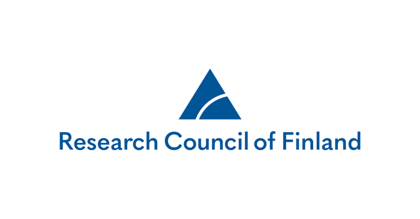

.. |PipeCraft2_logo| image:: _static/PipeCraft2_icon_v2.png
  :width: 50
  :alt: Alternative text
  :target: https://github.com/pipecraft2/user_guide

.. |PipeCraft2_icon| image:: _static/PipeCraft2_icon_v2.png
  :width: 200
  :alt: Alternative text

.. |PipeCraft_sticker1| image:: _static/PipeCraft_sticker1.png
  :width: 200
  :alt: Alternative text

.. |PipeCraft2_largelogo| image:: _static/PipeCraft2_logo.png
  :width: 200
  :alt: Alternative text

.. raw:: html

    

.. role:: blue

.. _contact: 

==============================================
Contact and Acknowledgements |PipeCraft2_logo|
==============================================

::

    Sten Anslan <sten.s.anslan[at]jyu.fi>
    Martin Metsoja <martin.metsoja[at]ut.ee>
    Vladimir Mikryukov <vladimir.mikryukov[at]ut.ee>
    Ali Hakimzadeh <ali.hakimzadeh[at]ut.ee>

:blue:`Feel free to propose new pipelines/modules/software to be implemented to PipeCraft.`

____________________________________________________

.

____________________________________________________

Acknowledgements
----------------

.. |EU_flag| image:: _static/funding/EU.png
  :width: 150
  :alt: Alternative text

.. |mobilitas| image:: _static/funding/mobilitas.jpg
  :width: 190
  :alt: Alternative text

.. |logo_BGE| image:: _static/funding/logo_BGE_alpha.png
  :width: 200
  :alt: Alternative text

**PipeCraft2 development has been supported by:** 

.. raw:: html

   

       
       
 European Regional Development Fund and the programme <strong>Mobilitas Pluss</strong>, MOBTP198. 

   

   

       
       
 <strong>Biodiversity Genomics Europe</strong> (BGE) project. 
       BGE (Grant no.101059492) is funded by Horizon Europe under the Biodiversity, Circular Economy 
       and Environment call (REA.B.3); co-funded by the Swiss State Secretariat for Education, 
       Research and Innovation (SERI) under contract numbers 22.00173 and 24.00054; and by the 
       UK Research and Innovation (UKRI) under the Department for Business, Energy and Industrial 
       Strategy’s Horizon Europe Guarantee Scheme.

   

|EU_flag|

.. raw:: html

   

       
       
 <strong>Research Council of Finland</strong>   (Decision number 362828)

   

____________________________________________________

PipeCraft2 logos/icons 
----------------------

design by © **Olesia Dulia**

|PipeCraft2_icon| |PipeCraft_sticker1| |PipeCraft2_largelogo|