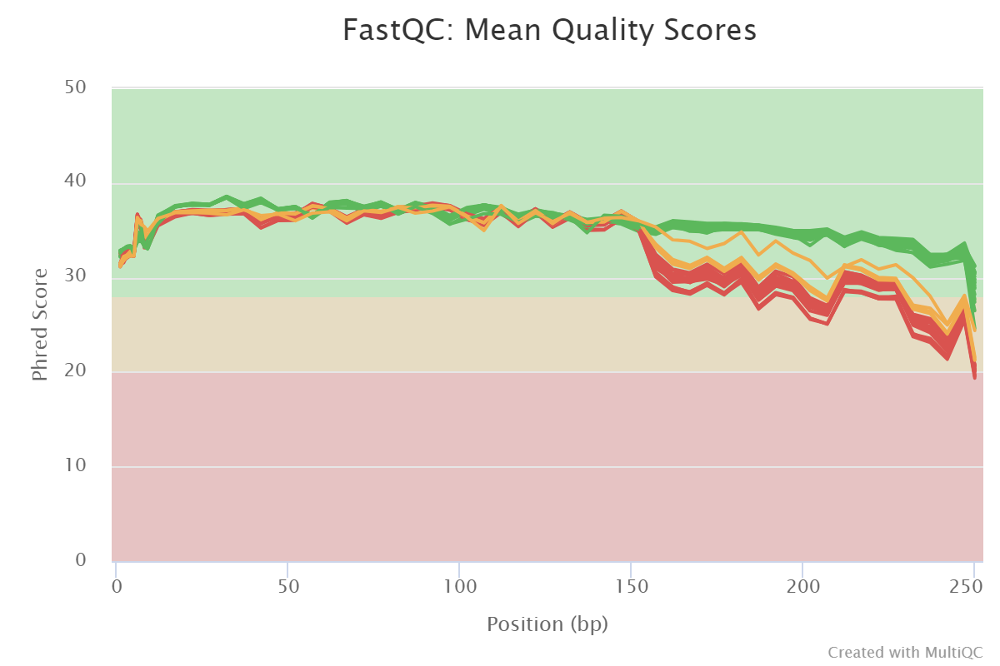
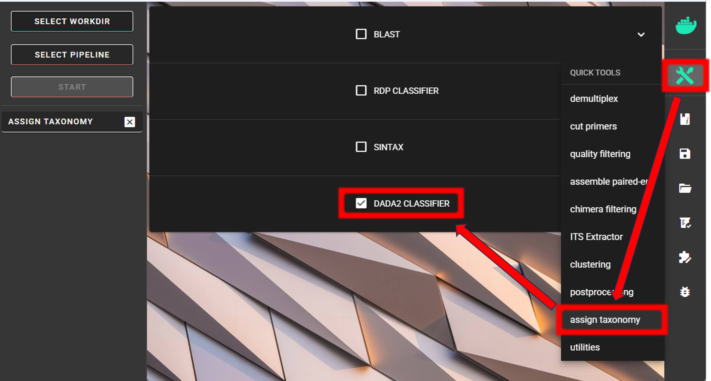
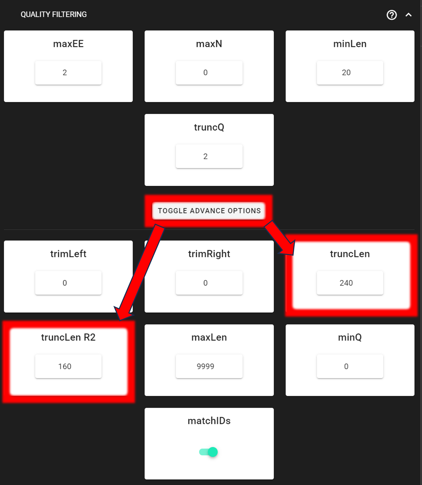
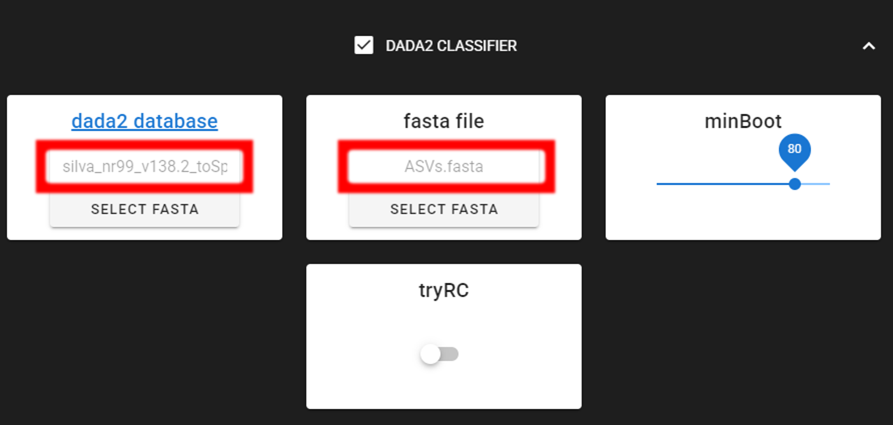
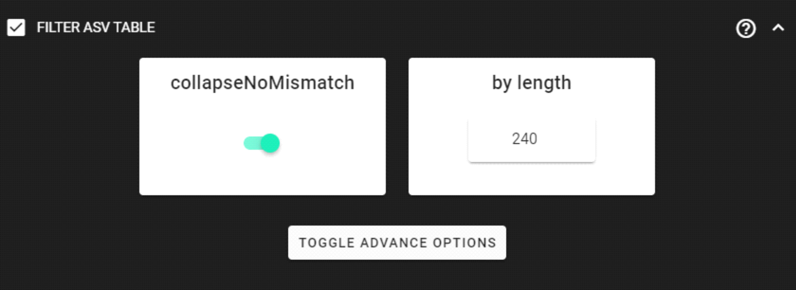

.. |PipeCraft2_logo| image:: _static/PipeCraft2_icon_v2.png
  :width: 50
  :target: https://github.com/pipecraft2/pipecraft

.. raw:: html

    

.. role:: red

.. raw:: html

    

.. role:: green
  

.. |workflow_finished| image:: _static/workflow_finished.png
  :width: 300
  :class: center

.. |stop_workflow| image:: _static/stop_workflow.png
  :width: 200

.. |DADA2_PE_FWD| image:: _static/DADA2_PE_FWD.png
  :width: 700

.. |DADA2_denoise_expand| image:: _static/DADA2_denoise_expand.png
  :width: 600

.. |DADA2_2samples_needed| image:: _static/troubleshoot/DADA2_2samples_needed.png
  :width: 300

.. |DADA2_select_pipeline| image:: _static/select_pipeline.png
  :width: 700

.. |output_icon| image:: _static/output_icon.png
  :width: 50

.. |save| image:: _static/save.png
  :width: 50

.. |pulling_image| image:: _static/pulling_image.png
  :width: 280

.. meta::
    :description lang=en:
        PipeCraft manual. tutorial

.. _example_analyses_DADA2_16S:

DADA2 ASVs pipeline, 16S |PipeCraft2_logo|
------------------------------------------

This example data analyses follows DADA2 ASVs workflow as implemented in PipeCraft2's pre-compiled pipelines panel. 

| `Download example data set here <https://mothur.s3.us-east-2.amazonaws.com/wiki/miseqsopdata.zip>`_ (35.1 Mb) and **unzip** it. 
| This is `mothur MiSeq SOP example data set <https://mothur.org/wiki/miseq_sop/>`_. 

____________________________________________________

Starting point 
~~~~~~~~~~~~~~

This example dataset consists of **16S rRNA gene V4 amplicon sequences**:

- **paired-end** Illumina MiSeq data;
- **demultiplexed** set (per-sample fastq files);
- indexes and primers have already been **removed**;
- sequences in this set are **5'-3' (fwd) oriented**.

.. admonition:: when working with your own data ...

  ... then please check that the paired-end data file names contain **R1** and **R2** strings *(not just _1 and _2)*, so that 
  PipeCraft can correctly identify the paired-end reads.

  | *Example:*
  | *F3D0_S188_L001_R1_001.fastq*
  | *F3D0_S188_L001_R2_001.fastq*

  
**At least 2 samples** (2x R1 + 2x R2 files) are required for this workflow! Otherwise ERROR in the denoising step:

|DADA2_2samples_needed| 

____________________________________________________

| **To select DADA2 pipeline**, press
| ``SELECT PIPELINE`` --> ``DADA" ASVs``.

|DADA2_select_pipeline|

| **To select input data**, press ``SELECT WORKDIR``
| and specify
| ``sequence files extension`` as **\*.fastq**;  
| ``sequencing read types`` as **paired-end**.
| and navigate to the working directory ``MiSeq_SOP`` (*note the in Windows, the directory files are not displayed*).

____________________________________________________

Workflow mode
~~~~~~~~~~~~~

Because we are working with sequences that are **5'-3' oriented**, we are selecting hte ``PAIRED-END FORWARD`` mode of the pipeline. 

|DADA2_PE_FWD| 

.. admonition:: if sequences are in mixed orientation
 
 If some sequences in your library are in 5'-3' and some as 3'-5' orientation, 
 then with the 'PAIRED-END FORWARD' mode exactly the same ASV may be reported twice, where one ASV is just the reverse complementary of another. 
 To avoid that, select **PAIRED-END MIXED** mode. 
 *Sequences have mixed orientation in libraries where sequenceing adapters have been ligated, rather than attached to amplicons during PCR.*

 **Specifying primers** (for CUT PRIMERS) **is mandatory for the PAIRED-END MIXED** mode. Based on the priemr sequences, the library will be split into two: 
 1) fwd oriented sequences, and 2) rev oriented sequences. Both batches are processed independently to produce ASVs, after which the rev oriented batch ASVs are 
 reverse complemented and merged with the fwd oriented ASVs. Identical ASVs are merged to form a final data set. This is a reccomended workflow for accurate denoising compared with first 
 reorienting all sequences to 5'-3', and then performing a standard 'PAIRED-END FORWARD' workflow.

____________________________________________________

Cut primers
~~~~~~~~~~~

The example dataset has primers already clipped, so here we are skipping this process.

.. admonition:: when working with your own data ... 

  ... and you need to clip primers, then check the box for **CUT PRIMERS** and specify the PCR primers. 
  You may specify add up to 13 primer pairs. 
  Check :ref:`cut primers page <remove_primers>`.

____________________________________________________
 
Quality filtering 
~~~~~~~~~~~~~~~~~

Before adjusting quality filtering settings, let's have a look on the **quality profile** of our example data set. 
Below quality profile plot was generated using ``QualityCheck`` panel (:ref:`see here <qualitycheck>`).

|fastqc_per_base_sequence_quality_plot|

In this case, all **R1 files are represented with green lines**, indicating good average quality per file (i.e., sample). 
However, all **R2 files are either yellow or red**, indicating a drop in quality scores. 
Lower qualities of R2 reads are characteristic for Illumina sequencing data, and is not too alarming. 
DADA2 algoritm is robust to lower quality sequences, but removing the low quality read parts
will improve the DADA2 sensitivity to rare sequence variants; so, let's do some quality filtering. 

____________________________________________________

**Click on** ``QUALITY FILTERING`` **to expand the panel**

|DADA2_quality_filt_expand|

Based on the quality scores distribution plot above, we will **trim reads to specified length to remove low quality ends**. 
Set ``truncLen`` to **240** for trimming R1 reads and ``truncLen R2`` to **160** to trim R2 reads. 
Latter positions represent the approximate positions where sequence quality drops notably.
Alternatively, you may use ``trimLeft`` and ``trimRight`` options to remove bases from the start and end of the reads, respectively. 
See also :ref:`remove low-quality ends/starts of reads section <remove_low_quality_ends>`. 

.. admonition:: when working with your own data ... 

  ... be sure to consider the amplicon length before applying ``truncLen`` options, 
  so that R1 and R2 reads would still overlap for the ``MERGE PAIRS`` process.
  Non-overlapping paired-end reads will be discarded. 

Here, we can leave other settings as **DEFAULT**.

+-----------------------+-------------------------------------------------------+
| Output directory |output_icon|          ``qualFiltered_out``                  |
+=======================+=======================================================+
| \*.fastq              | quality filtered sequences per sample in FASTQ format |
+-----------------------+-------------------------------------------------------+
| \*.rds                | R objects for the following DADA2 workflow processes  |
+-----------------------+-------------------------------------------------------+
| seq_count_summary.csv | summary of sequence counts per sample                 |
+-----------------------+-------------------------------------------------------+

____________________________________________________

Denoise and merge pairs
~~~~~~~~~~~~~~~~~~~~~~~

This step performs desiosing (as implemented in DADA2), which first forms ASVs per R1 and R2 files. 
Then during merging/assembling process the paired ASV mates are assembled to output full amplicon length ASV. 

|DADA2_denoise_expand| 

Here, we are working with Illumina MiSeq data, so let's make sure that the ``errorEstFun`` setting is **loessErrfun**. For PacBio data use **PacBioErrfun**. 
We can leave all settings as DEFAULT.

+----------------------------------+--------------------------------------------------------+
| Output directory |output_icon|          ``denoised_assembled.dada2``                      |
+==================================+========================================================+
| \*.fasta                         | denoised and assembled ASVs per sample in FASTA format |
+----------------------------------+--------------------------------------------------------+
| \*.rds                           | R objects for the following DADA2 workflow processes   |
+----------------------------------+--------------------------------------------------------+
| Error_rates_R*.pdf               | plots for estimated R1/R2 error rates                  |
+----------------------------------+--------------------------------------------------------+
| seq_count_summary.csv            | summary of sequence counts per sample                  |
+----------------------------------+--------------------------------------------------------+

___________________________________________________

Chimera filtering
~~~~~~~~~~~~~~~~~

This step performs chimera filtering according to DADA2 *removeBimeraDenovo* function. During this step, the **ASV table** is also generated. 

.. important:: 

  make sure that primers have been removed from your amplicons; otherwise many false-positive chimeras may be filtered out from your dataset. 

Here, we filter chimeras using the **consensus** method. 

+----------------------------------------+-------------------------------------------------------+
| Output directory |output_icon|                ``chimeraFiltered_out.dada2``                    |
+========================================+=======================================================+
| \*.fasta                               | chimera filtered ASVs per sample                      |
+----------------------------------------+-------------------------------------------------------+
| seq_count_summary.csv                  | summary of sequence counts per sample                 |
+----------------------------------------+-------------------------------------------------------+
| 'chimeras' dir                         | ASVs per sample identified as chimeras                |
+----------------------------------------+-------------------------------------------------------+

+----------------------------------------+-------------------------------------------------------+
| Output directory                       | ``ASVs_out.dada2``                                    |
+========================================+=======================================================+
| ASVs_table.txt                         | denoised and chimera filtered ASV-by-sample table     |
+----------------------------------------+-------------------------------------------------------+
| ASVs.fasta                             | corresponding FASTA formated ASV Sequences            |
+----------------------------------------+-------------------------------------------------------+
| ASVs per sample identified as chimeras | rds formatted denoised and chimera filtered ASV table |
+----------------------------------------+-------------------------------------------------------+

____________________________________________________

.. _curate_asv_table:

Curate ASV table
~~~~~~~~~~~~~~~~

This process first removes putative :ref:`tag jumps <filter_tag_jumps>` 
and then **collapses the ASVs that are identical** up to shifts or length variation, 
i.e. ASVs that have no internal mismatches (PipeCraft2 uses vsearch *usearch_global --id 1* for that); and finally 
filters out ASVs that are shorter/longer than specified length (in base pairs).

|DADA2_filter_table_expand|

Here, we are **enabling this process** by checking the box for ``CURATE ASV TABLE`` in the DADA2 ASV workflow panel. 

The ``f_value`` and ``p_value`` settings are used to filter out putative tag jumps (using UNCROSS2 algorithm). 
Generally, we recommend to use p_value of 1 (default), and **f_value of 0.03** when using combinational indexing strategy; 
f_value of 0.05 when using single-indexes, and f_value of 0.01 when using unique dual-indexes.

The expected amplicon length (without primers) in our example dataset in ~253 bp. 
Assuming that shorter sequences are non-target sequences, 
we use 240 in the ``min length`` setting. This will discard ASVs that are less than 240 bp.
Here, ``max length`` can be set to 0 (default), meaning no filtering by maximum sequence length.

We are also setting the ``collapseNoMismatch`` to TRUE, to collapse identical ASVs. 
This is basically equivalent to 100% clustering by ignoring the end gaps.

+----------------------------+-------------------------------------------------------------------+
| Output directory |output_icon|         ``ASVs_out.dada2/curated``                              |
+============================+===================================================================+
| ASVs_table_TagJumpFilt.txt | only tag-jump filtered ASV-by-sample table                        |
+----------------------------+-------------------------------------------------------------------+
| ASVs.fasta                 | corresponding ASV Sequences with ASVs_table_TagJumpFilt.txt table |
+----------------------------+-------------------------------------------------------------------+
|| ASVs_collapsed.fasta      || tag-jump filtered and collapsed and size filtered                |
||                           || ASV Sequences. Present only if some ASVs were collapsed.         |
+----------------------------+-------------------------------------------------------------------+
|| ASVs_table_collapsed.txt  || corresponding ASV-by-sample table.                               |
||                           || Present only if some ASVs were collapsed.                        |
+----------------------------+-------------------------------------------------------------------+
| TagJump_stats.txt          | summary of tag-jump filtering results                             |
+----------------------------+-------------------------------------------------------------------+

.. admonition:: If there is nothing to collapse or filter out based on the length
  
  then there are no corresponding files in the ``ASVs_out.dada2/curated`` directory, and only 
  ASVs_table_TagJumpFilt.txt and ASVs.fasta files will be generated 
  (even when there is nothing to tag-jump filter - in which case ASVs_table_TagJumpFilt.txt is the same 
  ASVs_table.txt in the ``ASVs_out.dada2`` directory).

.. note:: 

  The pre-compiled pipeline ends here. Outputs 16S ASVs can be further 
  :ref:`clustered into OTUs <asv2otu>`.

____________________________________________________

Save workflow
~~~~~~~~~~~~~

Once we have decided about the settings in our workflow, we can save the configuration file by pressing ``save workflow`` button on the right-ribbon
|save|

If you forget the save, then no worries, a ``pipecraft2_last_run_configuration.json`` file will be generated 
for you upon starting the workflow.
As the file name says, it is the workflow configuration file for your last PipeCraft run in this **working directory**.
If the file name (pipecraft2_last_run_configuration.json) is not changed, then the file is overwritten with the new configuration
if running a new job in the same working directory.

This ``JSON`` file can be loaded into PipeCraft2 to **automatically configure your next runs exactly the same way**.

.. note:: 

  **'Assign taxonomy' is not the part of the full per-defined pipeline**. This step 
  can be selected and run via **QuickTools** panel. See below. 

___________________________________________________

Start the workflow
~~~~~~~~~~~~~~~~~~

Press ``START`` on the left ribbon **to start the analyses**.

.. admonition:: when running the module for the first time ...
  
  ... a docker image will be first pulled to start the process. 

  For example: |pulling_image|

When you need to STOP the workflow, press ``STOP`` button |stop_workflow|

.. admonition:: When the workflow has completed ...

  ... a message window will be displayed.

  |workflow_finished|

.. _assign_taxonomy_dada2_16S:

___________________________________________________

Assign taxonomy
~~~~~~~~~~~~~~~

Assign taxonomy **is not the part of the full per-defined pipeline**, but can be run as a **separate step in QuickTools**.
**Double-check the selected working directory** (the outputs will be written there) by holding 
the mouse cursor over the ``SELECT WORKDIR`` button [re-select if needed]. 

|select_DADA2_classifier|

Here, we are using the :ref:`DADA2 classifier <assign_taxonomy_dada2>`, the assignTaxonomy function, 
which itself implements the RDP Naive Bayesian Classifier algorithm. 
See :ref:`other assign taxonomy options here <assign_taxonomy>`.

We need to specify the location of the **reference DATABASE** for the taxonomic classification of our ASVs. Click on the header of ``dada2_database`` setting, 
which directs you to the `DADA2-formatted reference databases web page <https://benjjneb.github.io/dada2/training.html>`_.
Here, we are using ``silva_nr99_v138.2_toSpecies_trainset.fa.gz``. 
See other databases available for taxonomy annotation :ref:`here <databases>`.

|DADA2_assign_tax_expand|

Specify the location of your downloaded database and also the fasta file with ASVs (``fasta file``) to be classified.
Herein, we use ``ASVs.fasta`` file in the ``ASVs_out.dada2/curated`` directory (since we applied also ``CURATE ASV TABLE`` process).

We can use the default ``minBoot`` (minimum bootstrap; ranging from 0-100; ~assignment confidence) value of 80. 
This means that taxonomic ranks with at least bootstrap value of 80 will get classification (unclassified for <80). 

``tryRC`` may be OFF, since we expact that all of our ASVs are in 5'-3' orientation. 

**Press "START" to start the taxonomy assignment process**.

+-------------------------------------------------------------+
| Output directory   |output_icon| ``taxonomy_out.dada2``     |
+==================+==========================================+
| taxonomy.csv     | classifier results with bootstrap values |
+------------------+------------------------------------------+

___________________________________________________

Examine the outputs
~~~~~~~~~~~~~~~~~~~

Several process-specific output folders are generated |output_icon|

+-------------------------------+--------------------------------------------------------+
| ``qualFiltered_out``          | quality filtered paired-end **fastq** files per sample |
+-------------------------------+--------------------------------------------------------+
| ``denoised_assembled.dada2``  | denoised and assembled **fasta** files per sample      |
+-------------------------------+--------------------------------------------------------+
| ``chimeraFiltered_out.dada2`` | chimera filtered **fasta** files per sample            |
+-------------------------------+--------------------------------------------------------+
| ``ASVs_out.dada2``            | **ASVs table**, and ASV sequences files                |
+-------------------------------+--------------------------------------------------------+
| ``ASVs_out.dada2/curated``    | curated **ASVs table**, and ASV sequences files        |
+-------------------------------+--------------------------------------------------------+
| ``taxonomy_out.dada2``        | ASVs **taxonomy table** (taxonomy.csv)                 |
+-------------------------------+--------------------------------------------------------+

.. _seq_count_summary:

Each folder (except ASVs_out.dada2 and taxonomy_out.dada2) contain 
**summary of the sequence counts** (``seq_count_summary.csv``). 
Examine those to track the read counts throughout the pipeline. 

For example, from the ``seq_count_summary.csv`` file in ``qualFiltered_out`` we see that on average ~91% of the sequences survived the quality filtering step.

+------------------+-------+--------------+
|                  | input | qualFiltered |
+------------------+-------+--------------+
| F3D0_S188_L001   | 7793  | 7113         |
+------------------+-------+--------------+
| F3D1_S189_L001   | 5869  | 5299         |
+------------------+-------+--------------+
| F3D141_S207_L001 | 5958  | 5463         |
+------------------+-------+--------------+
| F3D142_S208_L001 | 3183  | 2914         |
+------------------+-------+--------------+
| F3D143_S209_L001 | 3178  | 2941         |
+------------------+-------+--------------+
| ...              |       |              |
+------------------+-------+--------------+

____________________________________________________

Here, we applied also **"CURATE ASV TABLE"** process.
Therefore, our final outputs of the pipeline are in the ``ASVs_out.dada2/curated`` directory.

``ASVs_out.dada2/curated`` directory contains **ASVs_table_TagJumpFilt.txt** file. 
This represents the ASV table after the tag-jump filtering, 
where the **1st column** represents ASV identifiers (sha1 encoded), 
**2nd column** is the sequence of an ASV,
and all the following columns represent number of sequences in the corresponding samples 
(sample name is taken from the file name). This is tab delimited text file. 

*ASVs_table_TagJumpFilt.txt; first 4 samples and 4 ASVs:*

+--------------+------------+----------------+----------------+------------------+
| OTU          | Sequence   | F3D0_S188_L001 | F3D1_S189_L001 | F3D141_S207_L001 |
+--------------+------------+----------------+----------------+------------------+
| 7c6864ace... | TACGGAG... | 579            | 405            | 444              |
+--------------+------------+----------------+----------------+------------------+
| 1e3c68bda... | TACGGAG... | 345            | 353            | 362              |
+--------------+------------+----------------+----------------+------------------+
| 4ee096262... | TACGGAG..  | 449            | 231            | 345              |
+--------------+------------+----------------+----------------+------------------+
| 1cf2c5b8e... | TACGGAG... | 430            | 69             | 164              |
+--------------+------------+----------------+----------------+------------------+

*Note: even though the ASVs column header is "OTU", it represents ASVs as we preformed an ASVs workflow!*

The **ASV + Sequences** info are also represented in the fasta file (ASVs.fasta) in the ``ASVs_out.dada2`` directory. 

.. admonition:: did 'CURATE ASV TABLE' have any effect?

  In this example, we applied also ``collapseNoMismatch`` and ``min length`` filtering. 
  If we examine the ``README.txt`` file in the ``ASVs_out.dada2/curated`` directory, 
  then we see a note "*Output has the same number of Features (ASVs/OTUs) as input*",
  which means that **no ASVs were filtered out** based on the ``collapseNoMismatch`` and ``min length`` filters.
  Thus, ASVs_table.txt and ASVs.fasta files in the ``ASVs_out.dada2`` directory 
  contain the same number of ASVs.

  However, we applied also **tag-jump filtering** process (via ``f_value`` and ``p_value`` settings). 
  When checking the ``TagJump_stats.txt`` file in the ``ASVs_out.dada2/curated`` directory, 
  we see that based on our settings, **9 tag-jump events** were detected which involved 78 reads.
  That is, there were **9 potential cases where an ASV may have been "leaked" from one sample to another**.
  The number of ASVs are the same in ``ASVs_out.dada2/curated/ASVs_table_TagJumpFilt.txt`` and ``ASVs_out.dada2/ASVs_table.txt`` files, 
  but ``ASVs_table_TagJumpFilt.txt`` file has 78 less reads than "ASVs_table.txt" file as those were **removed as putative tag-jumps**.

  So, **for further processes, we use** ``ASVs_table_TagJumpFilt.txt`` file, 
  and ``ASVs.fasta`` file in the ``ASVs_out.dada2/curated`` directory.

__________________________________________________

Result from the **taxonomy annotation** process - **taxonomy table** (taxonomy.csv) - is located at the ``taxonomy_out.dada2`` directory. 

*Taxonomy results for the first 5 ASVs*

+--------------+------------+----------+--------------+-------------+---------------+----------------+-------------+------------+---------+--------+-------+-------+--------+-------+---------+
| ASV          | Sequence   | Kingdom  | Phylum       | Class       | Order         | Family         | Genus       | Species    | Kingdom | Phylum | Class | Order | Family | Genus | Species |
+--------------+------------+----------+--------------+-------------+---------------+----------------+-------------+------------+---------+--------+-------+-------+--------+-------+---------+
| 7c6864ace... | TACGGAG... | Bacteria | Bacteroidota | Bacteroidia | Bacteroidales | Muribaculaceae | NA          | NA         | 100     | 100    | 100   | 100   | 100    | 100   | 100     |
+--------------+------------+----------+--------------+-------------+---------------+----------------+-------------+------------+---------+--------+-------+-------+--------+-------+---------+
| 1e3c68bda... | TACGGAG... | Bacteria | Bacteroidota | Bacteroidia | Bacteroidales | Muribaculaceae | NA          | NA         | 100     | 100    | 100   | 100   | 100    | 100   | 100     |
+--------------+------------+----------+--------------+-------------+---------------+----------------+-------------+------------+---------+--------+-------+-------+--------+-------+---------+
| 4ee096262... | TACGGAG..  | Bacteria | Bacteroidota | Bacteroidia | Bacteroidales | Muribaculaceae | NA          | NA         | 100     | 100    | 100   | 100   | 100    | 98    | 98      |
+--------------+------------+----------+--------------+-------------+---------------+----------------+-------------+------------+---------+--------+-------+-------+--------+-------+---------+
| 1cf2c5b8e... | TACGGAG... | Bacteria | Bacteroidota | Bacteroidia | Bacteroidales | Muribaculaceae | NA          | NA         | 100     | 100    | 100   | 100   | 100    | 100   | 82      |
+--------------+------------+----------+--------------+-------------+---------------+----------------+-------------+------------+---------+--------+-------+-------+--------+-------+---------+
| 57bde09f1... | TACGGAG... | Bacteria | Bacteroidota | Bacteroidia | Bacteroidales | Bacteroidaceae | Bacteroides | caecimuris | 100     | 100    | 100   | 100   | 100    | 100   | 100     |
+--------------+------------+----------+--------------+-------------+---------------+----------------+-------------+------------+---------+--------+-------+-------+--------+-------+---------+

"**NA**" denotes that the sequence may not have enough resolution to confidently (herein we used minimum bootstrap of 80) place that ASV within a specific taxonomic rank or 
the database lack of reference sequences for more accurate classification.
Last columns with integers (for 'Kingdom' to 'Species') represent bootstrap values for the correspoinding taxonomic unit. 

___________________________________________________

Check for the non-target hits
~~~~~~~~~~~~~~~~~~~~~~~~~~~~~

It is often the case that universal metabarcoding primers **amplify also non-target DNA regions and/or non-target taxa**. 
Working with this example dataset, we are **interesed only in Bacteria**, thus we should **get rid of the off-target noise** before proceeding with relevant statistical analyses.  

When we **carefully examine the results**, the taxonomy table, then we can see that 3 ASVs are classified as **Chloroplast** ('Order' column) and 1 ASVs as **Mitochondria** ('Family' column).

+------------------------------------------+----------+----------+----------------+---------------------+-----------------+------------------+-------+---------+---------+--------+-------+-------+--------+-------+---------+
| ASV                                      | Sequence | Kingdom  | Phylum         | Class               | Order           | Family           | Genus | Species | Kingdom | Phylum | Class | Order | Family | Genus | Species |
+------------------------------------------+----------+----------+----------------+---------------------+-----------------+------------------+-------+---------+---------+--------+-------+-------+--------+-------+---------+
| 5c25197ab1565ef226075d05cff73a9cee0e3a2f | GACAG... | Bacteria | Cyanobacteria  | Cyanobacteriia      | **Chloroplast** | NA               | NA    | NA      | 100     | 100    | 100   | 100   | 100    | 100   | 100     |
+------------------------------------------+----------+----------+----------------+---------------------+-----------------+------------------+-------+---------+---------+--------+-------+-------+--------+-------+---------+
| 1c167d19cce4b4113c12dde61306132efed8dc20 | GACAG... | Bacteria | Cyanobacteria  | Cyanobacteriia      | **Chloroplast** | NA               | NA    | NA      | 100     | 100    | 100   | 100   | 100    | 100   | 100     |
+------------------------------------------+----------+----------+----------------+---------------------+-----------------+------------------+-------+---------+---------+--------+-------+-------+--------+-------+---------+
| 2f24601af9870b6120292e9f8a8280362d8ff0e0 | GACAG... | Bacteria | Cyanobacteria  | Cyanobacteriia      | **Chloroplast** | NA               | NA    | NA      | 100     | 100    | 100   | 100   | 100    | 100   | 100     |
+------------------------------------------+----------+----------+----------------+---------------------+-----------------+------------------+-------+---------+---------+--------+-------+-------+--------+-------+---------+
| e488265f509c969b5b2f63e7345c13417ed66035 | GACGG... | Bacteria | Proteobacteria | Alphaproteobacteria | Rickettsiales   | **Mitochondria** | NA    | NA      | 100     | 100    | 100   | 100   | 100    | 100   | 100     |
+------------------------------------------+----------+----------+----------------+---------------------+-----------------+------------------+-------+---------+---------+--------+-------+-------+--------+-------+---------+

The PCR primers used to generate the amplicon library, 515F and 806R, match very well with regions in the chloroplast and mitochondria genomes; and amplyfy 
also ~250 bp fragments which are nicely sequenced alongside with the bacterial 16S fragments. 
Chloroplast sequences are similar to ones in Cyanobacteria, and mitochondria sequences to ones in Rickettsiales (because of evolutionary history of these organelles), 
therewere we see these sequences in Phylum Cyanobacteria and Order Rickettsiales in the SILVA database, respectivelly. 
However, when flagged as "Chloroplast" or "Mitochondria", then those sequences most likely originate from the corresponding organelle genomes not from the bacterial 16S rRNA. 

It is common obtain these kind of off-target sequences from environmental DNA samples (such as soil, water) since the DNA pool likely contains also plant or algal DNA. 
Chloroplast|mitochondria are not present in bacteria (or Archaea), therefore ASVs with **assignments to Chloroplast and/or Mitochondria can be considered off-target ASVs** and should be removed. 

Below, you can find a **R script to clean** your taxonomy table, ASV table and ASVs fasta file from the off-target taxa and from 'Chloroplast' and 'Mitochondria' sequences. 

.. code-block:: R
   :caption: Filter out non-target ASVs
   :linenos:

    #!/usr/bin/env Rscript
    # This is R script.

    ### Filter taxonomy table, ASV table and ASVs fasta file to exclude non-target ASVs

    # specify input tables and fasta file
    taxonomy_table = "taxonomy.csv"          # csv file
    ASV_table = "ASVs_table_TagJumpFilt.txt" # tab-delimited file
    ASV_fasta = "ASVs.fasta"                 # FASTA file
    #----------------------------------------------------------#

    library(dplyr)
    library(readr)

    # load the taxonomy and ASV table
    taxonomy = read.csv(taxonomy_table, header = TRUE)
    ASV_table = read_tsv(ASV_table)

    # make sure that the first column header is "ASV"
    if (colnames(taxonomy)[1] != "ASV") {
      colnames(taxonomy)[1] = "ASV"
    }
    if (colnames(ASV_table)[1] != "ASV") {
      colnames(ASV_table)[1] = "ASV"
    }

    # double-check that all Kingdom level classifications are "Bacteria" or "Archaea"
    # change tax level and tax_group as needed
    tax_level = "Kingdom"
    tax_group = "Bacteria|Archaea"
    target_taxonomy = taxonomy %>%
      filter(grepl(tax_group, .[[tax_level]]))

    # summary
    if (nrow(taxonomy) - nrow(target_taxonomy) == 0) {
      cat("\n All",tax_level, "level classifications are Bacteria|Archaea \n\n")
    } else {
      cat("\n", nrow(taxonomy) - nrow(target_taxonomy), "non", tax_group, "ASVs removed\n\n")
    }

    ## filter "Chloroplast|Mitochondria"
    # a function to check for the presence of "Chloroplast" or "Mitochondria"
    # in any column in taxonomy
    chloroplast_or_mitochondria = function(row) {
      any(grepl("Chloroplast|Mitochondria", row))
    }

    # filter out rows that contain Chloroplast or Mitochondria
    filtered_taxonomy = target_taxonomy %>%
      filter(!apply(., 1, chloroplast_or_mitochondria))

    # summary
    if (nrow(target_taxonomy) - nrow(filtered_taxonomy) == 0) {
      cat("\n None of the target_taxonomy ASVs were classified as Chloroplast|Mitochondria \n\n")
    } else {
      cat("\n Removed", nrow(target_taxonomy) - nrow(filtered_taxonomy), 
                                "Chloroplast|Mitochondria ASVs.\n\n")
    }

    # write the filtered taxonomy table to a new file
    write.csv(filtered_taxonomy, "filtered_taxonomy.csv", row.names = FALSE)

    ### filter the ASV table ->
    # get the list of good ASVs
    good_ASVs = filtered_taxonomy$ASV

    # Filter the ASV table to keep only "good ASVs"
    filtered_ASV_table = ASV_table %>%
      filter(ASV %in% good_ASVs)

    # write the filtered ASV table to a new file
    write.table(filtered_ASV_table, "taxFiltered_ASV_table.txt",
                sep = "\t", quote = F, row.names = F)

    ## filter the ASVs.fasta
    library("seqinr")
    # read the FASTA file
    ASV_fasta = read.fasta(file = ASV_fasta,
                          seqtype = "DNA")

    # filter ASV_fasta to include only "good ASVs"
    filtered_ASV_fasta = ASV_fasta[names(ASV_fasta) %in% good_ASVs]

    # convert sequences to uppercase
    filtered_ASV_fasta = lapply(filtered_ASV_fasta, toupper)

    # write the filtered ASV fasta to a new file
    write.fasta(sequences = filtered_ASV_fasta,
                names = names(filtered_ASV_fasta),
                nbchar = 999,
                file.out = "taxFiltered_ASVs.fasta")

__________________________________________________

.. admonition:: Final curated files

  Now, final curated files are:

  - ``filtered_taxonomy.csv``
    
  - ``taxFiltered_ASV_table.txt``
    
  - ``taxFiltered_ASVs.fasta``

  Proceed with any relevant statistical analyses using the curated files.
