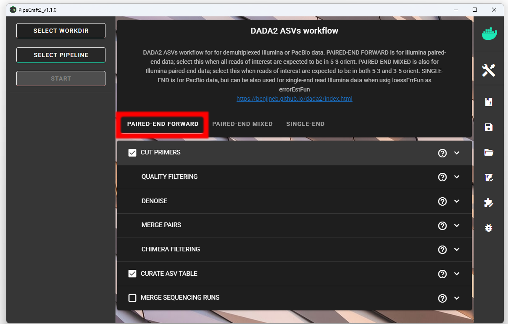
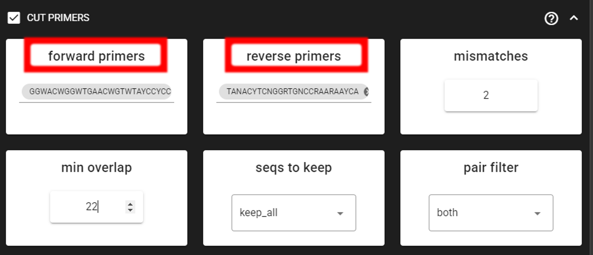
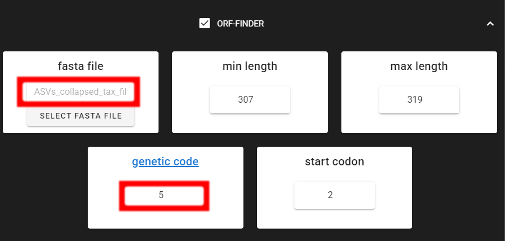
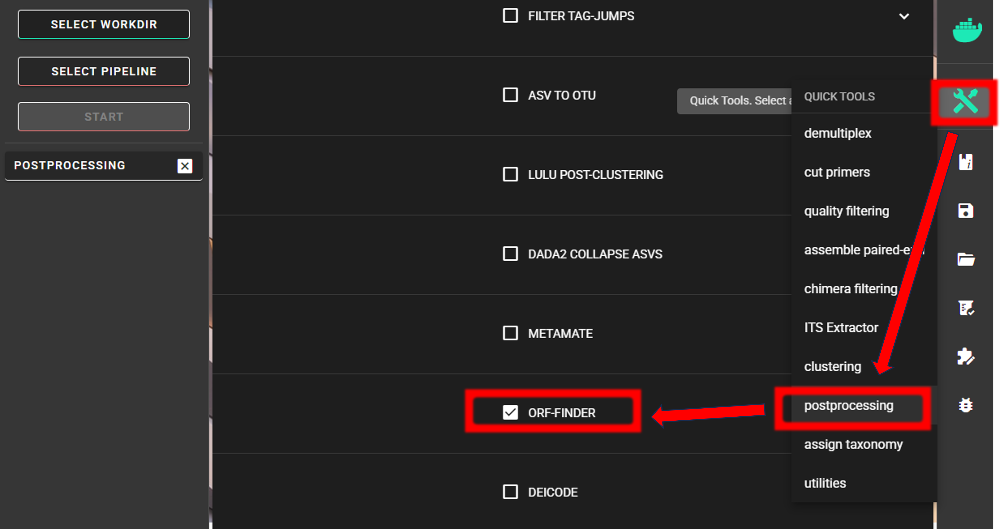
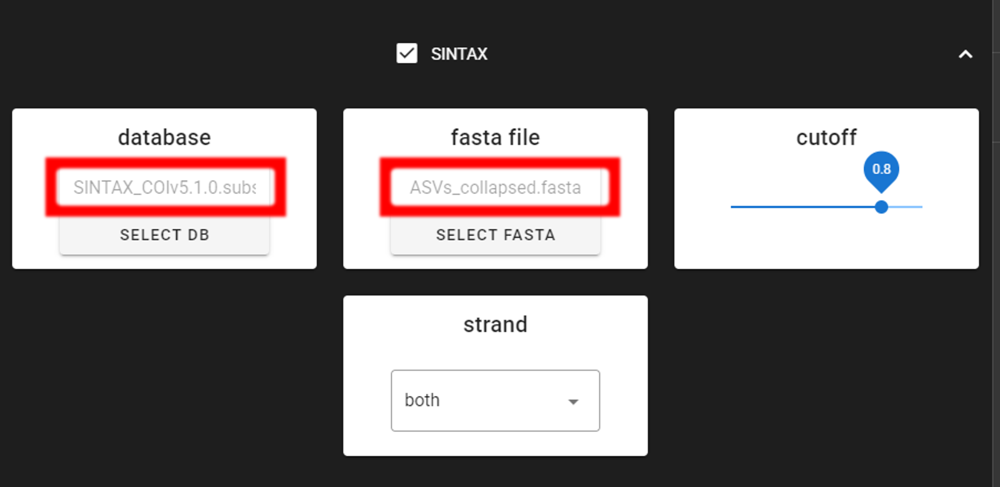
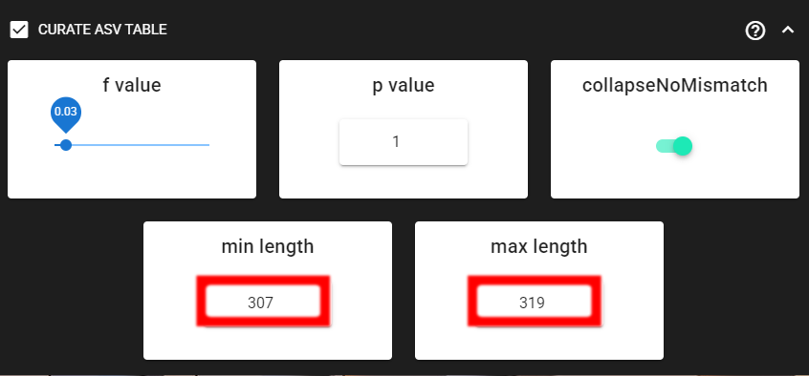
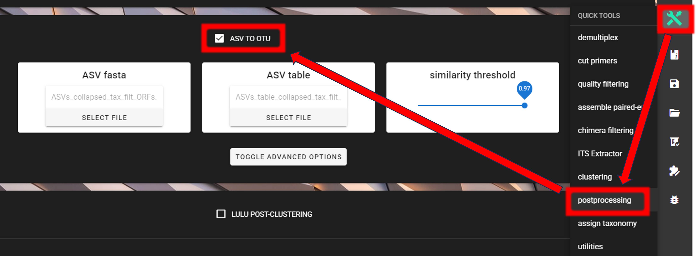
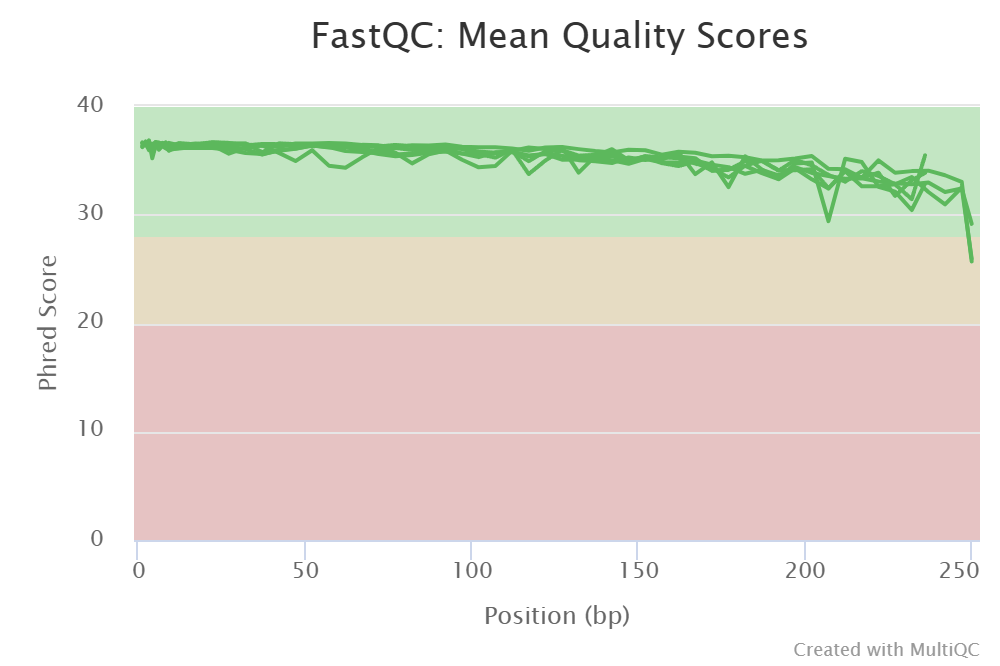

.. |PipeCraft2_logo| image:: _static/PipeCraft2_icon_v2.png
  :width: 50
  :target: https://github.com/pipecraft2/user_guide

.. raw:: html

    

.. role:: red

.. raw:: html

    

.. role:: green
  
.. |fastqc_per_base_sequence_quality_plot| image:: _static/fastqc_per_base_sequence_quality_plot.png
  :width: 850

.. |workflow_finished| image:: _static/workflow_finished.png
  :width: 300
  :class: center

.. |stop_workflow| image:: _static/stop_workflow.png
  :width: 200

.. |DADA2_quality_filt_expand| image:: _static/DADA2_quality_filt_expand.png
  :width: 600

.. |select_LULU| image:: _static/select_LULU.png
  :width: 600

.. |select_SINTAX_classifier| image:: _static/select_SINTAX_classifier.png
  :width: 700

.. |DADA2_denoise_expand| image:: _static/DADA2_denoise_expand.png
  :width: 600

.. |DADA2_2samples_needed| image:: _static/troubleshoot/DADA2_2samples_needed.png
  :width: 300

.. |LULU| image:: _static/lulu.png
  :width: 650

.. |output_icon| image:: _static/output_icon.png
  :width: 50

.. |save| image:: _static/save.png
  :width: 50

.. |pulling_image| image:: _static/pulling_image.png
  :width: 280

.. |DADA2_select_pipeline| image:: _static/select_pipeline.png
  :width: 700

.. meta::
    :description lang=en:
        PipeCraft manual. tutorial

|

DADA2 ASVs pipeline, COI |PipeCraft2_logo|
==========================================

This example dataset consists of **COI mtDNA gene amplicon sequences with the target length of 313 bp**:

| `Download example data set here <https://zenodo.org/records/18770850/files/example_data_COI_313bp.zip?download=1>`_ and **unzip** it. 

For this example data run, we are using a subset of `CO1Classifier <https://github.com/terrimporter/CO1Classifier>`_ 
database in the taxonomy annotation process,
`download it from here <https://zenodo.org/records/18770850/files/SINTAX_COIv5.1.0.subset.zip?download=1>`_.

____________________________________________________

Starting point 
--------------

This example dataset consists of **COI mtDNA gene amplicon sequences with the target length of 313 bp**:

- **paired-end** Illumina MiSeq data;
- **demultiplexed** set (per-sample fastq files);
- primers are not not **removed**;
- sequences in this set are **5'-3' (fwd) oriented**.

.. admonition:: when working with your own data ...

  ... then please check that the paired-end data file names contain **R1** and **R2** strings *(not just _1 and _2)*, so that 
  PipeCraft can correctly identify the paired-end reads.

  | *Example:*
  | *sample1_COI.R1.fq.gz*
  | *sample1_COI.R2.fq.gz*

**At least 2 samples** (2x R1 + 2x R2 files) are required for this workflow! Otherwise ERROR in the denoising step:

|DADA2_2samples_needed| 

____________________________________________________

| **To select DADA2 pipeline**, press
| ``SELECT PIPELINE`` --> ``DADA" ASVs``.

|DADA2_select_pipeline|

| **To select input data**, press ``SELECT WORKDIR``
| and specify
| ``sequence files extension`` as **\*.fastq**;  
| ``sequencing read types`` as **paired-end**.

____________________________________________________

Workflow mode
-------------

Because we are working with sequences that are **5'-3' oriented**, we are selecting hte ``PAIRED-END FORWARD`` mode of the pipeline. 

|DADA2_PE_FWD_cp| 

.. admonition:: if sequences are in mixed orientation
 
 If some sequences in your library are in 5'-3' and some as 3'-5' orientation, 
 then with the 'PAIRED-END FORWARD' mode exactly the same ASV may be reported twice, where one ASV is just the reverse complementary of another. 
 To avoid that, select **PAIRED-END MIXED** mode. 
 *Sequences have mixed orientation in libraries where sequenceing adapters have been ligated, rather than attached to amplicons during PCR.*

 **Specifying primers** (for CUT PRIMERS) **is mandatory for the PAIRED-END MIXED** mode. Based on the priemr sequences, the library will be split into two: 
 1) fwd oriented sequences, and 2) rev oriented sequences. Both batches are processed independently to produce ASVs, after which the rev oriented batch ASVs are 
 reverse complemented and merged with the fwd oriented ASVs. Identical ASVs are merged to form a final data set. This is a reccomended workflow for accurate denoising compared with first 
 reorienting all sequences to 5'-3', and then performing a standard 'PAIRED-END FORWARD' workflow.

____________________________________________________

Cut primers
-----------

The example dataset **contains primer sequences**. Generally, we need to remove these to proceed the analyses only with the variable metabarcode of interest.
If there are some additional sequence fragments, from eg. sequencing adapters or poly-G tails, then clipping the primers will remove those fragments as well.

Tick the box for ``CUT PRIMERS`` and specify forward and reverse primers.
For the example data, the **forward primer is GGWACWGGWTGAACWGTWTAYCCYCC** and **reverse primer is TANACYTCNGGRTGNCCRAARAAYCA**.

|cut_primers_expand_COI|

The primers are 26 bp - to keep a bit of flexibility in the primer search, we are requesting the ``min overlap`` of **22 bp** and are allowing maximum of 2 ``mismatches`` . 
Note that too low ``min overlap`` may lead to random matches. Check :ref:`other CUT PRIMER options here <remove_primers>`.

__________________________________________________

Quality filtering 
-----------------

Before adjusting quality filtering settings, let's have a look on the **quality profile** of our example data set. 
Below quality profile plot was generated using ``QualityCheck`` panel (:ref:`see here <qualitycheck>`).

|COI_example_quality_plot|

All files are represented with **green lines, indicating good average quality per file** (i.e., sample). 
However, if you see lower qualities of especially towards the end of R2 reads, then it not too alarming, since 
those can be clipped off with ``truncLen R2`` setting. DADA2 algoritm is robust to lower quality sequences, 
but removing the low quality read parts will improve the DADA2 sensitivity to rare sequence variants. 
But herein, we do not need to clip the ends, because the overall quality of the sequences is good enough.

____________________________________________________

**Click on** ``QUALITY FILTERING`` **to expand the panel**

.. |COI_ex_qFilt| image:: _static/COI_ex_qFilt.png
  :width: 600

|COI_ex_qFilt|

Here, we can leave the settings as DEFAULT by discarding sequences with 
**maximum error rate of >2** and with **ambiguous bases of >0**. 

+-----------------------+-------------------------------------------------------+
| Output directory |output_icon|          ``qualFiltered_out``                  |
+=======================+=======================================================+
| \*.fq.gz              | quality filtered sequences per sample in FASTQ format |
+-----------------------+-------------------------------------------------------+
| \*.rds                | R objects for the following DADA2 workflow processes  |
+-----------------------+-------------------------------------------------------+
| seq_count_summary.csv | summary of sequence counts per sample                 |
+-----------------------+-------------------------------------------------------+

____________________________________________________

Denoise and merge pairs
-----------------------

This step performs desiosing (as implemented in DADA2), which first forms ASVs per R1 and R2 files. 
Then during merging/assembling process the paired ASV mates are assembled to output full amplicon length ASV. 

|DADA2_denoise_expand| 

Here, we are working with Illumina data, so let's make sure that the ``errorEstFun`` setting is **loessErrfun**. 
We can leave all settings as DEFAULT. 

+----------------------------------+--------------------------------------------------------+
| Output directory |output_icon|          ``denoised_assembled.dada2``                      |
+==================================+========================================================+
| \*.fasta                         | denoised and assembled ASVs per sample in FASTA format |
+----------------------------------+--------------------------------------------------------+
| \*.rds                           | R objects for the following DADA2 workflow processes   |
+----------------------------------+--------------------------------------------------------+
| Error_rates_R*.pdf               | plots for estimated R1/R2 error rates                  |
+----------------------------------+--------------------------------------------------------+
| seq_count_summary.csv            | summary of sequence counts per sample                  |
+----------------------------------+--------------------------------------------------------+

___________________________________________________

Chimera filtering
-----------------

This step performs chimera filtering according to DADA2 *removeBimeraDenovo* function. During this step, the **ASV table** is also generated. 

.. important:: 

  make sure that primers have been removed from your amplicons; otherwise many false-positive chimeras may be filtered out from your dataset. 

Here, we filter chimeras using the **consensus** method. 

+----------------------------------------+-------------------------------------------------------+
| Output directory |output_icon|           ``chimeraFiltered_out.dada2``                         |
+========================================+=======================================================+
| \*.fasta                               | chimera filtered ASVs per sample                      |
+----------------------------------------+-------------------------------------------------------+
| seq_count_summary.csv                  | summary of sequence counts per sample                 |
+----------------------------------------+-------------------------------------------------------+
| 'chimeras' dir                         | ASVs per sample identified as chimeras                |
+----------------------------------------+-------------------------------------------------------+

+----------------------------------------+-------------------------------------------------------+
| Output directory |output_icon|           ``ASVs_out.dada2``                                    |
+========================================+=======================================================+
| ASVs_table.txt                         | denoised and chimera filtered ASV-by-sample table     |
+----------------------------------------+-------------------------------------------------------+
| ASVs.fasta                             | corresponding FASTA formated ASV Sequences            |
+----------------------------------------+-------------------------------------------------------+
| ASVs per sample identified as chimeras | rds formatted denoised and chimera filtered ASV table |
+----------------------------------------+-------------------------------------------------------+

____________________________________________________

Curate ASV table
----------------

This process first removes putative :ref:`tag jumps <filter_tag_jumps>` 
and then **collapses the ASVs that are identical** up to shifts or length variation, 
i.e. ASVs that have no internal mismatches (PipeCraft2 uses vsearch *usearch_global --id 1* for that); and finally 
filters out ASVs that are shorter/longer than specified length (in base pairs).

Here, we are **enabling this process** by checking the box for ``CURATE ASV TABLE`` in the DADA2 ASV workflow panel. 

|DADA2_filter_table_expand_COI|

The ``f_value`` and ``p_value`` settings are used to filter out putative tag jumps (using UNCROSS2 algorithm). 
Generally, we recommend to use p_value of 1 (default), and **f_value of 0.03** when using combinational indexing strategy; 
f_value of 0.05 when using single-indexes, and f_value of 0.01 when using unique dual-indexes.

The expected amplicon length (without primers) in our example dataset in **313 bp**.
Assuming that shorter sequences are non-target sequences, 
we use 307 in the ``min length`` setting and 319 in ``max length`` setting. 
This will discard ASVs that are shorter than 307 bp or longer than 319 bp.

We are also setting the ``collapseNoMismatch`` to TRUE, to collapse identical ASVs. 
This is basically equivalent to 100% clustering by ignoring the end gaps.

+----------------------------+-------------------------------------------------------------------+
| Output directory |output_icon|       ``ASVs_out.dada2/curated``                                |
+============================+===================================================================+
| ASVs_table_TagJumpFilt.txt | only tag-jump filtered ASV-by-sample table                        |
+----------------------------+-------------------------------------------------------------------+
| ASVs.fasta                 | corresponding ASV Sequences with ASVs_table_TagJumpFilt.txt table |
+----------------------------+-------------------------------------------------------------------+
|| ASVs_collapsed.fasta      || tag-jump filtered and collapsed and size filtered                |
||                           || ASV Sequences. Present only if some ASVs were collapsed.         |
+----------------------------+-------------------------------------------------------------------+
|| ASVs_table_collapsed.txt  || corresponding ASV-by-sample table.                               |
||                           || Present only if some ASVs were collapsed.                        |
+----------------------------+-------------------------------------------------------------------+
| TagJump_stats.txt          | summary of tag-jump filtering results                             |
+----------------------------+-------------------------------------------------------------------+

.. admonition:: If there is nothing to collapse or filter out based on the length
  
  then there are no corresponding files in the ``ASVs_out.dada2/curated`` directory, and only 
  ASVs_table_TagJumpFilt.txt and ASVs.fasta files will be generated 
  (even when there is nothing to tag-jump filter - in which case ASVs_table_TagJumpFilt.txt is the same 
  ASVs_table.txt in the ``ASVs_out.dada2`` directory).

.. note:: 

  The pre-compiled pipeline ends here. Outputs COI ASVs should be further filtered to **remove 
  putative pseudogenes (NUMTs)**, and optionally :ref:`ASVs can be clustered into OTUs <asv2otu>`. See below. 

____________________________________________________

Save workflow
-------------

Once we have decided about the settings in our workflow, we can save the configuration file by pressing ``save workflow`` button on the right-ribbon
|save|

If you forget the save, then no worries, a ``pipecraft2_last_run_configuration.json`` file will be generated 
for you upon starting the workflow.
As the file name says, it is the workflow configuration file for your last PipeCraft run in this **working directory**.
If the file name (pipecraft2_last_run_configuration.json) is not changed, then the file is overwritten with the new configuration
if running a new job in the same working directory.

This ``JSON`` file can be loaded into PipeCraft2 to **automatically configure your next runs exactly the same way**.

.. note:: 

  **'Assign taxonomy' is not the part of the full per-defined pipeline**. This step 
  can be selected and run via **QuickTools** panel. See below. 

___________________________________________________

Start the workflow
------------------

Press ``START`` on the left ribbon **to start the analyses**.

.. admonition:: when running the module for the first time ...
  
  ... a docker image will be first pulled to start the process. 

  For example: |pulling_image|

When you need to STOP the workflow, press ``STOP`` button |stop_workflow|

.. admonition:: When the workflow has completed ...

  ... a message window will be displayed.

  |workflow_finished|

___________________________________________________

Assign taxonomy
---------------

Assign taxonomy **is not the part of the full per-defined pipeline**, but can be run as a **separate step in QuickTools**.
Here, we are using the :ref:`SINTAX <assign_taxonomy_sintax>` classifier for that.

|select_SINTAX_classifier|

We need to specify the location of the **reference DATABASE** for the taxonomic classification of our ASVs. 
For this example data run, we are using a subset 
of `CO1Classifier <https://github.com/terrimporter/CO1Classifier>`_ database in the 
taxonomy annotation process, `download it from here <https://zenodo.org/records/18770850/files/SINTAX_COIv5.1.0.subset.zip?download=1>`_

Specify the location of your downloaded database and also the fasta file with ASVs (``fasta file``) to be classified.
Herein, we use ``ASVs_collapsed.fasta`` file in the ``ASVs_out.dada2/curated`` directory 
(since we applied also ``CURATE ASV TABLE`` process (see below :ref:`Examine the outputs <examine_outputs_COI>` section)).

We can use the default ``cutoff`` (minimum bootstrap; ranging from 0-1; ~assignment confidence) value of 0.8. 
This means that taxonomic ranks with at least bootstrap value of 80 will get classification (unclassified for <0.8). 

``strand`` may be plus (since we are expecting only 5'-3' oriented ASVs), 
but since SINTAX is fast, I'll leave it as default (both - comparre both strands).

.. admonition:: To **START**

  To **START**, specify working directory under ``SELECT WORKDIR`` (outputs will be written here), 
  but the following requests about ``Sequence files extension`` and ``Sequencing read types`` **do not matter here**, just click 'Confirm'.

.. note::

  First time usage of the fasta formatted database requires conversion to the SINTAX database format (.udb).
  This conversion is performed automatically by PipeCraft2, and will take some time, depending on the size of the database.

+---------------------+------------------------------------------+
| Output directory    | ``taxonomy_out.sintax``                  |
+=====================+==========================================+
| taxonomy.sintax.txt | classifier results with bootstrap values |
+---------------------+------------------------------------------+

__________________________________________________

|

.. _examine_outputs_COI:

Examine the outputs
-------------------

Several process-specific output folders are generated |output_icon|

+-------------------------------+--------------------------------------------------------+
| ``primersCut_out``            | paired-end **fastq** files per sample, primers clipped |
+-------------------------------+--------------------------------------------------------+
| ``qualFiltered_out``          | quality filtered paired-end **fastq** files per sample |
+-------------------------------+--------------------------------------------------------+
| ``denoised_assembled.dada2``  | denoised and assembled **fasta** files per sample      |
+-------------------------------+--------------------------------------------------------+
| ``chimeraFiltered_out.dada2`` | chimera filtered **fasta** files per sample            |
+-------------------------------+--------------------------------------------------------+
| ``ASVs_out.dada2``            | **ASVs table**, and ASV sequences files                |
+-------------------------------+--------------------------------------------------------+
| ``ASVs_out.dada2/curated``    | curated **ASVs table**, and ASV sequences files        |
+-------------------------------+--------------------------------------------------------+
| ``taxonomy_out.dada2``        | ASVs **taxonomy table** (taxonomy.csv)                 |
+-------------------------------+--------------------------------------------------------+

.. _seq_count_summary:

Each folder (except ASVs_out.dada2 and taxonomy_out.dada2) contain 
**summary of the sequence counts** (``seq_count_summary.csv``). 
Examine those to track the read counts throughout the pipeline. 

For example, from the ``seq_count_summary.csv`` file in ``qualFiltered_out`` 
we see that most of the sequences survived the quality filtering step. 
The **input** column represents the number of input sequences for the quality filtering step (that is, sequences from CUT PRIMERS step); 
the **qualFiltered** column represents the number of sequences that survived the quality filtering step.

+-------------+-------+--------------+
|             | input | qualFiltered |
+-------------+-------+--------------+
| sample1_COI | 999   | 830          |
+-------------+-------+--------------+
| sample2_COI | 999   | 829          |
+-------------+-------+--------------+
| sample3_COI | 999   | 871          |
+-------------+-------+--------------+

____________________________________________________

.. admonition:: Final outputs of the pipeline
    :class: important

    Here, we applied also **"CURATE ASV TABLE"** process.
    Therefore, our final outputs of the pipeline are in the ``ASVs_out.dada2/curated`` directory, which contans: 

+--------------------------------+-------------------------------------------------------------------+
| **ASVs_table_TagJumpFilt.txt** | only tag-jump filtered ASV-by-sample table                        |
+--------------------------------+-------------------------------------------------------------------+
| **ASVs.fasta**                 | corresponding ASV Sequences with ASVs_table_TagJumpFilt.txt table |
+--------------------------------+-------------------------------------------------------------------+
|| **ASVs_collapsed.fasta**      || tag-jump filtered and collapsed and size filtered                |
||                               || ASV Sequences.                                                   |
+--------------------------------+-------------------------------------------------------------------+
| **ASVs_table_collapsed.txt**   | corresponding ASV-by-sample table.                                |
+--------------------------------+-------------------------------------------------------------------+
| **TagJump_stats.txt**          | summary of tag-jump filtering results                             |
+--------------------------------+-------------------------------------------------------------------+

.. important::

  COI amplicons should be also checked for the presence of putative pseudogenes (NUMTs). 
  (see below :ref:`Remove NUMTs <remove_NUMTs>` section)).

If we see the **ASVs_table_collapsed.txt** in the ``ASVs_out.dada2/curated`` directory, 
then this means that some ASVs were collapsed and/or discarded because of the length filtering.

Let's check the ``README.txt`` file:
there we can read that **input** ASV table (``ASVs_out.dada2/ASVs_table.txt``)  had 27 ASVs and the **output** 
ASVs table (``ASVs_out.dada2/curated/ASVs_table_collapsed.txt``) had 23 ASVs. Further, it says that 
**lenFilt resulted in 23 Features (ASVs)**. 
This means that 4 ASVs were discarded because of the length filtering not because some were collapsed.

**The length filtering and collapsing has been performed upon tag-jump filted ASV table** (*ASVs_table_TagJumpFilt.txt*),
therefore, the final outputs of the pipeline are ``ASVs_table_collapsed.txt`` and ``ASVs_collapsed.fasta``

``ASVs_table_collapsed.txt`` represents the ASV table after the tag-jump and lenght/collapse filtering, 
where the **1st column** represents ASV identifiers (sha1 encoded), 
**2nd column** is the sequence of an ASV,
and all the following columns represent number of sequences in the corresponding samples 
(sample name is taken from the file name). This is tab delimited text file. 

*ASVs_table_collapsed.txt:*

+--------------+--------------+-------------+-------------+-------------+
| OTU          | Sequence     | sample1_COI | sample2_COI | sample3_COI |
+--------------+--------------+-------------+-------------+-------------+
| e837216e5... | TTTATCTT...  | 0           | 0           | 682         |
+--------------+--------------+-------------+-------------+-------------+
| 46a9fb279... | ACTATCCTC... | 583         | 0           | 0           |
+--------------+--------------+-------------+-------------+-------------+
| 37838deee... | TTAGCAGGG..  | 0           | 342         | 0           |
+--------------+--------------+-------------+-------------+-------------+
| c787bfb1f... | TCTTGCAA...  | 215         | 0           | 0           |
+--------------+--------------+-------------+-------------+-------------+

*Note: even though the ASVs column header is "OTU", it represents ASVs as we preformed an ASVs workflow!*

We applied also :ref:`tag-jump filtering <filter_tag_jumps>` process (via ``f_value`` and ``p_value`` settings). 
When checking the ``TagJump_stats.txt`` file in the ``ASVs_out.dada2/curated`` directory, 
we see that based on our settings, **0 tag-jump events** were detected.
[Therefore, ``ASVs_table_TagJumpFilt.txt`` and ``ASVs_out.dada2/ASVs_table.txt`` files are the same.]

__________________________________________________

Result from the **taxonomy annotation** process - **taxonomy table** (taxonomy.sintax.txt) - is located at the 
``taxonomy_out.sintax`` directory. 

*Taxonomy results for the first 4 ASVs*

+------------------------------------------+-------------------------------------------------------------------------------------------------------------------------------------------------------------------------------+-------+-------------------------------------------------------------------------------------------------------------------------------+
| 24a03fcd59d40823dcc5aacb594e9fc6b68bcf6b | d:Eukaryota(1.00),k:Metazoa(1.00),p:Arthropoda(0.97),c:Insecta(0.31),o:Coleoptera(0.26),f:Curculionidae(0.17),g:Laparocerus(0.17),s:Laparocerus_exiguus(0.09)                 | ``+`` | d:Eukaryota,k:Metazoa,p:Arthropoda                                                                                            |
+------------------------------------------+-------------------------------------------------------------------------------------------------------------------------------------------------------------------------------+-------+-------------------------------------------------------------------------------------------------------------------------------+
| 46a9fb279afe3d45b304409d09d63e9181f94096 | d:Eukaryota(1.00),k:Metazoa(1.00),p:Arthropoda(1.00),c:Chilopoda(1.00),o:Lithobiomorpha(1.00),f:Lithobiidae(1.00),g:Lithobius(1.00),s:Lithobius_curtipes(1.00)                | ``+`` | d:Eukaryota,k:Metazoa,p:Arthropoda,c:Chilopoda,o:Lithobiomorpha,f:Lithobiidae,g:Lithobius,s:Lithobius_curtipes                |
+------------------------------------------+-------------------------------------------------------------------------------------------------------------------------------------------------------------------------------+-------+-------------------------------------------------------------------------------------------------------------------------------+
| c787bfb1fb95d92352fe1579dcc1a8f67c0d5ebe | d:Eukaryota(1.00),k:Metazoa(1.00),p:Annelida(1.00),c:Clitellata(1.00),o:Enchytraeida(1.00),f:Enchytraeidae(1.00),g:Fridericia_segmented_worms(1.00),s:Fridericia_eiseni(0.99) | ``+`` | d:Eukaryota,k:Metazoa,p:Annelida,c:Clitellata,o:Enchytraeida,f:Enchytraeidae,g:Fridericia_segmented_worms,s:Fridericia_eiseni |
+------------------------------------------+-------------------------------------------------------------------------------------------------------------------------------------------------------------------------------+-------+-------------------------------------------------------------------------------------------------------------------------------+
| e837216e5c192a25cf3808ba39f29c34b3fe00e9 | d:Eukaryota(1.00),k:Metazoa(0.93),p:Arthropoda(0.92),c:Insecta(0.52),o:Lepidoptera(0.26),f:Geometridae(0.09),g:Homospora(0.06),s:Homospora_rhodoscopa(0.06)                   | ``+`` | d:Eukaryota,k:Metazoa,p:Arthropoda                                                                                            |
+------------------------------------------+-------------------------------------------------------------------------------------------------------------------------------------------------------------------------------+-------+-------------------------------------------------------------------------------------------------------------------------------+

``taxonomy.sintax.txt`` is a tab-delimited text file without the initial header row:

- 1st column: ASV identifier (sha1 encoded)
  
- 2nd column: SINTAX classification result with bootstrap values in parentheses
  
- 3rd column: "+" sign
  
- 4th column: SINTAX classification result when considering the ``cutoff`` value (minimum bootstrap of 0.8)

___________________________________________________

Check for the non-target hits
~~~~~~~~~~~~~~~~~~~~~~~~~~~~~

It is often the case that universal metabarcoding primers **amplify also non-target DNA regions and/or non-target taxa**. 
Working with this example dataset, we are **interesed only in Metazoa (Animals)**, 
thus we should **get rid of the off-target noise** before proceeding with relevant statistical analyses.  

When we **carefully examine the results**, the taxonomy table, then we can see that 
1 ASV is classifed to **Fungi**, 1 ASVs is **unclassified** to kingdom level (kingdom le). 
But even among the Metazoa, there are some off-target hits; 
1 ASV is classified as **Chordata** (specifically as *Homo sapiens*, human). 
We are not interested in latter as well. **We should remove all of those off-target ASVs.**

Below, you can find a **R script to clean and organize** sintax taxonomy table, as well as clean ASV table and ASVs fasta file from 
the off-target taxa. 

.. code-block:: R
    :caption: Clean and organize sintax taxonomy table, as well as clean ASV table and ASVs fasta file from the off-target taxa
    :linenos:

    #!/usr/bin/env Rscript
    ### Filter dataset based on SINTAX results to include target taxa

    # specify taxon and threshold
    target="Metazoa"            # target taxonomic group(s);
                                # multiple groups should be from the same taxonomic level
                                # separator is "," (e.g., "Hymenoptera, Lepidoptera")
    tax_level="kingdom"         # allowed levels: kingdom | phylum | class | order | family | genus
    off_targets = c("Chordata") # a list of off-targets within target 
    threshold="0.8"             # threshold for considering an ASV as a target taxon
    species_threshold = 0.9     # threshold for species level identification

    # specify the ASV table and ASVs.fasta file that would be filtered to include only target taxa
    ASV_fasta = "ASVs_collapsed.fasta"
    ASV_table = "ASVs_table_collapsed.txt"

    # specify the SINTAX-classifier output file (taxonomy file)
    taxtab="taxonomy.sintax.txt"

    #--------------------------------------#
    library(stringr)
    library(dplyr)
    library(Biostrings)

    # Function to parse SINTAX taxonomy format from vsearch output
    parse_sintax = function(tax_string) {
      # Initialize result with NAs
      result = list(
        kingdom = NA, kingdom_conf = 0,
        phylum = NA, phylum_conf = 0,
        class = NA, class_conf = 0,
        order = NA, order_conf = 0,
        family = NA, family_conf = 0,
        genus = NA, genus_conf = 0,
        species = NA, species_conf = 0
      )
      
      if (is.na(tax_string) || tax_string == "" || tax_string == "*") {
        return(result)
      }
      
      # Split by comma
      ranks = strsplit(tax_string, ",")[[1]]
      
      for (rank in ranks) {
        # Extract rank prefix (d:, k:, p:, c:, o:, f:, g:, s:)
        if (grepl("^d:", rank)) {
          # Domain (skip, not used)
          next
        } else if (grepl("^k:", rank)) {
          # Kingdom
          match = regmatches(rank, regexec("k:([^(]+)\\(([0-9.]+)\\)", rank))[[1]]
          if (length(match) == 3) {
            result$kingdom = match[2]
            result$kingdom_conf = as.numeric(match[3])
          }
        } else if (grepl("^p:", rank)) {
          # Phylum
          match = regmatches(rank, regexec("p:([^(]+)\\(([0-9.]+)\\)", rank))[[1]]
          if (length(match) == 3) {
            result$phylum = match[2]
            result$phylum_conf = as.numeric(match[3])
          }
        } else if (grepl("^c:", rank)) {
          # Class
          match = regmatches(rank, regexec("c:([^(]+)\\(([0-9.]+)\\)", rank))[[1]]
          if (length(match) == 3) {
            result$class = match[2]
            result$class_conf = as.numeric(match[3])
          }
        } else if (grepl("^o:", rank)) {
          # Order
          match = regmatches(rank, regexec("o:([^(]+)\\(([0-9.]+)\\)", rank))[[1]]
          if (length(match) == 3) {
            result$order = match[2]
            result$order_conf = as.numeric(match[3])
          }
        } else if (grepl("^f:", rank)) {
          # Family
          match = regmatches(rank, regexec("f:([^(]+)\\(([0-9.]+)\\)", rank))[[1]]
          if (length(match) == 3) {
            result$family = match[2]
            result$family_conf = as.numeric(match[3])
          }
        } else if (grepl("^g:", rank)) {
          # Genus
          match = regmatches(rank, regexec("g:([^(]+)\\(([0-9.]+)\\)", rank))[[1]]
          if (length(match) == 3) {
            result$genus = match[2]
            result$genus_conf = as.numeric(match[3])
          }
        } else if (grepl("^s:", rank)) {
          # Species
          match = regmatches(rank, regexec("s:([^(]+)\\(([0-9.]+)\\)", rank))[[1]]
          if (length(match) == 3) {
            result$species = match[2]
            result$species_conf = as.numeric(match[3])
          }
        }
      }
      
      return(result)
    }

    # read ASV table
    table = read.table(ASV_table, sep = "\t", check.names = F, header = T, row.names = 1)

    # read SINTAX taxonomy table (vsearch --sintax output format)
    # Format: ASV_ID \t taxonomy_string \t strand \t other_columns
    tax_raw = read.table(taxtab, sep = "\t", check.names = F, header = F,
                        stringsAsFactors = F, quote = "", comment.char = "", fill = TRUE)

    # Take first two columns only (ASV_ID and taxonomy)
    tax_raw = tax_raw[, 1:2]
    colnames(tax_raw) = c("ASV", "taxonomy")
    rownames(tax_raw) = tax_raw$ASV

    cat("\n Input =", nrow(tax_raw), "features.\n")

    # Parse SINTAX taxonomy strings
    tax_list = lapply(tax_raw$taxonomy, parse_sintax)
    tax = do.call(rbind, lapply(tax_list, as.data.frame))
    rownames(tax) = tax_raw$ASV

    # taxon list
    taxon_list = strsplit(target, ", ")[[1]]

    ### extract only target-taxon ASVs from the 'raw' SINTAX results
    tax_filtered = tax %>%
      filter(.data[[tax_level]] %in% taxon_list)

    cat("\n Found", nrow(tax_filtered), "ASVs matching", target, "at", tax_level, "level.\n")

    ### change all tax ranks to "unclassified_*" when
    # the confidence values is less than the specified threshold
    # kingdom
    tax_filtered = tax_filtered %>%
      mutate(kingdom = ifelse(kingdom_conf < threshold | is.na(kingdom),
                              "unclassified_root", as.character(kingdom)))

    # phylum
    tax_filtered = tax_filtered %>%
      mutate(phylum = ifelse(phylum_conf < threshold | is.na(phylum),
                            paste0("unclassified_", kingdom), as.character(phylum)))
    tax_filtered$phylum = stringr::str_replace(tax_filtered$phylum, "unclassified_unclassified_",
                                              "unclassified_")

    # class
    tax_filtered = tax_filtered %>%
      mutate(class = ifelse(class_conf < threshold | is.na(class),
                            paste0("unclassified_", phylum), as.character(class)))
    tax_filtered$class = stringr::str_replace(tax_filtered$class, "unclassified_unclassified_",
                                              "unclassified_")

    # order
    tax_filtered = tax_filtered %>%
      mutate(order = ifelse(order_conf < threshold | is.na(order),
                            paste0("unclassified_", class), as.character(order)))
    tax_filtered$order = stringr::str_replace(tax_filtered$order, "unclassified_unclassified_",
                                              "unclassified_")

    # family
    tax_filtered = tax_filtered %>%
      mutate(family = ifelse(family_conf < threshold | is.na(family),
                            paste0("unclassified_", order), as.character(family)))
    tax_filtered$family = stringr::str_replace(tax_filtered$family, "unclassified_unclassified_",
                                              "unclassified_")

    # genus
    tax_filtered = tax_filtered %>%
      mutate(genus = ifelse(genus_conf < threshold | is.na(genus),
                            paste0("unclassified_", family), as.character(genus)))
    tax_filtered$genus = stringr::str_replace(tax_filtered$genus, "unclassified_unclassified_",
                                              "unclassified_")

    # species to genus_sp when the confidence values is < species_threshold
    tax_filtered = tax_filtered %>%
      mutate(species = ifelse(species_conf < species_threshold | is.na(species),
                              paste0(genus, "_sp"), as.character(species)))

    ### exclude off-target taxa at any taxonomic level
    if (length(off_targets) > 0 && !all(is.na(off_targets)) && off_targets[1] != "") {
      # Count ASVs before exclusion
      n_before_exclusion = nrow(tax_filtered)
      
      # Exclude ASVs where any taxonomic level matches off-targets
      # Check all taxonomic ranks: kingdom, phylum, class, order, family, genus, species
      tax_filtered = tax_filtered %>%
        filter(!(kingdom %in% off_targets | 
                phylum %in% off_targets | 
                class %in% off_targets | 
                order %in% off_targets | 
                family %in% off_targets | 
                genus %in% off_targets | 
                species %in% off_targets))
      
      n_after_exclusion = nrow(tax_filtered)
      n_excluded = n_before_exclusion - n_after_exclusion
      
      cat("\n Excluded", n_excluded, "ASVs matching off-target taxa at any taxonomic level:", 
                                                  paste(off_targets, collapse = ", "), "\n")
      cat(" Remaining ASVs after exclusion:", n_after_exclusion, "\n")
    }

    ### count occurrences of each taxon in df (SINTAX results)
    count_taxa = function(df, taxa) {
      sapply(taxa, function(taxon) sum(apply(df, 1, function(row) any(row == taxon))))
    }
    taxon_counts = count_taxa(tax_filtered, taxon_list)

    # Check the counts
    if (all(taxon_counts == 0)) {
      print("ERROR: None of the specified taxa are present in the SINTAX results.")
    } else {
      if (any(taxon_counts == 0)) {
        warning("One or more of the specified taxa are not present in the SINTAX results.")
      }
      cat("\n Taxon counts:\n")
      print(taxon_counts)
    }

    ### extract only target-taxon ASVs from the 'threshold filtered' SINTAX results
    tax_filtered_thresh = tax_filtered %>%
      filter(.data[[tax_level]] %in% taxon_list)

    # Remove confidence columns for output
    tax_filtered_output = tax_filtered_thresh %>%
      select(kingdom, phylum, class, order, family, genus, species)

    # write filtered SINTAX taxonomy table
    tax_filtered_output = cbind(ASV = rownames(tax_filtered_output), tax_filtered_output)
    write.table(tax_filtered_output,
                file = "taxonomy.sintax.filt.txt",
                quote = F,
                row.names = F,
                sep = "\t")

    ### filter the ASV table to match ASVs that were kept in the tax_filtered table
    table_filt = table[rownames(table) %in% rownames(tax_filtered_thresh), ]

    # write filtered table
    table_filt = cbind(ASV = rownames(table_filt), table_filt)
    write.table(table_filt,
                file = paste0(sub("\\.[^.]*$", "_tax_filt.txt", ASV_table)),
                quote = F,
                row.names = F,
                sep = "\t")

    # filter ASV_fasta
    fasta = readDNAStringSet(ASV_fasta)
    fasta.tax_filt = fasta[names(fasta) %in% rownames(table_filt)]

    # write filtered ASV_fasta
    writeXStringSet(fasta.tax_filt,
                    paste0(sub("\\.[^.]*$", "_tax_filt.fasta", ASV_fasta)),
                    width = max(width(fasta.tax_filt)))

**Output files where off-target taxa have been removed**:

- ``taxonomy.sintax.filt.txt``: filtered SINTAX taxonomy table
  
- ``ASVs_table_collapsed_tax_filt.txt``: taxonomy filtered ASV table
  
- ``ASVs_collapsed_tax_filt.fasta``: taxonomy filtered ASVs fasta file

*Example of the filtered SINTAX taxonomy table:*

+------------------------------------------+---------+------------+-------------------------+-------------------------+-------------------------+----------------------------+----------------------------+
| ASV                                      | kingdom | phylum     | class                   | order                   | family                  | genus                      | species                    |
+==========================================+=========+============+=========================+=========================+=========================+============================+============================+
| 46a9fb279afe3d45b304409d09d63e9181f94096 | Metazoa | Arthropoda | Chilopoda               | Lithobiomorpha          | Lithobiidae             | Lithobius                  | Lithobius_curtipes         |
+------------------------------------------+---------+------------+-------------------------+-------------------------+-------------------------+----------------------------+----------------------------+
| 37838deee5cc9233c9ac7c74f01d8c06a7912bb1 | Metazoa | Arthropoda | Arachnida               | Sarcoptiformes          | Liacaridae              | Adoristes                  | Adoristes_ovatus           |
+------------------------------------------+---------+------------+-------------------------+-------------------------+-------------------------+----------------------------+----------------------------+
| c787bfb1fb95d92352fe1579dcc1a8f67c0d5ebe | Metazoa | Annelida   | Clitellata              | Enchytraeida            | Enchytraeidae           | Fridericia_segmented_worms | Fridericia_eiseni          |
+------------------------------------------+---------+------------+-------------------------+-------------------------+-------------------------+----------------------------+----------------------------+
| e837216e5c192a25cf3808ba39f29c34b3fe00e9 | Metazoa | Arthropoda | unclassified_Arthropoda | unclassified_Arthropoda | unclassified_Arthropoda | unclassified_Arthropoda    | unclassified_Arthropoda_sp |
+------------------------------------------+---------+------------+-------------------------+-------------------------+-------------------------+----------------------------+----------------------------+

*Note that the taxonomix ranks with lower bootstrap values than ``cutoff`` value have been changed to "unclassified_*".*

__________________________________________________

Additional processes via QuickTools
-----------------------------------

The following are **additional steps** that can be performed, with **removing putative NUMTs as the most important one** for COI data.

__________________________________________________

.. _remove_NUMTs:

Remove NUMTs
~~~~~~~~~~~~

When working with processing **protein-coding markers** (such as COI),
the amplified sequences of **nuclear mitochondrial pseudogenes (NUMTs)** 
may **inflate the richness estimates** and thus introduce biases in biodiversity research using metabarcoding.
Therefore, it is important to remove these sequences from the data set.

In PipeCraft2, there are tools such as `metaMATE <https://github.com/tjcreedy/metamate>`_ and `ORFfinder <https://www.ncbi.nlm.nih.gov/orffinder/>`_ 
that can be used to remove NUMTs from the data set.

Here, we use ORFfinder.

|select_ORF-finder|

Here, **input data** is only fasta file. We are selecting out filtered fasta file ``ASVs_collapsed_tax_filt.fasta``.
As we are interesed in "The Invertebrate Mitochondrial Code", we as specifying 5 in the ``genetic code`` setting
(in PipeCraft, click on the ``genetic code`` setting to see the available genetic codes).
The ``min length`` and ``max length`` settings were already set in the CURATE ASV TABLE step, so here, those setting to 
not have an effect unless we narrow down the accepdable length range.

|ORF-finder_expanded|

**Double-check the selected working directory** (the outputs will be written there) by holding 
the mouse cursor over the ``SELECT WORKDIR`` button [re-select if needed]. 

**Press "START" to start the ORFfinder process**.

__________________________________________________

+------------------------+-------------------------------------------------+
| Output files:          |                                                 |
+========================+=================================================+
| ***_ORFs.fasta**       | fasta file of filtered ASVs                     |
+------------------------+-------------------------------------------------+
| ***_ORFs.list.txt**    | list of of filtered ASVs                        |
+------------------------+-------------------------------------------------+
| ***_notORFs.fasta**    | fasta file of ASVs that did not pass ORF-finder |
+------------------------+-------------------------------------------------+
| ***_notORFs.list.txt** | list of ASVs that did not pass ORF-finder       |
+------------------------+-------------------------------------------------+

This process filters only the fasta file and as a **main output** it creates a 
a list of ASVs that passed and did not pass the genetic code translation.

In this example dataset, **ORFfinder identidied 1 ASV that did not pass the genetic code translation.** 
Let's discard this ASV from the dataset.

Below, you can find a R script to clean also taxonomy and ASV tables.

.. code-block:: R
    :caption: Remove NUMTs from taxonomy and ASV tables based on ORFfinder output
    :linenos:

    #!/usr/bin/env Rscript
    ### Filter dataset based on ORF-finder results to exclude putative NUMTs

    # Specify input files
    discard_file = "ASVs_collapsed_tax_filt.notORFs.list.txt"
    fasta_file = "ASVs_collapsed_tax_filt.fasta"
    ASV_table_file = "ASVs_table_collapsed_tax_filt.txt"
    taxonomy_file = "taxonomy.sintax.filt.txt"
    #--------------------------------------#
    library(seqinr)

    # Read the list of ASVs that should be discarded based on ORFfinder output
    discard = read.table(discard_file, header = FALSE)
    # Read the fasta file 
    fasta = read.fasta(fasta_file)
    n_input = length(fasta)
    # Read the ASV table 
    ASV_table = read.table(ASV_table_file, header = TRUE)
    # Read the taxonomy file
    taxonomy = read.table(taxonomy_file, header = TRUE)
    ### Remove ASVs from fasta file
    fasta = fasta[!names(fasta) %in% discard$V1]

    # Remove ASVs from ASV table
    ASV_table = ASV_table[!ASV_table$ASV %in% discard$V1, ]

    # Remove ASVs from taxonomy file
    taxonomy = taxonomy[!taxonomy$ASV %in% discard$V1, ]

    # Summary
    cat("Number of input ASVs:", n_input, "\n")
    cat("Number of ASVs discarded:", nrow(discard), "\n")
    cat("Number of ASVs left:", length(fasta), "\n")

    # Create output folder
    outdir <- "ORF_filtered"
    if (!dir.exists(outdir)) {
      dir.create(outdir)
    }

    # Output names: input basename with "_ORFs" before extension
    add_ORFs <- function(f) {
      paste0(tools::file_path_sans_ext(basename(f)), "_ORFs.", tools::file_ext(f))
    }

    # Write outputs
    write.fasta(fasta, names(fasta), nbchar = 999,
                file.path(outdir, add_ORFs(fasta_file)))
    write.table(ASV_table, file.path(outdir, add_ORFs(ASV_table_file)),
                sep = "\t", quote = FALSE, row.names = FALSE)
    write.table(taxonomy, file.path(outdir, add_ORFs(taxonomy_file)),
                sep = "\t", quote = FALSE, row.names = FALSE)

.. admonition:: Output files
    :class: important

    - ``ORF_filtered`` directory:
        - ``ASVs_collapsed_tax_filt_ORFs.fasta``: fasta file of filtered ASVs
        - ``ASVs_table_collapsed_tax_filt_ORFs.txt``: filtered ASV table
        - ``taxonomy.sintax.filt_ORFs.txt``: filtered taxonomy table

    **Proceed with any relevant statistical analyses using these filtered files if you** 
    **are interesed in ASV-level analyses, or proceed with clustering ASVs into OTUs** (see below).

__________________________________________________

Cluster ASVs into OTUs
~~~~~~~~~~~~~~~~~~~~~~

If the aim is not to do the haplotype-level analyses, then **ASVs can be clustered into OTUs** (PipeCraft uses vsearch for this).
The ASVs approach may not accurately reflect species composition in the community of as 
COI gene has highly variable levels of intraspecific polymorphism. Thus, 
one species may be represented by many ASVs, whereas other species may be represented by very few ASVs.

Here, we are **clustering ASVs to OTUs** (using vsearch) via **QuickTools** panel (on the right ribbon).

|ASVs_to_OTUs_COI|

**Input data** are files in the ``ORF_filtered`` directory: 

-  ``ASVs_collapsed_tax_filt_ORFs.fasta``
   
- ``ASVs_table_collapsed_tax_filt_ORFs.txt``

As a ``similarity threshold`` we are using the commonly used **97%** (0.97, default setting).

.. note::

  2nd column of the input **ASV table must be 'Sequences'** 
  (1st column is ASV IDs; this is the default PipeCraft2 output table, so you don't need to worry about this if you have followed this pipeline).
  For clustering, the ASV size annotation is obtained from the ASV table. 

  If the ASV table does not contain 'Sequence' column, then add those with ``QuickTools -> Utilities -> Add sequences to table`` 
  :ref:`see here <add_seqs_to_table>`.

Specify ``ORF_filtered`` directory as a working directory via ``SELECT WORKDIR`` button and press "START" to start the process.

__________________________________________________

+-----------------------------------------+---------------------------------------------+
| Outputs in ``ASVs2OTUs_out`` directory:                                               |
+=========================================+=============================================+
| OTUs.fasta                              | FASTA formated representative OTU sequences |
+-----------------------------------------+---------------------------------------------+
| OTU_table.txt                           | OTU table (tab delimited file)              |
+-----------------------------------------+---------------------------------------------+
| OTUs.uc                                 | uclust-like formatted clustering results    |
+-----------------------------------------+---------------------------------------------+

Herein, **clustering formed 17 OTUs** from 19 ASVs (with 97% similarity threshold).
 
**As we performed taxonomy annotation to ASVs, we can now match the taxonomy to the OTUs.**

.. code-block:: R
    :caption: Get taxonomy for OTUs based on ASVs taxonomy
    :linenos:
    
    #!/usr/bin/env Rscript
    ### Get taxonomy for OTUs based on ASVs taxonomy

    # Specify input files
    # Working directory is "ASVs2OTUs_out" 
    ASV_taxonomy_file = "../taxonomy.sintax.filt_ORFs.txt"
    OTU_fasta_file = "OTUs.fasta"
    #--------------------------------------#
    library(seqinr)

    # Read the ASV taxonomy file
    ASV_taxonomy = read.table(ASV_taxonomy_file, header = TRUE)
    # Read the OTU fasta file
    OTU_fasta = read.fasta(OTU_fasta_file)
    # Get the taxonomy for each OTU
    OTU_taxonomy = ASV_taxonomy[ASV_taxonomy$ASV %in% names(OTU_fasta), ]

    # Write the OTU taxonomy file
    write.table(OTU_taxonomy, file = "taxonomy.OTUs.txt", sep = "\t", 
                quote = FALSE, row.names = FALSE, col.names = TRUE)

.. admonition:: OTU taxonomy file
    :class: important
    
    - ``taxonomy.OTUs.txt``

    When now comparing the ASVs and OTUs taxonomy tables, 
    we can see that the ASVs taxonomy table had 2 ASVs assigned to *Euzetes globulus* species, and 
    2 ASVs assigned to *Holoparasitus calcaratus* species, **but those are now merged respectively into 1 OTU 
    for each of these species** (with 97% similarity threshold).

    However, in the OTUs taxonomy table, we see that *Lithobius curtipes* and *Adoristes ovatus* are 
    represented by 2 OTUs, respectively. Certanly, the barcoding gaps may vary between different specie, thus 
    resulting in different OTUs for the same species when using single sequence similarity threshold. 
    But let's check if the post-clustering process will help to
    merge these OTUs with same species names (see below).

.. _lulu_postclustering_DADA2_COI:

___________________________________________________

LULU post-clustering
~~~~~~~~~~~~~~~~~~~~

Additionally, we can perform :ref:`LULU post-clustering <postclustering_lulu>` to merge co-occurring 'daughter' OTUs.

LULU description from the `LULU repository <https://github.com/tobiasgf/lulu>`_: the purpose of LULU is to reduce the number of 
erroneous OTUs in OTU tables to achieve more realistic biodiversity metrics. 
By evaluating the co-occurence patterns of OTUs among samples LULU identifies OTUs that consistently satisfy some user selected 
criteria for being errors of more abundant OTUs and merges these. **It has been shown that curation with LULU consistently result in more realistic diversity metrics.**

Here, we are **performing LULU post-clustering** via **QuickTools** panel (on the right ribbon).

|select_LULU|

The **input data** are ``OTU_table.txt`` and ``OTUs.fasta`` files in the ``ASVs2OTUs_out`` directory. 
Here, we are using the default settings (which are suitable for most cases), 
but feel free to experiment with various settings to see the effect on the results.

|LULU| 

.. admonition:: To **START**

  To **START**, specify working directory under ``SELECT WORKDIR`` (outputs will be written here), 
  but the following requests about ``Sequence files extension`` and ``Sequencing read types`` **do not matter here**, just click 'Confirm'.

+-----------------------+----------------------------------------------------------------------------+
| Outputs in ``lulu_out`` directory:                                                                 |
+=======================+============================================================================+
| OTU_table.lulu.txt    | curated table in tab delimited txt format                                  |
+-----------------------+----------------------------------------------------------------------------+
| OTUs.lulu.fasta       | fasta file for the molecular units (OTUs or ASVs) in the curated table     |
+-----------------------+----------------------------------------------------------------------------+
| match_list.lulu       | match list file that was used by LULU to merge 'daughter' molecular units  |
+-----------------------+----------------------------------------------------------------------------+
|| discarded_units.lulu || molecular units (OTUs or ASVs) that were merged with other units based on |
||                      || specified thresholds                                                      |
+-----------------------+----------------------------------------------------------------------------+

__________________________________________________

The input for LULU post-clustering had 17 OTUs, with double representation of *Lithobius_curtipes* and *Adoristes_ovatus* OTUs:

+-----------------------------+-------------+-------------+-------------+
| OTU                         | sample1_COI | sample2_COI | sample3_COI |
+=============================+=============+=============+=============+
|| **Adoristes_ovatus**       || 0          || **342**    || 0          |
|| **Adoristes_ovatus**       || 0          || 0          || **3**      |
|| Entomobrya_sp              || 0          || 0          || 25         |
|| Euzetes_globulus           || 0          || 179        || 0          |
|| Fridericia_eiseni          || 215        || 0          || 0          |
|| Holoparasitus_calcaratus   || 0          || 38         || 7          |
|| **Lithobius_curtipes**     || **15**     || 0          || 0          |
|| **Lithobius_curtipes**     || **583**    || 0          || 0          |
|| Orchesella_flavescens      || 0          || 0          || 10         |
|| Pergalumna_nervosa         || 0          || 45         || 0          |
|| Tomocerus_sp               || 0          || 0          || 35         |
|| Trachytes_aegrota          || 0          || 7          || 0          |
|| unclassified_Arthropoda_sp || 0          || 75         || 0          |
|| unclassified_Arthropoda_sp || 0          || 81         || 0          |
|| unclassified_Arthropoda_sp || 0          || 0          || 39         |
|| unclassified_Arthropoda_sp || 0          || 0          || 682        |
|| unclassified_Metazoa_sp    || 0          || 0          || 2          |
+-----------------------------+-------------+-------------+-------------+

After LULU post-clustering, **LULU merged 2** *Lithobius_curtipes* **OTUs** into a single *Lithobius_curtipes* OTU.
But *Adoristes ovatus* remains represented as 2 OTUs.

+-----------------------------+-------------+-------------+-------------+
| OTU                         | sample1_COI | sample2_COI | sample3_COI |
+=============================+=============+=============+=============+
|| **Adoristes_ovatus**       || 0          || 342        || 0          |
|| **Adoristes_ovatus**       || 0          || 0          || 3          |
|| Entomobrya_sp              || 0          || 0          || 25         |
|| Euzetes_globulus           || 0          || 179        || 0          |
|| Fridericia_eiseni          || 215        || 0          || 0          |
|| Holoparasitus_calcaratus   || 0          || 38         || 7          |
|| **Lithobius_curtipes**     || **598**    || 0          || 0          |
|| Orchesella_flavescens      || 0          || 0          || 10         |
|| Pergalumna_nervosa         || 0          || 45         || 0          |
|| Tomocerus_sp               || 0          || 0          || 35         |
|| Trachytes_aegrota          || 0          || 7          || 0          |
|| unclassified_Arthropoda_sp || 0          || 75         || 0          |
|| unclassified_Arthropoda_sp || 0          || 81         || 0          |
|| unclassified_Arthropoda_sp || 0          || 0          || 39         |
|| unclassified_Arthropoda_sp || 0          || 0          || 682        |
|| unclassified_Metazoa_sp    || 0          || 0          || 2          |
+-----------------------------+-------------+-------------+-------------+

In addition to sequence similarity, LULU post-clustering merges OTUs based on **co-occurrence patterns**, 
and as *Adoristes ovatus* OTUs are **not co-occurring** in the same samples, LULU did not merge them.
On the other hand, *Lithobius curtipes* OTUs were **both in sample1_COI**, thus were merged
into single *Lithobius curtipes* OTU by **summing up the abundances** of the two OTUs.

.. admonition:: The last step 

  The last step here is to get matching taxonomy table for the LULU-curated OTUs.

.. code-block:: R
    :caption: Get final OTUs taxonomy table based on LULU results
    :linenos:
    
    #!/usr/bin/env Rscript
    ### Get final OTUs taxonomy

    # Specify input files
    OTUs_taxonomy_file = "taxonomy.OTUs.txt" # OTUs taxonomy table
    OTU_fasta_file = "OTUs.lulu.fasta"       # LULU-curated OTUs fasta file
    #--------------------------------------#
    library(seqinr)

    # Read the ASV taxonomy file
    OTUs_taxonomy = read.table(OTUs_taxonomy_file, header = TRUE)
    # Read the OTU fasta file
    OTU_fasta = read.fasta(OTU_fasta_file)
    # Get the taxonomy for each OTU
    OTU_taxonomy = OTUs_taxonomy[OTUs_taxonomy$ASV %in% names(OTU_fasta), ]

    # Write the OTU taxonomy file
    write.table(OTU_taxonomy, file = "taxonomy.OTUs.lulu.txt", 
                sep = "\t", quote = FALSE, row.names = FALSE)

.. admonition:: Final curated OTU files
  :class: important

  Now, final curated files are:

  - ``taxonomy.OTUs.lulu.txt``
    
  - ``OTUs.lulu.fasta``

  - ``OTU_table.lulu.txt``
    
  Proceed with any relevant statistical analyses using the curated files.

