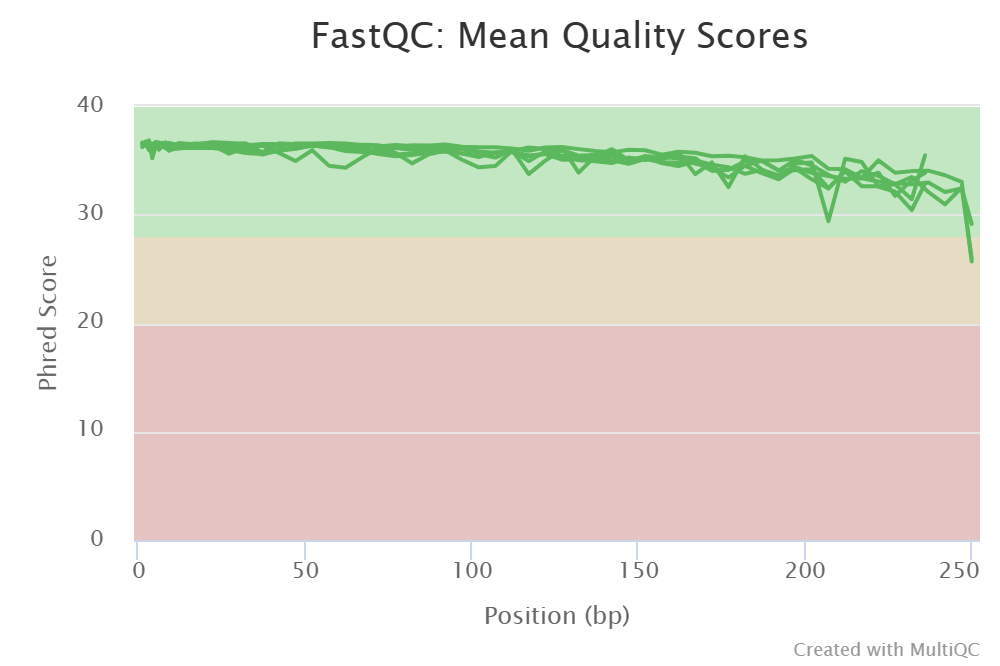
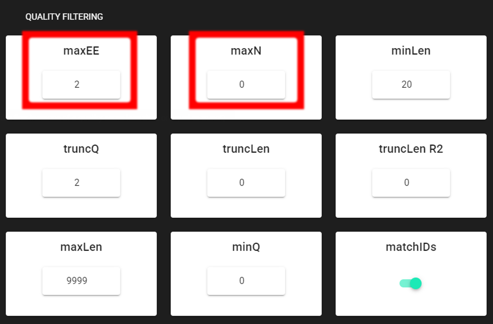

.. |PipeCraft2_logo| image:: _static/PipeCraft2_icon_v2.png
  :width: 50
  :alt: Alternative text
  :target: https://github.com/pipecraft2/user_guide

.. raw:: html

    

.. role:: red

.. raw:: html

    

.. role:: green
  
.. |fastqc_per_base_sequence_quality_plot| image:: _static/fastqc_per_base_sequence_quality_plot.png
  :width: 850
  :alt: Alternative text

.. |workflow_finished| image:: _static/workflow_finished.png
  :width: 300
  :alt: Alternative text
  :class: center

.. |stop_workflow| image:: _static/stop_workflow.png
  :width: 200
  :alt: Alternative text

.. |DADA2_PE_FWD| image:: _static/DADA2_PE_FWD.png
  :width: 700
  :alt: Alternative text

.. |cut_primers_expand_example| image:: _static/cut_primers_expand_example.png
  :width: 600
  :alt: Alternative text 

.. |DADA2_quality_filt_expand| image:: _static/DADA2_quality_filt_expand.png
  :width: 600
  :alt: Alternative text

.. |DADA2_denoise_expand| image:: _static/DADA2_denoise_expand.png
  :width: 600
  :alt: Alternative text

.. |DADA2_assign_tax_expand| image:: _static/DADA2_assign_tax_expand.png
  :width: 600
  :alt: Alternative text

.. |DADA2_filter_table_expand| image:: _static/DADA2_filter_table_expand.png
  :width: 600
  :alt: Alternative text

.. |DADA2_2samples_needed| image:: _static/troubleshoot/DADA2_2samples_needed.png
  :width: 300
  :alt: Alternative text

.. |output_icon| image:: _static/output_icon.png
  :width: 50
  :alt: Alternative text

.. |save| image:: _static/save.png
  :width: 50
  :alt: Alternative text

.. |pulling_image| image:: _static/pulling_image.png
  :width: 280
  :alt: Alternative text

.. meta::
    :description lang=en:
        PipeCraft manual. tutorial

|

:red:`THIS IS UNCOMPLETE PAGE`

COI example pipeline with DADA2 |PipeCraft2_logo|
-------------------------------------------------

This example dataset consists of **COI mtDNA gene amplicon sequences with the target length of 313 bp**:

| `Download example data set here <https://raw.githubusercontent.com/pipecraft2/user_guide/master/data/example_data_COI_313bp.zip>`_ and unzip it. 

For this example data run, we are using a subset of `CO1Classifier <https://github.com/terrimporter/CO1Classifier>`_ database in the taxonomy annotation process, `download it from here <https://raw.githubusercontent.com/pipecraft2/user_guide/master/data/Databases/SINTAX_COIv5.1.0.subset.zip>`_.

____________________________________________________

Starting point 
~~~~~~~~~~~~~~

This example dataset consists of **COI mtDNA gene amplicon sequences with the target length of 313 bp**:

- **paired-end** Illumina MiSeq data;
- **demultiplexed** set (per-sample fastq files);
- primers are not not **removed**;
- sequences in this set are **5'-3' (fwd) oriented**.

.. admonition:: when working with your own data ...

  ... then please check that the paired-end data file names contain **R1** and **R2** strings *(not just _1 and _2)*, so that 
  PipeCraft can correctly identify the paired-end reads.

  | *Example:*
  | *sample1_COI.R1.fq.gz*
  | *sample1_COI.R2.fq.gz*

**At least 2 samples** (2x R1 + 2x R2 files) are required for this workflow! Otherwise ERROR in the denoising step:

|DADA2_2samples_needed| 

____________________________________________________

| **To select DADA2 pipeline**, press
| ``SELECT PIPELINE`` --> ``DADA" ASVs``.
| 
| **To select input data**, press ``SELECT WORKDIR``
| and specify
| ``sequence files extension`` as **\*.fastq**;  
| ``sequencing read types`` as **paired-end**.

____________________________________________________

Workflow mode
~~~~~~~~~~~~~

Because we are working with sequences that are **5'-3' oriented**, we are selecting hte ``PAIRED-END FORWARD`` mode of the pipeline. 

|DADA2_PE_FWD| 

.. admonition:: if sequences are in mixed orientation
 
 If some sequences in your library are in 5'-3' and some as 3'-5' orientation, 
 then with the 'PAIRED-END FORWARD' mode exactly the same ASV may be reported twice, where one ASV is just the reverse complementary of another. 
 To avoid that, select **PAIRED-END MIXED** mode. 
 *Sequences have mixed orientation in libraries where sequenceing adapters have been ligated, rather than attached to amplicons during PCR.*

 **Specifying primers** (for CUT PRIMERS) **is mandatory for the PAIRED-END MIXED** mode. Based on the priemr sequences, the library will be split into two: 
 1) fwd oriented sequences, and 2) rev oriented sequences. Both batches are processed independently to produce ASVs, after which the rev oriented batch ASVs are 
 reverse complemented and merged with the fwd oriented ASVs. Identical ASVs are merged to form a final data set. This is a reccomended workflow for accurate denoising compared with first 
 reorienting all sequences to 5'-3', and then performing a standard 'PAIRED-END FORWARD' workflow.

____________________________________________________

Cut primers
~~~~~~~~~~~

The example dataset **contains primer sequences**. Generally, we need to remove these to proceed the analyses only with the variable metabarcode of interest.
If there are some additional sequence fragments, from eg. sequencing adapters or poly-G tails, then clipping the primers will remove those fragments as well.

Tick the box for ``CUT PRIMERS`` and specify forward and reverse primers.
For the example data, the **forward primer is GGWACWGGWTGAACWGTWTAYCCYCC** and **reverse primer is TANACYTCNGGRTGNCCRAARAAYCA**.

|cut_primers_expand_example|

The primers are 26 bp - to keep a bit of flexibility in the primer search, we are requesting the ``min overlap`` of **22 bp** and are allowing maximum of 2 ``mismatches`` . 
Note that too low ``min overlap`` may lead to random matches. Check :ref:`other CUT PRIMER options here <remove_primers>`.

__________________________________________________

Quality filtering 
~~~~~~~~~~~~~~~~~

Before adjusting quality filtering settings, let's have a look on the **quality profile** of our example data set. 
Below quality profile plot was generated using ``QualityCheck`` panel (:ref:`see here <qualitycheck>`).

|COI_example_quality_plot|

All files are represented with **green lines, indicating good average quality per file** (i.e., sample). 
However, if you see lower qualities of especially towards the end of R2 reads, then it not too alarming, since 
those can be clipped off with ``truncLen R2`` setting. DADA2 algoritm is robust to lower quality sequences, 
but removing the low quality read parts will improve the DADA2 sensitivity to rare sequence variants. 
But herein, we do not need to clip the ends, because the overall quality of the sequences is good enough.

____________________________________________________

**Click on** ``QUALITY FILTERING`` **to expand the panel**

|COI_ex_qFilt.png|

Here, we can leave the settings as DEFAULT by discarding sequences with 
**maximum error rate of >2** and with **ambiguous bases of >0**. 
:ref:`Check the settings here <dada2_qual_filt>`.

+-----------------------+-------------------------------------------------------+
| Output directory |output_icon|          ``qualFiltered_out``                  |
+=======================+=======================================================+
| \*.fq.gz              | quality filtered sequences per sample in FASTQ format |
+-----------------------+-------------------------------------------------------+
| \*.rds                | R objects for the following DADA2 workflow processes  |
+-----------------------+-------------------------------------------------------+
| seq_count_summary.csv | summary of sequence counts per sample                 |
+-----------------------+-------------------------------------------------------+

____________________________________________________

Denoise and merge pairs
~~~~~~~~~~~~~~~~~~~~~~~

This step performs desiosing (as implemented in DADA2), which first forms ASVs per R1 and R2 files. 
Then during merging/assembling process the paired ASV mates are assembled to output full amplicon length ASV. 

.. |DADA2_denoise_expand| image:: _static/DADA2_denoise_expand.png
  :width: 600
  :alt: Alternative text

|DADA2_denoise_expand| 

Here, we are working with Illumina data, so let's make sure that the ``errorEstFun`` setting is **loessErrfun**. 
We can leave all settings as DEFAULT. Check the :ref:`denoising settings here <dada2_qual_filt>` and :ref:`merge pairs settings here <dada2_merge_pairs>`.

+----------------------------------+--------------------------------------------------------+
| Output directory |output_icon|          ``denoised_assembled.dada2``                      |
+==================================+========================================================+
| \*.fasta                         | denoised and assembled ASVs per sample in FASTA format |
+----------------------------------+--------------------------------------------------------+
| \*.rds                           | R objects for the following DADA2 workflow processes   |
+----------------------------------+--------------------------------------------------------+
| Error_rates_R*.pdf               | plots for estimated R1/R2 error rates                  |
+----------------------------------+--------------------------------------------------------+
| seq_count_summary.csv            | summary of sequence counts per sample                  |
+----------------------------------+--------------------------------------------------------+

___________________________________________________

Chimera filtering
~~~~~~~~~~~~~~~~~

This step performs chimera filtering according to DADA2 removeBimeraDenovo function. During this step, the **ASV table** is also generated. 

.. important:: 

  make sure that primers have been removed from your amplicons; otherwise many false-positive chimeras may be filtered out from your dataset. 

Here, we filter chimeras using the **consensus** method. Check the :ref:`denoising settings here <dada2_chimeras>`  

+----------------------------------------+-------------------------------------------------------------------+
| Output directory                       | ``chimeraFiltered_out.dada2``                                     |
+========================================+===================================================================+
| \*.fasta                               | chimera filtered ASVs per sample                                  |
+----------------------------------------+-------------------------------------------------------------------+
| seq_count_summary.csv                  | summary of sequence counts per sample                             |
+----------------------------------------+-------------------------------------------------------------------+
| 'chimeras' dir                         | ASVs per sample identified as chimeras                            |
+----------------------------------------+-------------------------------------------------------------------+
| Output directory                       | ``ASVs_out.dada2``                                                |
+----------------------------------------+-------------------------------------------------------------------+
| ASVs_table.txt                         | denoised and chimera filtered ASV-by-sample table                 |
+----------------------------------------+-------------------------------------------------------------------+
| ASVs.fasta                             | corresponding FASTA formated ASV Sequences                        |
+----------------------------------------+-------------------------------------------------------------------+
| ASVs per sample identified as chimeras | rds formatted denoised and chimera filtered ASV table (for DADA2) |
+----------------------------------------+-------------------------------------------------------------------+

____________________________________________________

**THIS IS UNCOMPLETE PAGE**
