.. raw:: html

    

.. role:: red

.. raw:: html

    

.. role:: green
  
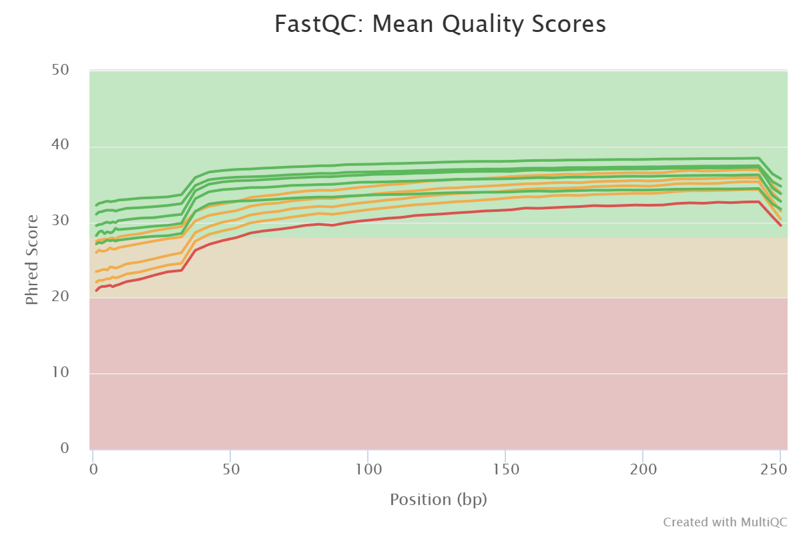

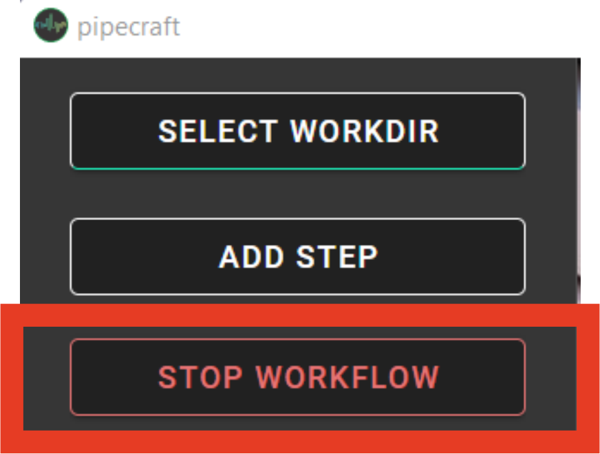

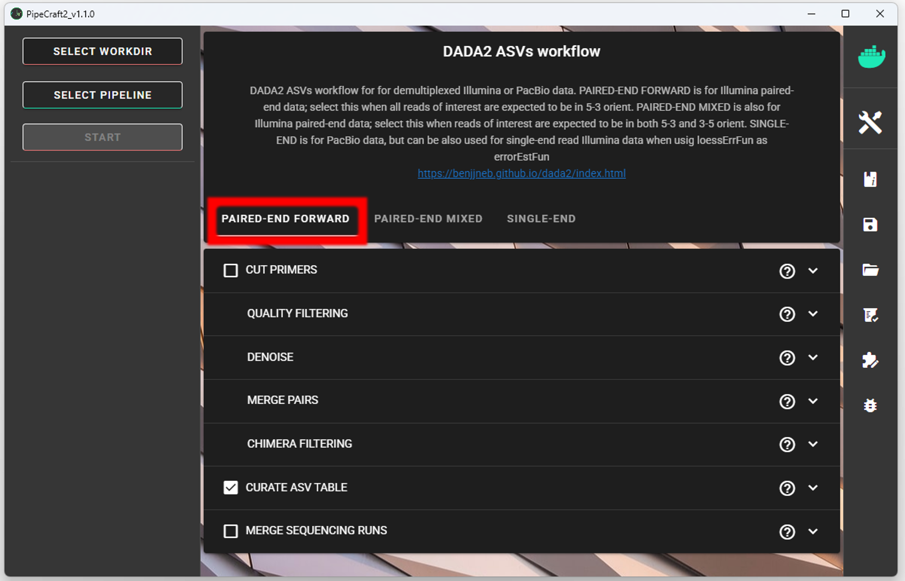

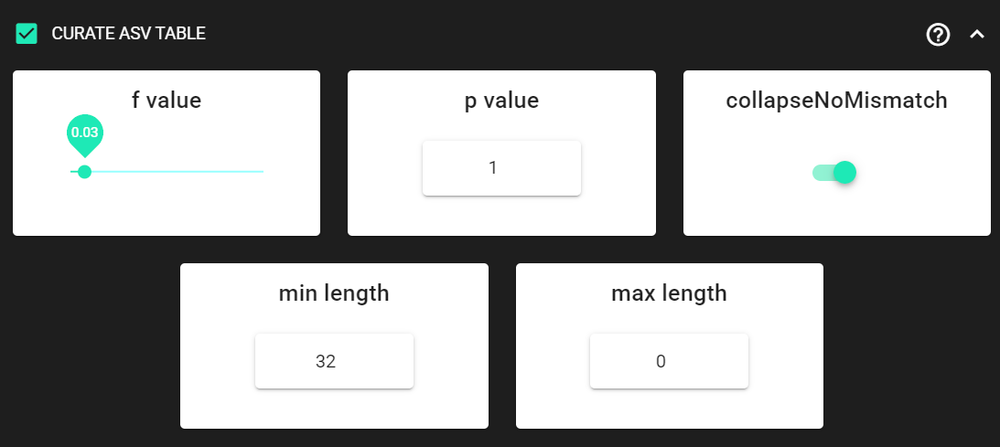

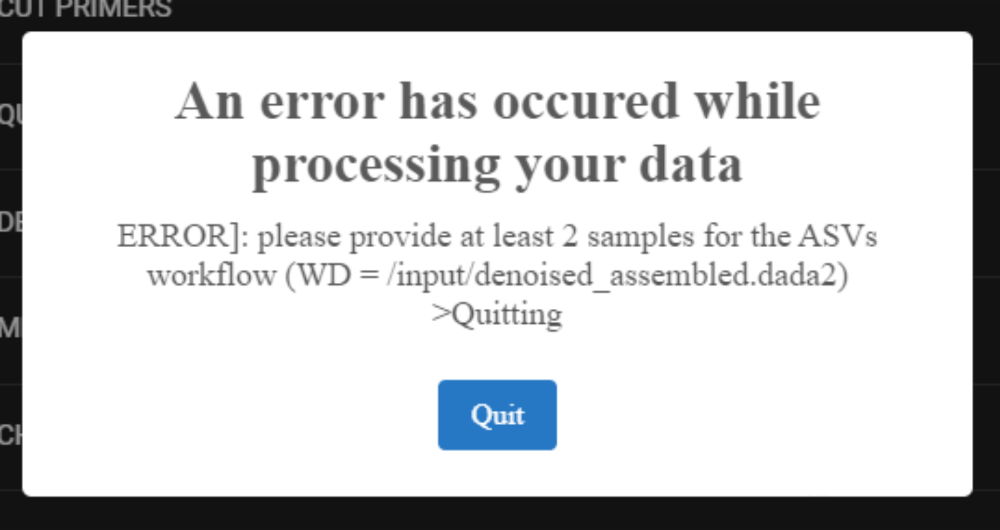

.. |DADA2_select_pipeline| image:: _static/select_pipeline.png
  :width: 700

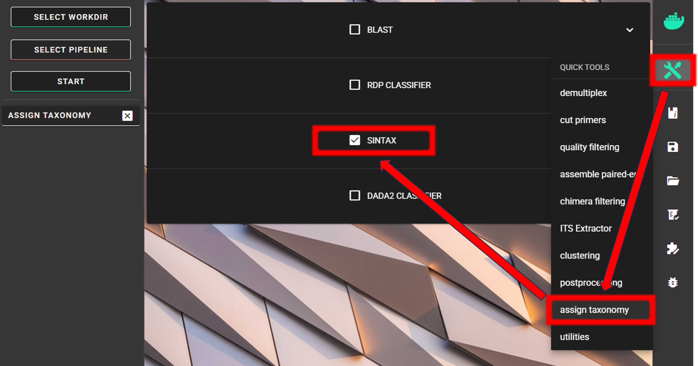

.. meta::
    :description lang=en:
        PipeCraft manual. tutorial

.. _example_analyses_DADA2_ITS:

DADA2 ASVs pipeline, ITS2 |PipeCraft2_logo|
===========================================

This example data analyses follows vsearch OTUs workflow as implemented in PipeCraft2's pre-compiled pipelines panel.

| `Download example data set here <https://zenodo.org/records/18770850/files/example_data_ITS2.zip?download=1>`_ (15.1 Mb) and unzip it.
| This is **ITS2 Illumina MiSeq** dataset. 

For this example, we are using `EUKARYOME database <https://eukaryome.org/>`_ in the taxonomy annotation process (SINTAX).
Download the **SINTAX_EUK_ITS** file from `here <https://eukaryome.org/sintax/>`_
and **unzip** it (note: use `7-Zip software <https://www.7-zip.org/download.html>`_ for **unzipping** files **in Windows**). 

____________________________________________________

Starting point 
--------------

This example dataset consists of **ITS2 rRNA gene amplicon sequences**; targeting fungi:

- **paired-end** Illumina MiSeq data;
- **demultiplexed** set (per-sample fastq files);
- primers **are not removed**;
- sequences in this set are **5'-3' oriented**.

.. admonition:: when working with your own data ...

  ... then please check that the paired-end data file names contain **R1** and **R2** strings *(not just _1 and _2)*, so that 
  PipeCraft can correctly identify the paired-end reads.

  | *Example:*
  | *sample1_R1.fastq.gz*
  | *sample1_R2.fastq.gz*

**At least 2 samples** (2x R1 + 2x R2 files) are required for this workflow! Otherwise ERROR in the denoising step:

|DADA2_2samples_needed| 

____________________________________________________

| **To select DADA2 pipeline**, press
| ``SELECT PIPELINE`` --> ``DADA" ASVs``.

|DADA2_select_pipeline|

| **To select input data**, press ``SELECT WORKDIR``
| and specify
| ``sequence files extension`` as **\*.fastq.gz**;  
| ``sequencing read types`` as **paired-end**.

____________________________________________________

Workflow mode
-------------

Because we are working with sequences that are **5'-3' oriented**, we are selecting hte ``PAIRED-END FORWARD`` mode of the pipeline. 

|DADA2_PE_FWD| 

.. admonition:: if sequences are in mixed orientation
 
 If some sequences in your library are in 5'-3' and some as 3'-5' orientation, 
 then with the 'PAIRED-END FORWARD' mode exactly the same ASV may be reported twice, where one ASV is just the reverse complementary of another. 
 To avoid that, select **PAIRED-END MIXED** mode. 
 *Sequences have mixed orientation in libraries where sequenceing adapters have been ligated, rather than attached to amplicons during PCR.*

 **Specifying primers** (for CUT PRIMERS) **is mandatory for the PAIRED-END MIXED** mode. Based on the priemr sequences, the library will be split into two: 
 1) fwd oriented sequences, and 2) rev oriented sequences. Both batches are processed independently to produce ASVs, after which the rev oriented batch ASVs are 
 reverse complemented and merged with the fwd oriented ASVs. Identical ASVs are merged to form a final data set. This is a reccomended workflow for accurate denoising compared with first 
 reorienting all sequences to 5'-3', and then performing a standard 'PAIRED-END FORWARD' workflow.

____________________________________________________

Cut primers
-----------

The example dataset **contains primer sequences**. 
Generally, we need to remove these to proceed the analyses only with the variable metabarcode of interest.
If there are some additional sequence fragments, from eg. sequencing adapters or poly-G tails, 
then clipping the primers will remove those fragments as well.

Tick the box for ``CUT PRIMERS`` and specify forward and reverse primers.
For the example data, the **forward primer is GTGARTCATCGAATCTTTG** (fITS7) 
and **reverse primer is TCCTCCGCTTATTGATATGC** (ITS4).

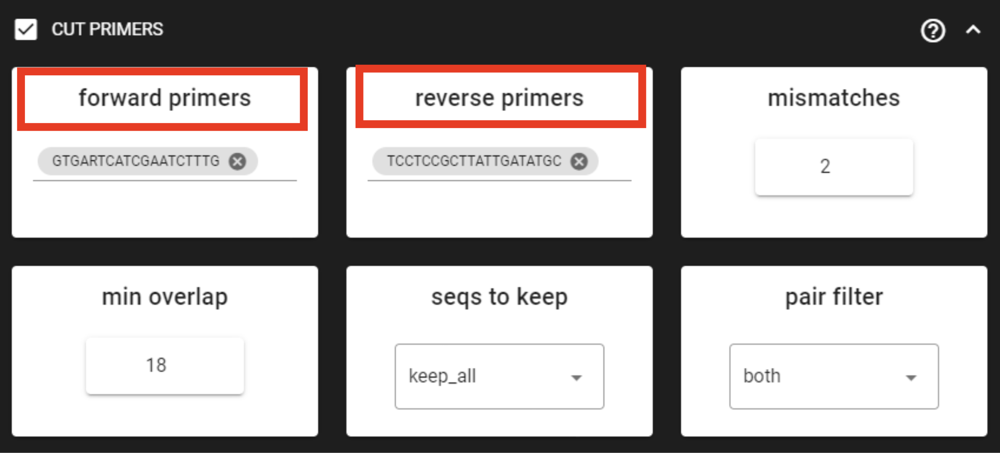

|cut_primers_expand_example|

Forward primer has 19 bp and reverse 20 bp - to keep a bit of flexibility in the primer search, 
we are requesting the ``min overlap`` of **18 bp** and are allowing maximum of 2 ``mismatches`` . 
Note that too low ``min overlap`` may lead to random matches. Check :ref:`other CUT PRIMER options here <remove_primers>`.

.. note:: 

  You may specify add up to 13 primer pairs. 

.. admonition:: A consideration when working with ITS sequences and plan to use ITS Extractor

  Since fITS7 and ITS4 primer binding sites are >50 bp from ITS2 region from the 5.8S side and >40 bp from the 28S side, 
  we can clip the primers in order to safely use :ref:`ITS Extractor <itsextractor>` 
  to remove the flanking regions from ITS2 reads. 
  
  However, when the primer binding sites are very close to the ITS region (< 25 bp), 
  then you may want to keep the primers for better detection of the 18S, 5.8S and 28S regions.

____________________________________________________

Quality filtering 
------------------

Quality filtering here removes sequences, which do not meet the specified quality threshold.
See :ref:`here for more inforamtion about sequence quality <qualitycheck>` 
and :ref:`DADA2 quality filtering <qfilt_dada2>`. 

**Click on** ``QUALITY FILTERING`` **to expand the panel**

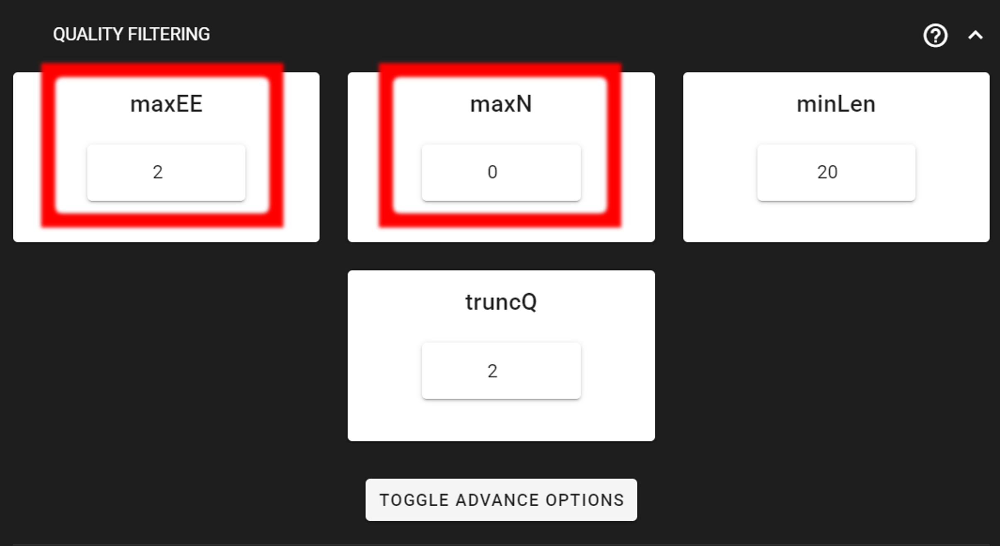

|COI_ex_qFilt|

Here, we can leave the settings as DEFAULT by discarding sequences with 
**maximum error rate of >2** and with **ambiguous bases of >0**. 

+-----------------------+-------------------------------------------------------+
| Output directory |output_icon|          ``qualFiltered_out``                  |
+=======================+=======================================================+
| \*.fq.gz              | quality filtered sequences per sample in FASTQ format |
+-----------------------+-------------------------------------------------------+
| \*.rds                | R objects for the following DADA2 workflow processes  |
+-----------------------+-------------------------------------------------------+
| seq_count_summary.csv | summary of sequence counts per sample                 |
+-----------------------+-------------------------------------------------------+

__________________________________________________

Denoise and merge pairs
~~~~~~~~~~~~~~~~~~~~~~~

This step performs desiosing (as implemented in DADA2), which first forms ASVs per R1 and R2 files. 
Then during merging/assembling process the paired ASV mates are assembled to output full amplicon length ASV. 

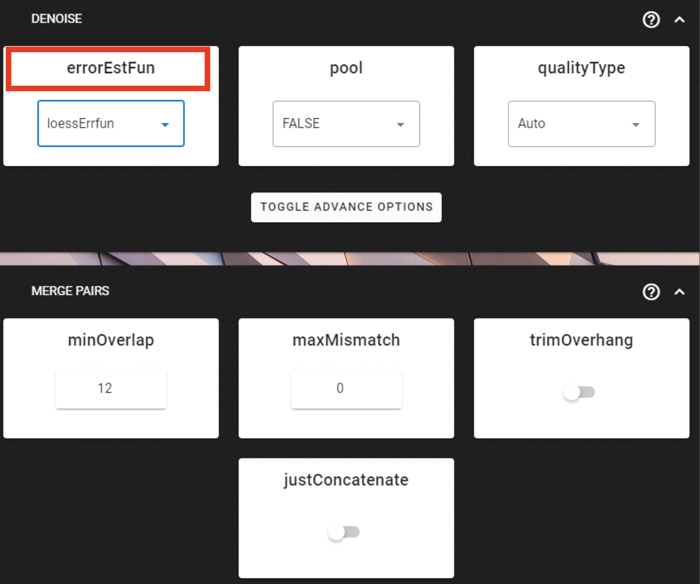

|DADA2_denoise_expand| 

Here, we are working with Illumina data, so let's make sure that the ``errorEstFun`` setting is **loessErrfun**. 
We can leave all settings as DEFAULT. 

+----------------------------------+--------------------------------------------------------+
| Output directory |output_icon|          ``denoised_assembled.dada2``                      |
+==================================+========================================================+
| \*.fasta                         | denoised and assembled ASVs per sample in FASTA format |
+----------------------------------+--------------------------------------------------------+
| \*.rds                           | R objects for the following DADA2 workflow processes   |
+----------------------------------+--------------------------------------------------------+
| Error_rates_R*.pdf               | plots for estimated R1/R2 error rates                  |
+----------------------------------+--------------------------------------------------------+
| seq_count_summary.csv            | summary of sequence counts per sample                  |
+----------------------------------+--------------------------------------------------------+

___________________________________________________

Chimera filtering
-----------------

This step performs chimera filtering according to DADA2 *removeBimeraDenovo* function. During this step, the **ASV table** is also generated. 

.. important:: 

  make sure that primers have been removed from your amplicons; otherwise many false-positive chimeras may be filtered out from your dataset. 

Here, we filter chimeras using the **consensus** method. 

+----------------------------------------+-------------------------------------------------------+
| Output directory |output_icon|           ``chimeraFiltered_out.dada2``                         |
+========================================+=======================================================+
| \*.fasta                               | chimera filtered ASVs per sample                      |
+----------------------------------------+-------------------------------------------------------+
| seq_count_summary.csv                  | summary of sequence counts per sample                 |
+----------------------------------------+-------------------------------------------------------+
| 'chimeras' dir                         | ASVs per sample identified as chimeras                |
+----------------------------------------+-------------------------------------------------------+

+----------------------------------------+-------------------------------------------------------+
| Output directory |output_icon|           ``ASVs_out.dada2``                                    |
+========================================+=======================================================+
| ASVs_table.txt                         | denoised and chimera filtered ASV-by-sample table     |
+----------------------------------------+-------------------------------------------------------+
| ASVs.fasta                             | corresponding FASTA formated ASV Sequences            |
+----------------------------------------+-------------------------------------------------------+
| ASVs per sample identified as chimeras | rds formatted denoised and chimera filtered ASV table |
+----------------------------------------+-------------------------------------------------------+

.. _curate_asv_table_DADA2_ITS:

____________________________________________________

Curate ASV table
----------------

This process first removes putative :ref:`tag jumps <filter_tag_jumps>` 
and then **collapses the ASVs that are identical** up to shifts or length variation, 
i.e. ASVs that have no internal mismatches (PipeCraft2 uses vsearch *usearch_global --id 1* for that); and finally 
filters out ASVs that are shorter/longer than specified length (in base pairs).

Here, we are **enabling this process** by checking the box for ``CURATE ASV TABLE`` in the DADA2 ASV workflow panel. 

|DADA2_filter_table_expand_ITS|

The ``f_value`` and ``p_value`` settings are used to filter out putative tag jumps (using UNCROSS2 algorithm). 
Generally, we recommend to use p_value of 1 (default), and **f_value of 0.03** when using combinational indexing strategy; 
f_value of 0.05 when using single-indexes, and f_value of 0.01 when using unique dual-indexes.

We are setting the ``collapseNoMismatch`` to TRUE, to collapse identical ASVs. 
This is basically equivalent to 100% clustering by ignoring the end gaps.

Since the ITS2 amplicon length is highly variable, we are keeping 
``min length`` and ``max length`` settings as default. 
``max length`` is set to 0, meaning no filtering by maximum sequence length.

+----------------------------+-------------------------------------------------------------------+
| Output directory |output_icon|       ``ASVs_out.dada2/curated``                                |
+============================+===================================================================+
| ASVs_table_TagJumpFilt.txt | only tag-jump filtered ASV-by-sample table                        |
+----------------------------+-------------------------------------------------------------------+
| ASVs.fasta                 | corresponding ASV Sequences with ASVs_table_TagJumpFilt.txt table |
+----------------------------+-------------------------------------------------------------------+
|| ASVs_collapsed.fasta      || tag-jump filtered and collapsed and size filtered                |
||                           || ASV Sequences. Present only if some ASVs were collapsed.         |
+----------------------------+-------------------------------------------------------------------+
|| ASVs_table_collapsed.txt  || corresponding ASV-by-sample table.                               |
||                           || Present only if some ASVs were collapsed.                        |
+----------------------------+-------------------------------------------------------------------+
| TagJump_stats.txt          | summary of tag-jump filtering results                             |
+----------------------------+-------------------------------------------------------------------+

.. admonition:: If there is nothing to collapse or filter out based on the length
  
  then there are no corresponding files in the ``ASVs_out.dada2/curated`` directory, and only 
  ASVs_table_TagJumpFilt.txt and ASVs.fasta files will be generated 
  (even when there is nothing to tag-jump filter - in which case ASVs_table_TagJumpFilt.txt is the same 
  ASVs_table.txt in the ``ASVs_out.dada2`` directory).

.. note:: 

  The pre-compiled pipeline ends here. Outputs ITS2 ASVs can be further filtered to 
  **remove flanking gene fragments from ITS2 sequences** (:ref:`via ITS Extractor <itsextractor>`), 
  and optionally :ref:`ASVs can be clustered into OTUs <asv2otu>`. See below. 

___________________________________________________

Save workflow
-------------

Once we have decided about the settings in our workflow, we can save the configuration file 
by pressing ``save workflow`` button on the right-ribbon.

|save|

If you forget the save, then no worries, a ``pipecraft2_last_run_configuration.json`` file will be generated 
for you upon starting the workflow.
As the file name says, it is the workflow configuration file for your last PipeCraft run in this **working directory**.
If the file name (pipecraft2_last_run_configuration.json) is not changed, then the file is overwritten with the new configuration
if running a new job in the same working directory.

This ``JSON`` file can be loaded into PipeCraft2 to **automatically configure your next runs exactly the same way**.

___________________________________________________

Start the workflow
------------------

Press ``START`` on the left ribbon **to start the analyses**.

.. admonition:: when running the module for the first time ...
  
  ... a docker image will be first pulled to start the process. 

  For example: |pulling_image|

When you need to STOP the workflow, press ``STOP`` button |stop_workflow|

.. admonition:: When the workflow has completed ...

  ... a message window will be displayed.

  |workflow_finished|

___________________________________________________

|

.. _examine_outputs_ITS:

Outputs of the DADA2 ASVs workflow
----------------------------------

Several process-specific output folders are generated |output_icon|

+-------------------------------+------------------------------------------------------------+
| ``primersCut_out``            | paired-end **fastq** files per sample, **primers clipped** |
+-------------------------------+------------------------------------------------------------+
| ``qualFiltered_out``          | quality filtered paired-end **fastq** files per sample     |
+-------------------------------+------------------------------------------------------------+
| ``denoised_assembled.dada2``  | denoised and assembled **fasta** files per sample          |
+-------------------------------+------------------------------------------------------------+
| ``chimeraFiltered_out.dada2`` | chimera filtered **fasta** files per sample                |
+-------------------------------+------------------------------------------------------------+
| ``ASVs_out.dada2``            | **ASVs table**, and ASV sequences files                    |
+-------------------------------+------------------------------------------------------------+
| ``ASVs_out.dada2/curated``    | curated **ASVs table**, and ASV sequences files            |
+-------------------------------+------------------------------------------------------------+

Each folder (except ``ASVs_out.dada2``) contain 
**summary of the sequence counts** (``seq_count_summary.csv``). 
Examine those to track the read counts throughout the pipeline. 

For example, from the ``seq_count_summary.txt`` file in ``qualFiltered_out`` we see that 
all sequences passed the quality filtering step for the 
first two samples, while most of the sequences 
were discarded from the last three samples 
*(note that this is an example dataset, with intentionally lower quality sequences in the last three samples)*.

+---------+-------+--------------+
|         | input | qualFiltered |
+---------+-------+--------------+
| sample1 | 22781 | 22781        |
+---------+-------+--------------+
| sample2 | 13748 | 13748        |
+---------+-------+--------------+
| sample3 | 11639 | 4383         |
+---------+-------+--------------+
| sample4 | 11476 | 401          |
+---------+-------+--------------+
| sample5 | 9431  | 55           |
+---------+-------+--------------+

____________________________________________________

.. admonition:: Final outputs of the pipeline
    :class: important

    Here, we applied also **"CURATE ASV TABLE"** process.
    Therefore, our final outputs of the pipeline are in the ``ASVs_out.dada2/curated`` directory, which contans: 

+--------------------------------+-------------------------------------------------------------------+
| Output directory  |output_icon|    ``ASVs_out.dada2/curated``                                      |
+================================+===================================================================+
| **ASVs_table_TagJumpFilt.txt** | tag-jump filtered ASV-by-sample table                             |
+--------------------------------+-------------------------------------------------------------------+
| **ASVs.fasta**                 | corresponding ASV Sequences with ASVs_table_TagJumpFilt.txt table |
+--------------------------------+-------------------------------------------------------------------+
| **TagJump_stats.txt**          | summary of tag-jump filtering results                             |
+--------------------------------+-------------------------------------------------------------------+

Let's check the ``README.txt`` file in the ``ASVs_out.dada2/curated`` directory:

there, we see that:
    - Number of **Features** = 21
    - Number of **sequences** in the Feature table = 40832
    - Number of **samples** in the Feature table   = 4

.. note::

  Note that even though we applied the ``collapseNoMismatch`` setting, no ASVs were collapsed 
  as stated in the ``README.txt`` file: "*Output has the same number of Features (ASVs/OTUs) as input. No new files outputted.*"
  Therefore, no ``ASVs_table_collapsed.txt`` and ``ASVs_collapsed.fasta`` files were generated.

Our final ASV table from this pipeline in ``ASVs_table_TagJumpFilt.txt``, which 
represents the ASV table after the tag-jump filtering, 
where the **1st column** represents ASV identifiers (sha1 encoded), 
**2nd column** is the sequence of an ASV,
and all the following columns represent number of sequences in the corresponding samples 
(sample name is taken from the file name). This is tab delimited text file. 

*ASVs_table_TagJumpFilt.txt; first 4 ASVs:*

+-----------+-----------+---------+---------+---------+---------+
| OTU       | Sequence  | sample1 | sample2 | sample3 | sample4 |
+-----------+-----------+---------+---------+---------+---------+
| d35ef6... | AACGCA... | 3824    | 4151    | 840     | 0       |
+-----------+-----------+---------+---------+---------+---------+
| b260a9... | AACGCA... | 3379    | 2167    | 783     | 0       |
+-----------+-----------+---------+---------+---------+---------+
| 52f069... | AACGCA... | 2889    | 1393    | 407     | 0       |
+-----------+-----------+---------+---------+---------+---------+
| 25989c... | AACGCA... | 2067    | 750     | 404     | 0       |
+-----------+-----------+---------+---------+---------+---------+

*Note: even though the ASVs column header is "OTU", it represents ASVs as we preformed an ASVs workflow!*

:ref:`Tag-jump filtering <filter_tag_jumps>` **does not remove ASVs**. 
Instead, it adjusts the **ASV table**
by removing (setting to zero) low-abundance occurrences of an ASV in specific samples where they are likely due to tag-jumps.
Therefore, the ``ASVs_out.dada2/curated/ASVs.fasta`` file is the same as ``ASVs_out.dada2/ASVs.fasta`` file. 

When checking the ``TagJump_stats.txt`` file in the ``ASVs_out.dada2/curated`` directory, 
we see that based on our settings, **13 tag-jump events** were detected, 
and total of **316 reads** were removed as putative tag-jumps.

You can track the tag-jump filtering by comparing the 
``ASVs_out.dada2/ASVs_table.txt`` and ``ASVs_out.dada2/curated/ASVs_table_TagJumpFilt.txt`` files.

+-------------------------------------------------------+-------------------------------------+
| ``ASVs_out.dada2/ASVs_table.txt``                     | ASV table produced by DADA2         |
+-------------------------------------------------------+-------------------------------------+
| ``ASVs_out.dada2/curated/ASVs_table_TagJumpFilt.txt`` | ASV table after tag-jump filtering  |
+-------------------------------------------------------+-------------------------------------+

First thing, that we notice is that ``ASVs_out.dada2/ASVs_table.txt`` has **5 samples**, 
but ``ASVs_out.dada2/curated/ASVs_table_TagJumpFilt.txt`` has only **4 samples**.
This is because tag-jump filtering removed the only ASV *d35ef67e34f96f725d342aedac2bc2a69cbf078a* 
from *sample5*, that was represented by 15 sequences.
Based on the sequence distribution of that ASV, it was considered as a tag-jump, thus removed from *sample5*.

Tag-jump filtering can be relaxed by decreasing the ``f_value`` to 0.01. 
Generally, we recommend to use p_value of 1 (default), and **f_value of 0.03** when using combinational indexing strategy; 
f_value of 0.05 when using single-indexes, and f_value of 0.01 when using unique dual-indexes.

__________________________________________________

Extract ITS2 
------------

Here, in this example dataset, we are working with **ITS2 amplicons**, and since 
**fungi may have multiple different ITS copies per genome and may exhibit size polymorphism**,
then we aim to cluster the :ref:`ASVs into OTUs <asv2otu>`. 

But for that, first we want to remove the flanking gene fragments from ITS2 sequences
that may affect clustering. For that, we are using :ref:`ITSx <itsextractor>` (``QuickTools --> ITS Extractor``). 

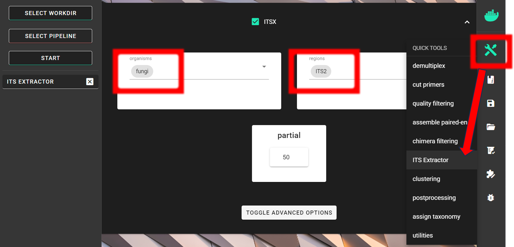

|ITSx_quicktools|

Since we are interesed only in **fungi**, 
we can limit the ``organisms`` to only fungi and keep the ``regions`` as **ITS2**. 
Universal ITS2 **primers amplify also other eukaryotes besides fungi**, thus, this 
step **helps also to discard off-target sequences** when limiting the ``organisms`` to only fungi. 
However, note that this increase in specificity may lead to some decrease in sensitivity; i.e., discarding some Fungal OTUs.
For **real-world applications**, you may set ``organism`` to **"all"**, and 
**discard off-target OTUs after the taxonomy assignment step**.

.. note::

  **If you are working with only 5'-3' oriented amplicons**, then turn off ``complement`` setting under ``TOGGLE ADVANCE OPTIONS``
  to skip the reverse complementary search; and possibly add more ``cores`` to speed things up (:ref:`see here <modify_resources>`).

The ``partial`` setting is set to 50, which means that if **at least one of the 5.8S or 28S motif is found in the sequence**
and that sequence is **at least 50 bp long** (after cutting the motif), 
then it will be classified as **partial ITS2 sequence** and outputted in the ``ITS2/full_and_partial`` directory.

.. note::

  For better detection of the 18S, 5.8S and/or 28S regions by ITSx, you may not want to CUT PRIMERS in your own dataset. 
  With this example dataset, :ref:`ITSx <itsextractor>` works fine even when primers were clipped.

Input data
~~~~~~~~~~

Via ``SELECT WORKDIR`` button, we specify the ``ASVs_out.dada2/curated`` directory as a working directory.
The output directory, ``ITSx_out``, will be created there (``ASVs_out.dada2/curated/ITSx_out``).

Automatically detected ``Sequence files extension`` may be ``.txt``, but we need to set it to ``.fasta``, so 
ITSx can work with the FASTA files in the working directory. The ``Sequencing read types`` do not matter here, 
just click 'Confirm'.

.. admonition:: Before starting ITSx
  :class: important

  Note that all fasta files in the folder will be subjected to :ref:`ITSx <itsextractor>`, so include 
  to the WORKING DIRECTORY only ONE FASTA FILE within this workflow ``ASVs.fasta`` or ``ASVs_collapsed.fasta`` 
  if there were any collapses with your own data.

  The WORKING DIRECTORY can contain multiple FASTA files when the aim is to extract ITS2 sequences from all of them. 

Outputs of ITSx
~~~~~~~~~~~~~~~ 

+-------------------------------------------+-------------------------------------------------------------+
| Output directory |output_icon| ``ITSx_out``                                                             |
+===========================================+=============================================================+
| ``ITS2``/\*.fasta                         | ITS2 sequences (without flanking gene fragments) per sample |
+-------------------------------------------+-------------------------------------------------------------+
| ``ITS2``/``full_and_partial``/\*.fasta    | full, but also partial ITS2 sequences per sample            |
+-------------------------------------------+-------------------------------------------------------------+
| seq_count_summary.txt                     | summary of sequence counts per sample                       |
+-------------------------------------------+-------------------------------------------------------------+

Checking the ``ITSx_out/ITS2/seq_count_summary.txt`` file, we see that 
ITS2 region was identified in all 21 ASVs.

+------------+----------+-----------+
| File       | Reads_in | Reads_out |
+------------+----------+-----------+
| ASVs.fasta | 21       | 21        |
+------------+----------+-----------+

For the demonstration purposes, **let's examine the lenghts of the ASV sequences before and after ITSx**:

Easy way to do this is to use :ref:`seqkit stats <utilities_seqkit_stats>` tool (``QuickTools --> Utilities``). 

**seqkit stats** output (``seqkit_stats.fasta.txt``):

+-----------------+--------+------+----------+---------+---------+---------+---------+
| File            | format | type | num_seqs | sum_len | min_len | avg_len | max_len |
+-----------------+--------+------+----------+---------+---------+---------+---------+
| ASVs.fasta      | FASTA  | DNA  | 21       | 6614    | 272     | 315.0   | 366     |
+-----------------+--------+------+----------+---------+---------+---------+---------+
| ASVs.ITS2.fasta | FASTA  | DNA  | 21       | 4619    | 177     | 220.0   | 271     |
+-----------------+--------+------+----------+---------+---------+---------+---------+

The sequences in the ``ASVs.fasta`` still contain the flanking **5.8S** and **LSU** regions,
while the sequences in the ``ASVs.ITS2.fasta`` only contain the ITS2 region. Therefore, 
the ``avg_len`` of the ``ASVs.ITS2.fasta`` is shorter than the ``avg_len`` of the ``ASVs.fasta``.

The spread between ``min_len`` and ``max_len`` reflects **true biological length variation** of ITS2 among taxa.

Working with only ITS2 reads (without flanking gene fragments) may be useful 
as it **standardizes what part of the rDNA amplicon you cluster** (so clustering is driven by the ITS barcode region).

ITS2 ASVs
~~~~~~~~~

We can further proceed to cluster :ref:`ASVs into OTUs <asv2otu>`, but if the aim is 
to work with ITS2 ASVs, then we need to match the ASV table to the ITS2 ASVs.
In this example, ITSx did not remove any ASVs, therefore, the ASV table to work with is ``ASVs_table_TagJumpFilt.txt`` file 
in the ``ASVs_out.dada2/curated`` directory.

In case ITSx removed some ASVs, then you can use :ref:`ASV TO OTU <asv2otu>` tool (``QuickTools --> Postprocessing --> ASV TO OTU``) 
with ``similarity threshold`` of **1** to **match the input ASV table to the ITS2 ASVs**. 
:ref:`ASV TO OTU <asv2otu>` tool allows the ASVs in the input ASV fasta file to be a subset of the input ASV table. 

Applying :ref:`ASV TO OTU <asv2otu>` module with 
``similarity threshold`` of **1** is the same thing as ``collapseNoMismatch = TRUE`` in the 
:ref:`CURATE ASV TABLE <curate_asv_table_DADA2_ITS>` process.
It collapses identical ASVs by ignoring the end gaps, but if there are no identical ASVs, then it just 
matches the input ASV table to the ITS2 ASVs.

__________________________________________________

Cluster ASVs into OTUs
----------------------

The ASVs approach may not accurately reflect species composition in the community of as 
**fungi may have multiple different ITS copies per genome and may exhibit size polymorphism**. Thus, here
we aim to cluster the :ref:`ASVs into OTUs <asv2otu>` (``QuickTools --> Postprocessing --> ASV TO OTU``). 

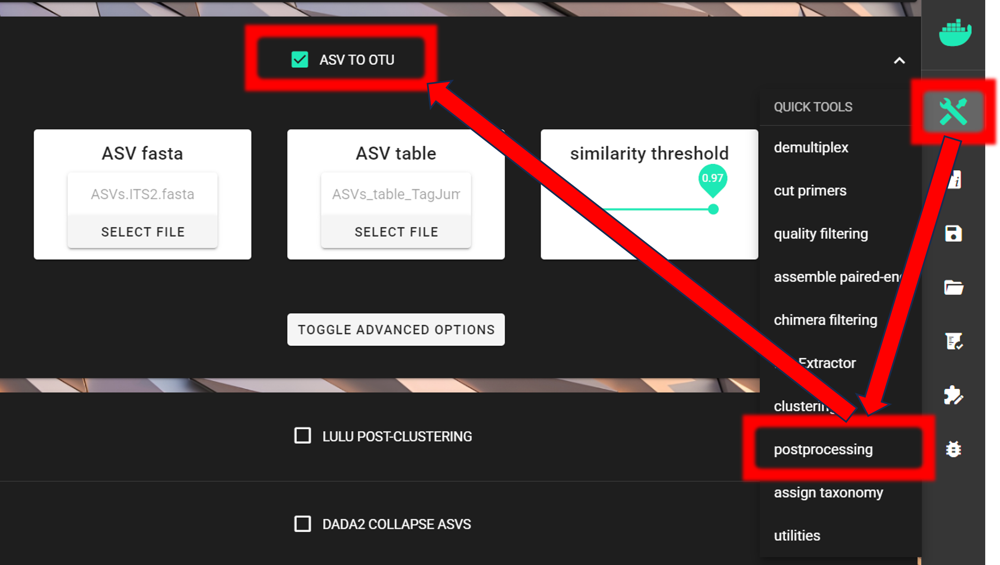

|ASVs_to_OTUs_ITS|

**Input fasta** file is in the ``ITSx_out/ITS2/ASVs.ITS2.fasta`` and 
**input ASV table** is in the ``ASVs_out.dada2/curated/ASVs_table_TagJumpFilt.txt`` directory.

As a ``similarity threshold`` we are using the commonly used **97%** (0.97, default setting).

.. note::

  2nd column of the input **ASV table must be 'Sequences'** 
  (1st column is ASV IDs; this is the default PipeCraft2 output table, so you don't need to worry about this if you have followed this pipeline).
  For clustering, the ASV size annotation is obtained from the ASV table. 

  If the ASV table does not contain 'Sequence' column, then add those with ``QuickTools -> Utilities -> Add sequences to table`` 
  :ref:`see here <add_seqs_to_table>`.

Via ``SELECT WORKDIR`` button, we specify the ``ASVs_out.dada2/curated`` directory as a working directory 
(``Sequence files extension`` and ``Sequencing read types`` do not matter here, just click 'Confirm').

The output directory, ``ASVs2OTUs_out``, will be created there (``ASVs_out.dada2/curated/ASVs2OTUs_out``).

+-----------------------------------------+---------------------------------------------+
| Outputs in ``ASVs2OTUs_out`` directory:                                               |
+=========================================+=============================================+
| OTUs.fasta                              | FASTA formated representative OTU sequences |
+-----------------------------------------+---------------------------------------------+
| OTU_table.txt                           | OTU table (tab delimited file)              |
+-----------------------------------------+---------------------------------------------+
| OTUs.uc                                 | uclust-like formatted clustering results    |
+-----------------------------------------+---------------------------------------------+

__________________________________________________

LULU post-clustering
--------------------

Additionally, we can perform :ref:`LULU post-clustering <postclustering_lulu>` to merge co-occurring 'daughter' OTUs.

LULU description from the `LULU repository <https://github.com/tobiasgf/lulu>`_: the purpose of LULU is to reduce the number of 
erroneous OTUs in OTU tables to achieve more realistic biodiversity metrics. 
By evaluating the co-occurence patterns of OTUs among samples LULU identifies OTUs that consistently satisfy some user selected 
criteria for being errors of more abundant OTUs and merges these. **It has been shown that curation with LULU consistently result in more realistic diversity metrics.**

Here, we are **performing LULU post-clustering** via **QuickTools** panel (on the right ribbon).

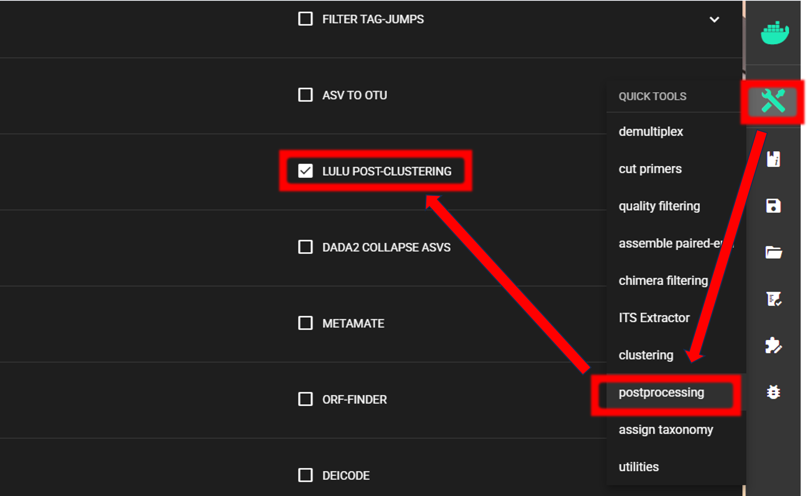

|select_LULU|

The **input data** are ``OTU_table.txt`` and ``OTUs.fasta`` files in the ``ASVs2OTUs_out`` directory. 
Here, we are using the default settings (which are suitable for most cases), 
but feel free to experiment with various settings to see the effect on the results.

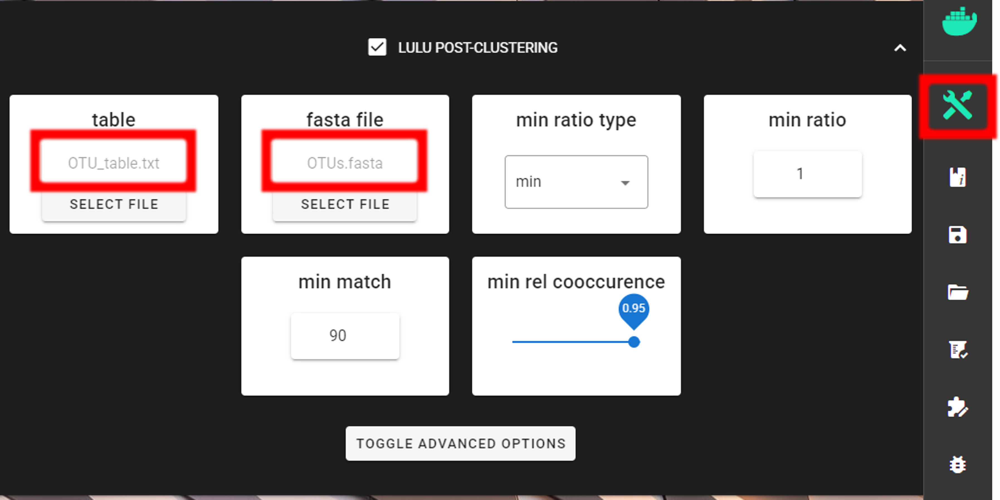

|LULU| 

.. admonition:: To **START**

  To **START**, specify working directory under ``SELECT WORKDIR`` (outputs will be written here), 
  but the following requests about ``Sequence files extension`` and ``Sequencing read types`` **do not matter here**, just click 'Confirm'.

The outputs of the process are in the ``lulu_out`` directory. But if we examine the ``README.txt`` file in that directory, 
then we see that **"Total of 0 Features (OTUs/ASVs) were merged"**, and therefore we do not have any OTU table or fasta file on the ``lulu_out`` folder. 
Note that this is a small example dataset, but with larger datasets postclustering merges many 'daughter' OTUs into 'parent' OTUs.

Thus, with this example dataset, our final OTU table and fasta file are 
``OTU_table.txt`` and ``OTUs.fasta`` files in the ``ASVs2OTUs_out`` directory.

See :ref:`this example of applying LULU post-clustering <lulu_postclustering_DADA2_COI>` where LULU merged some OTUs.

.. _assign_taxonomy_ITS2:

__________________________________________________

Assign taxonomy
---------------

Assign taxonomy **is not the part of the full per-defined pipeline**, but can be run as a **separate step in QuickTools**.

Here, we are using :ref:`SINTAX <assign_taxonomy_sintax>`.
See :ref:`other assign taxonomy options here <assign_taxonomy>`.

|select_SINTAX_classifier|

We need to specify the location of the **reference DATABASE** for the taxonomic classification of our OTUs. 
For this example, we are using `EUKARYOME database <https://eukaryome.org/>`_, which 
is a comprehensive database of eukaryotic ITS sequences; thus containing also other eukaryotic sequences besides Fungi. 
**"Outgroups" are important in the reference database in order not to overclassify non-Fungal sequences as Fungi.**
Download the **SINTAX_EUK_ITS** file from `here <https://eukaryome.org/sintax/>`_
and **unzip** it (note: use `7-Zip software <https://www.7-zip.org/download.html>`_ for **unzipping** files **in Windows**). 

See other databases available for taxonomy annotation :ref:`here <databases>`. 

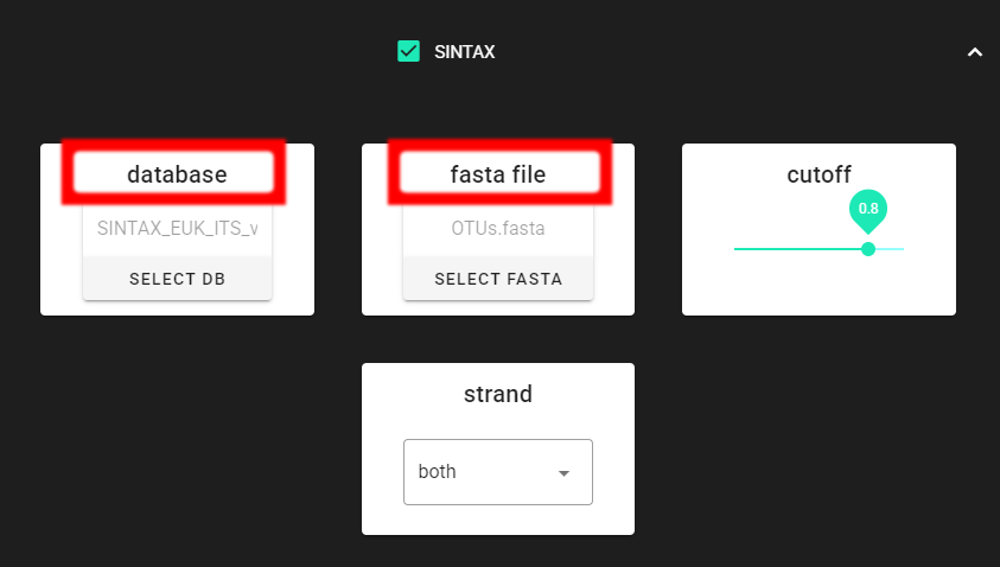

|select_SINTAX_classifier_ITS|

Specify the location of your downloaded ``database`` and also the fasta file with ASVs (``fasta file``) to be classified.
Herein, we use ``OTUs.fasta`` file in the ``ASVs2OTUs_out`` directory (since we applied also ``ASV TO OTU`` process).

.. important::

  Make sure you do not have any other SINTAX database files is the same directory as the database you are using.
  That is, use dedicated directory for the SINTAX database.

.. admonition:: To **START**

  To **START**, specify working directory under ``SELECT WORKDIR`` (outputs will be written here), 
  but the following requests about ``Sequence files extension`` and ``Sequencing read types`` **do not matter here**, just click 'Confirm'.

.. note::

  First time usage of the fasta formatted database requires conversion to the SINTAX database format (.udb).
  This conversion is performed automatically by PipeCraft2, and will take some time, depending on the size of the database.

Result from the **taxonomy annotation** process - **taxonomy table** (taxonomy.sintax.txt) - is located at the 
``taxonomy_out.sintax`` directory. 

+---------------------+------------------------------------------+
| Output directory    | ``taxonomy_out.sintax``                  |
+=====================+==========================================+
| taxonomy.sintax.txt | classifier results with bootstrap values |
+---------------------+------------------------------------------+

*Taxonomy results for the first 4 OTUs*

+------------------------------------------+--------------------------------------------------------------------------------------------------------------------------------------------+-------+--------------------------------------------------------------------------------------------+
| 52f069d5552dbeaa8fe7dc379bd33c111bdc958f | d:Fungi(1.00),p:Basidiomycota(1.00),c:Agaricomycetes(1.00),o:Russulales(1.00),f:Albatrellaceae(1.00),g:Byssoporia(1.00),s:terrestris(0.53) | ``+`` | d:Fungi,p:Basidiomycota,c:Agaricomycetes,o:Russulales,f:Albatrellaceae,g:Byssoporia        |
+------------------------------------------+--------------------------------------------------------------------------------------------------------------------------------------------+-------+--------------------------------------------------------------------------------------------+
| 99a50398b16a99aa01a932e3cfbf072c1313e8bd | d:Fungi(1.00),p:Basidiomycota(1.00),c:Agaricomycetes(1.00),o:Russulales(1.00),f:Russulaceae(1.00),g:Russula(1.00),s:chloroides(0.85)       | ``+`` | d:Fungi,p:Basidiomycota,c:Agaricomycetes,o:Russulales,f:Russulaceae,g:Russula,s:chloroides |
+------------------------------------------+--------------------------------------------------------------------------------------------------------------------------------------------+-------+--------------------------------------------------------------------------------------------+
| ed8775e608760e3c55fd15cf33eeed6690db89a2 | d:Fungi(1.00),p:Ascomycota(1.00),c:Pezizomycetes(1.00),o:Pezizales(1.00),f:Pyronemataceae(1.00),g:Humaria(1.00),s:hemisphaerica(0.70)      | ``+`` | d:Fungi,p:Ascomycota,c:Pezizomycetes,o:Pezizales,f:Pyronemataceae,g:Humaria                |
+------------------------------------------+--------------------------------------------------------------------------------------------------------------------------------------------+-------+--------------------------------------------------------------------------------------------+
| 12a6e094e33bc2c9cf286bfde56fc73b90c26847 | d:Fungi(1.00),p:Basidiomycota(1.00),c:Agaricomycetes(1.00),o:Russulales(1.00),f:Russulaceae(1.00),g:Lactarius(Fungi)(1.00)                 | ``+`` | d:Fungi,p:Basidiomycota,c:Agaricomycetes,o:Russulales,f:Russulaceae,g:Lactarius(Fungi)     |
+------------------------------------------+--------------------------------------------------------------------------------------------------------------------------------------------+-------+--------------------------------------------------------------------------------------------+

``taxonomy.sintax.txt`` is a tab-delimited text file without the initial header row:

- 1st column: OTU identifier (sha1 encoded)
  
- 2nd column: SINTAX classification result with bootstrap values in parentheses
  
- 3rd column: "+" sign
  
- 4th column: SINTAX classification result when considering the ``cutoff`` value (minimum bootstrap of 0.8)

In most cases, the **4th column** of the ``taxonomy.sintax.txt`` is needed for further downstream ecological analyses. 
However, when using comma (``,``) as a field separator, the taxonomy in the 4th column has a **variable** number of fields
(depending on the deepest rank SINTAX assigned at the ``cutoff``).

Below, you can find a **R-script to parse** sintax taxonomy table (when **EUKARYOME** database is used). 
The R-script reads the
SINTAX table, takes the **4th column**, and writes ``taxonomy.sintax.formatted.txt`` with **eight** fixed columns
for each rank. Missing ranks are filled with ``unclassified_<previous_rank>`` (for example,
``Species`` = ``unclassified_Lactarius`` when the deepest rank in column 4 is genus). EUKARYOME ``s:`` values are **species
epithets only**; the script writes the binomial as ``Genus_epithet``. 
Additional clarifications in genus names, specific to EUKARYOME database, such as 
``Lactarius(Fungi)`` are reduced to ``Lactarius`` for the ``Genus`` and species columns.

For species level assignment, the R-script has an optional ``species_threshold`` argument, for 
requiring a **higher** bootstrap value for species assignment (**stricter way** for assigning species names.)
When ``species_threshold`` in the script is set to **0.8 or higher**, any row that has ``s:`` (species epithet) in the
**4th column** must also have a species assignment in the **2nd column** with bootstrap **≥** ``species_threshold``;
otherwise the epithet is dropped and species name becomes ``unclassified_<Genus>``. 
Set ``species_threshold`` to **0** to disable this check.

.. code-block:: R
    :caption: Parse taxonomy resulting from SINTAX run against EUKARYOME database
    :linenos:

    #!/usr/bin/env Rscript
    ### Format SINTAX column 4 for EUKARYOME.
    ### No-hit rows: all ranks output as "unclassified"

    # specify input
    taxtab <- "taxonomy.sintax.txt"

    # (optional) species bootstrap filter: 0 = OFF. 
    species_threshold <- 0.9 # [allowed values: 0 or >= 0.8]

    # specify output file name 
    outfile <- "taxonomy.sintax.formatted.txt"
    #--------------------------------------#

    # if running on CLI, use specified args
    args <- commandArgs(trailingOnly = TRUE)
    if (length(args) >= 1L) taxtab <- args[[1L]]
    if (length(args) >= 2L) outfile <- args[[2L]]
    if (length(args) >= 3L) species_threshold <- as.numeric(args[[3L]])

    ## Ranks in output order (used for NA fill and unclassified_* propagation)
    TAX_RANKS <- c("Kingdom", "Phylum", 
                  "Class", "Order", 
                  "Family", "Genus", 
                  "Species")

    ## Strip trailing parenthetical qualifiers from genus 
    # when not a numeric bootstrap (e.g. Lactarius(Fungi)).
    strip_genus_qualifier <- function(genus) {
      if (is.na(genus) || !nzchar(genus)) return(NA_character_)
      x <- sub("\\([^)]*[0-9][^)]*\\)$", "", genus)
      sub("\\([A-Za-z_][A-Za-z_ ]*\\)$", "", x)
    }

    ## spaces -> underscores; empty -> NA.
    sanitize_tokens <- function(x) {
      x <- trimws(as.character(x))
      keep <- !is.na(x) & nzchar(x)
      x[!keep] <- NA_character_
      x[keep] <- gsub("\\s+", "_", x[keep], perl = TRUE)
      x
    }

    ## Species bootstrap from SINTAX column 2
    extract_species_bootstrap <- function(col2_string) {
      s <- trimws(as.character(col2_string))
      if (is.na(s) || !nzchar(s)) return(NA_real_)
      m <- regmatches(s, regexec("s:[^(]+\\(([0-9.]+)\\)", s, perl = TRUE))[[1L]]
      if (length(m) < 2L) return(NA_real_)
      as.numeric(m[[2L]])
    }

    ## No hits
    is_no_hit_col4 <- function(s) {
      x <- trimws(as.character(s))
      is.na(x) | !nzchar(x) | x == "*"
    }

    ## Parse one column-4 string into one row
    parse_sintax_col4 <- function(s) {
      na_row <- function() {
        m <- matrix(
          NA_character_,
          nrow = 1L,
          ncol = 7L,
          dimnames = list(
            NULL,
            c("Kingdom", "Phylum", 
              "Class", "Order", 
              "Family", "Genus", 
              "species_epithet")
          )
        )
        as.data.frame(m, stringsAsFactors = FALSE)
      }
      
      s <- trimws(as.character(s))
      if (is.na(s) || !nzchar(s) || s == "*") return(na_row())
      
      d_val <- k_val <- NA_character_
      row <- na_row()
      
      for (part in strsplit(s, ",", fixed = TRUE)[[1L]]) {
        part <- trimws(part)
        if (!nzchar(part) || !grepl("^[dkpcofgs]:", part)) next
        code <- substr(part, 1L, 1L)
        val <- substr(part, 3L, nchar(part))
        if (!nzchar(val)) next
        switch(code,
              "d" = { d_val <- val },
              "k" = { k_val <- val },
              "p" = { row$Phylum <- val },
              "c" = { row$Class <- val },
              "o" = { row$Order <- val },
              "f" = { row$Family <- val },
              "g" = { row$Genus <- val },
              "s" = { row$species_epithet <- val },
              NULL
        )
      }
      
      if (!is.na(k_val)) {
        row$Kingdom <- k_val
      } else if (!is.na(d_val)) {
        row$Kingdom <- d_val
      }
      row
    }

    replace_na_with_unclassified <- function(df) {
      out <- df
      km <- out[["Kingdom"]]
      out[["Kingdom"]] <- ifelse(is.na(km) | km == "", 
                                "UnknownKingdom", km)
      for (i in 2L:length(TAX_RANKS)) {
        cur <- TAX_RANKS[i]
        prev <- TAX_RANKS[i - 1L]
        v <- out[[cur]]
        prev_v <- out[[prev]]
        out[[cur]] <- ifelse(is.na(v) | v == "", 
                            paste0("unclassified_", 
                                    prev_v), v)
      }
      out
    }

    collapse_unclassified_prefix <- function(df) {
      out <- df
      for (nm in TAX_RANKS) {
        out[[nm]] <- gsub("^(unclassified_)+", 
                          "unclassified_", out[[nm]], 
                          perl = TRUE)
      }
      out
    }

    ## Build Species = Genus_epithet where both present
    species_binomial <- function(genus, epithet) {
      gen <- sanitize_tokens(genus)
      ep <- sanitize_tokens(epithet)
      ok <- !is.na(ep) & !is.na(gen)
      out <- rep(NA_character_, length(gen))
      out[ok] <- paste0(gen[ok], "_", ep[ok])
      out
    }

    ## Load input and run parse
    raw <- read.table(
      taxtab,
      sep = "\t",
      header = FALSE,
      stringsAsFactors = FALSE,
      quote = "",
      comment.char = "",
      fill = TRUE,
      check.names = FALSE
    )

    while (ncol(raw) < 4L) {
      raw <- cbind(raw, rep(NA_character_, nrow(raw)), 
                  stringsAsFactors = FALSE)
    }

    if (ncol(raw) < 1L || nrow(raw) < 1L) {
      stop("Expected at least one column and one row in ", 
          taxtab)
    }

    feat_id <- as.character(raw[[1L]])
    col4v <- as.character(raw[[4L]])
    no_hit <- vapply(col4v, is_no_hit_col4, FUN.VALUE = NA)

    parsed_df <- do.call(rbind, lapply(seq_len(nrow(raw)), function(i) {
      if (isTRUE(no_hit[i])) {
        data.frame(
          Kingdom = "unclassified",
          Phylum = "unclassified",
          Class = "unclassified",
          Order = "unclassified",
          Family = "unclassified",
          Genus = "unclassified",
          species_epithet = NA_character_,
          stringsAsFactors = FALSE
        )
      } else {
        parse_sintax_col4(col4v[i])
      }
    }))
    rownames(parsed_df) <- feat_id

    parsed_df$Genus <- vapply(parsed_df$Genus, 
                              strip_genus_qualifier, 
                              FUN.VALUE = character(1L))

    ## species_threshold
    st_num <- suppressWarnings(as.numeric(species_threshold))
    if (!is.na(st_num) && st_num >= 0.8) {
      col2 <- as.character(raw[[2L]])
      sp_bt <- vapply(col2, extract_species_bootstrap, FUN.VALUE = NA_real_)
      epit <- parsed_df$species_epithet
      has_s4 <- !is.na(epit) & nzchar(trimws(as.character(epit)))
      fail <- !no_hit & has_s4 & (is.na(sp_bt) | sp_bt < st_num)
      parsed_df$species_epithet[fail] <- NA_character_
    }

    out <- data.frame(
      parsed_df[, c("Kingdom", "Phylum", 
                    "Class", "Order", 
                    "Family", "Genus"), 
                drop = FALSE],
      Species = species_binomial(parsed_df$Genus, 
                                parsed_df$species_epithet),
      stringsAsFactors = FALSE,
      row.names = rownames(parsed_df)
    )

    out <- replace_na_with_unclassified(out)
    out <- collapse_unclassified_prefix(out)

    ## No-hit rows: every rank is "unclassified"
    if (any(no_hit)) {
      ii <- which(no_hit)
      for (nm in TAX_RANKS) {
        out[ii, nm] <- "unclassified"
      }
    }

    out <- cbind(feature_id = feat_id, out, 
                stringsAsFactors = FALSE)

    # write output file
    write.table(out, file = outfile, 
                sep = "\t", 
                quote = FALSE, 
                row.names = FALSE, 
                col.names = TRUE)

    message("Wrote ", nrow(out), " rows to ", outfile)

You can copy-paste the script to a file and name it e.g., **format_SINTAX_tax.R** to run it on terminal
(or run directly in RStudio).

.. code-block:: shell

   # Run with species_threshold of 0.9
   Rscript format_SINTAX_tax.R path/to/taxonomy.sintax.txt path/to/taxonomy.sintax.formatted.txt 0.9

  # Run with species_threshold disabled
  Rscript format_SINTAX_tax.R path/to/taxonomy.sintax.txt path/to/taxonomy.sintax.formatted.txt 0

The output file ``taxonomy.sintax.formatted.txt`` (with ``species_threshold`` of 0.9):

+------------------------------------------+---------+---------------+----------------+------------+----------------+------------+-------------------------+
| feature_id                               | Kingdom | Phylum        | Class          | Order      | Family         | Genus      | Species                 |
+==========================================+=========+===============+================+============+================+============+=========================+
| 52f069d5552dbeaa8fe7dc379bd33c111bdc958f | Fungi   | Basidiomycota | Agaricomycetes | Russulales | Albatrellaceae | Byssoporia | unclassified_Byssoporia |
+------------------------------------------+---------+---------------+----------------+------------+----------------+------------+-------------------------+
| 99a50398b16a99aa01a932e3cfbf072c1313e8bd | Fungi   | Basidiomycota | Agaricomycetes | Russulales | Russulaceae    | Russula    | unclassified_Russula    |
+------------------------------------------+---------+---------------+----------------+------------+----------------+------------+-------------------------+
| ed8775e608760e3c55fd15cf33eeed6690db89a2 | Fungi   | Ascomycota    | Pezizomycetes  | Pezizales  | Pyronemataceae | Humaria    | unclassified_Humaria    |
+------------------------------------------+---------+---------------+----------------+------------+----------------+------------+-------------------------+
| 12a6e094e33bc2c9cf286bfde56fc73b90c26847 | Fungi   | Basidiomycota | Agaricomycetes | Russulales | Russulaceae    | Lactarius  | unclassified_Lactarius  |
+------------------------------------------+---------+---------------+----------------+------------+----------------+------------+-------------------------+

