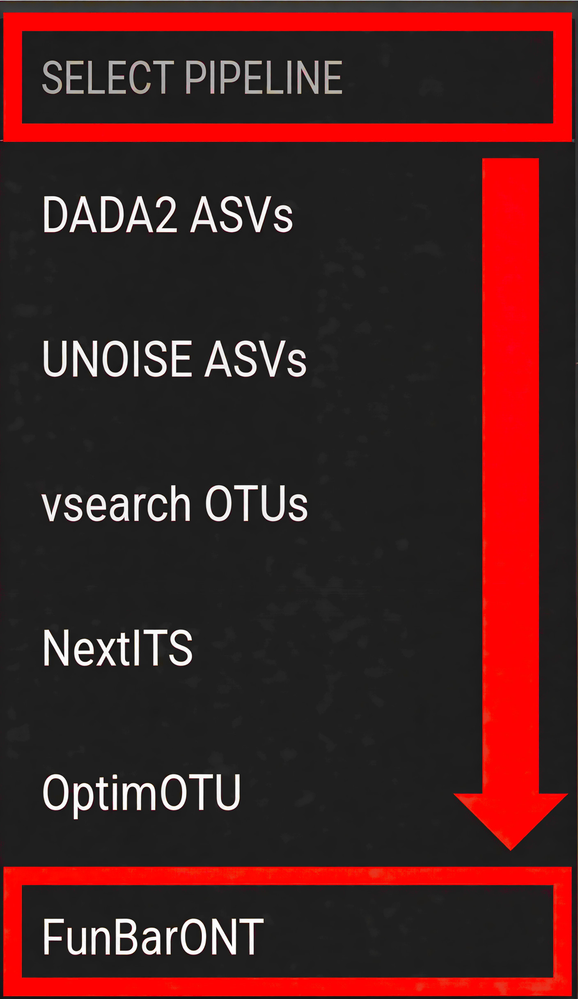
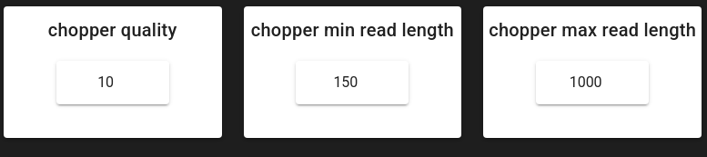
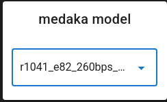
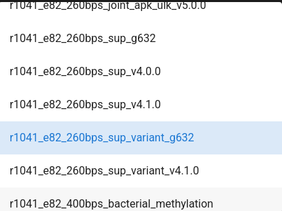
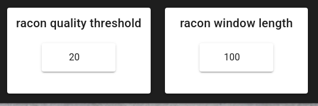

.. |PipeCraft2_logo| image:: _static/PipeCraft2_icon_v2.png
  :width: 50
  :alt: Alternative text
  :target: https://github.com/pipecraft2/pipecraft

.. raw:: html

    

.. role:: red

.. raw:: html

    

.. role:: green

.. |workflow_finished| image:: _static/workflow_finished.png
  :width: 300
  :alt: Alternative text

.. |stop_workflow| image:: _static/stop_workflow.png
  :width: 200
  :alt: Alternative text

.. |output_icon| image:: _static/output_icon.png
  :width: 50
  :alt: Alternative text

.. |save| image:: _static/save.png
  :width: 50
  :alt: Alternative text

.. |funbaront_workflow_overview| image:: _static/funbaront_workflow.png
  :width: 800
  :alt: FunBarONT workflow overview diagram

.. meta::
    :description lang=en:
        PipeCraft manual. FunBarONT workflow tutorial

.. _example_analyses_FunBarONT:

FunBarONT pipeline, ITS |PipeCraft2_logo|
-------------------------------------------

This example data analyses follows **FunBarONT** workflow as implemented in PipeCraft2's pre-compiled pipelines panel. 

`FunBarONT <https://github.com/mdziurzynski/FunBarONT/tree/main>`_ is a specialized pipeline for processing **Oxford Nanopore Technologies (ONT) fungal barcoding data**,
specifically targeting the **ITS rRNA gene region**. This pipeline is optimized for long-read sequencing data and incorporates
quality filtering, demultiplexing, sequence polishing, and taxonomic assignment to generate high-confidence fungal identifications.

| `Download example data set here: <https://zenodo.org/records/18770850/files/example_data_FunBarONT.zip?download=1>`_ and **unzip** it.
| This is a sample dataset for **fungal identification and barcoding** using ITS amplicons.

____________________________________________________

Starting point 
~~~~~~~~~~~~~~

This example dataset consists of **ITS rRNA gene amplicon sequences**; targeting fungi:

- **single-end** Oxford Nanopore sequencing data;
- **demultiplexed** set (per-sample fastq files, :ref:`see demultiplexing here <demux>`);
- indexes and adapters have already been **removed**;
- sequences are generated using **Nanopore sequencing technology** (read lengths typically 1-10+ kb).

.. admonition:: when working with your own ONT data ...

  ... then please ensure that the fastq files are properly demultiplexed and contain sample identifiers in the file names.
  For mixed barcode runs that have not been demultiplexed, preprocessing may be required to split reads by barcode before 
  using the FunBarONT pipeline.

  | *Example demultiplexed file naming:*
  | *sample1.fastq*
  | *sample2.fastq*
  | *sample3.fastq*

____________________________________________________

| **To select FunBarONT pipeline**, press
| ``SELECT PIPELINE`` --> ``FunBarONT``.

|funbaront_workflow|

| **To select input data**, press ``SELECT WORKDIR`` and specify ``sequence files extension`` as **\*.fastq**;  
| ``sequencing read types`` is not an effective option in this pipeline (just click 'Confirm').

____________________________________________________

Workflow overview
~~~~~~~~~~~~~~~~~

The FunBarONT pipeline consists of the following processing steps designed to handle the characteristics of Oxford Nanopore long-read sequencing data:

1. **Quality Control (NanoPlot)** - Generates quality reports and statistics for each sample
2. **Quality Filtering (chopper)** - Filters reads based on quality scores and length thresholds
3. **Clustering (VSEARCH)** - Groups similar sequences into clusters/OTUs
4. **Read Mapping (minimap2)** - Maps reads to cluster centroids for consensus generation (no separate output; intermediate step for polishing)
5. **Sequence Polishing (racon + medaka)** - Corrects sequencing errors to generate high-accuracy consensus sequences
6. **ITS Extraction (ITSx)** - Extracts the ITS region from fungal sequences (optional)
7. **Taxonomy Assignment (BLAST)** - Assigns taxonomic classification using BLAST against a reference database

|funbaront_workflow_overview|

**FunBarONT tools and versions (v1.0):**

- minimap2 v2.26 (read mapping and alignment)
- samtools v1.20 (sequence alignment/map format utilities)
- bcftools v1.20 (variant calling and file processing)
- racon v1.4.20 (sequence polishing)
- medaka v1.11 (neural network consensus calling for high-accuracy sequences)
- vsearch v2.30 (clustering and chimera detection)
- chopper v0.7.1 (quality filtering for long reads)
- filtlong v0.2.5 (additional long-read quality filtering)
- ITSx v2.1 (ITS region extraction)
- BLAST v2.15 (local sequence alignment and taxonomy assignment)
- seqkit v2.12 (sequence manipulation utilities)
- nextflow v24.04 (workflow orchestration)
- nanoplot v1.42 (quality control and visualization)
- Python 3.10 (scripting and analysis environment)

.. note::

  The FunBarONT pipeline is specifically designed for Oxford Nanopore fungal barcoding data. 
  All steps run automatically in sequence once the workflow is started.
  
  **minimap2** is used internally to align reads to cluster centroids before polishing—this step produces no separate output files but is essential for high-accuracy consensus calling.

____________________________________________________

Input data preparation
~~~~~~~~~~~~~~~~~~~~~~

Before starting the FunBarONT workflow in PipeCraft2, ensure your input data is properly prepared:

**File naming convention:**

All fastq files should follow a consistent naming pattern with the sample identifier at the beginning:

.. code-block::
   :caption: Recommended file naming structure

    sample_name.fastq
    sample_name.fastq.gz

**Directory structure:**

.. code-block::
   :caption: Recommended directory structure for FunBarONT

    my_fungal_barcoding/   
    └── sequences/         # SELECT THIS FOLDER AS WORKING DIRECTORY
        ├── sample1.fastq
        ├── sample2.fastq
        ├── sample3.fastq
        └── ...

**Data quality considerations:**

- **Read quality**: The pipeline includes quality filtering steps to handle the sequencing errors.

- **Read length**: Ensure that the expected amplicon length (including ITS and flanking regions) matches your read lengths. 
  The default minimum length filtering is typically set to accommodate full-length ITS amplicons (~500-700 bp for fungi).

- **Mixed samples**: If your data contains mixed fungal species or environmental samples, the clustering steps will group similar sequences together.

____________________________________________________

Quality control (NanoPlot)
~~~~~~~~~~~~~~~~~~~~~~~~~~

The FunBarONT pipeline uses **NanoPlot** to assess the quality of your Oxford Nanopore sequencing data. 
This step generates comprehensive quality reports and statistics for each sample.

NanoPlot produces:

- **Quality distribution plots** - Visualize the distribution of read quality scores
- **Read length distribution** - Shows the length distribution of your sequencing reads
- **NanoStats.txt** - Summary statistics including read counts, mean quality, and length metrics
- **NanoPlot-report.html** - Interactive HTML report with all quality metrics

Key quality metrics to consider:

- **Mean quality score**: Typically > Q10 is acceptable for ONT basecalling data
- **Read length distribution**: Should center around your expected amplicon length
- **Total reads**: Verify adequate sequencing depth per sample

+-----------------------------------------------+---------------------------------------------------+
| Output directory |output_icon|                | ``01_quality_reports``                            |
+===============================================+===================================================+
| ``<sample>_NanoPlot_results``/                | NanoPlot results folder per sample                |
+-----------------------------------------------+---------------------------------------------------+
| NanoPlot-report.html                          | interactive HTML quality report                   |
+-----------------------------------------------+---------------------------------------------------+
| NanoStats.txt                                 | summary statistics (read counts, quality, length) |
+-----------------------------------------------+---------------------------------------------------+

____________________________________________________

Quality filtering (chopper)
~~~~~~~~~~~~~~~~~~~~~~~~~~~

Quality filtering uses **chopper** to remove low-quality reads that do not meet specified thresholds. 
This step is critical for Oxford Nanopore data, which can have variable error rates.

**Configurable parameters:**

- **chopper_quality** (default: 10) - Minimum read quality score. Reads below this threshold are discarded.
- **chopper_min_read_length** (default: 150 bp) - Minimum read length. Shorter reads are removed.
- **chopper_max_read_length** (default: 1000 bp) - Maximum read length. Longer reads are removed.

**Why these settings for ITS barcoding:**

- **What “quality 10” means:** ONT FASTQ qualities are reported on the **Phred scale**, where a score Q corresponds to an expected base-call error probability P via: ``Q = -10 * log10(P)``.  
  So **Q10** corresponds to **~10% expected error per base** (roughly 90% per-base accuracy), **Q12** to ~6.3%, **Q15** to ~3.2%, and **Q20** to ~1%.

- **Logic behind `chopper_quality = 10`:** this setting removes the “very noisy” reads that tend to:
  1) inflate the number of spurious clusters/OTUs,
  2) reduce identity to the true ITS sequence (hurting BLAST hits), and
  3) make polishing less stable (because alignments contain too many mismatches/indels).
  At the same time, ONT ITS datasets often benefit from keeping sufficient depth for clustering and consensus generation, so Q10 is a pragmatic balance between **read retention** and **error reduction**.

- **Logic behind `min_read_length = 150`:** fungal ITS amplicons are typically ~400–800 bp, but real ONT data may contain truncated reads. A 150 bp minimum is mainly a guardrail to remove very short fragments (adapter remnants, primer dimers, broken reads) while still allowing partially truncated reads to contribute during clustering/polishing. If you require only near full-length ITS reads, increase this to e.g. 300–400 bp.

- **Logic behind `max_read_length = 1000`:** reads much longer than the expected ITS amplicon are often off-target products, concatemers, or chimeric/multi-amplicon reads. Keeping an upper bound avoids these dominating alignments and distorting clustering/consensus.

.. admonition:: NanoPlot results for this example dataset

  Looking at the ``NanoStats.txt`` files produced for this example data, the quality picture across the four samples is:

  +--------+--------+--------------+------------------+--------------------+--------------------+--------------------+
  | Sample | Reads  | Mean len (bp)| Median len (bp)  | Mean quality (Q)   | >Q10 retained      | >Q15 retained      |
  +========+========+==============+==================+====================+====================+====================+
  | CLT01  | 6,920  | 1,543        | 1,755            | Q17.0              | 98.5 %             | 85.0 %             |
  +--------+--------+--------------+------------------+--------------------+--------------------+--------------------+
  | CLT02  | 19,621 | 1,404        | 1,466            | Q16.6              | 98.5 %             | 80.3 %             |
  +--------+--------+--------------+------------------+--------------------+--------------------+--------------------+
  | CLT15  | 992    | 1,254        | 1,309            | Q17.0              | 98.3 %             | 83.8 %             |
  +--------+--------+--------------+------------------+--------------------+--------------------+--------------------+
  | CLT16  | 212    | 525          | 522              | Q15.1              | 97.6 %             | 63.2 %             |
  +--------+--------+--------------+------------------+--------------------+--------------------+--------------------+

  **What these numbers tell us about the Q10 threshold:**
  In all four samples, Q10 retains **97.6–98.5 %** of reads. This confirms that Q10 is a very permissive floor —
  it only removes the truly unusable bottom fraction, while more stringent thresholds such as Q15 would already drop
  17–37 % of reads. For clustering and consensus polishing to work reliably, retaining depth is important, so Q10 is
  the right balance here.

  **What the length distribution reveals:**
  CLT01 and CLT02 have median read lengths of ~1,466–1,755 bp, well above the typical ITS amplicon size (~500–700 bp for fungi).
  These longer reads are raw amplicon reads that include the ITS region embedded in flanking rRNA sequences (18S/5.8S/28S).
  The **max_read_length = 1000** chopper setting therefore **deliberately captures only the shorter reads** that are more
  likely to represent clean, full-length ITS amplicons, filtering out concatemers and off-target long fragments before
  clustering and polishing begin.

  **What ``max_read_length = 1000`` does to these samples:**
  Because the median read lengths in CLT01 and CLT02 are 1,755 bp and 1,466 bp respectively — well above the 1,000 bp ceiling — the
  length filter removes the majority of raw reads. That is by design: those long reads contain the ITS region
  *embedded inside* longer flanking rRNA sequences, and they would produce mixed-content clusters. After chopper,
  only the shorter reads that are more likely to span a clean ITS amplicon survive. CLT16 is an exception:
  its median length was already 522 bp, so almost no reads are cut by the length filter (212 → 190 reads retained).

|funbaront_chopper|

+--------------------------------------------+-------------------------------------------------------+
| Output directory |output_icon|             | ``02_filtered_sequences``                             |
+============================================+=======================================================+
| \*.chopper.fasta.gz                        | quality filtered sequences per sample in FASTA format |
+--------------------------------------------+-------------------------------------------------------+

____________________________________________________

Clustering (VSEARCH)
~~~~~~~~~~~~~~~~~~~~

The clustering step uses **VSEARCH** to group similar sequences into clusters. 
This reduces the impact of sequencing errors and produces representative sequences for downstream analysis.

**Configurable parameters:**

- **similarity_threshold** (default: 0.95) - Clustering identity threshold (0-1). Sequences with similarity above this threshold will be clustered together.
- **strands** (default: "both") - Check both strands or plus strand only during clustering.

**Why clustering for ONT data:**

- Reduces impacts of sequencing errors by grouping similar sequences
- Produces representative centroid sequences for each cluster
- Improves computational efficiency for downstream polishing and taxonomy assignment

+---------------------------------------+-----------------------------------------------+
| Output directory |output_icon|        | ``03_clusters``                               |
+=======================================+===============================================+
| \*.centroids.fasta.gz                 | representative centroid sequences per sample  |
+---------------------------------------+-----------------------------------------------+

.. admonition:: Clustering results for this example dataset

  After chopper filtering, VSEARCH groups reads into clusters at 95% identity:

  .. list-table::
     :header-rows: 1
     :widths: 10 15 15 60

     * - Sample
       - Reads in
       - Clusters out
       - What this means
     * - CLT01
       - 1,046
       - 594
       - ~1.8 reads per cluster on average
     * - CLT02
       - 4,294
       - 2,510
       - ~1.7 reads per cluster on average
     * - CLT15
       - 163
       - 115
       - ~1.4 reads per cluster on average
     * - CLT16
       - 190
       - 132
       - ~1.4 reads per cluster on average

  The low average reads-per-cluster reflects the diversity of this dataset and the ONT error rate:
  each unique ITS sequence produces its own centroid, but many clusters contain only one read (singletons).
  Singleton and small clusters are usually noise or rare off-target reads — the polishing step will
  expose this, as consensus calling requires multiple reads per cluster to be reliable.

____________________________________________________

Sequence polishing (racon + medaka)
~~~~~~~~~~~~~~~~~~~~~~~~~~~~~~~~~~~

Oxford Nanopore long reads often contain random errors that are corrected using a two-step polishing process:

1. **Racon** - First-pass polishing using multiple sequence alignment
2. **Medaka** - Neural network-based polishing for high-accuracy consensus sequences

**Configurable parameters:**

- **medaka_model** (default: r1041_e82_400bps_hac_variant_v4.3.0) - Select the medaka model based on your flowcell, kit, and basecaller. In this example should set to  **r1041_e82_260bps_sup_variant_g632**. 
- **racon_quality_threshold** (default: 20) - Minimum average base quality for windows used by Racon.
- **racon_window_length** (default: 100) - Window length used by Racon for polishing.

**Why these settings for this ONT ITS data:**

- **What `racon_quality_threshold = 20` means:** similar to chopper, this threshold uses **Phred Q-scores**, where **Q20 ≈ 1% expected error per base**. In Racon, this is not “keep/discard the whole read”; instead it is used to decide which **local windows** of the read are trusted enough to drive corrections. The goal is to prevent low-quality tails or error-rich segments from “pulling” the consensus away from the true ITS sequence.

- **Why 20 is reasonable here:** after chopper filtering and clustering, most remaining reads are informative, but ONT errors are still present (especially indels in homopolymers). Setting the window threshold to Q20 makes Racon focus on the more reliable parts of alignments, and then **Medaka** further improves the consensus by correcting systematic ONT errors.

- **What `racon_window_length = 100` means:** Racon evaluates quality and corrections in windows. A 100 bp window is a compromise for ITS-length amplicons: it is long enough to average out per-base noise (stability) but short enough to remain sensitive to localized error hotspots.

Tuning tips:

- If you see over-correction or unstable consensuses (few reads per cluster, noisy data), try lowering `racon_quality_threshold` (e.g., 15–18) and/or reducing `racon_window_length`.
- If your basecalling is very high quality and clusters have good depth, a higher threshold can yield a cleaner consensus, but may reduce how much of each read contributes to polishing.

|medaka_model_selection|
|medaka_model|

.. note::

  Select the appropriate **medaka model** based on your sequencing setup:
  
  - **r1041_e82** models are for R10.4.1 flowcells with E8.2 chemistry
  - **r941** models are for R9.4.1 flowcells
  - Choose **hac** (high accuracy) or **sup** (super accuracy) based on your basecalling model
  - The model affects consensus accuracy, so matching your setup is important

|racon|

+---------------------------------------+-----------------------------------------------+
| Output directory |output_icon|        | ``04_polished_sequences``                     |
+=======================================+===============================================+
| \*.racon.fasta                        | Racon-polished sequences per sample           |
+---------------------------------------+-----------------------------------------------+
| \*.medaka.consensus.fasta             | Medaka-polished consensus sequences per sample|
+---------------------------------------+-----------------------------------------------+

.. admonition:: Polishing results for this example dataset

  Racon and Medaka both produce the same number of polished sequences — Medaka refines what Racon produced,
  it does not filter. The notable reduction vs. the number of clusters comes from a minimum cluster size
  requirement: clusters with very few reads do not yield a reliable consensus and are dropped.

  .. list-table::
     :header-rows: 1
     :widths: 10 15 20 55

     * - Sample
       - Clusters in
       - Polished sequences out
       - Reduction explained
     * - CLT01
       - 594
       - 156
       - 438 clusters (74%) were too small to polish
     * - CLT02
       - 2,510
       - 544
       - 1,966 clusters (78%) were too small to polish
     * - CLT15
       - 115
       - 33
       - 82 clusters (71%) too small
     * - CLT16
       - 132
       - 17
       - 115 clusters (87%) too small

  The high fraction of small clusters is expected in ONT data with moderate depth: sequencing errors spread
  reads across many near-identical but not identical sequences, producing many singleton clusters.
  The polishing step therefore acts as an implicit quality gate — only clusters with enough reads
  to build a trustworthy consensus survive.

____________________________________________________

ITS extraction (ITSx)
~~~~~~~~~~~~~~~~~~~~~

The ITS extraction step uses **ITSx** software to identify and extract the ITS rRNA gene region from your sequences. 
This is particularly valuable for fungal identification because:

- **Improves taxonomic accuracy**: The ITS region is the standard barcode for fungi
- **Removes flanking regions**: Eliminates 18S and 5.8S rRNA genes that may bias taxonomy assignment
- **Standardizes sequences**: Produces comparable sequences for database matching

**Pipeline option:**

- **use_itsx** (default: true) - Set to false if you want to skip ITS extraction (useful for non-ITS sequences)

**Important considerations:**

- ITSx works best on full or near-full length amplicons
- Sequences without detectable ITS regions will produce empty output files
- The tool extracts both ITS1 and ITS2 regions when present

+---------------------------------------+---------------------------------------------------+
| Output directory |output_icon|        | ``05_its_extracted``                              |
+=======================================+===================================================+
| \*.its.fasta                          | extracted ITS sequences per sample                |
+---------------------------------------+---------------------------------------------------+

.. admonition:: ITS extraction results for this example dataset

  This step is often where the most dramatic filtering occurs. ITSx only extracts sequences where
  it can detect the ITS region using fungal rRNA HMM profiles — consensus sequences from off-target
  amplification or non-ITS content simply produce no output.

  .. list-table::
     :header-rows: 1
     :widths: 10 22 18 50

     * - Sample
       - Medaka sequences in
       - ITS sequences out
       - Outcome
     * - CLT01
       - 156
       - 18
       - 138 polished sequences had no detectable ITS region
     * - CLT02
       - 544
       - 37
       - 507 polished sequences had no detectable ITS region
     * - CLT15
       - 33
       - 0
       - Analysis aborted — no ITS sequences detected at all
     * - CLT16
       - 17
       - 0
       - Analysis aborted — no ITS sequences detected at all

  **CLT01 and CLT02:** the large majority of polished sequences do not contain a recognizable ITS region.
  These are likely reads that passed length and quality filters but originate from flanking 18S/28S rRNA,
  off-target amplification, or are simply too divergent for ITSx to classify. Only the consensus sequences
  with a clear ITS1–5.8S–ITS2 architecture are extracted — 18 and 37 sequences respectively — and these
  carry forward into BLAST.

  **CLT15 and CLT16 — what went wrong:**
  Both samples produced polished sequences (33 and 17 respectively), but ITSx found zero ITS regions in any of them.
  Looking back at the NanoPlot data: CLT16 had only **212 raw reads** (the smallest dataset here), and its
  very low read count persisted through every step — 190 after chopper, 132 clusters, 17 polished.
  With such shallow depth, polished consensuses are noisy and are unlikely to match ITSx's HMM profiles.
  CLT15 had better raw quality (Q17.0, 992 reads) but still produced no ITS — suggesting the sequenced
  material in this sample simply did not contain the fungal ITS region at the expected architecture.
  Both samples illustrate that **quality filtering and polishing alone cannot rescue samples with
  insufficient depth or off-target sequencing content**.

____________________________________________________

Taxonomy assignment (BLAST)
~~~~~~~~~~~~~~~~~~~~~~~~~~~

Taxonomy assignment uses **BLAST** to compare your sequences against a reference database and assign taxonomic classifications.
This step is **compulsory** in the FunBarONT workflow, and the run will not start unless a BLAST database file is provided.

**Configurable parameters:**

- **database_file** (required) - Reference database file in FASTA format. The pipeline will automatically create a BLAST database from this file.
- **run_id** (default: "funbaront_run") - Unique identifier for this analysis run. Used for naming output directories and files.
- **strands** (default: "both") - Query strand to search against database. "both" includes reverse complement.
- **e_value** (default: 10) - E-value threshold. Lower values indicate more significant matches.
- **word_size** (default: 11) - Initial word size for BLAST alignment.

**Additional pipeline options:**

- **output_all_polished_seqs** (default: false) - Output all polished sequences even those without database hits (useful for non-ITS sequences).
- **rel_abu_threshold** (default: 10) - Output only clusters with barcode-wise relative abundance above this percentage (0-100).

**For fungal ITS barcoding:**

Use a fungal ITS reference database such as:

- **UNITE database** (https://unite.ut.ee/) - The standard reference database for fungal ITS sequences

**Interpreting taxonomy output:**

The BLAST results include taxonomic assignments at multiple ranks when available in the reference database.
Not all sequences may have reliable classifications; sequences without database hits will have empty results.

+---------------------------------------+-------------------------------------------+
| Output directory |output_icon|        | ``06_blast_results``                      |
+=======================================+===========================================+
| \*.blast.tsv                          | BLAST results in tabular format per sample|
+---------------------------------------+-------------------------------------------+

.. admonition:: BLAST results for this example dataset

  Every ITS sequence that passed extraction is passed to BLAST, with one result row per sequence:

  .. list-table::
     :header-rows: 1
     :widths: 10 15 12 63

     * - Sample
       - ITS seqs in
       - BLAST hits
       - Representative taxa found
     * - CLT01
       - 18
       - 18
       - Roussoella sp., Spegazzinia sp. (Ascomycota)
     * - CLT02
       - 37
       - 37
       - Pseudopestalotiopsis theae (Ascomycota)
     * - CLT15
       - 0
       - 0
       - No sequences passed ITSx; BLAST file is empty
     * - CLT16
       - 0
       - 0
       - No sequences passed ITSx; BLAST file is empty

  All 18 sequences from CLT01 and all 37 from CLT02 received BLAST hits, which is a good sign:
  it confirms that the polishing pipeline successfully produced high-accuracy ITS consensus sequences
  (note the ≥99% identity hits for the dominant clusters in the final Excel file).
  The cluster ``size`` field in the BLAST output (e.g., ``size=64``) indicates how many reads
  supported that consensus — larger clusters generally yield more reliable taxonomy assignments.

____________________________________________________

Start the workflow
~~~~~~~~~~~~~~~~~~

Once all parameters have been configured, press ``START`` on the left ribbon to begin the FunBarONT analysis.

|workflow_finished|

The workflow will proceed through each step in sequence, with progress displayed in the PipeCraft2 interface.

.. admonition:: first-time execution notes

  ... when running the FunBarONT pipeline for the first time, Docker will automatically pull the required container image. 
  This may take several minutes depending on your internet connection and the image size.

  |pulling_image|

  Subsequent runs will use the cached image and will start more quickly.

**Monitoring progress:**

- Each completed step will display a checkmark
- Error messages will appear if any step fails
- Processing time depends on the size of your dataset and computational resources available

____________________________________________________

Save workflow configuration
~~~~~~~~~~~~~~~~~~~~~~~~~~~

Once you have configured all parameters for your FunBarONT analysis, you can save the configuration file by pressing ``save workflow`` button on the right ribbon.

|save|

The configuration file will be saved as a JSON file (e.g., ``pipecraft2_last_run_configuration.json``) in your working directory. 
This file stores all your parameter choices and can be reloaded into PipeCraft2 to reproduce the exact same analysis in future runs.

.. admonition:: automatic configuration backup

  If you forget to manually save the configuration, PipeCraft2 will automatically generate 
  ``pipecraft2_last_run_configuration.json`` upon starting the workflow. 
  This serves as a backup of your analysis parameters for this working directory.

____________________________________________________

Final results and JSON output
~~~~~~~~~~~~~~~~~~~~~~~~~~~~~

The FunBarONT pipeline produces comprehensive final results in multiple formats:

+---------------------------------------+-----------------------------------------------------------+
| Output directory |output_icon|        | ``07_json_results``                                       |
+=======================================+===========================================================+
| \*.results.json                       | JSON formatted results per sample with all analysis data  |
+---------------------------------------+-----------------------------------------------------------+

**Main results file:**

+---------------------------------------+-----------------------------------------------------------+
| Output file |output_icon|             | Root output directory                                     |
+=======================================+===========================================================+
| funbaront_run.results.xlsx            | Excel spreadsheet with all results (taxonomy, quality)    |
+---------------------------------------+-----------------------------------------------------------+
| README.md                             | Summary of the pipeline run with parameters and citations |
+---------------------------------------+-----------------------------------------------------------+

____________________________________________________

Data interpretation and post-processing
~~~~~~~~~~~~~~~~~~~~~~~~~~~~~~~~~~~~~~~~

Once the FunBarONT workflow is complete, you have several files for further analysis:

**Primary output files:**

- **funbaront_run.results.xlsx** - Excel spreadsheet with comprehensive results including sequence info, taxonomy, and quality metrics
- **\*.blast.tsv** - BLAST results per sample in tabular format
- **\*.its.fasta** - Extracted ITS sequences per sample
- **\*.medaka.consensus.fasta** - Polished consensus sequences per sample
- **\*.results.json** - JSON formatted results for programmatic access

**Output directory structure:**

.. code-block::
   :caption: FunBarONT output directory structure

    <run_id>_results/
    ├── 01_quality_reports/          # NanoPlot quality reports per sample
    │   └── <sample>_NanoPlot_results/
    ├── 02_filtered_sequences/       # Chopper-filtered sequences
    ├── 03_clusters/                 # VSEARCH clustering centroids
    ├── 04_polished_sequences/       # Racon and Medaka polished sequences
    ├── 05_its_extracted/            # ITSx extracted ITS sequences
    ├── 06_blast_results/            # BLAST taxonomy results
    ├── 07_json_results/             # JSON formatted results
    ├── funbaront_run.results.xlsx   # Main results spreadsheet
    └── README.txt                    # Run summary and citations

**Recommended post-processing steps:**

1. **Filter for target kingdom/phylum** - Remove non-fungal OTUs if present
2. **Examine unclassified OTUs** - BLAST search or phylogenetic analysis
3. **Summary statistics** - Calculate diversity metrics, rarefaction curves
4. **Downstream analyses** - Community composition, differential abundance, etc.

**Quality checks before downstream analyses:**

- Verify that the majority of OTUs are classified as fungi
- Check for contamination (e.g., unusual taxa)
- Examine OTU abundance distributions

____________________________________________________

Troubleshooting
~~~~~~~~~~~~~~~

**Common issues and solutions:**

.. admonition:: Docker image pull fails

  **Issue**: Error message about pulling the FunBarONT Docker image
  
  **Solution**: Check your internet connection and ensure sufficient disk space for the image. 
  Ensure Docker daemon is running properly.

.. admonition:: Insufficient reads in output

  **Issue**: Output OTU table contains very few sequences after processing
  
  **Solution**: 
  
  - Check quality filtering thresholds; they may be too stringent
  - Verify primer sequences are correct
  - Ensure input data quality is adequate
  - Review quality control metrics for the sequencing run

.. admonition:: High proportion of unclassified OTUs

  **Issue**: Many OTUs receive "Unclassified" taxonomy assignments
  
  **Solution**:
  
  - Lower the minimum identity threshold in taxonomy assignment
  - Verify the reference database is appropriate for your samples
  - Consider BLAST search of unclassified OTUs against EUKARYOME database or a public database (NCBI)

____________________________________________________

Example output analysis
~~~~~~~~~~~~~~~~~~~~~~~~

After the workflow completes, you can examine the output files to understand your fungal community composition.

**Main Excel results file (default:funbaront_run.results.xlsx):**

The Excel spreadsheet contains comprehensive results organized by sample with the following columns:

1. **Sample**: Sample identifier from input fastq file
2. **Number of clusters**: Total number of sequence clusters identified
3. **Number of passed clusters**: Clusters that passed the relative abundance threshold (default ≥10%)
4. **Total reads after filtering**: Number of quality-filtered reads for this sample
5. **Cluster ID**: Unique identifier for each consensus sequence
6. **Cluster size**: Number of reads grouped into this cluster
7. **Cluster relative abundance**: Percentage of reads in this cluster (%)
8. **Cluster sequence**: Trimmed ITS consensus sequence
9. **Cluster sequence untrimmed**: Full-length consensus sequence before ITS extraction
10. **BLASTn taxonomy assignment**: Species name from best BLAST match
11. **BLASTn perc. ident.**: Sequence similarity to database match (%)
12. **BLASTn query coverage**: Percentage of query sequence aligned (%)
13. **BLASTn query length**: Length of the query sequence (bp)
14. **BLASTn subject length**: Length of the database match sequence (bp)
15. **BLASTn evalue**: Statistical significance of the BLAST match
16. **BLASTn subject SH**: UNITE Species Hypothesis identifier (e.g., SH1292241.10FU)
17. **BLASTn full taxonomy**: Complete taxonomic lineage (k__Kingdom;p__Phylum;c__Class;o__Order;f__Family;g__Genus;s__Species)

**Example rows from funbaront_run.results.xlsx** *(sequence columns omitted for brevity)*:

.. list-table:: Example rows from funbaront_run.results.xlsx
   :header-rows: 1
   :widths: 8 20 10 12 30 8 14 20 10 10 10 10 8 14 26

   * - Sample
     - Number of clusters
     - Passed clusters
     - Total reads
     - Cluster ID
     - Cluster size
     - Rel. abundance (%)
     - BLASTn taxonomy
     - Perc. ident.
     - Query cov.
     - Query len.
     - Subject len.
     - E-value
     - Subject SH
     - Full taxonomy
   * - CLT16
     - Analysis aborted! No ITS sequences extracted by ITSx.
     - \-
     - \-
     - \-
     - \-
     - \-
     - \-
     - \-
     - \-
     - \-
     - \-
     - \-
     - \-
     - \-
   * - CLT15
     - Analysis aborted! No ITS sequences extracted by ITSx.
     - \-
     - \-
     - \-
     - \-
     - \-
     - \-
     - \-
     - \-
     - \-
     - \-
     - \-
     - \-
     - \-
   * - CLT01
     - 18
     - 3
     - 138
     - d4c2f2d3-a5d6-4ce9-a8c3-d36a36963e9b
     - 64
     - 46.38
     - Roussoella_sp
     - 99.123
     - 100
     - 454
     - 528
     - 0.0
     - SH1292241.10FU
     - k__Fungi;p__Ascomycota;c__Dothideomycetes;o__Pleosporales;f__Roussoellaceae;g__Roussoella;s__Roussoella_sp
   * - CLT01
     - 18
     - 3
     - 138
     - bfd8cc6d-385a-4b8f-ad8e-874b873ca304
     - 25
     - 18.12
     - Roussoella_sp
     - 99.781
     - 100
     - 456
     - 528
     - 0.0
     - SH1292241.10FU
     - k__Fungi;p__Ascomycota;c__Dothideomycetes;o__Pleosporales;f__Roussoellaceae;g__Roussoella;s__Roussoella_sp
   * - CLT01
     - 18
     - 3
     - 138
     - b4b3da0f-991d-4c3e-a03c-658d640e7436
     - 14
     - 10.14
     - Roussoella_sp
     - 99.781
     - 100
     - 456
     - 528
     - 0.0
     - SH1292241.10FU
     - k__Fungi;p__Ascomycota;c__Dothideomycetes;o__Pleosporales;f__Roussoellaceae;g__Roussoella;s__Roussoella_sp
   * - CLT02
     - 37
     - 3
     - 141
     - 368c9255-821c-4d5a-a365-829ef52d5880
     - 28
     - 19.86
     - Pseudopestalotiopsis_theae
     - 99.359
     - 100
     - 468
     - 491
     - 0.0
     - SH1272767.10FU
     - k__Fungi;p__Ascomycota;c__Sordariomycetes;o__Amphisphaeriales;f__Sporocadaceae;g__Pseudopestalotiopsis;s__Pseudopestalotiopsis_theae
   * - CLT02
     - 37
     - 3
     - 141
     - 85aeee25-1a09-4e44-aa40-9b38decc6fbd
     - 17
     - 12.06
     - Pseudopestalotiopsis_theae
     - 99.359
     - 100
     - 468
     - 491
     - 0.0
     - SH1272767.10FU
     - k__Fungi;p__Ascomycota;c__Sordariomycetes;o__Amphisphaeriales;f__Sporocadaceae;g__Pseudopestalotiopsis;s__Pseudopestalotiopsis_theae
   * - CLT02
     - 37
     - 3
     - 141
     - 374d0a9d-b74f-4a03-b832-faffa4605a81
     - 16
     - 11.35
     - Pseudopestalotiopsis_theae
     - 99.359
     - 100
     - 468
     - 491
     - 0.0
     - SH1272767.10FU
     - k__Fungi;p__Ascomycota;c__Sordariomycetes;o__Amphisphaeriales;f__Sporocadaceae;g__Pseudopestalotiopsis;s__Pseudopestalotiopsis_theae

.. note::

   Each row represents a single cluster. Samples with multiple clusters will have multiple rows.
   Failed samples show error messages in the "Number of clusters" column (e.g., "Analysis aborted! No ITS sequences extracted").

**BLAST results files (*.blast.tsv):**

Tab-separated files containing detailed BLAST alignments for each sample with columns:

- Query sequence ID (cluster ID;size=N)
- Subject sequence with full taxonomic path
- Percent identity
- Query coverage
- E-value
- Query length
- Subject length

Empty BLAST files indicate no sequences passed quality filtering or ITSx extraction.

**JSON results files (*.results.json):**

Per-sample JSON files containing structured data:

- ``number_of_clusters``: Total number of consensus sequences
- ``total_reads_after_filtering``: Number of reads after quality filtering
- ``cluster_data``: Array of cluster objects with:
  
  - cluster_id, cluster_size
  - cluster_sequence, cluster_sequence_untrimmed
  - blastn_tax_name, blastn_sh_id, blastn_full_taxonomy
  - blastn_pident, blastn_query_coverage, blastn_evalue
  - blastn_query_length, blastn_subject_length
  - relative_abundance (as decimal 0-1)
