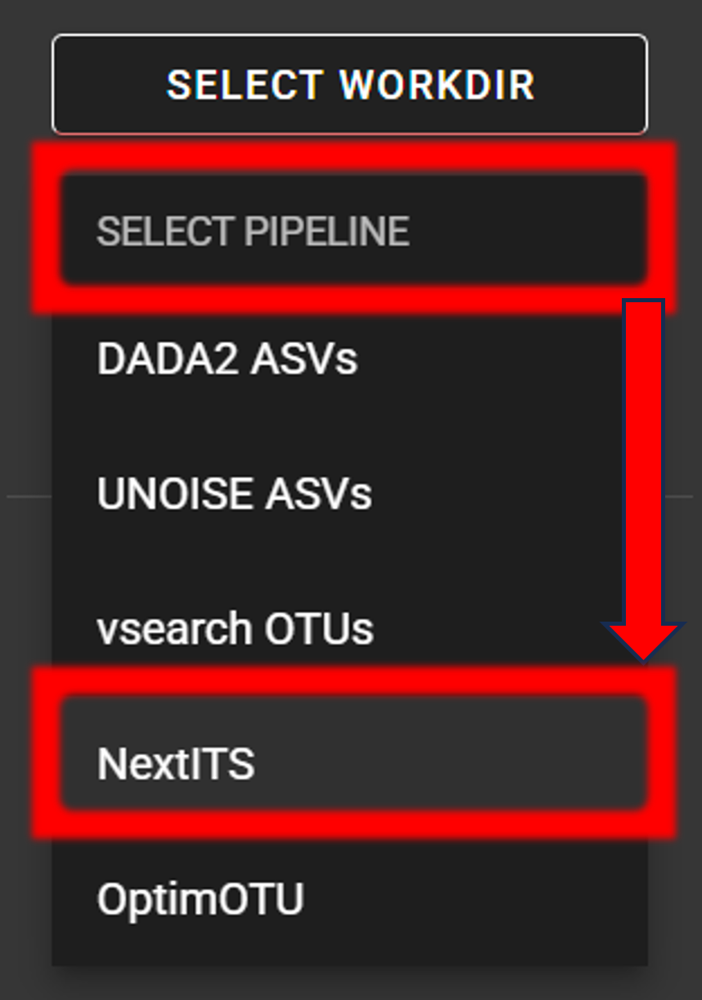
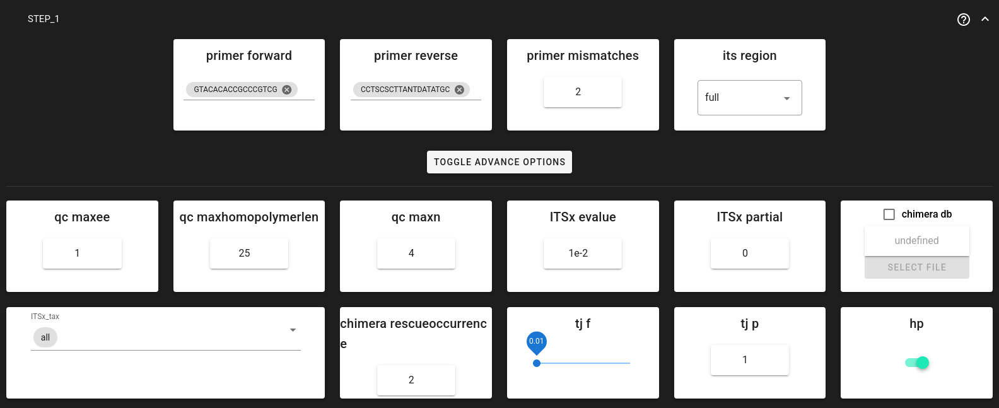
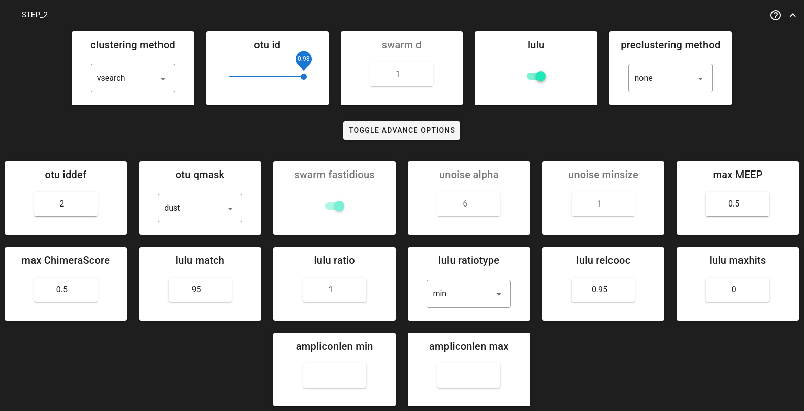

.. |PipeCraft2_logo| image:: _static/PipeCraft2_icon_v2.png
  :width: 50
  :target: https://github.com/pipecraft2/user_guide

.. raw:: html

    

.. role:: red

.. raw:: html

    

.. role:: green
  
.. |workflow_finished| image:: _static/workflow_finished.png
  :width: 300
  :class: center

.. |stop_workflow| image:: _static/stop_workflow.png
  :width: 200

.. |output_icon| image:: _static/output_icon.png
  :width: 50

.. |save| image:: _static/save.png
  :width: 50

.. |pulling_image| image:: _static/pulling_image.png
  :width: 280

.. meta::
    :description lang=en:
        PipeCraft manual. NextITS tutorial

|

NextITS pipeline, Full-length ITS |PipeCraft2_logo|
-------------------------------------------------

This example data analysis follows the **NextITS** pipeline as implemented in PipeCraft2's pre-compiled pipelines panel.
NextITS is a specialized pipeline for analyzing **full-length ITS** reads obtained via **PacBio** sequencing.

| `Download example data set here <https://zenodo.org/records/18770850/files/example_data_NextITS.zip?download=1>`_ (1 Mb) and **unzip** it. 
| This is a **Full-length ITS dataset, PacBio sequencing**. 

____________________________________________________

Starting point 
~~~~~~~~~~~~~~

The example dataset consists of **PacBio full-length ITS sequences** from **two sequencing runs**.

**Key features of the data:**

- **Demultiplexed** fastq files.
- **Two sequencing runs** (Run_01 and Run_02).
- Files follow the ``RunID__SampleID`` naming convention.

**Directory structure:**

To process data with NextITS in PipeCraft2, your input directory must follow a specific structure:

1. A main folder (e.g., ``my_NextITS_project``).
2. Inside that, a folder named **exactly** ``Input``.
3. Inside ``Input``, subfolders for each sequencing run (e.g., ``Run_01``, ``Run_02``).
4. Inside run folders, your demultiplexed fastq files.

.. code-block:: text

    my_NextITS_project/       <-- SELECT THIS AS WORKING DIRECTORY
    └── Input/
        ├── Run_01/
        │   ├── Run01__Sample101.fastq.gz
        │   ├── Run01__Sample49.fastq.gz
        │   └── Run01__Sample72.fastq.gz
        └── Run_02/
            ├── Run02__Sample26.fastq.gz
            ├── Run02__Sample61.fastq.gz
            └── Run02__Sample87.fastq.gz

.. note::
    
    The double underscore ``__`` in filenames (e.g., ``Run01__Sample101``) is important! 
    It allows the pipeline to parse the Run ID and Sample ID correctly, which is crucial for tracking samples across runs and for tag-jump filtering.

____________________________________________________

Select Pipeline and Input
~~~~~~~~~~~~~~~~~~~~~~~~~

| **To select the NextITS pipeline**, press:
| ``SELECT PIPELINE`` --> ``NextITS``.

| **To select input data**, press ``SELECT WORKDIR``
| and select the **main folder** (e.g., ``my_NextITS_project``) that contains the ``Input`` directory.

|NextITS_pipeline|

____________________________________________________

Step 1: Quality Control and Artefact Removal
~~~~~~~~~~~~~~~~~~~~~~~~~~~~~~~~~~~~~~~~~~~~

NextITS processes data in **two distinct steps**. Step 1 is performed **per sequencing run** to handle run-specific errors and artefacts.

|NextITS_step1_settings|

Step 1 includes:

*   **Primer trimming**: Removing primers and filtering reads that don't contain them.
*   **Quality filtering**: Removing low-quality reads and correcting homopolymer errors (common in PacBio data).
*   **ITS extraction**: Using ITSx to extract the full ITS region (ITS1-5.8S-ITS2), removing flanking 18S/28S parts.
*   **Chimera filtering**: De novo and reference-based chimera detection, with a "rescue" step for likely false positives.
*   **Tag-jump correction**: Removing sequences that likely jumped between samples during library prep.

**Key Settings for Step 1:**

1.  **Trim Primers**:
    NextITS requires **exactly one forward and one reverse primer**.
    
    *   ``primer_forward``: Specify your forward primer (IUPAC codes allowed).
    *   ``primer_reverse``: Specify your reverse primer.
    *   ``primer_mismatch``: Allowed mismatches (default 2).

2.  **ITS Extraction**:
    
    *   ``its_region``: Generally set to **full** for PacBio data to keep the entire ITS region.
    *   ``ITSx_tax``: Can be set to **all**, **Fungi**, or other groups to restrict ITSx search.

3.  **Chimera Filtering**:
    
    *   Uses a built-in or custom reference database.
    *   ``chimera_rescue_occurrence``: Sequences initially flagged as chimeric but appearing in at least this many samples (default 2) are "rescued" (considered valid). This protects against false positives in multi-sample datasets.

4.  **Tag-jump Correction**:
    
    *   Important to remove erroneous reads (assigned to wrong samples).
    *   ``tj_f`` (f-value): Expected tag-jump rate. Default **0.01** is often appropriate for dual-indexed libraries. Use **0.03** or higher for combinational dual indexing if tag-jumping is suspected to be higher.

____________________________________________________

Step 2: Aggregation and Clustering
~~~~~~~~~~~~~~~~~~~~~~~~~~~~~~~~~~

After Step 1 processes each run individually, **Step 2 pools all valid sequences** from all runs and clusters them into OTUs.

|NextITS_step2_settings|

**Clustering Options:**

You can choose between three clustering strategies via ``clustering_method``:

*   **vsearch** (default): Greedy clustering at a fixed threshold (e.g., 0.98 for 98% similarity). Fast and widely used.
*   **swarm**: Exact-sequence based clustering that forms OTUs by chaining sequences differing by *d* nucleotides. Good for high-resolution analysis.
*   **unoise**: Denoising algorithm (zero-radius OTUs or zOTUs are analogous to ASVs).

**Post-clustering LULU:**

*   ``lulu`` = **TRUE** (default).
*   LULU merges "daughter" OTUs (errors) into "parent" OTUs based on co-occurrence patterns, producing a cleaner final OTU table.

____________________________________________________

Save and Start
~~~~~~~~~~~~~~

Once settings are configured:

1.  **Save the configuration**: Click the **Save Workflow** button |save| on the right ribbon. This creates a ``pipecraft2_last_run_configuration.json`` file for reproducibility.
2.  **Start the pipeline**: Click **START**.

.. admonition:: First time run
  
  When running NextITS for the first time, PipeCraft will pull the necessary Docker images. This may take a few minutes. 
  
  |pulling_image|

____________________________________________________

Examine the Outputs
~~~~~~~~~~~~~~~~~~~

NextITS organizes outputs into ``Step1_Results`` and ``Step2_Results``.

.. note::

    Both Step 1 and Step 2 output directories contain a ``pipeline_info`` folder.
    This folder includes ``execution_trace_*.txt`` with the detailed log of the pipeline execution (e.g., duration and resources used per each process), 
    as well as ``README_Step{1,2}_Methods.txt`` with the human-readable description (suitable for materials and methods of a publication) of the pipeline steps with references to software tools used.

Step 1 Outputs (Per Run)
^^^^^^^^^^^^^^^^^^^^^^^^

Located in ``Step1_Results/Run_XX/``. Key folders include:

*   ``02_PrimerCheck``: Sequences after primer trimming.
*   ``03_ITSx``: Results from ITS extraction (ITS sequences, coordinates).
*   ``05_Chimera``: Chimera filtering results (chimeras found vs. non-chimeras).
*   ``06_TagJumpFiltration``: Results after removing tag-jump artefacts.
*   ``07_SeqTable``: **Final processed sequences for this run**. These are used as input for Step 2.
*   ``08_RunSummary``: Contains ``Run_summary.xlsx`` with read counts per sample at each step. **Check this to evaluate sample quality and dropout.**

Step 2 Outputs (Pooled)
^^^^^^^^^^^^^^^^^^^^^^^

Located in ``Step2_Results/``. This is where your final results are stored.

*   ``01.Dereplicated``: Pooled and dereplicated sequences from all runs.
*   ``03.Clustered_VSEARCH`` (or Swarm/UNOISE): Raw clusters before LULU curation.
*   ``04.PooledResults``:
    *   ``OTUs.fa.gz``: Representative OTU sequences.
    *   ``OTU_table_wide.txt.gz``: OTU table (OTUs x Samples).
*   ``05.LULU`` (if LULU was enabled):
    *   **OTUs_LULU.fa.gz**: **Final curated OTU sequences.**
    *   **OTU_table_LULU.txt.gz**: **Final curated OTU table.**
    *   ``LULU_merging_statistics.txt.gz``: Info on which OTUs were merged.

If required, RData files can be loaded into R using ``readRDS`` function, e.g.:

.. code-block:: R

    OTU_table <- readRDS("Step2_Results/04.PooledResults/OTU_table_long.RData")

.. important::

    For downstream analysis (taxonomy assignment, statistics), use the files in the **05.LULU** folder (if enabled) or **04.PooledResults** (if LULU was disabled).

____________________________________________________

Taxonomy Assignment
~~~~~~~~~~~~~~~~~~~

Taxonomy assignment is not part of the core NextITS clustering pipeline but can be run subsequently using **QuickTools**.

1.  Go to **QuickTools** (right ribbon).
2.  Select **Assign Taxonomy (BLAST)**.
3.  **Input FASTA**: Select ``Step2_Results/05.LULU/OTUs_LULU.fa.gz``.
4.  **Database**: Select a reference database (e.g., UNITE for Fungi).
5.  **Start**: Run the assignment.

This will generate a BLAST output table that can be merged with your OTU table for ecological analysis.
