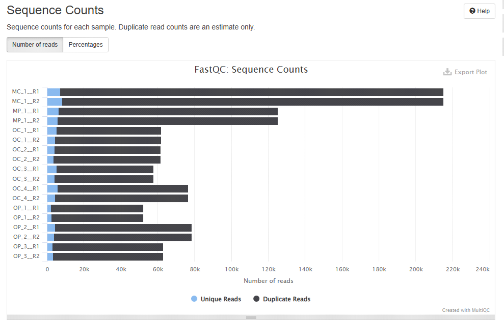
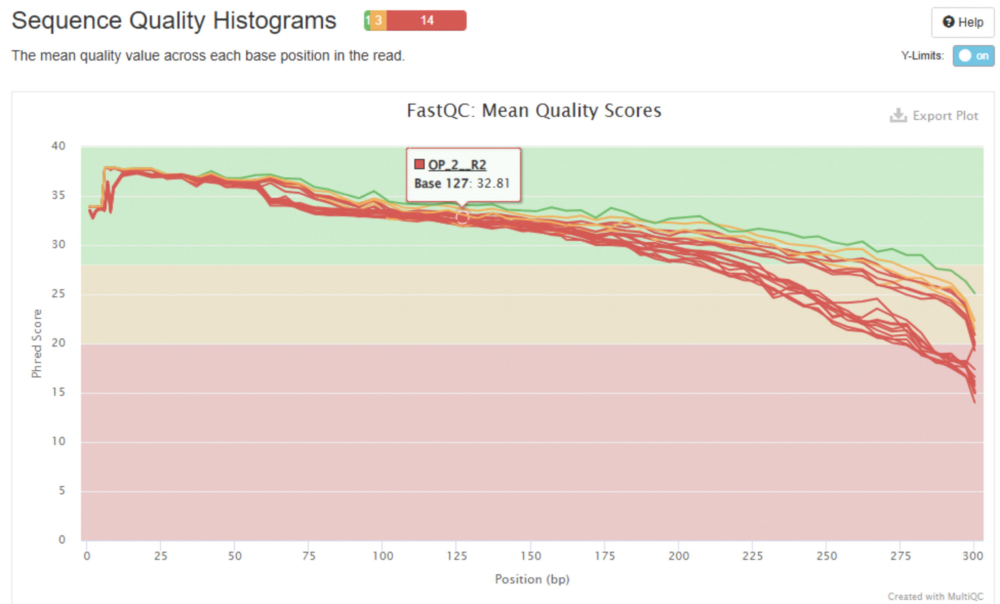

.. |PipeCraft2_logo| image:: _static/PipeCraft2_icon_v2.png
  :width: 50
  :alt: Alternative text
  :target: https://github.com/pipecraft2/user_guide

.. raw:: html

    

.. role:: red

.. raw:: html

    

.. role:: green

.. |multiQC_main| image:: _static/multiQC_main.png
  :width: 1000
  :alt: Alternative text

.. |multiQC_1-3| image:: _static/multiQC_1-3.png
  :width: 550
  :alt: Alternative text

.. |multiQC_view_report| image:: _static/multiQC_view_report.png
  :width: 550
  :alt: Alternative text

.. _qualitycheck:

Inspect quality profiles
------------------------

Quality scores are assigned to each nucleotide during base calling to indicate errors/accuarcies of the recorded base. 
Generally, the **quality score of 30** indicates a trustfuly recorded base (99.9% accuracy). 

+---------------+------------------------------------+--------------------+
| Quality score | Probability of incorrect base call | Base call accuracy |
+===============+====================================+====================+
| 10            | 1 in 10                            | 90%                |
+---------------+------------------------------------+--------------------+
| 20            | 1 in 100                           | 99%                |
+---------------+------------------------------------+--------------------+
| 30            | 1 in 1000                          | 99.9%              |
+---------------+------------------------------------+--------------------+
| 40            | 1 in 10000                         | 99.99%             |
+---------------+------------------------------------+--------------------+
| 50            | 1 in 100000                        | 99.999%            |
+---------------+------------------------------------+--------------------+
| 60            | 1 in 1000000                       | 99.9999%           |
+---------------+------------------------------------+--------------------+

.. admonition:: Average Q score of a sequence

  However, an **average quality score of 30** may be misleading in determining the reliability of a sequence.
  For example, the average quality score of a 100 base pairs (bp) sequence which has quality score of 37 for 80 bases and quality score of 6 for 20 bases, is **30.8**; but 
  the **expected number of errors for that sequence is 5** (80 x 0.00020 + 20 x 0.25119 = 5.0398; :ref:`see table for the error probabilities <quality_scores_table>`). 
  I.e., the sequence may host errors accountable for 5% variation in that amplicon and thus is not reliable, and should be discarded during quality filtering.
  
  Therefore, generally, the quality filtering based on the expected number of errors (sum of the error probabilities) is preferred over the average quality score threshold. 

____________________________________________________

In PipeCraft2, **examine the quality profiles and basic statistics** of the your FASTQ files using the ``QualityCheck module``, which 
implements `FastQC <https://www.bioinformatics.babraham.ac.uk/projects/fastqc/>`_ and `MultiQC <https://multiqc.info/>`_. 

|multiQC_main|

**TO START:** 

| 1. ``SELECT FOLDER`` (a working directory) which contains **fastq**/fq files that you aim to inspect. **Files can be gz compressed**. *Note that Windows OS does not display containing files; so double-check you are selecting the correct dir.)*
|
| 2. Press ``CREATE REPORT`` to start MultiQC.
|
| 3. **"LOADING ...** will be displayed while the report is being generated.
|
| 4. Once DONE, then ``VIEW REPORT`` is displayed. Click on ``VIEW REPORT`` and a html file (multiqc_report.html) will open in your default web browser.
    
    *If the summary does not open, check your working floder for the presence of* **multiqc_report.html** *in a* **quality_check** directory *and try to open with some other web browser.*

|multiQC_1-3|

|multiQC_view_report|

    
.. error:: 
  
  Something went wrong if the file multiqc_report.html does not exist (may fail e.g. when maximum number of fastq files in the folder is extremely large, >10 000).

____________________________________________________

MultiQC report
~~~~~~~~~~~~~~

MultiQC report allows to interactively examine the basic statistics and quality profiles of your input data. 

**Example plots generated by MultiQC:** 
|multiQC_stats|

|multiQC_plot|

More info about `"using MultiQC reports" in MultiQC docs page <https://docs.seqera.io/multiqc/reports>`_.

   
.. note::

 Note that '_fastqc.zip' and '_fastqc.html' are generated for each fastq file in the **'quality_check'** directory. These are summarized in **multiqc_report.html**, 
 so you may **examine or delete** all individual '_fastqc.zip' and '_fastqc.html' files if those are of no interest.
 
____________________________________________________

.. _quality_scores_table:

Quality scores table
~~~~~~~~~~~~~~~~~~~~

The table of quality (Phred) scores and corresponding probabilities of base calling errors. 
The ASCII column denotes the quality score representations in the fastq file *(note that old Illumina fastq files have different Phred score encoding)*.

+---------------+-------------------+-------+---------------+-------------------+-------+
| Quality score | Error probability | ASCII | Quality score | Error probability | ASCII |
+===============+===================+=======+===============+===================+=======+
| **0**         | 1.00000           | !     | **22**        | 0.00631           | 7     |
+---------------+-------------------+-------+---------------+-------------------+-------+
| **1**         | 0.79433           | \"    | **23**        | 0.00501           | 8     |
+---------------+-------------------+-------+---------------+-------------------+-------+
| **2**         | 0.63096           | #     | **24**        | 0.00398           | 9     |
+---------------+-------------------+-------+---------------+-------------------+-------+
| **3**         | 0.50119           | $     | **25**        | 0.00316           | :     |
+---------------+-------------------+-------+---------------+-------------------+-------+
| **4**         | 0.39811           | %     | **26**        | 0.00251           | ;     |
+---------------+-------------------+-------+---------------+-------------------+-------+
| **5**         | 0.31623           | &     | **27**        | 0.00200           | \<    |
+---------------+-------------------+-------+---------------+-------------------+-------+
| **6**         | 0.25119           | \'    | **28**        | 0.00158           | =     |
+---------------+-------------------+-------+---------------+-------------------+-------+
| **7**         | 0.11953           | (     | **29**        | 0.00126           | \>    |
+---------------+-------------------+-------+---------------+-------------------+-------+
| **8**         | 0.15849           | )     | **30**        | 0.00100           | ?     |
+---------------+-------------------+-------+---------------+-------------------+-------+
| **9**         | 0.12589           | \*    | **31**        | 0.00079           | @     |
+---------------+-------------------+-------+---------------+-------------------+-------+
| **10**        | 0.10000           | \+    | **32**        | 0.00063           | A     |
+---------------+-------------------+-------+---------------+-------------------+-------+
| **11**        | 0.07943           | ,     | **33**        | 0.00050           | B     |
+---------------+-------------------+-------+---------------+-------------------+-------+
| **12**        | 0.06310           | \-    | **34**        | 0.00040           | C     |
+---------------+-------------------+-------+---------------+-------------------+-------+
| **13**        | 0.05012           | .     | **35**        | 0.00032           | D     |
+---------------+-------------------+-------+---------------+-------------------+-------+
| **14**        | 0.03981           | /     | **36**        | 0.00025           | E     |
+---------------+-------------------+-------+---------------+-------------------+-------+
| **15**        | 0.03162           | 0     | **37**        | 0.00020           | F     |
+---------------+-------------------+-------+---------------+-------------------+-------+
| **16**        | 0.02512           | 1     | **38**        | 0.00016           | G     |
+---------------+-------------------+-------+---------------+-------------------+-------+
| **17**        | 0.01995           | 2     | **39**        | 0.00013           | H     |
+---------------+-------------------+-------+---------------+-------------------+-------+
| **18**        | 0.01585           | 3     | **40**        | 0.00010           | I     |
+---------------+-------------------+-------+---------------+-------------------+-------+
| **19**        | 0.01259           | 4     | **41**        | 0.00008           | J     |
+---------------+-------------------+-------+---------------+-------------------+-------+
| **20**        | 0.01000           | 5     |               |                   |       |
+---------------+-------------------+-------+---------------+-------------------+-------+
| **21**        | 0.00794           | 6     |               |                   |       |
+---------------+-------------------+-------+---------------+-------------------+-------+

So, such a sequence with associated encoded quality scores ...

.. code-block:: 

  @M02459:45:000000000-ATN9N:1:1101:9884:1029 1:N:0:247
  ATGAATCATCGAATCTTTGAACGCA
  +
  &8BCCGGGGGAAGGGGGG,CFFGGG

| ... would translate into sequence with the following quality scores:

.. code-block:: 
    
  @M02459:45:000000000-ATN9N:1:1101:9884:1029 1:N:0:247
  A   T   G   A   A   T   C   A   T   C   G   A   A   T   C  T   T   T   G   A   A   C   G   C   A 
  5  23  33  34  34  38  38  38  38  38  32  32  38  38  38  38  38  38  11  34  37  37  38  38  38

