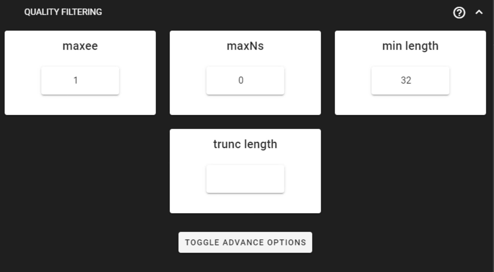
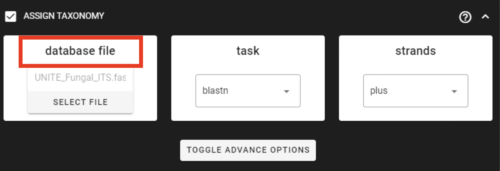
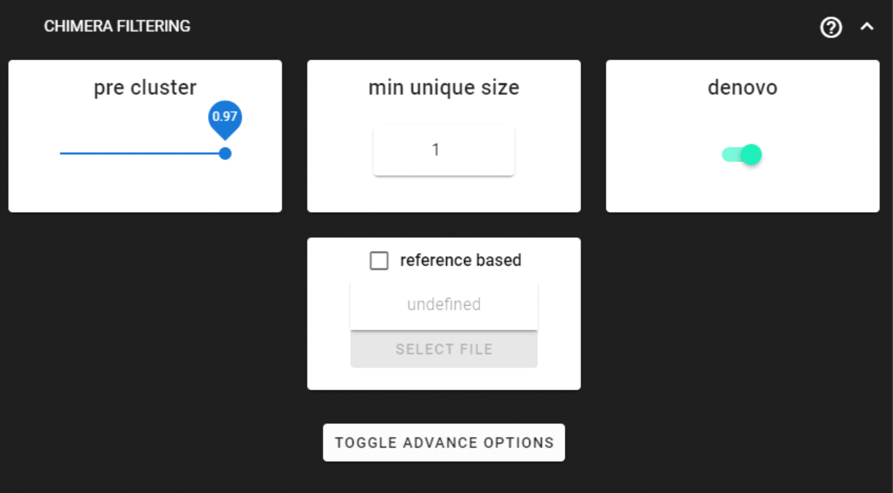
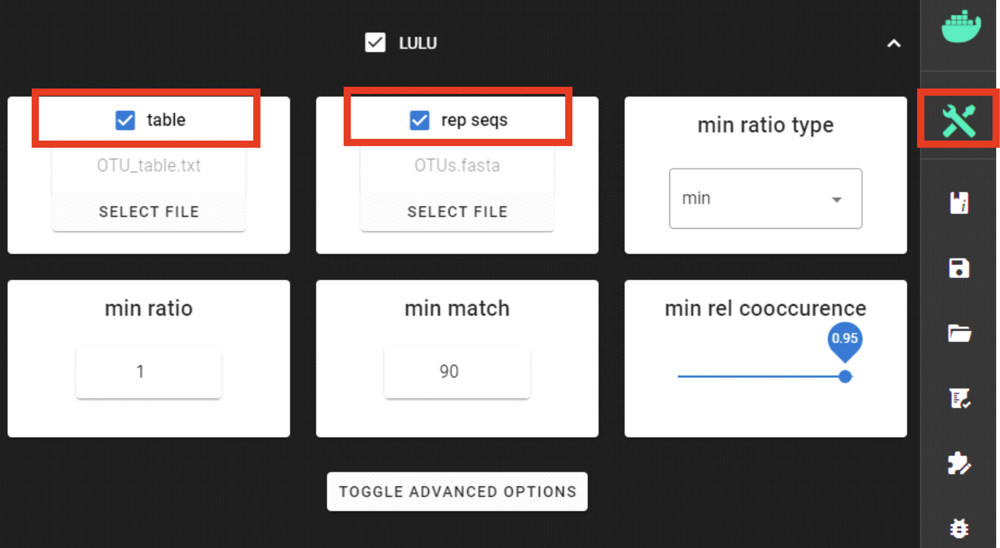
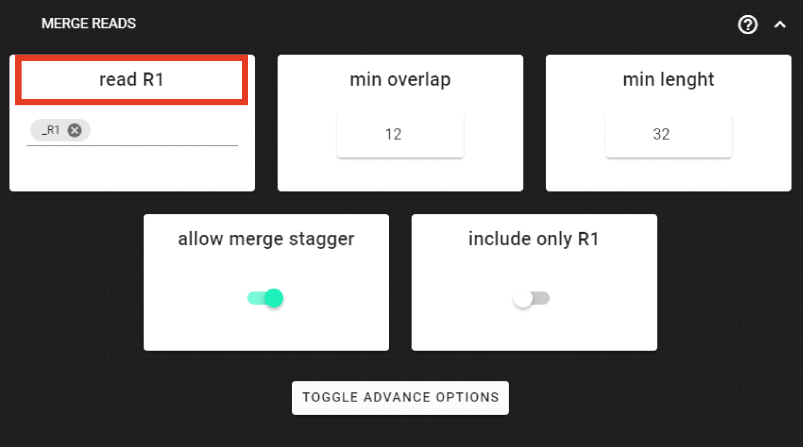
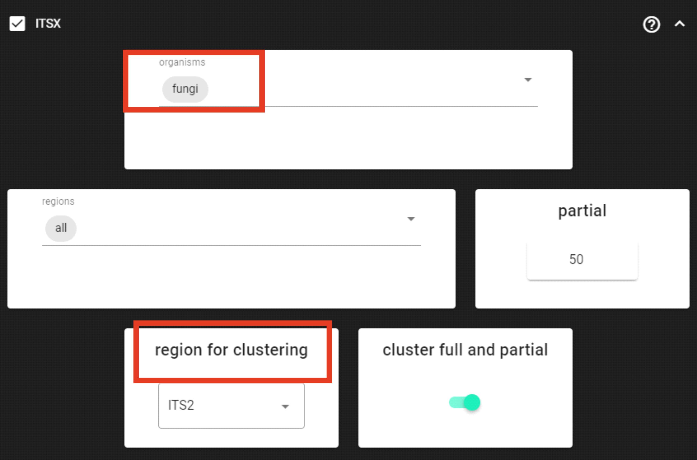
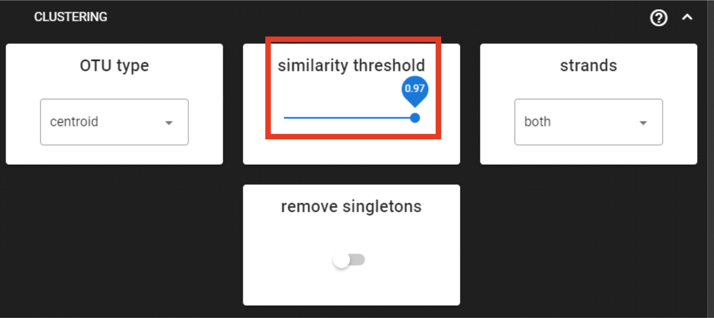

.. |PipeCraft2_logo| image:: _static/PipeCraft2_icon_v2.png
  :width: 50
  :alt: Alternative text
  :target: https://github.com/pipecraft2/user_guide

.. raw:: html

    

.. role:: red

.. raw:: html

    

.. role:: green

.. |workflow_finished| image:: _static/workflow_finished.png
  :width: 300
  :alt: Alternative text

.. |stop_workflow| image:: _static/stop_workflow.png
  :width: 200
  :alt: Alternative text

.. |assign_taxonomy_blast| image:: _static/assign_taxonomy_blast.png
  :width: 600
  :alt: Alternative text   

.. |cut_primers_expand_example| image:: _static/cut_primers_expand_example.png
  :width: 600
  :alt: Alternative text 

.. |output_icon| image:: _static/output_icon.png
  :width: 50
  :alt: Alternative text

.. |save| image:: _static/save.png
  :width: 50
  :alt: Alternative text

.. |pulling_image| image:: _static/pulling_image.png
  :width: 280
  :alt: Alternative text

.. meta::
    :description lang=en:
        PipeCraft manual. tutorial

vsearch OTUs pipeline, ITS2 |PipeCraft2_logo|
---------------------------------------------

This example data analyses follows vsearch OTUs workflow as implemented in PipeCraft2's pre-compiled pipelines panel. 

| `Download example data set here <https://raw.githubusercontent.com/pipecraft2/user_guide/master/data/example_data_ITS2.zip>`_ (15.1 Mb) and unzip it. 
| This is **ITS2 Illumina MiSeq** dataset. 

For this example data run, we are using a subset of UNITE database in the taxonomy annotation process, `download it from here <https://raw.githubusercontent.com/pipecraft2/user_guide/master/data/Database_ITS/UNITE_Fungal_ITS.zip>`_.

____________________________________________________

Starting point 
~~~~~~~~~~~~~~

This example dataset consists of **ITS2 rRNA gene amplicon sequences**; targeting fungi:

- **paired-end** Illumina MiSeq data;
- **demultiplexed** set (per-sample fastq files);
- primers **are not removed**;
- sequences in this set are **5'-3' oriented**.

.. admonition:: when working with your own data ...

  ... then please check that the paired-end data file names contain **R1** and **R2** strings *(not just _1 and _2)*, so that 
  PipeCraft can correctly identify the paired-end reads.

  | *Example:*
  | *sample1_R1.fastq.gz*
  | *sample1_R2.fastq.gz*

____________________________________________________

| **To select vsearch OTUs pipeline**, press
| ``SELECT PIPELINE`` --> ``vsearch OTUs``.
| 
| **To select input data**, press ``SELECT WORKDIR``
| and specify
| ``sequence files extension`` as **\*.fastq.gz**;  
| ``sequencing read types`` as **paired-end**.

___________________________________________________

Cut primers
~~~~~~~~~~~

The example dataset **contains primer sequences**. Generally, we need to remove these to proceed the analyses only with the variable metabarcode of interest.
If there are some additional sequence fragments, from eg. sequencing adapters or poly-G tails, then clipping the primers will remove those fragments as well.

Tick the box for ``CUT PRIMERS`` and specify forward and reverse primers.
For the example data, the **forward primer is GTGARTCATCGAATCTTTG** and **reverse primer is TCCTCCGCTTATTGATATGC**.

|cut_primers_expand_example|

Forward primer has 19 bp and reverse 20 bp - to keep a bit of flexibility in the primer search, we are requesting the ``min overlap`` of **18 bp** and are allowing maximum of 2 ``mismatches`` . 
Note that too low ``min overlap`` may lead to random matches. Check :ref:`other CUT PRIMER options here <remove_primers>`.

.. admonition:: when working with your own ITS data ... 

  ... and applying the **ITSx** step, then note that cutting primers process may be skipped, since those regions are removed in the ITS subregion extraction process. 
  
____________________________________________________

Merge paired-end reads
~~~~~~~~~~~~~~~~~~~~~~

This step assembles/merged the paired-end read mates. 
**Click on** ``MERGE READS`` **to expand the panel** and double-check the value in ``read R1`` box.

|vsearch_merge_reads|

.. admonition:: it is important to double-check the value in 'read R1' box.
  
  This denotes the **common identifier for all read1 sequences** in your input Illumina data set. 

  Our example data fastq files were named as:
    | *sample1_R1.fastq.gz*
    | *sample1_R2.fastq.gz* ...

  So, **_R1** is common identifier for all read1 files.
  By specifying **_R1**, PipeCraft automatically expects that corresponding read2 files have common identifier **_R2**. 

  All characters in the file name before the specified identifier, that is **_R1** in this case, account for **sample name**.
  So, the **sample name in the final OTU table** for files sample1_R1.fastq.gz and sample1_R2.fastq.gz is **sample1**.

  **Note that simply _1 and _2 are not recognized as read1/2 identifiers!**

Check :ref:`other MERGE PAIRS options here <merge_pairs>`.

+------------------------------------------------+---------------------------------------+
| Output directory |output_icon| ``assembled_out``                                       |
+================================================+=======================================+
| \*.fastq                                       | merged per sample FASTQ files         |
+------------------------------------------------+---------------------------------------+
| seq_count_summary.txt                          | summary of sequence counts per sample |
+------------------------------------------------+---------------------------------------+

___________________________________________________

Quality filtering 
~~~~~~~~~~~~~~~~~

Quality filtering here removes sequences which does not meet the threshold for the allowed maximum number of expected errors. 
See :ref:`here for more inforamtion about sequence quality <qualitycheck>` 
and `here for the additional information about expected errors <https://drive5.com/usearch/manual/exp_errs.html>`_.

|vsearch_qfilt|

Here, we can leave settings as DEFAULT. :ref:`Check the settings here <qfilt_vsearch>`.

+-----------------------+-------------------------------------------------------+
| Output directory |output_icon|          ``qualFiltered_out``                  |
+=======================+=======================================================+
| \*.fastq              | quality filtered sequences per sample in FASTQ format |
+-----------------------+-------------------------------------------------------+
| seq_count_summary.txt | summary of sequence counts per sample                 |
+-----------------------+-------------------------------------------------------+

____________________________________________________

Chimera filtering 
~~~~~~~~~~~~~~~~~

This step performs chimera filtering according to `uchime <https://pmc.ncbi.nlm.nih.gov/articles/PMC3150044/>`_ algoritm, and optionally uchime_ref (reference based) algorithm. 

|vsearch_chimeraFilt|

Here, we are using the DEFAULT settings. *Chimera filtering settings* :ref:`here <chimFilt>`. 

.. admonition:: when working with your own ITS data ...

  ... then UNITE database may used as a reference for the additional 'reference based' chimera filtering process.
  When both, denovo and reference based methods, are selected, then denovo process will be performed first, and uchime_ref if 
  applied upon uchime_denovo results.

  Download `UNITE ref databse for chimera filtering here <https://unite.ut.ee/repository.php>`_ (select 'UCHIME/USEARCH/UTAX/SINTAX reference datasets').

+-------------------------------------------------------+---------------------------------------------------------+
| Output directory |output_icon| ``chimera_Filtered_out``                                                         |
+=======================================================+=========================================================+
| \*.fasta                                              | chimera filtered sequences per sample in FASTA format   |
+-------------------------------------------------------+---------------------------------------------------------+
| seq_count_summary.txt                                 | summary of sequence counts per sample                   |
+-------------------------------------------------------+---------------------------------------------------------+
| ``chimeras``/\*.fasta                                 | discarded sequences per sample during chimera filtering |
+-------------------------------------------------------+---------------------------------------------------------+

___________________________________________________

Extract ITS2 
~~~~~~~~~~~~

Here, in this example dataset, we are working with **ITS2 amplicons**, and 
we want to remove the conservative flanking regions (where the primer binding sites are designed) 
that are affecting the clustering thresholds. 

Since we are working with **ITS2** amplicons and are interesed only in **fungi**, we can limit the ``organisms`` to only fungi and keep the ``region for clusering`` as **ITS2**. 
Check other :ref:`ITSx settings* here <itsextractor>`.

.. admonition:: when working with your own ITS data ...
  
  ... then double-check the ``region for clusering`` setting and edit according to your working amplicon (ITS1/ITS2,full-ITS).

  **If you are working with only 5'-3' oriented amplicons**, then turn off ``complement`` setting under ``TOGGLE ADVANCE OPTIONS``
  to skip the reverse complementary search; and possibly add more ``cores`` to speed things up.

|ITSx|

.. note::

  For better detection of the 18S, 5.8S and/or 28S regions by ITSx, you may not want to CUT PRIMERS in your own dataset. 
  With this example dataset, `ITSx <https://microbiology.se/software/itsx/>`_ works fine even when primers were clipped.

+-------------------------------------------+-------------------------------------------------------------+
| Output directory |output_icon| ``ITSx_out``                                                             |
+===========================================+=============================================================+
| ``ITS2``/\*.fasta                         | ITS2 sequences (without flanking gene fragments) per sample |
+-------------------------------------------+-------------------------------------------------------------+
| ``ITS2``/``full_and_partial``/\*.fasta    | full, but also partial ITS2 sequences per sample            |
+-------------------------------------------+-------------------------------------------------------------+
| seq_count_summary.txt                     | summary of sequence counts per sample                       |
+-------------------------------------------+-------------------------------------------------------------+

___________________________________________________

Clustering
~~~~~~~~~~

The clustering process collapses sequences that fall into the same ``similarity threshold`` using vsearch clustering algorithms. 
Check :ref:`vsearch clustering settings here <clustering>` to see the supported methods. 
 
|vsearch_clustering|

Here, we are applying DEFAULT settings by clustering sequenes with 97% ``similarity threshold``.
Here, however, the ``strands`` could be set as "plut", since our sequences are 5'-3' oriented (keep it "both" when sequences are mixed orientations in the dataset). 

+-------------------------------------------------+--------------------------------------------+
| Output directory |output_icon| ``clustering_out``                                            |
+=================================================+============================================+
| OTU_table.txt                                   | OTU-by-sample table                        |
+-------------------------------------------------+--------------------------------------------+
| OTUs.fasta                                      | corresponding FASTA formated OTU sequences |
+-------------------------------------------------+--------------------------------------------+
| OTUs.uc                                         | clustering results mapping file            |
+-------------------------------------------------+--------------------------------------------+

___________________________________________________

Postclustering 
~~~~~~~~~~~~~~

Postclustering polishes the clusters (OTUs) by merging consistently co-occurring 'daughter-OTUs' with the 'parent-OTUs' (and reduces the tail of rare/low-abundant OTUs).
PipeCraft2 implements LULU algorithm for postclustering; :ref:`see here <postclustering_lulu>`. 

LULU can be found under **QuickTools** panel on the right ribbon.

.. admonition:: when doing LULU postclustering ...

  ... then make sure you specify your working directory (the data output location) via ``SELECT WORKDIR`` button. Here, the 
  **file extension** and **read-type** selections **do not matter**; just make sure you are correctly specifying the ``table`` (OTU_table.txt)
  and ``rep seqs`` (OTUs.fasta) files. 

|lulu|

+-------------------------------------------+--------------------------------------------+
| Output directory |output_icon|  ``lulu_out``                                           |
+===========================================+============================================+
| OTU_table_LULU.txt                        | OTU-by-sample table                        |
+-------------------------------------------+--------------------------------------------+
| OTUs_LULU.fasta                           | corresponding FASTA formated OTU sequences |
+-------------------------------------------+--------------------------------------------+
| match_list.lulu                           | similarity match list for LULU             |
+-------------------------------------------+--------------------------------------------+

.. note::

  if no OTUs are merged, then ``lulu_out`` folder does not contain OTU_table_LULU.txt and OTUs_LULU.fasta. 

___________________________________________________

Assign taxonomy
~~~~~~~~~~~~~~~

The default taxonomy assignment tool within vsearch OTUs workflow is **BLAST**. 
See other :ref:`taxonomy assignment options here <assign_taxonomy>`.

For this example data run, we are using a subset of UNITE database, `download it from here <https://raw.githubusercontent.com/pipecraft2/user_guide/master/data/Database_ITS/UNITE_Fungal_ITS.zip>`_
and unzip it. 

Here, we have 5'-3' oriented OTUs, so let's change the ``strands`` setting to "plus" to speed up BLAST *(which is the slowest process among the ones here)*. 

|vsearch_blast|

.. admonition:: when working with your own ITS data ...

  ... then you can download `EUKARYOME database here <https://eukaryome.org/generalfasta/>`_, or `UNITE database here <https://unite.ut.ee/repository.php>`_

+-----------------------------------------------+-------------------------------+
| Output directory |output_icon| ``taxonomy_out``                               |
+===============================================+===============================+
| BLAST_1st_best_hit.txt                        | BLAST 1st hit per query       |
+-----------------------------------------------+-------------------------------+
| BLAST_10_best_hits.txt                        | First 10 BLAST hits per query |
+-----------------------------------------------+-------------------------------+

___________________________________________________

Save workflow
~~~~~~~~~~~~~

Once we have decided about the settings in our workflow, we can save the configuration file by pressing ``save workflow`` button on the right-ribbon
|save|

If you forget the save, then no worries, a ``pipecraft2_last_run_configuration.json`` file will be generated for you upon starting the workflow.
As the file name says, it is the workflow configuration file for your last PipeCraft run in this **working directory**. 

This ``JSON`` file can be loaded into PipeCraft2 to **automatically configure your next runs exactly the same way**.

___________________________________________________

Start the workflow
~~~~~~~~~~~~~~~~~~

Press ``START`` on the left ribbon **to start the analyses**.

.. admonition:: when running the module for the first time ...
  
  ... a docker image will be first pulled to start the process. 

  For example: |pulling_image|

When you need to STOP the workflow, press ``STOP`` button |stop_workflow|

.. admonition:: When the workflow has completed ...

  ... a message window will be displayed.

  |workflow_finished|

___________________________________________________

Examine the outputs
~~~~~~~~~~~~~~~~~~~

Several process-specific output folders are generated |output_icon|

+-------------------------+---------------------------------------------------------------+
| ``primersCut_out``      | paired-end fastq files per sample where primers have been cut |
+-------------------------+---------------------------------------------------------------+
| ``assembled_out``       | merged fastq files per sample                                 |
+-------------------------+---------------------------------------------------------------+
| ``qualFiltered_out``    | quality filtered **fastq** files per sample                   |
+-------------------------+---------------------------------------------------------------+
| ``chimeraFiltered_out`` | chimera filtered **fasta** files per sample                   |
+-------------------------+---------------------------------------------------------------+
| ``ITSx_out``            | ITS2 sequences per sample without flanking gene fragments     |
+-------------------------+---------------------------------------------------------------+
| ``clustering_out``      | **OTU table**, and OTU sequences files                        |
+-------------------------+---------------------------------------------------------------+
| ``taxonomy_out``        | OTUs **taxonomy table** (in this case, BLAST hits)            |
+-------------------------+---------------------------------------------------------------+

.. _seq_count_summary:

Each folder (except clustering_out and taxonomy_out) contain 
**summary of the sequence counts** (``seq_count_summary.txt``). 
Examine those to track the read counts throughout the pipeline. 

For example, from the ``seq_count_summary.txt`` file in ``qualFiltered_out`` we see that first two samples did not contains any "bad" quality sequences, while ~84% of the sequences 
were discarded from the last sample. *(note that this is an example dataset and the good-bad sequence distribution is generally more even among samples)*.

+---------------+----------+-----------+
| File          | Reads_in | Reads_out |
+---------------+----------+-----------+
| sample1.fastq | 13715    | 13715     |
+---------------+----------+-----------+
| sample2.fastq | 13715    | 13715     |
+---------------+----------+-----------+
| sample3.fastq | 11613    | 8556      |
+---------------+----------+-----------+
| sample4.fastq | 11456    | 1997      |
+---------------+----------+-----------+
| sample5.fastq | 9408     | 1443      |
+---------------+----------+-----------+

``clustering_out`` directory contains **OTU table** (OTU_table.txt), where the **1st column** represents OTU identifiers (sha1 encoded), 
and all the following columns represent number of sequences in the corresponding sample (sample name is taken from the file name). This is tab delimited text file. 

*OTU_table.txt; first 4 samples and 4 ASVs*

+-------------+-----------------------------+-----------------------------+-----------------------------+
| OTU         | sample1ITS2full_and_partial | sample2ITS2full_and_partial | sample3ITS2full_and_partial |
+-------------+-----------------------------+-----------------------------+-----------------------------+
| 920bdde8... | 3817                        | 4139                        | 2140                        |
+-------------+-----------------------------+-----------------------------+-----------------------------+
| 0ccd85db... | 3375                        | 2159                        | 1706                        |
+-------------+-----------------------------+-----------------------------+-----------------------------+
| 80249b06... | 2882                        | 1390                        | 675                         |
+-------------+-----------------------------+-----------------------------+-----------------------------+
| 80ee6f38... | 2064                        | 750                         | 843                         |
+-------------+-----------------------------+-----------------------------+-----------------------------+

.. admonition:: Whay our sample names now have "ITS2full_and_partial" string attached??

  Note that during the **Extract ITS2** process the ``cluster full and partial`` was switched on and ``partial`` = 50. 
  This means, that if at least one of the 5.8S or 28S motif is found in the sequence, and the sequence is at least 50 bp long (after 
  cutting the motif), then the sequence will be passed into **ITS2_full_and_partial** output. 
  And since the ``cluster full and partial`` was ON, the **sample name is extended with "ITS2full_and_partial"**. 
  

.. admonition:: Did 'postclustering with LULU' have any effect?

  In this example, we applied also postclustering.
  The results of this is in the ``clustering_out/lulu_out`` folder. 
  If we examine the ``README.txt`` file in that folder, then we see that **Total of 0 molecular units (OTUs or ASVs) were merged**, and therefore we 
  do not have any OTU table or fasta file on the ``lulu_out`` folder. 

  **Note that this is a small example dataset**, but with larger datasets postclustering may collapse >50% of OTUs. 

...