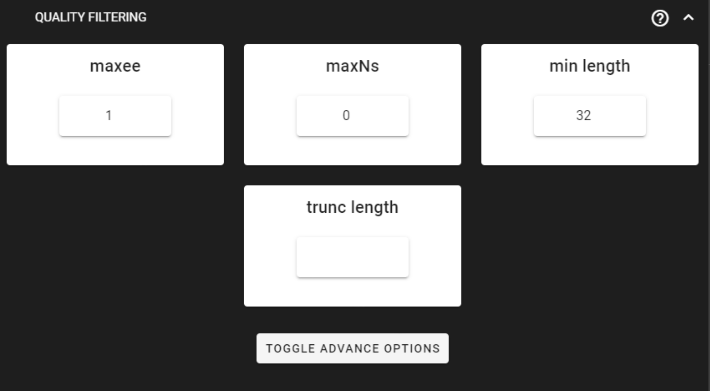
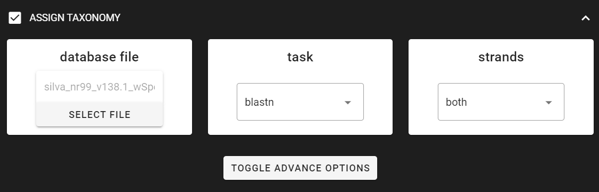
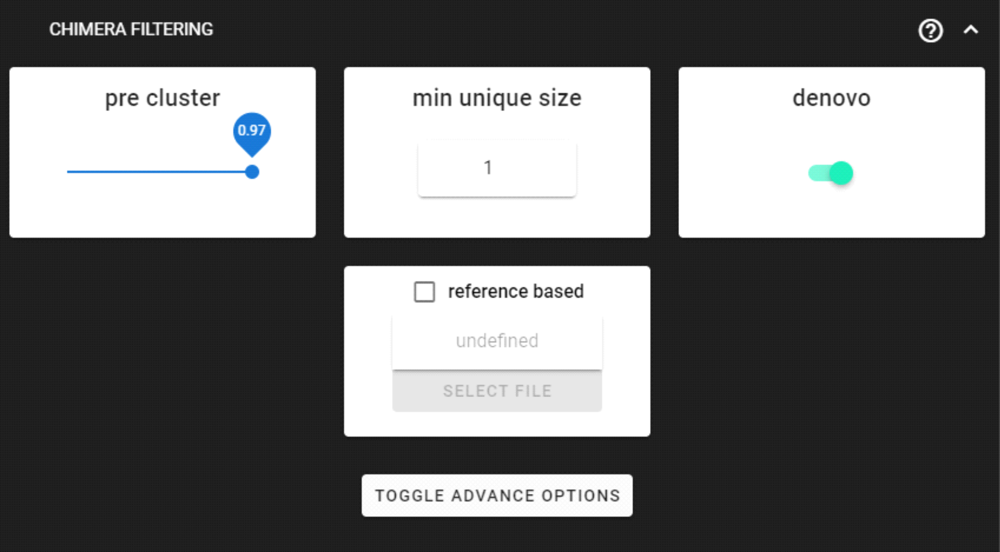
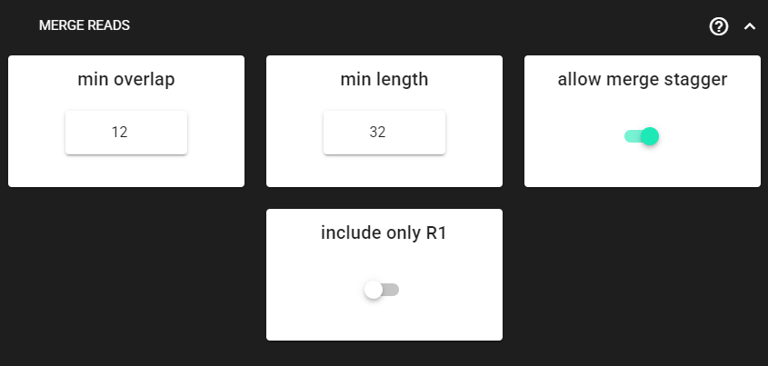
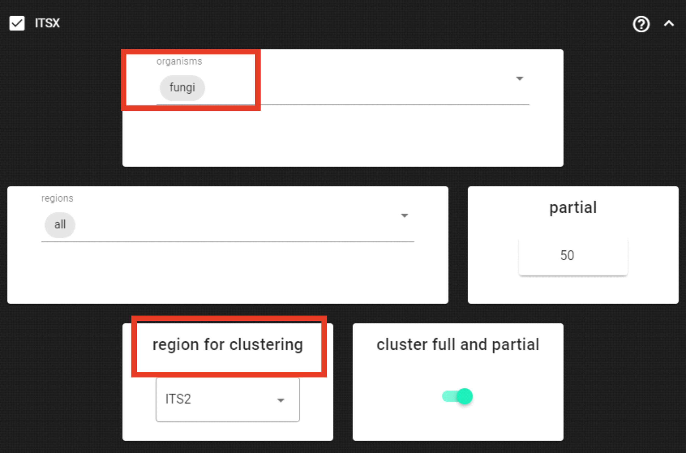
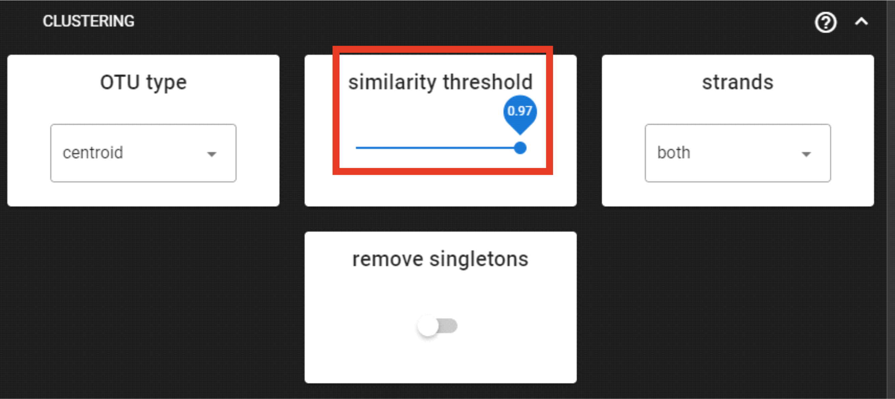
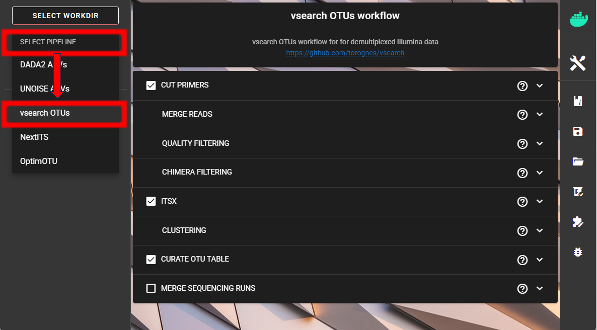
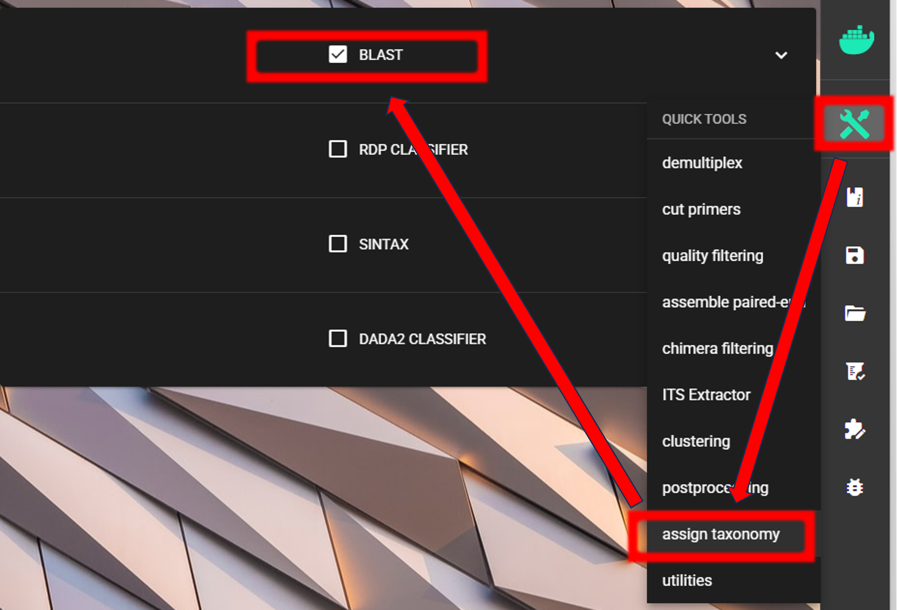
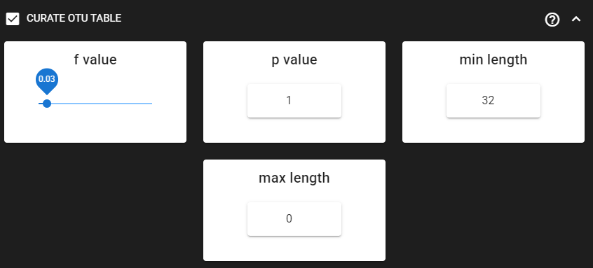
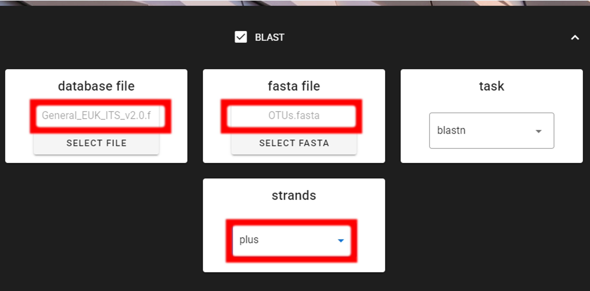

.. |PipeCraft2_logo| image:: _static/PipeCraft2_icon_v2.png
  :width: 50
  :target: https://github.com/pipecraft2/pipecraft

.. raw:: html

    

.. role:: red

.. raw:: html

    

.. role:: green

.. |select_LULU| image:: _static/select_LULU.png
  :width: 600

.. |workflow_finished| image:: _static/workflow_finished.png
  :width: 300

.. |stop_workflow| image:: _static/stop_workflow.png
  :width: 200

.. |lulu| image:: _static/lulu.png
  :width: 600

.. |cut_primers_expand_example| image:: _static/cut_primers_expand_example.png
  :width: 600

.. |output_icon| image:: _static/output_icon.png
  :width: 50

.. |save| image:: _static/save.png
  :width: 50

.. |pulling_image| image:: _static/pulling_image.png
  :width: 280

.. meta::
    :description lang=en:
        PipeCraft manual. tutorial

.. _example_analyses_vsearchOTU:

vsearch OTUs pipeline, ITS2 |PipeCraft2_logo|
---------------------------------------------

This example data analyses follows vsearch OTUs workflow as implemented in PipeCraft2's pre-compiled pipelines panel.

| `Download example data set here <https://zenodo.org/records/18770850/files/example_data_ITS2.zip?download=1>`_ (15.1 Mb) and unzip it.
| This is **ITS2 Illumina MiSeq** dataset. 

For this example, we are using `EUKARYOME database <https://eukaryome.org/>`_ in the taxonomy annotation process (BLAST).
Download the **General_EUK_ITS** file from `here <https://eukaryome.org/generalfasta/>`_
and **unzip** it (note: use `7-Zip software <https://www.7-zip.org/download.html>`_ for **unzipping** files **in Windows**). 

____________________________________________________

Starting point 
~~~~~~~~~~~~~~

This example dataset consists of **ITS2 rRNA gene amplicon sequences**; targeting fungi:

- **paired-end** Illumina MiSeq data;
- **demultiplexed** set (per-sample fastq files);
- primers **are not removed**;
- sequences in this set are **5'-3' oriented**.

.. admonition:: when working with your own data ...

  ... then please check that the paired-end data file names contain **R1** and **R2** strings *(not just _1 and _2)*, so that 
  PipeCraft can correctly identify the paired-end reads.

  | *Example:*
  | *sample1_R1.fastq.gz*
  | *sample1_R2.fastq.gz*

____________________________________________________

| **To select vsearch OTUs pipeline**, press
| ``SELECT PIPELINE`` --> ``vsearch OTUs``.

|select_vsearch_OTUs_workflow|

| **To select input data**, press ``SELECT WORKDIR``
| and specify
| ``sequence files extension`` as **\*.fastq.gz**;  
| ``sequencing read types`` as **paired-end**.

___________________________________________________

Cut primers
~~~~~~~~~~~

The example dataset **contains primer sequences**. 
Generally, we need to remove these to proceed the analyses only with the variable metabarcode of interest.
If there are some additional sequence fragments, from eg. sequencing adapters or poly-G tails, 
then clipping the primers will remove those fragments as well.

Tick the box for ``CUT PRIMERS`` and specify forward and reverse primers.
For the example data, the **forward primer is GTGARTCATCGAATCTTTG** (fITS7) 
and **reverse primer is TCCTCCGCTTATTGATATGC** (ITS4).

|cut_primers_expand_example|

Forward primer has 19 bp and reverse 20 bp - to keep a bit of flexibility in the primer search, 
we are requesting the ``min overlap`` of **18 bp** and are allowing maximum of 2 ``mismatches`` . 
Note that too low ``min overlap`` may lead to random matches. Check :ref:`other CUT PRIMER options here <remove_primers>`.

.. note:: 

  You may specify add up to 13 primer pairs. 

.. admonition:: A consideration when working with ITS sequences and plan to use ITS Extractor

  Since fITS7 and ITS4 primer binding sites are >50 bp from ITS2 region from the 5.8S side and >40 bp from the 28S side, 
  we can clip the primers in order to safely use :ref:`ITS Extractor <itsextractor>` 
  to remove the flanking regions from ITS2 reads. 
  
  However, when the primer binding sites are very close to the ITS region (< 25 bp), 
  then you may want to keep the primers for better detection of the 18S, 5.8S and 28S regions.

___________________________________________________

Quality filtering 
~~~~~~~~~~~~~~~~~

:ref:`Quality filtering <qfilt_vsearch>` removes sequences, 
which do not meet the threshold for the allowed maximum number of expected errors 
(``maxee``; sum of per-base error probabilities derived from Phred scores). 

If the quality profile of the sequences are low at the beginning or at the end, then 
applying ``trunc length``, ``strip_left`` and ``strip_right`` settings may be helpful to remove 
low-quality ends/starts of reads before filtering 
(``maxee`` filtering is applied to the truncated reads).
See :ref:`remove low-quality ends/starts of reads section <remove_low_quality_ends>`. 

|vsearch_qfilt|

Here, we can leave settings as DEFAULT. 
:ref:`Check the settings here <qfilt_vsearch>`.

+-----------------------+-------------------------------------------------------+
| Output directory |output_icon|          ``qualFiltered_out``                  |
+=======================+=======================================================+
| \*.fastq              | quality filtered sequences per sample in FASTQ format |
+-----------------------+-------------------------------------------------------+
| seq_count_summary.txt | summary of sequence counts per sample                 |
+-----------------------+-------------------------------------------------------+

____________________________________________________

Merge paired-end reads
~~~~~~~~~~~~~~~~~~~~~~

This step assembles/merges the paired-end read mates. 
**Click on** ``MERGE READS`` **to expand the panel**.

|vsearch_merge_reads|

Here, we are using the DEFAULT settings, which are fine in most cases.
Check :ref:`other MERGE PAIRS options here <merge_pairs>`.

+------------------------------------------------+---------------------------------------+
| Output directory |output_icon| ``assembled_out``                                       |
+================================================+=======================================+
| \*.fastq                                       | merged per sample FASTQ files         |
+------------------------------------------------+---------------------------------------+
| seq_count_summary.txt                          | summary of sequence counts per sample |
+------------------------------------------------+---------------------------------------+

____________________________________________________

Chimera filtering 
~~~~~~~~~~~~~~~~~

This step performs chimera filtering according to `uchime <https://pmc.ncbi.nlm.nih.gov/articles/PMC3150044/>`_ algoritm, 
and optionally uchime_ref (reference based) algorithm. 

|vsearch_chimeraFilt|

Here, we are using the DEFAULT settings. *Chimera filtering settings* :ref:`here <chimFilt>`. 

.. admonition:: when working with your own ITS data ...

  ... then UNITE database may used as a reference for the additional 'reference based' chimera filtering process.
  When both, denovo and reference based methods, are selected, then denovo process will be performed first, and uchime_ref if 
  applied upon uchime_denovo results.

  Download `UNITE ref databse for chimera filtering here <https://unite.ut.ee/repository.php>`_ (select 'UCHIME/USEARCH/UTAX/SINTAX reference datasets').

+-------------------------------------------------------+---------------------------------------------------------+
| Output directory |output_icon| ``chimera_Filtered_out``                                                         |
+=======================================================+=========================================================+
| \*.fasta                                              | chimera filtered sequences per sample in FASTA format   |
+-------------------------------------------------------+---------------------------------------------------------+
| seq_count_summary.txt                                 | summary of sequence counts per sample                   |
+-------------------------------------------------------+---------------------------------------------------------+
| ``chimeras``/\*.fasta                                 | discarded sequences per sample during chimera filtering |
+-------------------------------------------------------+---------------------------------------------------------+

___________________________________________________

Extract ITS2 
~~~~~~~~~~~~

Here, in this example dataset, we are working with **ITS2 amplicons**, and 
we want to remove the conservative flanking regions (where the primer binding sites are located) 
that are affecting the clustering thresholds. For that,
we are using :ref:`ITSx <itsextractor>`.

Since we are working with **ITS2** amplicons and are interesed only in **fungi**, 
we can limit the ``organisms`` to only fungi and keep the ``region for clusering`` as **ITS2**. 
Since universal ITS2 **primers amplify also other eukaryotes besides fungi**, this 
step **helps also to discard off-target sequences** when limiting the ``organisms`` to only fungi. 
However, note that this increase in specificity may lead to some decrease in sensitivity; i.e., discarding some Fungal OTUs.
For **real-world applications**, you may set ``organism`` to "all", and 
**discard off-target OTUs after the taxonomy assignment step** (:ref:`see below <parse_BLAST_results>`).

.. admonition:: when working with your own ITS data ...
  
  ... then double-check the ``region for clusering`` setting and edit according to your working amplicon (ITS1/ITS2,full-ITS).
  Since, ITSx outputs multiple directories for corresponding ITS regions, **we need to specify the** ``region for clusering`` accordingly
  so that PipeCraft can proceed with **clustering the corresponding ITS region**.

  **If you are working with only 5'-3' oriented amplicons**, then turn off ``complement`` setting under ``TOGGLE ADVANCE OPTIONS``
  to skip the reverse complementary search; and possibly add more ``cores`` to speed things up (:ref:`see here <modify_resources>`).

The ``partial`` setting is set to 50, which means that if **at least one of the 5.8S or 28S motif is found in the sequence**
and that sequence is **at least 50 bp long** (after cutting the motif), 
then it will be classified as **partial ITS2 sequence** and outputted in the ``ITS2/full_and_partial`` directory.

``cluster full and partial`` is ON, which means that in the following process (**clustering**),
PipeCraft is clustering sequences in the ``ITS2/full_and_partial`` directory. 
In most cases, this is fine as the partial ITS2 sequences are clustered together with the full ITS2 sequences
(if they fall into the same similarity threshold). 
But this behaviour can be turned off by turning off the ``cluster full and partial`` setting.

|ITSx|

.. note::

  For better detection of the 18S, 5.8S and/or 28S regions by ITSx, you may not want to CUT PRIMERS in your own dataset. 
  With this example dataset, :ref:`ITSx <itsextractor>` works fine even when primers were clipped.

+-------------------------------------------+-------------------------------------------------------------+
| Output directory |output_icon| ``ITSx_out``                                                             |
+===========================================+=============================================================+
| ``ITS2``/\*.fasta                         | ITS2 sequences (without flanking gene fragments) per sample |
+-------------------------------------------+-------------------------------------------------------------+
| ``ITS2``/``full_and_partial``/\*.fasta    | full, but also partial ITS2 sequences per sample            |
+-------------------------------------------+-------------------------------------------------------------+
| seq_count_summary.txt                     | summary of sequence counts per sample                       |
+-------------------------------------------+-------------------------------------------------------------+

___________________________________________________

Clustering
~~~~~~~~~~

The clustering process collapses sequences that fall into the same ``similarity threshold`` using vsearch clustering algorithms. 
Check :ref:`vsearch clustering settings here <clustering>` to see the supported methods. 
 
|vsearch_clustering|

Here, we are applying DEFAULT settings by clustering sequenes with 97% ``similarity threshold``.
Here, however, the ``strands`` could be set as "plus" (for the process to be a bit faster), 
since our sequences are 5'-3' oriented (keep it "both" when sequences are mixed orientations in the dataset). 

+-------------------------------------------------+--------------------------------------------+
| Output directory |output_icon| ``clustering_out``                                            |
+=================================================+============================================+
| OTU_table.txt                                   | OTU-by-sample table                        |
+-------------------------------------------------+--------------------------------------------+
| OTUs.fasta                                      | corresponding FASTA formated OTU sequences |
+-------------------------------------------------+--------------------------------------------+
| OTUs.uc                                         | clustering results mapping file            |
+-------------------------------------------------+--------------------------------------------+

___________________________________________________

Curate ASV table
~~~~~~~~~~~~~~~~

This process first removes putative **tag jumps** and then
filters out OTUs whose **sequences are shorter/longer than specified length** (in base pairs).

|vsearch_curate_table_expand|

Here, we are **enabling this process** by checking the box for ``CURATE OTU TABLE`` in the workflow panel. 

The ``f_value`` and ``p_value`` settings are used to filter out putative tag jumps (using UNCROSS2 algorithm). 
Generally, we recommend to use p_value of 1 (default), and **f_value of 0.03** when using combinational indexing strategy; 
f_value of 0.05 when using single-indexes, and f_value of 0.01 when using unique dual-indexes.

Since the ITS2 sequences are highly variable among Fungi, we are keeping the 
``max length`` as 32 (bp) and ``max length`` 
as 0 (meaning no filtering by maximum sequence length).

+---------------------------+--------------------------------------------+
| Output directory          | ``clustering_out/curated``                 |
+===========================+============================================+
| OTU_table_TagJumpFilt.txt | only tag-jump filtered OTU-by-sample table |
+---------------------------+--------------------------------------------+
| OTUs.fasta                | corresponding OTU sequences                |
+---------------------------+--------------------------------------------+
| TagJump_stats.txt         | summary of tag-jump filtering results      |
+---------------------------+--------------------------------------------+

.. note:: 
  
  OTU_table_TagJumpFilt.txt is outputted even when there are no tag-jump events detected.
  In this case, OTU_table_TagJumpFilt.txt is the same as OTU_table.txt in the ``clustering_out`` directory.

____________________________________________________

Save workflow
~~~~~~~~~~~~~

Once we have decided about the settings in our workflow, we can save the configuration 
file by pressing ``save workflow`` button on the right-ribbon

|save|

If you forget the save, then no worries, a ``pipecraft2_last_run_configuration.json`` file will be generated 
for you upon starting the workflow.
As the file name says, it is the workflow configuration file for your last PipeCraft run in this **working directory**.
If the file name (pipecraft2_last_run_configuration.json) is not changed, then the file is overwritten with the new configuration
if running a new job in the same working directory.

This ``JSON`` file can be loaded into PipeCraft2 to **automatically configure your next runs exactly the same way**.

.. note:: 

  **'Assign taxonomy' is not the part of the full per-defined pipeline**. This step 
  can be selected and run via **QuickTools** panel. See below. 

___________________________________________________

Start the workflow
~~~~~~~~~~~~~~~~~~

Press ``START`` on the left ribbon **to start the analyses**.

.. admonition:: when running the module for the first time ...
  
  ... a docker image will be first pulled to start the process. 

  For example: |pulling_image|

When you need to STOP the workflow, press ``STOP`` button |stop_workflow|

.. admonition:: When the workflow has completed ...

  ... a message window will be displayed.

  |workflow_finished|

___________________________________________________

Assign taxonomy
~~~~~~~~~~~~~~~

Assign taxonomy **is not the part of the full per-defined pipeline**, but can be run as a **separate step in QuickTools**.

Here, we are using :ref:`BLAST <assign_taxonomy_blast>`.
See :ref:`other assign taxonomy options here <assign_taxonomy>`.

|select_BLAST|

We need to specify the location of the **reference DATABASE** for the taxonomic classification of our OTUs. 
For this example, we are using `EUKARYOME database <https://eukaryome.org/>`_, which 
is a comprehensive database of eukaryotic ITS sequences; thus containing also other eukaryotic sequences besides Fungi. 
**"Outgroups" are important in the reference database in order not to overclassify non-Fungal sequences as Fungi.**
Download the **General_EUK_ITS** file from `here <https://eukaryome.org/generalfasta/>`_ 
and **unzip** it (note: use `7-Zip software <https://www.7-zip.org/download.html>`_ for **unzipping** files **in Windows**). 

See other databases available for taxonomy annotation :ref:`here <databases>`. 

|BLAST_assign_tax_expand|

Specify the location of your downloaded database and also the fasta file with OTUs (``fasta file``) to be classified.
Herein, we use ``OTUs.fasta`` file in the ``clustering_out/curated`` directory (since we applied also ``CURATE OTU TABLE`` process).

.. important::

  Make sure you do not have any other BLAST database files is the same directory as the database you are using.
  That is, use dedicated directory for the BLAST database.

Here, we have 5'-3' oriented OTUs, so let's change the ``strands`` setting to 
"plus" (only forward strand search is performed) to speed up BLAST search. 

Here, the ``task`` is **blastn**, which is suitable for sequences with moderate to distant similarity 
and is therefore preferred when comparing sequences across taxa or when sequence divergence is expected. 
The alternative option is **megablast**, which is optimized for the rapid alignment of highly similar nucleotide 
sequences and is typically used when sequences are expected to be nearly identical (e.g. within species); 
**megablast is substantially faster than blastn, but less sensitive to divergent matches**. Note that the 
sensitivity settings can be adjusted under ``TOGGLE ADVANCE OPTIONS`` panel.

.. admonition:: To **START**

  To **START**, specify working directory under ``SELECT WORKDIR`` (outputs will be written here), 
  but the following requests about ``Sequence files extension`` and ``Sequencing read types`` **do not matter here**, just click 'Confirm'.

+------------------------+----------------------------------------------------------+
| Output directory       |output_icon|  ``taxonomy_out.blast``                      |
+========================+==========================================================+
| BLAST_1st_best_hit.txt | BLAST results for the 1st best hit in the used database. |
+------------------------+----------------------------------------------------------+
| BLAST_10_best_hits.txt | BLAST results for the 10 best hits in the used database. |
+------------------------+----------------------------------------------------------+

___________________________________________________

Examine the outputs
~~~~~~~~~~~~~~~~~~~

Several process-specific output folders are generated |output_icon|

+-------------------------+---------------------------------------------------------------+
| ``primersCut_out``      | paired-end fastq files per sample where primers have been cut |
+-------------------------+---------------------------------------------------------------+
| ``assembled_out``       | merged fastq files per sample                                 |
+-------------------------+---------------------------------------------------------------+
| ``qualFiltered_out``    | quality filtered **fastq** files per sample                   |
+-------------------------+---------------------------------------------------------------+
| ``chimeraFiltered_out`` | chimera filtered **fasta** files per sample                   |
+-------------------------+---------------------------------------------------------------+
| ``ITSx_out``            | ITS2 sequences per sample without flanking gene fragments     |
+-------------------------+---------------------------------------------------------------+
| ``clustering_out``      | **OTU table**, and OTU sequences files                        |
+-------------------------+---------------------------------------------------------------+
| ``taxonomy_out.blast``  | BLAST taxonomy assignment results                             |
+-------------------------+---------------------------------------------------------------+

.. _seq_count_summary:

Each folder (except clustering_out and taxonomy_out) contain 
**summary of the sequence counts** (``seq_count_summary.txt``). 
Examine those to track the read counts throughout the pipeline. 

For example, from the ``seq_count_summary.txt`` file in ``qualFiltered_out`` we see that 
first two samples did not contains much of bad quality sequences, while most of the sequences 
were discarded from the last three samples *(note that this is an example dataset, with intentionally lower quality sequences in the last three samples)*.

+---------------+----------+-----------+
| File          | Reads_in | Reads_out |
+---------------+----------+-----------+
| sample1.fastq | 22736    | 22661     |
+---------------+----------+-----------+
| sample2.fastq | 13715    | 13393     |
+---------------+----------+-----------+
| sample3.fastq | 11613    | 392       |
+---------------+----------+-----------+
| sample4.fastq | 11456    | 23        |
+---------------+----------+-----------+
| sample5.fastq | 9408     | 17        |
+---------------+----------+-----------+

__________________________________________________

.. admonition:: Final outputs of the pipeline
    :class: important

    Here, we applied also **"CURATE OTU TABLE"** process.
    Therefore, our final outputs of the pipeline are in the ``clustering_out/curated`` directory, which contans: 

+-------------------------------+------------------------------------------------------------------+
| **OTU_table_TagJumpFilt.txt** | tag-jump filtered OTU-by-sample table                            |
+-------------------------------+------------------------------------------------------------------+
| **OTUs.fasta**                | corresponding OTU Sequences with OTU_table_TagJumpFilt.txt table |
+-------------------------------+------------------------------------------------------------------+
| **TagJump_stats.txt**         | summary of tag-jump filtering results                            |
+-------------------------------+------------------------------------------------------------------+

If we see the **OTU_table_TagJumpFilt_lenFilt.txt** in the ``clustering_out/curated`` directory, 
then this means that some OTUs were discarded because of the length filtering.

Let's check the ``README.txt`` file:
there we can read that **input** OTU table for curation (``clustering_out/OTU_table.txt``)  had 20 OTUs and the **output** 
OTU table (``clustering_out/curated/OTU_table_TagJumpFilt_lenFilt.txt``) has also 20 OTUs, since 
we did not apply length filtering, but only :ref:`tag-jump filtering <filter_tag_jumps>` which does not affect the number of OTUs.

``OTU_table_TagJumpFilt.txt`` represents the OTU table after the :ref:`tag-jump filtering <filter_tag_jumps>`, 
where the **1st column** represents OTU identifiers (sha1 encoded), 
**2nd column** is the sequence of an OTU,
and all the following columns represent number of sequences in the corresponding samples 
(sample name is taken from the file name). This is tab delimited text file. 

*OTU_table.txt; first 4 samples and 4 ASVs*

+-------------+-----------+-----------------------------+-----------------------------+-----------------------------+
| OTU         | Sequence  | sample1ITS2full_and_partial | sample2ITS2full_and_partial | sample3ITS2full_and_partial |
+-------------+-----------+-----------------------------+-----------------------------+-----------------------------+
| 920bdde8... | AATCCT... | 3814                        | 4106                        | 266                         |
+-------------+-----------+-----------------------------+-----------------------------+-----------------------------+
| 0ccd85db... | AATTCT... | 3366                        | 2101                        | 0                           |
+-------------+-----------+-----------------------------+-----------------------------+-----------------------------+
| 80249b06... | AATCAT... | 2868                        | 1345                        | 0                           |
+-------------+-----------+-----------------------------+-----------------------------+-----------------------------+
| 0e76c4ee... | ACAACC... | 2052                        | 736                         | 0                           |
+-------------+-----------+-----------------------------+-----------------------------+-----------------------------+

.. admonition:: Why our sample names have "ITS2full_and_partial" string attached??

  Note that during the **Extract ITS2** process the ``cluster full and partial`` was switched on and ``partial`` = 50. 
  This means, that if at least one of the 5.8S or 28S motif is found in the sequence, and the sequence is at least 50 bp long (after 
  cutting the motif), then the sequence will be passed into **ITS2_full_and_partial** output. 
  And since the ``cluster full and partial`` was ON, the **sample name is extended with "ITS2full_and_partial"**. 
  

We applied also **tag-jump filtering** process (via ``f_value`` and ``p_value`` settings). 
When checking the ``TagJump_stats.txt`` file in the ``clustering_out/curated`` directory, 
we see that based on our settings, **19 tag-jump events** were detected which involved 143 reads.
That is, there were **19 potential cases where an OTU may have been "leaked" from one sample to another**.
The number of OTUs are the same in ``clustering_out/OTU_table.txt`` and ``clustering_out/curated/OTU_table_TagJumpFilt.txt`` files, 
but ``clustering_out/curated/OTU_table_TagJumpFilt.txt`` file has 143 less reads than ``clustering_out/OTU_table.txt``
file as those were **removed as putative tag-jumps**.

So, **for further processes, we use** ``clustering_out/curated/OTU_table_TagJumpFilt.txt`` file, 
and ``clustering_out/curated/OTUs.fasta`` file.

__________________________________________________

Results from the **taxonomy annotation** process (BLAST) are located at the 
``taxonomy_out.blast`` directory. 

+------------------------+----------------------------------------------------------+
| Output directory       |output_icon|  ``taxonomy_out.blast``                      |
+========================+==========================================================+
| BLAST_1st_best_hit.txt | BLAST results for the 1st best hit in the used database. |
+------------------------+----------------------------------------------------------+
| BLAST_10_best_hits.txt | BLAST results for the 10 best hits in the used database. |
+------------------------+----------------------------------------------------------+

**These files are "+"-delimited text files**. Check the **README.txt** in the ``taxonomy_out.blast`` 
directory for more details about column headers.

Let's examine the ``BLAST_1st_best_hit.txt`` file:

+-------------+--------------+-------------+-----------------------------------------------------------------------------------------------------------------+------+------+--------+------+--------+------+------------+--------+--------+----------+---------+------+---------+-------+--------+-----------+----------+
| qseqid      | query_seq    | qseqid      | 1st_hit                                                                                                         | qlen | slen | qstart | qend | sstart | send | evalue     | length | nident | mismatch | gapopen | gaps | sstrand | qcovs | pident | sim_score | adj_qcov |
+=============+==============+=============+=================================================================================================================+======+======+========+======+========+======+============+========+========+==========+=========+======+=========+=======+========+===========+==========+
|| 02f4053... || TACTCTCA... || 02f4053... || UDB025020;k__Fungi;p__Basidiomycota;c__Agaricomycetes;o__Sebacinales;f__Sebacinaceae;g__Sebacina;s__incrustans || 198 || 534 || 1     || 198 || 337   || 534 || 2.56E-97  || 198   || 198   || 0       || 0      || 0   || plus   || 100  || 100   || 100      || 100     |
|| 0ccd85d... || AATTCTCA... || 0ccd85d... || UDB016429;k__Fungi;p__Basidiomycota;c__Agaricomycetes;o__Atheliales;f__Atheliaceae;g__Athelia;s__bombacina     || 201 || 558 || 1     || 201 || 358   || 558 || 6.13E-99  || 201   || 201   || 0       || 0      || 0   || plus   || 100  || 100   || 100      || 100     |
|| 0e76c4e... || ACAACCAG... || 0e76c4e... || UDB015480;k__Fungi;p__Ascomycota;c__Pezizomycetes;o__Pezizales;f__Pyronemataceae;g__Humaria;s__hemisphaerica   || 207 || 623 || 1     || 207 || 417   || 623 || 3.51E-102 || 207   || 207   || 0       || 0      || 0   || plus   || 100  || 100   || 100      || 100     |
+-------------+--------------+-------------+-----------------------------------------------------------------------------------------------------------------+------+------+--------+------+--------+------+------------+--------+--------+----------+---------+------+---------+-------+--------+-----------+----------+

**One of the most informative column** is the ``sim_score`` column. 
This indicates the **similarity** of the OTU sequence to the target sequence in the 
reference database taking the **query coverage** into account.
``sim_score`` = similarity score of a hit taking the query coverage into account; calculated as (pident * (alignment length / qlen)).
Therefore, it **helps to identify hits with high identity% but low coverage to reference sequence** (that is, only 
partial matches).

.. important::

  If the OTU sequence gets a BLAST hit, and the ``1st_hit`` column has taxonomy information down to species level,
  but the **BLAST values are poor**, then it is not appropriate to consider this OTU as assigned to this species.
  BLASTs results should be subjected to **additional threshold filtering** (see below).

The minimum similarity score for those OTUs in the example dataset is >99, with all hits to Fungi, so it is highly likely 
that all OTUs **are Fungal OTUs**, and here, we do not need to discard any off-target OTUs. 

.. _parse_BLAST_results:

Below is the R-script for additional parsing of the BLAST results and discarding non-Fungal OTUs 
(if there are any). The script applies **e-value** and **sim_score thresholds** to parse the taxonomy information.
**Default threshold values** are spcified according to `Tedersoo et al. 2014 <https://doi.org/10.1126/science.1256688>`_.

This R-script **works only for PipeCraft2 BLAST outputs with EUKARYOME database.**

.. code-block:: R
  :linenos:
  :caption: Parse BLAST_1st_hit results and discard non-target OTUs (if any)
  
  #!/usr/bin/env Rscript
  ### Parse BLAST_1st_hit results and discard non-target OTUs (if any)

  ### Specify input file
   # BLAST 1st hit output from PipeCraft
  blast_1st_hit_file = "BLAST_1st_best_hit.txt" 

  ### Specify target group(s) (if any)
   # Target taxonomic group(s) to keep
  target = c("Fungi")
   # Taxonomic level to filter on: 
   #           Kingdom | Phylum | Class | Order | Family | Genus | Species
  tax_level = "Kingdom"

  ### Specify sim_score thresholds for taxonomic levels
  # Minimum sim_score required for reliable assignment at each level
  sim_score_thresholds = list(
    Class = 75,
    Order = 80,
    Family = 85,
    Genus = 90,
    Species = 97
  )

  ### Specify e-value thresholds
  # e-value < e-50: reliable for kingdom assignment
  # e-value > e-20: mark as "unknown"
  evalue_reliable = 1e-50  # Reliable threshold for kingdom assignment
  evalue_unknown = 1e-20   # Unknown threshold, mark OTU as "unknown"  
  #--------------------------------------#
  #--------------------------------------#

  # Load blast_1st_hit_file
  blast_1st_hit = read.table("BLAST_1st_best_hit.txt", 
                            header = TRUE, sep = "+", fill = TRUE)

  ###################################
  ### Parse 1st best hit taxonomy ###
  ###################################
  ### Parse semicolon-separated taxonomy 
  # Format: Accession;k__Kingdom;p__Phylum;
  #           c__Class;o__Order;f__Family;g__Genus;s__Species
  parse_taxonomy = function(taxonomy_string) {
    # Initialize result with NAs
    result = data.frame(
      Accession = NA, Kingdom = NA, Phylum = NA, Class = NA, 
      Order = NA, Family = NA, Genus = NA, Species = NA,
      stringsAsFactors = FALSE
    )
    
    # Handle NA/empty cases
    if (is.na(taxonomy_string) || 
        taxonomy_string == "" || 
        taxonomy_string == "*") {
      return(result)
    }
    
    # Split by semicolon
    ranks = strsplit(taxonomy_string, ";")[[1]]
    
    # Extract accession number (first field)
    if (length(ranks) > 0) {
      result$Accession = ranks[1]
    }
    
    # Parse each rank (format: prefix__taxon_name)
    for (rank in ranks) {
      if (grepl("^k__", rank)) {
        # Kingdom
        result$Kingdom = sub("^k__", "", rank)
      } else if (grepl("^p__", rank)) {
        # Phylum
        result$Phylum = sub("^p__", "", rank)
      } else if (grepl("^c__", rank)) {
        # Class
        result$Class = sub("^c__", "", rank)
      } else if (grepl("^o__", rank)) {
        # Order
        result$Order = sub("^o__", "", rank)
      } else if (grepl("^f__", rank)) {
        # Family
        result$Family = sub("^f__", "", rank)
      } else if (grepl("^g__", rank)) {
        # Genus
        result$Genus = sub("^g__", "", rank)
      } else if (grepl("^s__", rank)) {
        # Species: combine with genus as Genus_species
        species_epithet = sub("^s__", "", rank)
        if (!is.na(result$Genus) && result$Genus != "") {
          result$Species = paste0(result$Genus, "_", species_epithet)
        } else {
          result$Species = species_epithet
        }
      }
    }
    
    return(result)
  }

  # Apply parsing function 
  taxonomy_parsed = do.call(rbind, 
                            lapply(blast_1st_hit$X1st_hit, parse_taxonomy))

  # Compile parsed 1st hit file
  blast_taxonomy = cbind(
    qseqid = blast_1st_hit$qseqid,
    query_seq = blast_1st_hit$query_seq,
    taxonomy_parsed,
    qlen = blast_1st_hit$qlen,
    evalue = blast_1st_hit$evalue,
    nident = blast_1st_hit$nident,
    mismatch = blast_1st_hit$mismatch,
    qcovs = blast_1st_hit$qcovs,
    adj_qcov = blast_1st_hit$adj_qcov,
    pident = blast_1st_hit$pident,
    sim_score = blast_1st_hit$sim_score)

  ##############################################
  ### Apply e-value and sim_score thresholds ###
  ##############################################
  # Mark as "unknown" if e-value > e-20
  unknown_mask = blast_taxonomy$evalue > evalue_unknown
  blast_taxonomy$Kingdom[unknown_mask] = "unknown"
  blast_taxonomy$Phylum[unknown_mask] = NA
  blast_taxonomy$Class[unknown_mask] = NA
  blast_taxonomy$Order[unknown_mask] = NA
  blast_taxonomy$Family[unknown_mask] = NA
  blast_taxonomy$Genus[unknown_mask] = NA
  blast_taxonomy$Species[unknown_mask] = NA

  # Apply sim_score thresholds for valid hits (e-value < e-20)
  valid_mask = blast_taxonomy$evalue < evalue_unknown

  # Class threshold
  class_below = valid_mask & (!is.na(blast_taxonomy$sim_score) & 
                                blast_taxonomy$sim_score < 
                                sim_score_thresholds$Class)
  blast_taxonomy$Class[class_below] = NA
  blast_taxonomy$Order[class_below] = NA
  blast_taxonomy$Family[class_below] = NA
  blast_taxonomy$Genus[class_below] = NA
  blast_taxonomy$Species[class_below] = NA

  # Order threshold
  order_below = valid_mask & (!is.na(blast_taxonomy$sim_score) & 
                                blast_taxonomy$sim_score < 
                                sim_score_thresholds$Order) & 
    !is.na(blast_taxonomy$Class)
  blast_taxonomy$Order[order_below] = NA
  blast_taxonomy$Family[order_below] = NA
  blast_taxonomy$Genus[order_below] = NA
  blast_taxonomy$Species[order_below] = NA

  # Family threshold
  family_below = valid_mask & (!is.na(blast_taxonomy$sim_score) & 
                                blast_taxonomy$sim_score < 
                                sim_score_thresholds$Family) & 
    !is.na(blast_taxonomy$Order)
  blast_taxonomy$Family[family_below] = NA
  blast_taxonomy$Genus[family_below] = NA
  blast_taxonomy$Species[family_below] = NA

  # Genus threshold
  genus_below = valid_mask & (!is.na(blast_taxonomy$sim_score) & 
                                blast_taxonomy$sim_score < 
                                sim_score_thresholds$Genus) & 
    !is.na(blast_taxonomy$Family)
  blast_taxonomy$Genus[genus_below] = NA
  blast_taxonomy$Species[genus_below] = NA

  # Species threshold
  species_below = valid_mask & (!is.na(blast_taxonomy$sim_score) & 
                                  blast_taxonomy$sim_score < 
                                  sim_score_thresholds$Species) & 
    !is.na(blast_taxonomy$Genus)
  blast_taxonomy$Species[species_below] = NA

  #######################################
  ### Filter to target group (if any) ###
  #######################################
  # Discard OTUs that are not classified as target at specified taxonomic level
  if (length(target) > 0 && !all(is.na(target)) && target[1] != "") {
    if (tax_level %in% colnames(blast_taxonomy)) {
      n_before = nrow(blast_taxonomy)
      blast_taxonomy = blast_taxonomy[blast_taxonomy[[tax_level]] %in% 
                                        target, , drop = FALSE]
      n_after = nrow(blast_taxonomy)
      n_excluded = n_before - n_after
      cat("\n Filtered to", tax_level, "level:", 
          paste(target, collapse = ", "), "\n")
      cat(" Excluded", n_excluded, "OTUs not matching target.\n")
      cat(" Remaining OTUs:", n_after, "\n")
    } else {
      warning(paste("Column '", tax_level, 
                    "' not found in taxonomy table; no filtering applied.", 
                    sep = ""))
    }
  }

  # Write output
  write.table(blast_taxonomy, file = "BLAST_1st_hit_parsed.txt", 
              sep = "\t", quote = FALSE, row.names = FALSE)

__________________________________________________

.. note::
  
  Alternatively, apply `this script (Right-click → Save As) <https://raw.githubusercontent.com/pipecraft2/user_guide/master/doc/_static/supporting_scripts/Consensus_BLAST_10_hits.R>`_ 
  to generate the consensus taxonomy from the 10 best hits [method explanation is in the script].

Here, with this example dataset, we did not have any non-Fungal OTUs to be filtered out, 
but in case some OTUs were discarded from the BLAST results, then use the following R-script 
to **filter the OTU table and fasta file accordingly**.

.. code-block:: R
  :linenos:
  :caption: Filter OTU table and fasta file based on taxonomy table (BLAST_1st_hit_parsed.txt)

  #!/usr/bin/env Rscript
  ### Filter OTU table and fasta file based on taxonomy table (BLAST_1st_hit_parsed.txt)

  ### Specify input files
  # OTU table
  otu_table_file = "../OTU_table_TagJumpFilt.txt"
  # OTU fasta file
  otu_fasta_file = "../OTUs.fasta"
  # BLAST_1st_hit_parsed.txt
  blast_1st_hit_parsed_file = "BLAST_1st_hit_parsed.txt"
  #--------------------------------------#
  library(dplyr)
  library(readr)
  library(Biostrings)

  # Load BLAST taxonomy file
  blast_taxonomy = read.table(blast_1st_hit_parsed_file, 
                              header = TRUE, sep = "\t", 
                              stringsAsFactors = FALSE)

  # Get list of OTU IDs from BLAST file
  otu_ids_keep = unique(blast_taxonomy$qseqid)

  # Load OTU table
  otu_table = read.table(otu_table_file, 
                        header = TRUE, sep = "\t", 
                        stringsAsFactors = FALSE)

  # Filter OTU table - keep only OTUs in BLAST file
  otu_table_filtered = otu_table[otu_table[, 1] %in% otu_ids_keep, ]

  # Write filtered OTU table
  write.table(otu_table_filtered, 
              file = "OTU_table_filtered.txt",
              sep = "\t", quote = FALSE, row.names = FALSE)

  # Load OTU fasta file
  otu_fasta = readDNAStringSet(otu_fasta_file)

  # Extract OTU IDs from fasta names (assuming format is just OTU ID or OTU_ID;description)
  otu_names = names(otu_fasta)
  # Remove any description after semicolon or space (if any)
  otu_ids_fasta = sub(";.*", "", otu_names)
  otu_ids_fasta = sub(" .*", "", otu_ids_fasta)

  # Filter fasta - keep only sequences where OTU ID is in BLAST file
  keep_fasta = otu_ids_fasta %in% otu_ids_keep
  otu_fasta_filtered = otu_fasta[keep_fasta]

  # Write filtered fasta file
  writeXStringSet(otu_fasta_filtered, 
                  filepath = "OTUs_filtered.fasta",
                  format = "fasta",
                  width = 999)

__________________________________________________

LULU post-clustering
~~~~~~~~~~~~~~~~~~~~

Additionally, we can perform :ref:`LULU post-clustering <postclustering_lulu>` to merge co-occurring 'daughter' OTUs.

LULU description from the `LULU repository <https://github.com/tobiasgf/lulu>`_: the purpose of LULU is to reduce the number of 
erroneous OTUs in OTU tables to achieve more realistic biodiversity metrics. 
By evaluating the co-occurence patterns of OTUs among samples LULU identifies OTUs that consistently satisfy some user selected 
criteria for being errors of more abundant OTUs and merges these. **It has been shown that curation with LULU consistently result in more realistic diversity metrics.**

Here, we are **performing LULU post-clustering** via **QuickTools** panel (on the right ribbon).

|select_LULU|

The **input data** are ``OTU_table_TagJumpFilt.txt`` and ``OTUs.fasta`` files in the ``clustering_out/curated`` directory. 

Here, we are using the default settings (which are suitable for most cases), 
but feel free to experiment with various settings to see the effect on the results.

|LULU| 

.. admonition:: To **START**

  To **START**, specify working directory under ``SELECT WORKDIR`` (outputs will be written here), 
  but the following requests about ``Sequence files extension`` and ``Sequencing read types`` **do not matter here**, just click 'Confirm'.

If postclustering merges some OTUs, then the outputs are:

+-----------------------+----------------------------------------------------------------------------+
| Outputs in ``lulu_out`` directory:                                                                 |
+=======================+============================================================================+
| OTU_table.lulu.txt    | curated table in tab delimited txt format                                  |
+-----------------------+----------------------------------------------------------------------------+
| OTUs.lulu.fasta       | fasta file for the molecular units (OTUs or ASVs) in the curated table     |
+-----------------------+----------------------------------------------------------------------------+
| match_list.lulu       | match list file that was used by LULU to merge 'daughter' molecular units  |
+-----------------------+----------------------------------------------------------------------------+
|| discarded_units.lulu || molecular units (OTUs or ASVs) that were merged with other units based on |
||                      || specified thresholds                                                      |
+-----------------------+----------------------------------------------------------------------------+

.. admonition:: Did 'postclustering with LULU' have any effect?

  In this example, we applied the postclustering step.
  The results of this is in the ``$WD/lulu_out`` folder (where $WD is the working directory). 
  If we examine the ``README.txt`` file in that folder, 
  then we see that **"Total of 0 Features (OTUs/ASVs) were merged"**, and therefore we 
  do not have any OTU table or fasta file on the ``$WD/lulu_out`` folder. 

  **Note that this is a small example dataset**, but with larger datasets postclustering merges many 'daughter' OTUs into 'parent' OTUs. 

__________________________________________________

.. admonition:: Final OTU files
  :class: important

  Now, final files are:
  
  - ``clustering_out/curated/OTUs.fasta``

  - ``clustering_out/curated/OTU_table_TagJumpFilt_lenFilt.txt``

  - ``taxonomy_out.blast/BLAST_1st_hit_parsed.txt``
    
  Proceed with any relevant statistical analyses using the curated files.

  