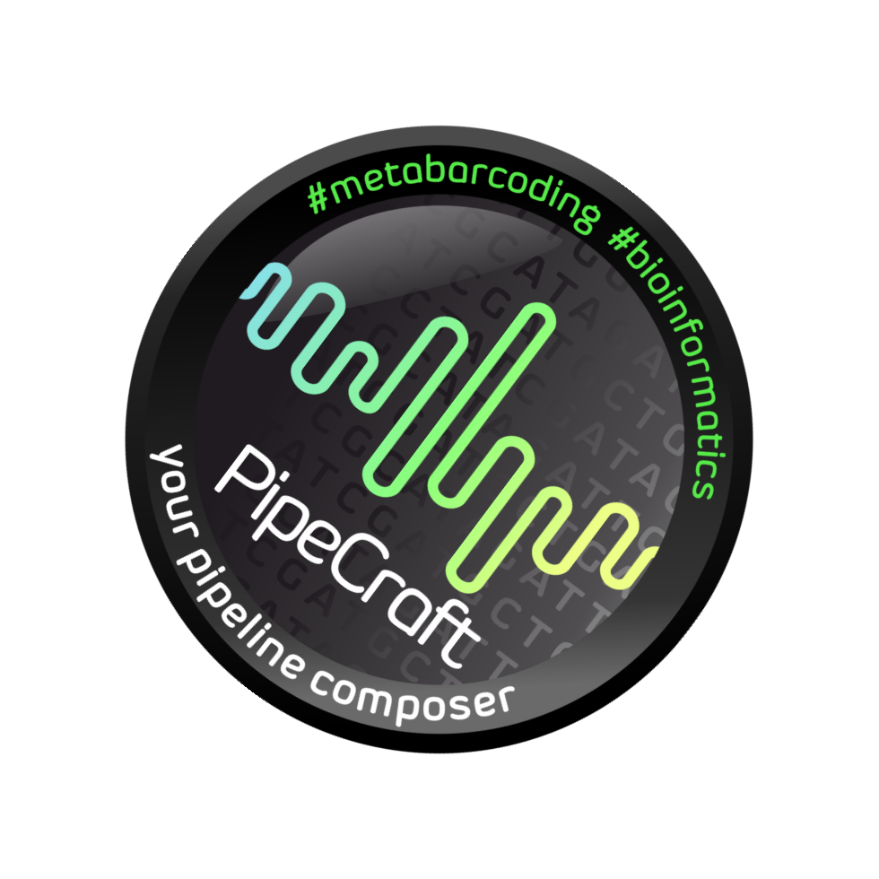

.. |PipeCraft2_logo| image:: _static/PipeCraft2_icon_v2.png
  :width: 50
  :alt: Alternative text
  :target: https://github.com/pipecraft2/user_guide 

.. |main_interface| image:: _static/main_interface.png
  :width: 2000
  :alt: Alternative text

.. raw:: html

    

.. role:: red

.. meta::
    :description lang=en:
        PipeCraft manual. PipeCraft is a Graphical User Interface software for metabarcoding data analyses

============================
PipeCraft2 |PipeCraft2_logo|
============================

**PipeCraft2** is a Graphical User Interface (GUI) software that implements :ref:`various popular tools <tools>` for **metabarcoding** data analyses. 
Implements various :ref:`ready-to-run (pre-defined) pipelines <predefinedpipelines>` as well as an option to run a 
variety of :ref:`individual steps <quicktools>` outside of a full-pipeline.

.. _interface:

*(click on the image for enlargement)*
|main_interface|

| Software settings for pipeline processes contain key options for metabarcoding sequence data analyses, but all options of any implemented program may be accessed via :ref:`PipeCraft console (command line) <expert_mode>`. 
| Default settings in the panels represent commonly used options for amplicon sequence data analyses, which may be tailored according to user experience or needs. 
 Custom-designed pipeline settings can be saved, and thus the exact same pipeline may be easily re-run on other sequencing data (and for reproducibility, may be used as a supplement material in the manuscript). 
 PipeCraft enables executing the :ref:`full pipeline <predefinedpipelines>` (user specifies the input, and output will be e.g. OTU/ASV table with taxonomic annotations of the generated features), 
 but supports also :ref:`single-step mode (Quick Tools panel) <quicktools>` where analyses may be performed in a step-by-step manner *(e.g. perform quality filtering, then examine the output and decide whether to adjust the quality filtering options of 
 to proceed with next step, e.g. with chimera filtering step)*.

Glossary
========

List of terms that you may encounter in this user guide.

=========================== ===================================
**working directory**       | the directory (folder) that contains the files for the analyses.
                            | The outputs will be written into this directory
**paired-end data**         | obtained by sequencing two ends of the same DNA fragment, 
                            | which results in read 1 (R1) and read 2 (R2) files per library or per sample.
                            | Note that PipeCraft expects that :red:`read 1 file contains the string R1` 
                            | and :red:`read 2 contains R2` 
                            | (not e.g. my_sample_L001_1.fastq / my_sample_L001_2.fastq)
**single-end data**         | only one sequencing file per library or per sample. 
                            | Herein, may mean also assembled paired-end data.
**demultiplexed data**      | sequences are sorted into separate files, representing individual samples 
**multiplexed data**        | file(s) that represent a pool of sequences from different samples
**read/sequence**           | DNA sequence; herein, reads and sequences are used interchangeably 
=========================== ===================================

____________________________________________________

Docker images 
==============

.. |pulling_image| image:: _static/pulling_image.png
  :width: 280
  :alt: Alternative text

All the processes are run through `docker <https://www.docker.com/>`_, where the PipeCraft's GUI simply mediates the 
information exchange. Therefore, whenever a process is initiated for the **first time**, 
a relevant Docker image (contains required software for the analyses step) will be pulled from `Docker Hub <https://hub.docker.com/u/pipecraft>`_.
Initial PipeCraft2 installation does not contain any software for sequence data processing. 

Example: when running DEMULTIPLEXING for the first time |pulling_image|

Thus working **Internet connection** is initially required. Once the Docker images are pulled, PipeCraft2 can work without an Internet connection. 

:ref:`Docker images <dockerimages>` vary in size, and the speed of the first process is extended by the docker image download time.

____________________________________________________

.. _tools:

Currently implemented software
------------------------------

:ref:`See software version on the 'Releases' page <releases>`

=======================================================================  =========================================================================================  =============
Software                                                                 Reference                                                                                  Task
=======================================================================  =========================================================================================  =============
`docker <https://www.docker.com/>`_                                      https://www.docker.com                                                                     building, sharing and running applications
`DADA2 <https://benjjneb.github.io/dada2/index.html>`_                   `Callahan et. al 2016 <https://www.nature.com/articles/nmeth.3869>`_                       full pipeline operations
`vsearch <https://github.com/torognes/vsearch>`_                         `Rognes et. al 2016 <https://peerj.com/articles/2584/>`_                                   quality filtering, assemble paired-end reads, chimera filtering, clustering
`NextITS <https://next-its.github.io/>`_                                 `Mikryukov et. al <https://github.com/vmikk/NextITS>`_                                     pipeline for fungal full-ITS (PacBio); not available in Mac version of PipeCraft2
`trimmomatic <http://www.usadellab.org/cms/?page=trimmomatic>`_          `Bolger et al. 2014 <https://doi.org/10.1093/bioinformatics/btu170>`_                      quality filtering
`fastp <https://github.com/OpenGene/fastp>`_                             `Chen et al. 2018 <https://doi.org/10.1093/bioinformatics/bty560>`_                        quality filtering
`seqkit <https://bioinf.shenwei.me/seqkit/>`_                            `Shen et al. 2016 <https://doi.org/10.1371/journal.pone.0163962>`_                         multiple sequence manipulation operations
`cutadapt <https://cutadapt.readthedocs.io/en/stable/>`_                 `Martin 2011 <https://doi.org/10.14806/ej.17.1.200>`_                                      demultiplexing, cut primers
`biopython <https://biopython.org/>`_                                    `Cock et al. 2009 <https://academic.oup.com/bioinformatics/article/25/11/1422/330687>`_    multiple sequence manipulation operations
`GNU Parallel <https://doi.org/10.5281/zenodo.4710607>`_                 `Tangle 2021 <https://doi.org/10.5281/zenodo.4710607>`_                                    executing jobs in parallel
`mothur <https://github.com/mothur/mothur>`_                             `Schloss et al. 2009 <https://doi.org/10.1128/AEM.01541-09>`_                              submodule in ITSx to make unique and deunique seqs
`ITS Extractor <https://microbiology.se/software/itsx/>`_                `Bengtsson-Palme et al. 2013 <https://doi.org/10.1111/2041-210X.12073>`_                   extract ITS regions
`fqgrep <https://github.com/indraniel/fqgrep>`_                          `Indraniel Das 2011 <https://github.com/indraniel/fqgrep>`_                                core for reorient reads
`BLAST <https://blast.ncbi.nlm.nih.gov/Blast.cgi>`_                      `Camacho et al. 2009 <https://doi.org/10.1186/1471-2105-10-421>`_                          assign taxonomy
RDP classifier                                                           `Wang et al. 2007 <https://doi.org/10.1128%2FAEM.00062-07>`_                               assign taxonomy
ORFfinder                                                                `NCBI Tool <https://www.ncbi.nlm.nih.gov/orffinder/>`_                                     finding open reading frames of protein coding genes (filtering pseudogenes/off-targets)
HMMER                                                                    `Web site <http://hmmer.org>`_                                                             HMM based filtering if the sequences (filtering pseudogenes/off-targets)
`FastQC <https://www.bioinformatics.babraham.ac.uk/projects/fastqc/>`_   `Andrews 2019 <https://www.bioinformatics.babraham.ac.uk/projects/fastqc/>`_               QualityCheck module
`MultiQC <https://multiqc.info/>`_                                       `Ewels et al. 2016 <https://doi.org/10.1093/bioinformatics/btw354>`_                       QualityCheck module
`LULU <https://github.com/tobiasgf/lulu>`_                               `Frøslev et al. 2017 <https://www.nature.com/articles/s41467-017-01312-x>`_                post-clustering curation
`DEICODE <https://github.com/biocore/DEICODE>`_                          `Martino et al. 2019 <https://journals.asm.org/doi/10.1128/mSystems.00016-19>`_            dissimilarity analysis
=======================================================================  =========================================================================================  =============

Let us know if you would like to have a specific software implemeted to PipeCraft (:ref:`contacts <contact>`) or create an issue in the `main repository <https://github.com/SuvalineVana/pipecraft/issues>`_.

____________________________________________________

Contents of this user guide
---------------------------

.. toctree::
   :maxdepth: 1

   installation
   quickstart
   pre-defined_pipelines
   quicktools
   postprocessing
   example_analyses
   troubleshoot
   licence
   contact
   citation
   releases
   docker_images
   for_developers

|PipeCraft_sticker1sideways|
