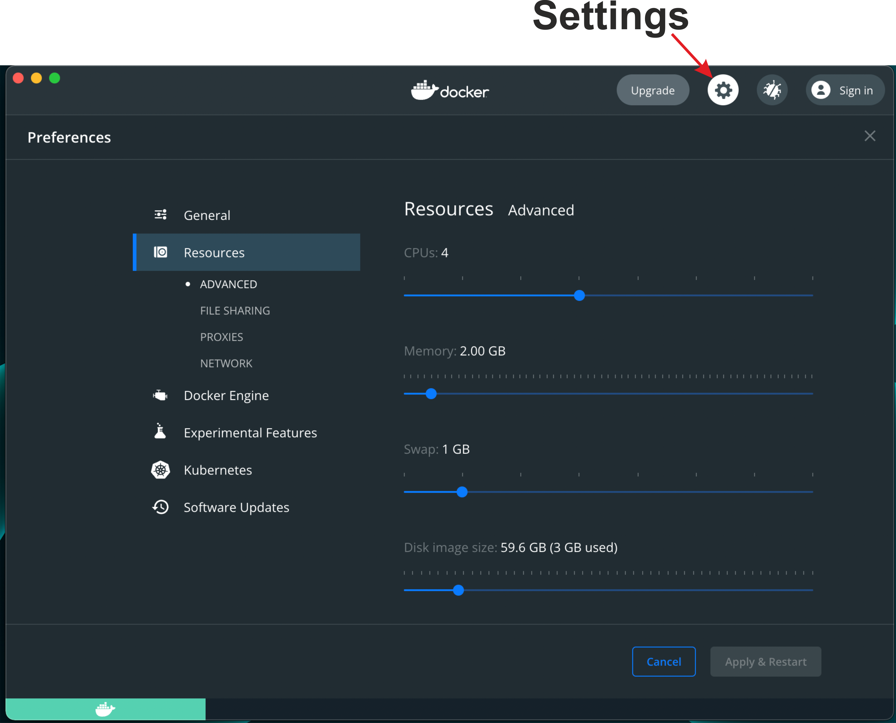
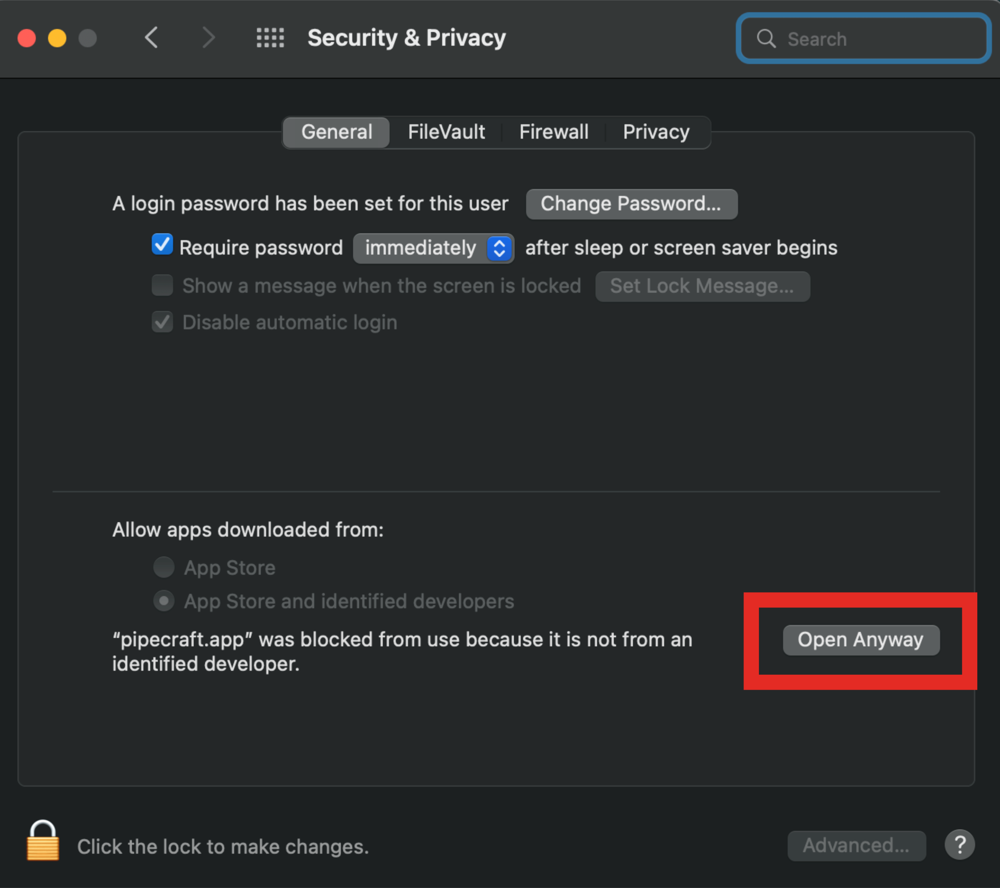
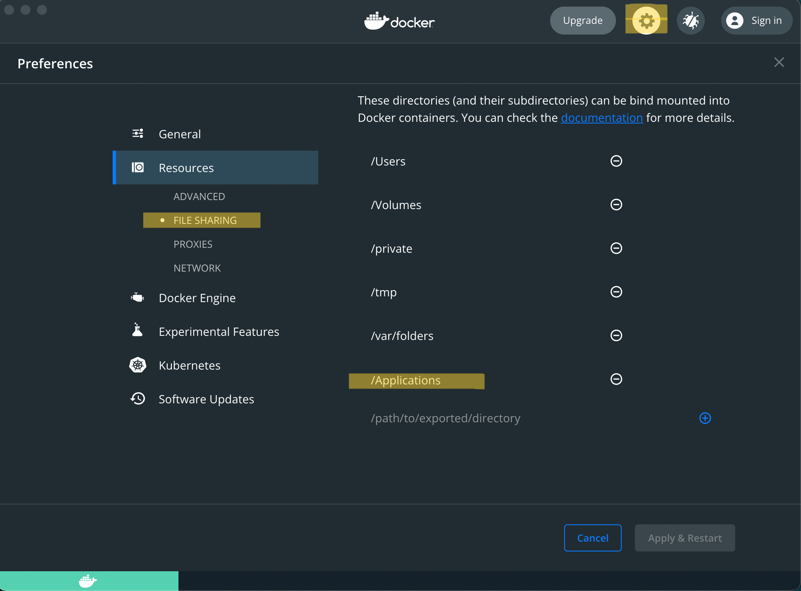
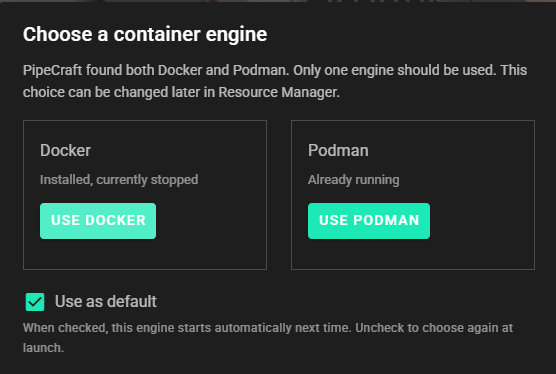
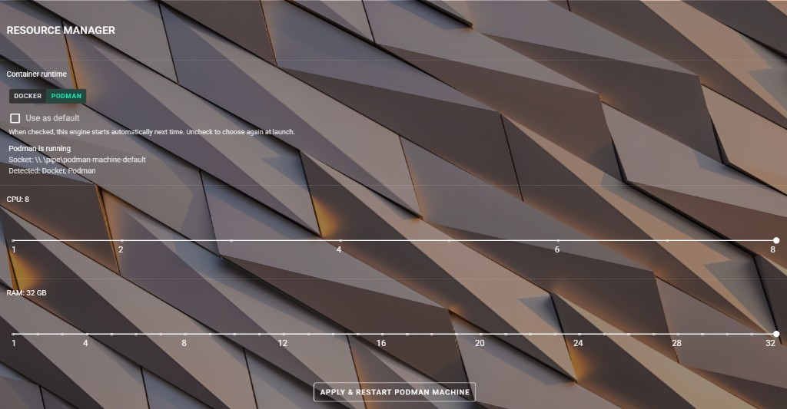
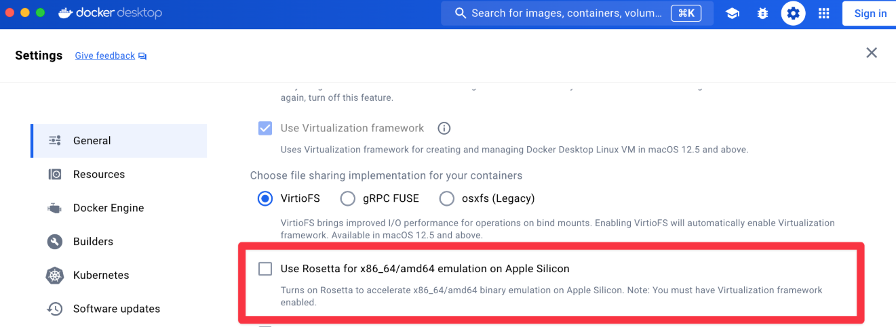
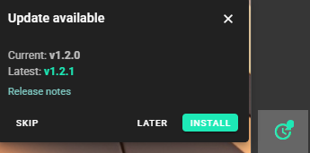
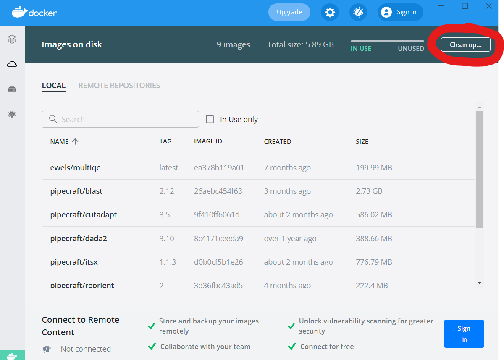

  
.. raw:: html

    

.. role:: red

.. meta::
    :description lang=en:
        PipeCraft manual. How to install PipeCraft

==============================
Installation |PipeCraft2_logo|
==============================

| Installation packages are available for **Windows, Mac and Linux**.
| 
| Current :ref:`versions <releases>` do not work on High Performance Computing (**HPC**) clusters **yet**.
| 
| Herein **'PipeCraft' == 'PipeCraft2'**. Using those interchangeably. 

____________________________________________________

Prerequisites
-------------

1. :red:`ADMIN rights to install software`. Required to install a container engine, and since PipeCraft2 app is not "signed" (for Windows and Linux [ok for MacOS]) then executing this requires also admin rights.

2. A **container engine**: `Docker <https://www.docker.com/>`_ **or** `Podman <https://podman.io/>`_ (from **v1.3.0**). Install at least one. **See OS-specific guidelines below.**

.. admonition:: Why a container engine is needed?

 Modules of PipeCraft2 are distributed as containers, which will liberate the users from the
 struggle to install/compile various software for metabarcoding data analyses.
 **Thus, all backend bioinformatics processes are run in Docker or Podman containers**.
 Images are pulled from `Docker Hub <https://hub.docker.com/u/pipecraft>`_ the first time a process is run
 (Podman can pull the same images).
 See below how to manage and remove container images.

.. _container_engine:

Choosing Docker or Podman
~~~~~~~~~~~~~~~~~~~~~~~~~

From **v1.3.0**, PipeCraft2 supports **Docker and Podman on Windows, macOS, and Linux**.
Only one engine is used at a time.

* If **one** engine is installed, PipeCraft2 uses it and will try to start it if it is stopped.
* If **both** are installed, a chooser appears at launch. Pick Docker or Podman; optionally tick **Use as default** so the same engine starts next time. Uncheck that option in :ref:`Resource Manager <manage_resources>` to be asked again at launch.
* If **neither** is installed, you can still browse the interface, but you cannot start a workflow. Install Docker or Podman, then restart PipeCraft2 or click **Check again**.

The icon in the top-right corner of the PipeCraft window shows the **active** engine (Docker or Podman). Click it to open Resource Manager, where you can switch engines when both are installed.

Install links used by the chooser: `Docker <https://docs.docker.com/get-docker/>`__ and `Podman <https://podman.io/docs/installation>`__. 

In the app, the chooser window is titled **Choose a container engine** (buttons ``USE DOCKER`` / ``USE PODMAN``; each engine is shown as
*Not installed*, *Installed, currently stopped* or *Already running*). When no engine is found, the window is titled
**No container engine found** (buttons ``CONTINUE ANYWAY`` and ``CHECK AGAIN``).

|choose_container_engine|

.. note::

 **Podman on Windows and MacOS** runs inside a Podman machine (virtual machine).
 PipeCraft2 starts an existing Podman machine when needed, but does not create one;
 so create and initialise the machine first via Podman Desktop or ``podman machine init``.
 On **Linux**, PipeCraft2 starts the Podman API socket (``podman.socket`` systemd unit) if needed.

____________________________________________________

| 

__________________________________________________

Windows
-------

PipeCraft2 was tested on **Windows 10** and **Windows 11**. Older Windows versions do not support PipeCraft GUI workflow through Docker or Podman.

1. Download installer for Windows: `PipeCraft2 v1.3.1 <https://github.com/pipecraft2/pipecraft/releases/download/v1.3.1/pipecraft-Setup-1.3.1.exe>`__
2. Install PipeCraft2 via the setup executable.

.. admonition:: False alert

 Your OS might warn that PipeCraft2 is dangerous software! Please ignore the warning until this issue is fixed by the developers. 

.. hide

    .. youtube:: MEJsH8PsSnU

   
3. Install a container engine - ONLY ONCE (no need, when updating PipeCraft):

   * `Docker Desktop for Windows <https://www.docker.com/get-started>`_, **or**
   * `Podman Desktop <https://podman-desktop.io/>`__ (see also `Podman installation <https://podman.io/docs/installation>`__).

   .. important:: 

    **Administrator privileges are required during installation**. Once installed, Docker or Podman on Windows can be run without admin rights.  

.. youtube:: G7DTht6WlFY

.. warning::

  In Windows, please keep you working directory path as short as possible. Maximum path length in Windows is 260 characters. 
  PipeCraft may not be able to work with files, that are buried "deep inside" (i.e. the path is too long).

.. note::

 Resource limits for Docker are managed by Windows; 
 but you can configure limits in a **.wslconfig** file, but this can be automatically done via PipeCraft GUI, see :ref:`Manage resources allocated to the container engine <manage_resources>`.
 Default = 50% of total memory on Windows or 8GB, whichever is less. 80% of total memory on Windows on builds before 20175 (Win10, from 2020).
 For Podman, set CPU and RAM in Resource Manager and press ``APPLY & RESTART PODMAN MACHINE``.
 On Windows, the Podman machine runs in WSL 2, so these limits are also written to the **.wslconfig** file and apply WSL-wide.

| 
|

.. _increase_RAM:

*Quick guide to increase Docker accessible RAM size in Windows:*

This is a legacy guide; please use the PipeCraft GUI to manage Docker resources, see :ref:`Manage resources allocated to the container engine <manage_resources>`.

Instructions from https://learn.microsoft.com/en-us/windows/wsl/wsl-config#wslconfig 

1. This is for Windows Build 19041 and later with WSL 2
2. Open 'File Explorer' and type **%USERPROFILE%** to the address bar to access the %USERPROFILE% directory (generally e.g. "C:\Users\my_user_name").
3. Make new text (txt) document into %USERPROFILE% directory.
4. Paste the following text to that new txt document: 

.. code-block::
   :caption: make .wslconfig file

    # Settings apply across all Linux distros running on WSL 2
    [wsl2]

    # Limits VM memory to use no more than X GB, this can be set as whole numbers using GB or MB
    memory=30GB

    # Sets the VM to use X virtual processors
    processors=8

5. Edit "memory=30GB" and "processors=8" according to your needs
6. Save the file and rename this as .wslconfig
7. Restart Docker.

____________________________________________________

| 

__________________________________________________

MacOS
-----

PipeCraft2 is supported on macOS 10.15+. Older OS versions might not support PipeCraft GUI workflow through Docker or Podman. 

.. note:: 

  If your MacOS has M1/M2 chips, please let us know if you encounter something weird while trying to run some analyses (:ref:`contact <contact>` or post an issue on the `github page <https://github.com/pipecraft2/pipecraft>`_).  

.. hide

    .. youtube:: bcYeCXkN1XQ

1. Download for Mac: `PipeCraft2 v1.3.1 <https://github.com/pipecraft2/pipecraft/releases/download/v1.3.1/pipecraft-1.3.1-universal.dmg>`__

2. Install PipeCraft2 via downloaded **dmg** file by double-clicking on the file and dragging the app to the Applications folder.

3. Check your Mac chip (Apple or Intel) and install a container engine - ONLY ONCE (no need, when updating PipeCraft):

   * `Docker Desktop for Mac <https://www.docker.com/get-started>`_, **or**
   * `Podman Desktop <https://podman-desktop.io/>`__ (see also `Podman installation <https://podman.io/docs/installation>`__). 

.. youtube:: I7SXBxCv6ik 

4. **Docker Desktop only:** Open **Docker dashboard**: Settings -> Resources -> File Sharing; and add the directory where **pipecraft.app** was installed (it is usually /Applications)

 |mac_docker_share|

.. note::

 Manage CPU and RAM in the engine dashboard or :ref:`Resource Manager in PipeCraft GUI <manage_resources>`.
 On Windows and macOS, press ``APPLY & RESTART DOCKER`` or ``APPLY & RESTART PODMAN MACHINE`` after changing limits.
 |resources|

 

.. note::

 On Apple silicon with **Docker Desktop**, tick **Use Rosetta for x86_64/amd64 emulation** in Docker Desktop settings. PipeCraft images are amd64; Podman Desktop uses its own machine/emulation settings.

 |rosetta|

____________________________________________________

| 

__________________________________________________

Linux
-----

PipeCraft2 was tested with **Ubuntu 20.04** and **Mint 20.1**. Older OS versions might not support PipeCraft GUI workflow through Docker or Podman.

.. hide

    .. youtube:: v1smqfAz5nE

1. Download for Linux: `PipeCraft2 v1.3.1 <https://github.com/pipecraft2/pipecraft/releases/download/v1.3.1/pipecraft-1.3.1-linux-x86_64.AppImage>`__
   
2. Right click the .AppImage file, go to Properties, and check "Allow executing file as program", then simply run Pipecraft2 by double-clicking the Appimage.

   .. note::

      Latest Ubuntu versions require a library called libfuse2t64 to run AppImages. Open your terminal and run: ``sudo apt install libfuse2t64``

      If you are having trouble launching the AppImage, try starting it from the terminal for more feedback:

      .. code-block:: bash

         chmod +x pipecraft-1.3.1-linux-x86_64.AppImage && ./pipecraft-1.3.1-linux-x86_64.AppImage

      **Ubuntu 24.04+**: from v1.3.1, the AppImage starts with Chromium's sandbox disabled (``--no-sandbox``),
      so it starts on Ubuntu 24.04 and newer without extra command-line flags or environment variables.

3. Install a container engine - ONLY ONCE (no need, when updating PipeCraft):

   * Docker Engine; `follow the guidelines under appropriate Linux distribution <https://docs.docker.com/engine/install/ubuntu/>`_
   * **or** Podman; `follow the Podman installation docs <https://podman.io/docs/installation>`_ (on Ubuntu/Debian often ``sudo apt install podman``). Rootless Podman is supported.

   .. warning:: 

    | When installing Docker Engine, make sure you have not Docker Desktop already installed!
    | :red:`Installing both might have interfering consequences`

.. youtube:: KCbHgaWGdvc

4. **Docker Engine only:** if you are a non-root user complete these `post-install steps <https://docs.docker.com/engine/install/linux-postinstall/>`_ so you can run Docker without ``sudo``. Podman is typically used rootless and does not need this.

   
.. note::

   When you encounter ERROR during PipeCraft2 installation with an older **deb** package, then uninstall the previous version of PipeCraft2 ``sudo dpkg --remove pipecraft`` (or ``sudo dpkg --remove pipecraft-v1.2.2`` if that package name was used).
   For AppImage builds, just delete the old AppImage file.

5. Run PipeCraft2. From v1.3.1, each start of the AppImage adds (or updates) a **PipeCraft2** entry to the applications menu
   (``~/.local/share/applications/pipecraft.desktop``) and a launcher on the Desktop (``~/Desktop/PipeCraft2.desktop``, if the Desktop folder exists).
   If you move the AppImage to another folder, start it once from the new location to update these shortcuts.

.. note::

 On Linux, Docker or Podman can use host resources. CPU and RAM limits set in Resource Manager are applied to each workflow container; **no engine restart is required**.

____________________________________________________

| 

__________________________________________________

Updating PipeCraft2
-------------------

From version **1.2.0** onwards, PipeCraft2 will automatically check for updates on startup and notify the user. 
To manually check for updates, click on the update icon in the bottom-right corner. 

|auto_update|

When updating PipeCraft2, it is recommended to **remove previous container images** 
associated with previous PipeCraft2 versions. This simply helps to save disk space, since 
each PipeCraft2 version has its own images. 
See :ref:`removing docker images <removedockerimages>` section.

| See :ref:`PipeCraft2 releases here <releases>`.

.. warning::

 | To avaoid any potential software conflicts from PipeCraft2 **v0.1.1 to v0.1.4**, all Docker images of older PipeCraft2 version should be removed. 
 | Starting **from v1.0.0**, if docker container is updated for the new PipeCraft2 version, then it will get a new tag; so, no need to purge all previous docker containers *(but to save disk space, see which containers you have not used for a while and perhaps delete those)*

____________________________________________________

| 

__________________________________________________

.. _uninstalling:

Uninstalling PipeCraft2
-----------------------

| **Windows**: uninstall PipeCraft via control panel
| **MacOS**: Move pipecraft.app to Bin
| **Linux**: Delete the AppImage file (and the shortcuts ``~/.local/share/applications/pipecraft.desktop`` and ``~/Desktop/PipeCraft2.desktop``) or if running an older deb package, remove pipecraft via Software Manager/Software Centre or via terminal:
| ``sudo dpkg --remove pipecraft``

____________________________________________________

| 

__________________________________________________

.. _manage_resources:

Manage resources allocated to the container engine
--------------------------------------------------

|resource_manager|

Resource management in PipeCraft2 allows to control and limit the 
resources (such as number of CPUs, RAM) that workflow containers can use.
You can control these settings through PipeCraft GUI, by **clicking on the Docker or Podman icon** in the top-right corner of the 
PipeCraft window.

**From v1.3.0**, Resource Manager also shows the active container engine. If both Docker and Podman are installed, switch between them there and optionally tick **Use as default**.

The **Container runtime** section of the **RESOURCE MANAGER** shows the engine status (e.g. *Docker is running* or *Podman is not running*;
*(rootless)* is added for rootless engines), the socket path and the detected engines (e.g. *Detected: Docker, Podman*).
The engine switch (``DOCKER`` / ``PODMAN`` buttons) and **Use as default** are shown only when both engines are installed.
The icon in the top-right corner is green when the engine is running; hover over it to see the same status text.

After editing CPU/RAM on **Windows or macOS**, press ``APPLY & RESTART DOCKER`` or ``APPLY & RESTART PODMAN MACHINE`` so that the changes take effect.
The engine (Docker Desktop or the Podman machine) is restarted and **any running containers will be stopped**.
On **Linux**, CPU and RAM limits are applied to each workflow container; no engine restart is required.

The engine must be running (the icon must be green) in order to apply the changes.

**Required amont of allocated resources depends** generally on the input data size and the complexity of the analysis.
If too few RAM is allocated, then the analysis may fail without any informative ERROR message. 
If too few CPU cores are allocated, then the analysis may be very slow.
The more the merrier, but when allocating most of your computer's resources, please keep in mind that 
there will be fewer resources available for other processes on your computer.

____________________________________________________

| 

__________________________________________________

Purging 'old' Docker installations
----------------------------------

.. code-block::
   :caption: To uninstall **docker engine** and all its packages:

    sudo apt-get purge docker-ce docker-ce-cli containerd.io docker-buildx-plugin docker-compose-plugin docker-ce-rootless-extras

.. code-block::
   :caption: To uninstall **docker desktop** and clean configurations:

       rm -r $HOME/.docker/desktop
       sudo rm /usr/local/bin/com.docker.cli
       sudo apt purge docker-desktop

____________________________________________________

| 

__________________________________________________

.. _removedockerimages:

Removing Docker / Podman images
--------------------------------

| On **MacOS** and **Windows**: images and containers can be managed from the Docker Desktop or Podman Desktop dashboard. For Docker Desktop see https://docs.docker.com/desktop/dashboard/
| See **command-line** based way below.

|purge_docker_Win|

| 
| On **Linux** machines: containers and images are managed via CLI commands (https://docs.docker.com/engine/reference/commandline/rmi/):
| ``sudo docker images``       --> to see which docker images exist
| ``sudo docker rmi IMAGE_ID`` --> to delete selected image
|
| For Podman, the same commands work with ``podman`` (often without ``sudo`` when running rootless):
| ``podman images``
| ``podman rmi IMAGE_ID``

or

| ``sudo docker system prune -a`` --> to delete all unused containers, networks, images 
| ``sudo docker images``          --> check if images were removed
| ``podman system prune -a``      --> same for Podman
