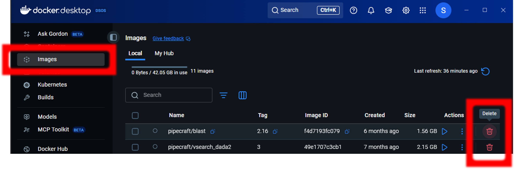

.. |PipeCraft2_logo| image:: _static/PipeCraft2_icon_v2.png
  :width: 100
  :alt: Alternative text

.. |resources| image:: _static/resources1.png
  :width: 600
  :alt: Alternative text

.. |openanyway| image:: _static/openanyway.png
  :width: 400
  :alt: Alternative text

.. |mac_docker_share| image:: _static/Mac_docker_share.png
  :width: 400
  :alt: Alternative text
  
.. raw:: html

    

.. role:: red

.. meta::
    :description lang=en:
        PipeCraft manual. How to install PipeCraft

|PipeCraft2_logo|
  `github <https://github.com/pipecraft2/pipecraft>`_

==============
Installation
==============

| Current :ref:`versions <releases>` do not work on High Performance Computing (**HPC**) clusters **yet**.
| 
| Herein **'PipeCraft' == 'PipeCraft2'**. Using those interchangeably. 

____________________________________________________

.. contents:: Contents
   :depth: 3

____________________________________________________

Prerequisites
-------------
The only prerequisite is `Docker <https://www.docker.com/>`_.

See OS-specific (Windows, Mac, Linux) docker installation guidelines below.

.. note:: 

 Modules of PipeCraft2 are distributed through Docker containers, which will liberate the users from the
 struggle to install/compile various software for metabarcoding data analyses.
 **Thus, all processes are run in Docker containers**.
 Relevant Docker container will be automatically downloaded prior the analysis.

.. warning::

 Your OS might warn that PipeCraft2 is dangerous software! Please ignore the warning in this case. 

____________________________________________________

Windows
-------

PipeCraft2 was tested on **Windows 10** and **Windows 11**. Older Windows versions do not support PipeCraft GUI workflow through Docker.

1. Download PipeCraft2 for `Windows: v1.0.0 <https://github.com/pipecraft2/pipecraft/releases/download/v1.0.0/pipecraft_1.0.0.exe>`_

2. Install PipeCraft2 via the setup executable
   
3. Download `Docker for windows <https://www.docker.com/get-started>`_  - ONLY ONCE (no need, when updating PipeCraft)

..  |
    .. youtube:: G7DTht6WlFY
    |
    .. youtube:: MEJsH8PsSnU
    |

.. warning::

  In Windows, please keep you working directory path as short as possible. Maximum path length in Windows is 260 characters. 
  PipeCraft may not be able to work with files, that are buried "deep inside" (i.e. the path is too long).

.. note::

 Resource limits for Docker are managed by Windows; 
 but you can configure limits in a **.wslconfig** file (see **Settings** -> **Resources** on your Docker desktop app).
 Default = 50% of total memory on Windows or 8GB, whichever is less. 80% of total memory on Windows on builds before 20175 (Win10, from 2020).

.. _increase_RAM:

Quick guide to increase Docker accessible RAM size in Windows 
~~~~~~~~~~~~~~~~~~~~~~~~~~~~~~~~~~~~~~~~~~~~~~~~~~~~~~~~~~~~~~

Instructions from https://learn.microsoft.com/en-us/windows/wsl/wsl-config#wslconfig 

1. This is for Windows Build 19041 and later with WSL 2
2. Open 'File Explorer' and type **%USERPROFILE%** to the address bar to access the %USERPROFILE% directory (generally e.g. "C:\Users\my_user_name").
3. Make new text (txt) document into %USERPROFILE% directory.
4. Paste the following text to that new txt document: 

.. code-block::
   :caption: make .wslconfig file

    # Settings apply across all Linux distros running on WSL 2
    [wsl2]

    # Limits VM memory to use no more than X GB, this can be set as whole numbers using GB or MB
    memory=30GB

    # Sets the VM to use X virtual processors
    processors=8

5. Edit "memory=30GB" and "processors=8" according to your needs
6. Save the file and rename this as .wslconfig
7. Restart Docker.

____________________________________________________

MacOS
-----

PipeCraft2 is supported on macOS 10.15+. Older OS versions might not support PipeCraft GUI workflow through Docker. 

.. note:: 

  If your MacOS has M1/M2 chips, please let us know if you encounter something weird while trying to run some analyses (:ref:`contact <contact>` or post an issue on the `github page <https://github.com/pipecraft2/pipecraft>`_).  

1. Download PipeCraft2 for `Mac: v1.0.0 <https://github.com/pipecraft2/pipecraft/releases/download/v1.0.0/pipecraft_1.0.0.pkg>`_

2. Install PipeCraft2 via **pkg** file

3. Currently macOS will flag pipecraft as an app from an unidentified developer. Grant an exception for a blocked app by clicking the "**Open Anyway**" button in the General panel of **Security & Privacy** preferences. Installing on latest versions of macOS (13.0+) will require you to disable gatekeeper entirely, to do so paste the following command into a terminal.

4. Check your Mac chip (Apple or Intel) and download `Docker for Mac <https://www.docker.com/get-started>`_ - ONLY ONCE (no need, when updating PipeCraft) 

.. code-block::

 sudo spctl --master-disable  

|openanyway|

5. Open **Docker dashboard**: Settings -> Resources -> File Sharing; and add the directory where **pipecraft.app** was installed (it is usually /Appications)

 |mac_docker_share|

.. note::

 Manage Docker resource limits in the Docker dashboard:
 |resources|
 
..  | 
    .. youtube:: I7SXBxCv6ik 
    |
    .. youtube:: bcYeCXkN1XQ
    |
____________________________________________________

Linux
-----

PipeCraft2 was tested with **Ubuntu 20.04** and **Mint 20.1**. Older OS versions might not support PipeCraft GUI workflow through Docker.

1. Download PipeCraft2 for `Linux: v1.0.0 <https://github.com/pipecraft2/pipecraft/releases/download/v1.0.0/pipecraft_1.0.0_amd64.deb>`_
   
2. Right click on the pipecraft_*.deb file and "Open With GDebi Package Installer" (Install Package) or ``sudo dpkg -i path_to_deb_file``

3. Install Docker - ONLY ONCE (no need, when updating PipeCraft); `follow the guidelines under appropriate Linux distribution <https://docs.docker.com/engine/install/ubuntu/>`_

   .. warning:: 

    | When installing Docker Engine, make sure you have not Docker Desktop already installed!
    | :red:`Installing both might have interfering consequences`

4. If you are a non-root user complete these `post-install steps <https://docs.docker.com/engine/install/linux-postinstall/>`_

   
.. note::

   When you encounter ERROR during PipeCraft2 installation, then uninstall the previous version of PipeCraft2 ``sudo dpkg --remove pipecraft-v0.1.3``

5. Run PipeCraft2. If PipeCraft shortcut does not appear on the Desktop, then search the app and generate shortcut manually (installed in */opt/pipecraft* directory)

.. note::

 On Linux, Docker can use all available host resources.

..  |
    .. youtube:: KCbHgaWGdvc
    |
    .. youtube:: v1smqfAz5nE
    |
____________________________________________________

Updating PipeCraft2
-------------------

Auto-updates will be available (hopefully) soon [at least for Windows]! 

 | See :ref:`PipeCraft2 releases here <releases>`.
 | See :ref:`removing docker images <removedockerimages>` section.

.. warning::

 | To avaoid any potential software conflicts from PipeCraft2 **v0.1.1 to v0.1.4**, all Docker images of older PipeCraft2 version should be removed. 
 | Starting **from v1.0.0**, if docker container is updated for the new PipeCraft2 version, then it will get a new tag; so, no need to purge all previous docker containers *(but to save disk space, see which containers you have not used for a while and perhaps delete those)*

____________________________________________________

.. _uninstalling:

Uninstalling PipeCraft2
-----------------------

| **Windows**: uninstall PipeCraft via control panel
| **MacOS**: Move pipecraft.app to Bin
| **Linux**: remove pipecraft via Software Manager/Software Centre or via terminal ``sudo dpkg --remove pipecraft``

____________________________________________________

Purging 'old' Docker installations
----------------------------------

.. code-block::
   :caption: To uninstall **docker engine** and all its packages:

    sudo apt-get purge docker-ce docker-ce-cli containerd.io docker-buildx-plugin docker-compose-plugin docker-ce-rootless-extras

.. code-block::
   :caption: To uninstall **docker desktop** and clean configurations:

       rm -r $HOME/.docker/desktop
       sudo rm /usr/local/bin/com.docker.cli
       sudo apt purge docker-desktop

____________________________________________________

.. _removedockerimages:

Removing Docker images
----------------------

| On **MacOS** and **Windows**: Docker images and container can be easily managed from the Docker dashboard. For more info visit https://docs.docker.com/desktop/dashboard/
| See **command-line** based way below.

|purge_docker_Win|

| 
| On **Linux** machines: containers and images are managed via the Docker cli commands (https://docs.docker.com/engine/reference/commandline/rmi/):
| ``sudo docker images``       --> to see which docker images exist
| ``sudo docker rmi IMAGE_ID`` --> to delete selected image

or

| ``sudo docker system prune -a`` --> to delete all unused containers, networks, images 
| ``sudo docker images``          --> check if images were removed
