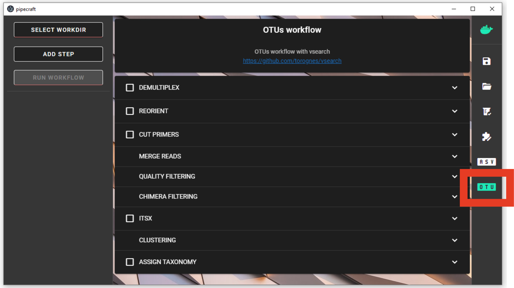

.. |PipeCraft2_logo| image:: _static/PipeCraft2_icon_v2.png
  :width: 100
  :alt: Alternative text

.. raw:: html

    

.. role:: red

.. raw:: html

    

.. role:: green
  

.. meta::
    :description lang=en:
        PipeCraft manual. tutorial

|PipeCraft2_logo|
  `github <https://github.com/SuvalineVana/pipecraft>`_

=====================
Post-processing tools
=====================

.. contents:: Contents
   :depth: 2

____________________________________________________

.. _deicode: 

DEICODE

DEICODE (Martino et al., 2019; DOI 10.1128/mSystems.00016-19) is used to perform beta diversity analysis 
by applying robust Aitchison PCA on the OTU/ASV table. To consider the compositional nature of data, 
it preprocesses data with rCLR transformation (centered log-ratio on only non-zero values, without adding pseudo count). 
As a second step, it performs dimensionality reduction of the data using robust PCA (also applied only to the non-zero values of the data), 
where sparse data are handled through matrix completion.

Additional information:
- `DEICODE tutorial <https://library.qiime2.org/plugins/deicode/19/>` 
- `DEICODE repository <https://github.com/biocore/DEICODE>`
- `DEICODE paper <https://journals.asm.org/doi/10.1128/mSystems.00016-19>`

The output provided:
====================================  ========================================================================
Filename                              Description                                                    
====================================  ========================================================================
DEICODE_out/otutab.biom               Full OTU table in BIOM format
DEICODE_out/rclr_subset.tsv           rCLR-transformed subset of OTU table *
DEICODE_out/full/distance-matrix.tsv  Distance matrix between the samples, based on full OTU table
DEICODE_out/full/ordination.txt       Ordination scores for samples and OTUs, based on full OTU table
DEICODE_out/full/rclr.tsv             rCLR-transformed OTU table
DEICODE_out/subs/distance-matrix.tsv  Distance matrix between the samples, based on a subset of OTU table *
DEICODE_out/subs/ordination.txt       Ordination scores for samples and OTUs, based on a subset of OTU table *
====================================  ========================================================================
*, files are present only if 'subset_IDs' variable was specified

PERMANOVA and PERMDISP example using the robust Aitchison distance
  .. code-block:: r
      library(vegan)

      ## Load distance matrix
      dd <- read.table(file = "distance-matrix.tsv")

      ## You will also need to load the sample metadata
      ## However, for this example we will create a dummy data
      meta <- data.frame(
        SampleID = rownames(dd),
        TestData = rep(c("A", "B", "C"), each = ceiling(nrow(dd)/3))[1:nrow(dd)])

      ## NB! Ensure that samples in distance matrix and metadata are in the same order
      meta <- meta[ match(x = meta$SampleID, table = rownames(dd)), ]

      ## Convert distance matrix into 'dist' class
      dd <- as.dist(dd)

      ## Run PERMANOVA
      adon <- adonis2(formula = dd ~ TestData, data = meta, permutations = 1000)
      adon

      ## Run PERMDISP
      permdisp <- betadisper(dd, meta$TestData)
      plot(permdisp)
