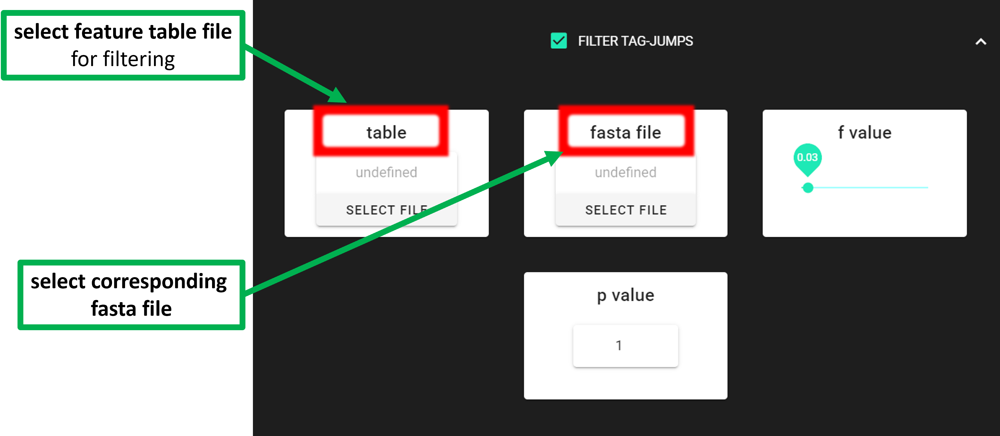
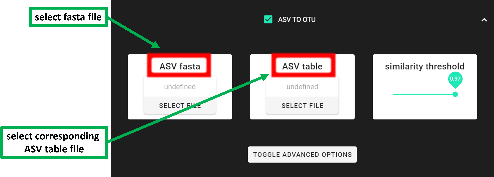
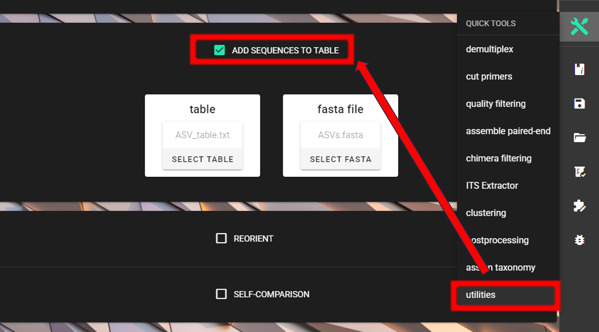
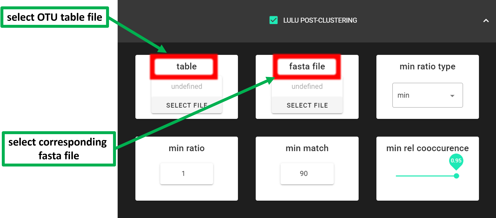
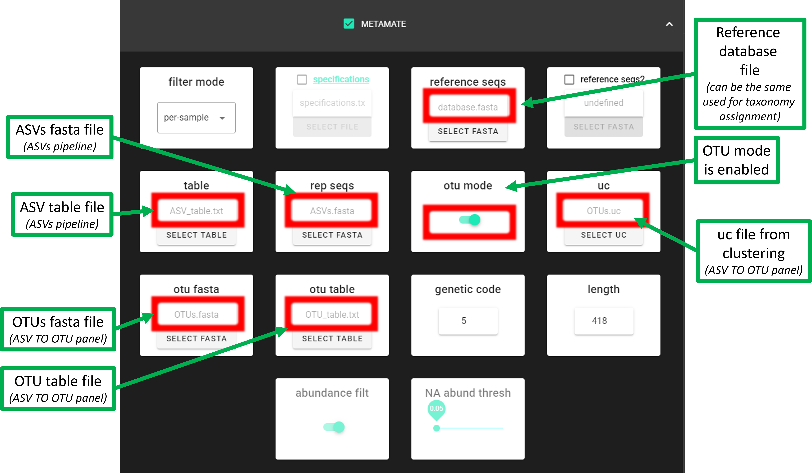
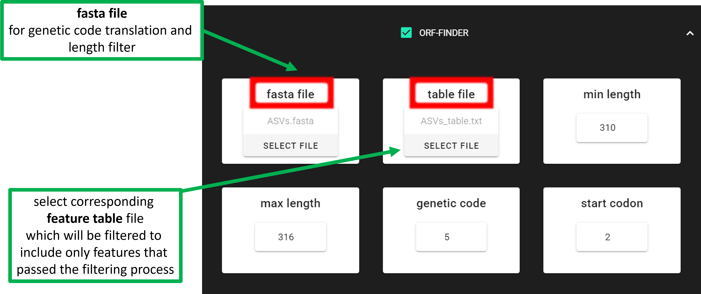

.. |PipeCraft2_logo| image:: _static/PipeCraft2_icon_v2.png
  :width: 50
  :target: https://github.com/pipecraft2/user_guide

.. |output_icon| image:: _static/output_icon.png
  :width: 50

.. raw:: html

    

.. role:: red

.. raw:: html

    

.. role:: green
  

.. meta::
    :description lang=en:
        PipeCraft manual. tutorial

.. _postprocessingtools:

=======================================
Post-processing tools |PipeCraft2_logo|
=======================================

All post-processing tools accessible under **QuickTools** -> **Postprocessing**

.. |postprocessing_button| image:: _static/postprocessing_button.png
  :width: 600

|postprocessing_button|

____________________________________________________

Filter tag-jumps
----------------

Filter out putative tag-jumps with `UNCROSS2 <https://doi.org/10.1101/400762>`_. 
This is done via ``QuickTools -> Postprocessing -> FILTER TAG-JUMPS``, 
but is also automatically performed as a part of the pre-compiled pipelines via ``CURATE ASV/OTU TABLE`` panel 
by specifying ``f-value`` and ``p-value`` parameters (:ref:`see here <curate_asv_table>`).

Tag-jumps (also called index/tag switching or sample cross-talk) are library-preparation/sequencing 
artifacts where a small fraction of reads are assigned the wrong sample index. 
This creates low-level "ghost" occurrences of real sequences in samples where they are not truly present.
If not removed, tag-jumps can inflate apparent diversity, 
introduce false positives (especially in low-biomass samples), 
which may bias downstream analyses. 
**Tag-jumps filtering aims to remove these low-frequency cross-sample contaminants.**

|tagjump_filtering_example|

Input data is tab delimited **OTU/ASV table** and corresponding **fasta file** (representative sequences of ASV/OTUs).
Note that the input FASTA file is not changed: tag-jumps filtering does not delete ASVs/OTUs globally. Instead, it adjusts the **feature table**
by removing (setting to zero) low-abundance occurrences of a feature in specific samples where they are likely due to tag-jumps.
Here, FASTA file is only used to add sequences (back) to the feature table after filtering. 
This is needed for example when subjecting the resulting feature table to further clustering (see :ref:`ASV TO OTU <asv2otu>`).

.. admonition:: The **input table format**; can contain "Sequence" column (but this is ignored):

  +-------+--------------+----------+----------+----------+-----+
  | ASV   | Sequence     | Sample_1 | Sample_2 | Sample_3 | ... |
  +=======+==============+==========+==========+==========+=====+
  | ASV_1 | ATGCTGATC... | 0        | 200      | 320      | ... |
  +-------+--------------+----------+----------+----------+-----+
  | ASV_2 | ATGCTGATC... | 99       | 200      | 222      | ... |
  +-------+--------------+----------+----------+----------+-----+
  | ASV_3 | ATGCTGATC... | 10       | 34       | 3        | ... |
  +-------+--------------+----------+----------+----------+-----+

.. admonition:: To **START**

  To **START**, specify working directory under ``SELECT WORKDIR``, 
  but the following requests about ``Sequence files extension`` and ``Sequencing read types`` **do not matter here**, just click 'Confirm'.

Settings
~~~~~~~~

+-----------------+------------------------------------------------------------------------------------------+
| Setting         | Tooltip                                                                                  |
+=================+==========================================================================================+
|| ``table``      || select tab-delimited OTU/ASV table, where the 1st column is the OTU/ASV IDs and the     |
||                || following columns represent samples; 2nd column may be Sequence column, with the        |
||                || colName 'Sequence' [**file must be in the SELECT WORKDIR directory**]                   |
+-----------------+------------------------------------------------------------------------------------------+
|| ``fasta file`` || select corresponding fasta file for OTU/ASV table [**fasta file must be in the SELECT** |
||                || **WORKDIR directory**]                                                                  |
+-----------------+------------------------------------------------------------------------------------------+
|| ``f value``    || f-parameter of UNCROSS2, which defines the expected tag-jumps rate. Default is 0.03     |
||                || (equivalent to 3%). A higher value enforces stricter filtering                          |
+-----------------+------------------------------------------------------------------------------------------+
|| ``p value``    || p-parameter, which controls the severity of tag-jump removal. It adjusts the exponent   |
||                || in the UNCROSS formula. Default is 1. Opt for 0.5 or 0.3 to steepen the curve           |
+-----------------+------------------------------------------------------------------------------------------+

Outputs
~~~~~~~

Outputs are in the **selected working directory**: 

+-----------------------+-------------------------------------------------------------------------------+
| Outputs               |                                                                               |
+=======================+===============================================================================+
| ``*_TagJumpFilt.txt`` | output table where tag-jumps have been filtered out                           |
+-----------------------+-------------------------------------------------------------------------------+
| TagJump_plot.pdf      | illustration about the presence of tag-jumps based on the selected parameters |
+-----------------------+-------------------------------------------------------------------------------+
|| TagJump_stats.txt    || tag-jump statistics (Total_reads, Number_of_TagJump_Events,                  |
||                      || TagJump_reads, ReadPercent_removed)                                          |
+-----------------------+-------------------------------------------------------------------------------+

.. _asv2otu:

___________________________________________________

ASV to OTU
----------

Cluster ASVs (or zOTUs) to OTUs.

If the aim is to work on OTU-level, but also benefit from the denoising workflows as implemented in DADA2 or UNOISE pipelines (that produce ASVs), 
then resulting ASVs can be clustered to OTUs (using vsearch). This is done via ``QuickTools -> Postprocessing -> ASV TO OTU``.

|asv2otu_example|

**Input data** is tab delimited **ASV table** and **ASV sequences** in fasta format. 
2nd column of **ASV table** MUST BE 'Sequences' (1st column is ASV IDs; default pipecraft output table). 
For clustering, the ASV size annotation is obtained from the ASV table. 

.. admonition:: The **input table format**; **MUST** contain "Sequence" column:

  +-------+--------------+----------+----------+----------+-----+
  | ASV   | Sequence     | Sample_1 | Sample_2 | Sample_3 | ... |
  +=======+==============+==========+==========+==========+=====+
  | ASV_1 | ATGCTGATC... | 0        | 200      | 320      | ... |
  +-------+--------------+----------+----------+----------+-----+
  | ASV_2 | ATGCTGATC... | 99       | 200      | 222      | ... |
  +-------+--------------+----------+----------+----------+-----+
  | ASV_3 | ATGCTGATC... | 10       | 34       | 3        | ... |
  +-------+--------------+----------+----------+----------+-----+

.. admonition:: To **START**

  To **START**, specify working directory under ``SELECT WORKDIR``, 
  but the following requests about ``Sequence files extension`` and ``Sequencing read types`` **do not matter here**, just click 'Confirm'.

If the ASV table does not contain 'Sequence' column, then add those with ``QuickTools -> Utilities -> Add sequences to table``.

|add_seqs_to_table|

Settings
~~~~~~~~

+---------------------------+----------------------------------------------------------------------------------------+
| Setting                   | Tooltip                                                                                |
+===========================+========================================================================================+
|| ``ASV fasta``            || select fasta formatted ASVs sequence file (ASV IDs must match with the ones in        |
||                          || the ASVs table) [fasta file must be in the SELECT WORKDIR directory]                  |
+---------------------------+----------------------------------------------------------------------------------------+
|| ``ASV table``            || select ASVs_table file [1st col is ASVs ID, 2nd col MUST BE 'Sequences'               |
||                          || (default PipeCraft's output)] [file must be in the SELECT WORKDIR directory]          |
+---------------------------+----------------------------------------------------------------------------------------+
|| ``similarity threshold`` || define OTUs based on the sequence similarity threshold;                               |
||                          || 0.97 = 97% similarity threshold                                                       |
+---------------------------+----------------------------------------------------------------------------------------+
|| ``OTU type``             || "centroid" = output centroid sequences;                                               |
||                          || "consout" = output consensus sequences                                                |
+---------------------------+----------------------------------------------------------------------------------------+
|| ``strands``              || when comparing sequences with the cluster seed, check both strands                    |
||                          || (forward and reverse complementary) or the plus strand only                           |
+---------------------------+----------------------------------------------------------------------------------------+
|| ``remove singletons``    || remove singleton OTUs (e.g., if TRUE, then OTUs with only                             |
||                          || one sequence will be discarded)                                                       |
+---------------------------+----------------------------------------------------------------------------------------+
| ``similarity type``       | pairwise sequence identity definition (--iddef of vsearch)                             |
+---------------------------+----------------------------------------------------------------------------------------+
|| ``sequence sorting``     || size = sort the sequences by decreasing abundance; "length" = sort the sequences by   |
||                          || decreasing length (--cluster_fast); "no" = do not sort sequences                      |
||                          || (--cluster_smallmem --usersort)                                                       |
+---------------------------+----------------------------------------------------------------------------------------+
|| ``centroid type``        || "similarity" = assign representative sequence to the closest (most similar)           |
||                          || centroid (distance-based greedy clustering);                                          |
||                          || "abundance" = assign representative sequence to the most abundant                     |
||                          || centroid (abundance-based greedy clustering; --sizeorder), --maxaccepts should be > 1 |
+---------------------------+----------------------------------------------------------------------------------------+
|| ``maxaccepts``           || maximum number of hits to accept before stopping the search                           |
||                          || (should be > 1 for abundance-based selection of centroids [centroid type])            |
+---------------------------+----------------------------------------------------------------------------------------+
| ``mask``                  | mask regions in sequences using the "dust" method, or do not mask ("none").            |
+---------------------------+----------------------------------------------------------------------------------------+

Outputs
~~~~~~~

Outputs are in ``ASVs2OTUs_out`` directory:

+---------------------------+--------------------------------------------------------+
| Outputs ``ASVs2OTUs_out`` |                                                        |
+===========================+========================================================+
| OTUs.fasta                | FASTA formated representative OTU sequences            |
+---------------------------+--------------------------------------------------------+
| OTU_table.txt             | OTU distribution table per sample (tab delimited file) |
+---------------------------+--------------------------------------------------------+
| OTUs.uc                   | uclust-like formatted clustering results for OTUs      |
+---------------------------+--------------------------------------------------------+
| ASVs.size.fasta           | size annotated input sequences                         |
+---------------------------+--------------------------------------------------------+

.. _postclustering_lulu:

___________________________________________________

LULU post-clustering
---------------------

Perform OTU post-clustering with `LULU <https://github.com/tobiasgf/lulu>`_ to merge co-occurring 'daughter' OTUs; 
``QuickTools -> Postprocessing -> LULU``.

LULU description from the `LULU repository <https://github.com/tobiasgf/lulu>`_: the purpose of LULU is to reduce the number of 
erroneous OTUs in OTU tables to achieve more realistic biodiversity metrics. 
By evaluating the co-occurence patterns of OTUs among samples LULU identifies OTUs that consistently satisfy some user selected 
criteria for being errors of more abundant OTUs and merges these. It has been shown that curation with LULU consistently result 
in more realistic diversity metrics. 

|lulu_example|

Input data is tab delimited **OTU table** (``table``) and **OTU sequences** (``rep_seqs``) in fasta format.

.. admonition:: The **input table format**; can contain "Sequence" column (but this is ignored):

  +-------+--------------+----------+----------+----------+-----+
  | OTU   | Sequence     | Sample_1 | Sample_2 | Sample_3 | ... |
  +=======+==============+==========+==========+==========+=====+
  | OTU_1 | ATGCTGATC... | 0        | 200      | 320      | ... |
  +-------+--------------+----------+----------+----------+-----+
  | OTU_2 | ATGCTGATC... | 99       | 200      | 222      | ... |
  +-------+--------------+----------+----------+----------+-----+
  | OTU_3 | ATGCTGATC... | 10       | 34       | 3        | ... |
  +-------+--------------+----------+----------+----------+-----+

.. admonition:: To **START**

  To **START**, specify working directory under ``SELECT WORKDIR``, 
  but the following requests about ``Sequence files extension`` and ``Sequencing read types`` **do not matter here**, just click 'Confirm'.

Settings
~~~~~~~~

=============================================== =========================
`Setting <https://github.com/tobiasgf/lulu>`_   Tooltip
=============================================== =========================
``table``                                       | select OTU/ASV table. If no file is selected, then PipeCraft will 
                                                | look OTU_table.txt or ASV_table.txt in the working directory.
                                                | `EXAMPLE table here <https://github.com/tobiasgf/lulu/blob/master/Example_data/otutable_test.txt>`_
``fasta_file``                                  | select fasta formatted sequence file containing your OTU/ASV reads.
                                                | `EXAMPLE file here <https://github.com/tobiasgf/lulu/blob/master/Example_data/centroids_test.txt>`_
``min_ratio_type``                              | sets whether a potential error must have lower abundance than the parent 
                                                | in all samples 'min' (default), or if an error just needs to have lower 
                                                | abundance on average 'avg'
``min_ratio``                                   | set the minimim abundance ratio between a potential error and a 
                                                | potential parent to be identified as an error
``min_match``                                   | specify minimum threshold of sequence similarity for considering 
                                                | any OTU as an error of another
``min_rel_cooccurence``                         | minimum co-occurrence rate. Default = 0.95 (meaning that 1 in 20 samples 
                                                | are allowed to have no parent presence)
``match_list_soft``                             | use either 'blastn' or 'vsearch' to generate match list for LULU. 
                                                | Default is 'vsearch' (much faster)
``vsearch_similarity_type``                     | applies only when 'vsearch' is used as 'match_list_soft'. 
                                                | Pairwise sequence identity definition (--iddef)
``perc_identity``                               | percent identity cutoff for match list. Excluding pairwise comparisons 
                                                | with lower sequence identity percentage than specified threshold
``coverage_perc``                               | percent query coverage per hit. Excluding pairwise comparisons with 
                                                | lower sequence coverage than specified threshold
``strands``                                     | query strand to search against database. Both = search also reverse complement
=============================================== ========================= 

Outputs
~~~~~~~

Outputs are in ``lulu_out`` directory:

+-----------------------+----------------------------------------------------------------------------+
| Outputs ``lulu_out``  |                                                                            |
+=======================+============================================================================+
| OTU_table.lulu.txt    | curated table in tab delimited txt format                                  |
+-----------------------+----------------------------------------------------------------------------+
| OTUs.lulu.fasta       | fasta file for the molecular units (OTUs or ASVs) in the curated table     |
+-----------------------+----------------------------------------------------------------------------+
| match_list.lulu       | match list file that was used by LULU to merge 'daughter' molecular units  |
+-----------------------+----------------------------------------------------------------------------+
|| discarded_units.lulu || molecular units (OTUs or ASVs) that were merged with other units based on |
||                      || specified thresholds                                                      |
+-----------------------+----------------------------------------------------------------------------+

.. _postclustering_dada2_table_filtering:

____________________________________________________

DADA2 collapse ASVs
-------------------

DADA2 `collapseNoMismatch <https://www.bioconductor.org/packages/devel/bioc/manuals/dada2/man/dada2.pdf>`_ function 
collapses identical ASVs with no internal mismatches (~greedy 100% clustering with end-gapping ignored).
Representative sequence of a collapsed ASV will be the most abundant one.

Input data is **DADA2 compatible RSD table file** resulting from DADA2 workflow (in dir ``ASVs_out.dada2``). 

**This process can be automatically performed** also by setting the ``collapseNoMismatch`` = TRUE while running the **DADA2 pre-compiled pipeline**
(:ref:`see here <curate_asv_table>`).

.. admonition:: To **START**

  To **START**, specify working directory under ``SELECT WORKDIR``, 
  but the following requests about ``Sequence files extension`` and ``Sequencing read types`` **do not matter here**, just click 'Confirm'.

Settings
~~~~~~~~

========================== ============
Setting                    Tooltip
========================== ============
``DADA2 table``            | select the RDS file (ASV table), output from DADA2 workflow; 
                           | usually in ASVs_out.dada2/ASVs_table.denoised-merged.rds
``collapseNoMismatch``     | collapses ASVs that are identical up to shifts or 
                           | length variation, i.e. that have no mismatches or internal indels
``by_length``              | discard ASVs from the ASV table that are shorter than specified 
                           | value (in base pairs). Value 0 means OFF, no filtering by length
``minOverlap``             | collapseNoMismatch setting. Default = 20. The minimum overlap of 
                           | base pairs between ASV sequences required to collapse them together
``vec``                    | collapseNoMismatch setting. Default = TRUE. Use the vectorized 
                           | aligner. Should be turned off if sequences exceed 2kb in length
========================== ============

Outputs
~~~~~~~

Outputs are in ``filtered_table`` directory:

+---------------------------------+-------------------------------------------------------------------------------------+
| Outputs ``filtered_table``      |                                                                                     |
+=================================+=====================================================================================+
| ASVs_table_collapsed.txt        | ASV table after collapsing identical ASVs                                           |
+---------------------------------+-------------------------------------------------------------------------------------+
| ASVs_collapsed.fasta            | ASV sequences after collapsing identical ASVs                                       |
+---------------------------------+-------------------------------------------------------------------------------------+
| ASV_table_collapsed.rds         | ASV table in RDS format after collapsing identical ASVs                             |
+---------------------------------+-------------------------------------------------------------------------------------+
| If length filtering was applied |                                                                                     |
+---------------------------------+-------------------------------------------------------------------------------------+
| ASV_table_lenFilt.tx            | ASV table after filtering out ASVs with shorther than specified sequence length     |
+---------------------------------+-------------------------------------------------------------------------------------+
| ASVs_lenFilt.fasta              | ASV sequences after filtering out ASVs with shorther than specified sequence length |
+---------------------------------+-------------------------------------------------------------------------------------+

__________________________________________________

metaMATE
--------

Determine and filter out putative NUMTs (from **mitochondrial coding** amplicon genes, such as COI, rbcL) 
and and other erroneous sequences based on relative read abundance thresholds within libraries, 
phylogenetic clades and/or taxonomic groupings 
(`metaMATE repository <https://github.com/tjcreedy/metamate>`_, `metaMATE paper <https://doi.org/10.1111/1755-0998.13337>`_).

Native metaMATE has three execution modes:
 - `find <https://github.com/tjcreedy/metamate#find-mode>`_ (to assess the impact of filtering strategy and select the "best" strategy)
 - `dump <https://github.com/tjcreedy/metamate#dump-mode>`_ (to filter the data according to the selected strategy. Applies **global filtering thresholds**)
 - `filter-adaptive <https://github.com/tjcreedy/metamate#filter-adaptive-mode>`_ (as above two modes, but this mode applies **per-sample filtering thresholds**)

To streamline the workflow and improve usability, PipeCraft2 automatically runs ``find`` and ``dump`` modes to perform data filtering.
Since this process applies global filtering threshold, then it is called **global filter** mode in PipeCraft2. 
Since ``filter-adaptive`` mode applies per-sample filtering thresholds, then it is called **per-sample filter** mode in PipeCraft2.

+----------------------------------+----------------------------------------------------------------+ 
| ``filter mode``                  | Description                                                    |
+==================================+================================================================+
| global filter                    || applies global filtering thresholds to the data.              |
|                                  || Performs ``find`` and then ``dump`` based on the              |
|                                  || user specified threshold (NA_abund_thresh; default is 0.05).  |
+----------------------------------+----------------------------------------------------------------+  
| per-sample filter                || applies per-sample filtering thresholds to the data           |
|                                  || Executes ``filter-adaptive`` mode of metaMATE.                |
+----------------------------------+----------------------------------------------------------------+

.. admonition:: The **input table format**; can contain "Sequence" column (but this is ignored):

  +-------+--------------+----------+----------+----------+-----+
  | ASV   | Sequence     | Sample_1 | Sample_2 | Sample_3 | ... |
  +=======+==============+==========+==========+==========+=====+
  | ASV_1 | ATGCTGATC... | 0        | 200      | 320      | ... |
  +-------+--------------+----------+----------+----------+-----+
  | ASV_2 | ATGCTGATC... | 99       | 200      | 222      | ... |
  +-------+--------------+----------+----------+----------+-----+
  | ASV_3 | ATGCTGATC... | 10       | 34       | 3        | ... |
  +-------+--------------+----------+----------+----------+-----+

.. admonition:: To **START**

  To **START**, specify working directory under ``SELECT WORKDIR``, 
  but the following requests about ``Sequence files extension`` and ``Sequencing read types`` **do not matter here**, just click 'Confirm'.

Settings
~~~~~~~~

**In most cases, the default settings are fine!**
Most crucial user defined settings are ``genetic code`` and ``length`` settings.
Verified non-authentic sequences are the ones that do not pass the genetic code translation 
and have a length outside the specified range (length + basevariation). Therefore,
check and specify the length of the expected amplicon sequence and genetic code (based on the target organism; 
5 = invertebrate mitochondrial code. Use 1 for rbcL. `Specify values from 1 to 33 <https://www.ncbi.nlm.nih.gov/Taxonomy/Utils/wprintgc.cgi>`_.

+---------------------------------+----------------------------------------------------------------+ 
| Setting                         | Tooltip                                                        |
+=================================+================================================================+
| global filter                   || applies global filtering thresholds to the data.              |
|                                 || Performs ``find`` and then ``dump`` based on the              |
|                                 || user specified threshold (NA_abund_thresh; default is 0.05).  |
+---------------------------------+----------------------------------------------------------------+  
| per-sample filter               || applies per-sample filtering thresholds to the data           |
|                                 || Executes ``filter-adaptive`` mode of metaMATE.                |
+---------------------------------+----------------------------------------------------------------+  

**global filter**: ``NA_abund_thresh`` corresponds to ``nonauthentic_retained_estimate_p`` column in the results.csv file (latter is metaMATE-find result).
When ``NA_abund_thresh`` = 0.05 (*default value*), then for metaMATE-dump, select the result_index that corresponds to 
setting with the highest accuracy score (column 'accuracy_score' in the results.csv) among settings 
where the ratio of non-validated ASVs/OTUs is <5% (column 'nonauthentic_retained_estimate_p' in the results.csv). 

OTU mode
~~~~~~~~~

metaMATE is a filtering framework that was developed primarily for ASV (haplotype) datasets. 
It is choosing filtering thresholds by combining threshold specification system  
and by using validation: ASVs are assessed for membership of two control groups 
(verified authentic vs verified non-authentic), 
and the effects of different threshold/binning strategies on 
retention/rejection of these controls are used to identify an optimal filtering strategy.

When working with OTUs, the situation is different because one OTU can comprise multiple ASVs, 
and those constituent ASVs may include a mixture of refpass, unclassified, and even non-authentic variants. 
Therefore, in OTU mode, the metaMATE approach is applied at the OTU level: ASV-level authenticity calls 
are first aggregated to OTUs, and filtering is then performed using the OTU abundance table, 
so decisions are made per OTU rather than treating each ASV within an OTU as an independent unit.
An OTU is considered authentic if it contains any authentic ASVs, 
and non-authentic if it contains only non-authentic ASVs. 
Finally, the filtering is performed on the OTUs using the provided OTU table.

.. admonition:: files needed for the **OTU mode**

  In addition to the OTU table and OTUs.fasta files, 
  ASVs.fasta and ASV table are also needed for the OTU mode.
  Therefore, **OTU mode** can be used when you have performed ASVs pipeline (DADA2 or UNOISE) and then 
  clustered ASVs to OTUs (Postprocessing -> 'ASV TO OTU').

  If you do not have the ASVs.fasta and ASV table files 
  (that is, you have performed OTUs pipeline), then run metaMATE with ``otu mode`` disabled. 
  However, note that metaMETA will then work only with the representative sequences of OTUs.
  

|metamate_otumode|

If planning to use :ref:`LULU POST-CLUSTERING <postclustering_lulu>`, then perform this after applying metaMATE 
*(because after LULU, the uc file from clustering is not anymore compatible with OTU table, and thus metaMATE cannot work with post-clustered OTUs).*

.. admonition:: memory (RAM) usage

  if a reference database (``reference seqs``) is very large, then the process may require a lot of RAM.
  If you receive an error message "*.ERROR: BBMap alignment produced no matches and a memory error was detected*", 
  then you may need to increase the :ref:`memory (RAM) allocated to Docker <manage_resources>` and or close other applications that are using a lot of RAM.

Outputs
~~~~~~~

Outputs are in ``metamate_out`` directory:

+------------------------------------+----------------------------------------------------------------------------------------------------------------------------------------+
| Output directory                   |                                                                                                                                        |
+====================================+========================================================================================================================================+
| **when global filter is used**     |                                                                                                                                        |
+------------------------------------+----------------------------------------------------------------------------------------------------------------------------------------+
| \*.metaMATE.txt                    | filtered feature (ASV/OTU) table                                                                                                       |
+------------------------------------+----------------------------------------------------------------------------------------------------------------------------------------+
| \*metaMATE.fasta                   | retained features (ASVs/OTUs)                                                                                                          |
+------------------------------------+----------------------------------------------------------------------------------------------------------------------------------------+
| \*metaMATE.list                    | list of IDs of retained features                                                                                                       |
+------------------------------------+----------------------------------------------------------------------------------------------------------------------------------------+
| sequence_counts.txt                | a text file containing the number of sequences per sample                                                                              |
+------------------------------------+----------------------------------------------------------------------------------------------------------------------------------------+
|| otu_summary.csv                   || summary of ASV_Status and OTU_Status.                                                                                                 |
|| [if ``otu mode`` = TRUE ]         || **Authentic** = feature that perfectly matched the reference sequence                                                                 |
||                                   || **Non-Authentic** = feature that did not pass the genetic                                                                             |
||                                   || code translation or length filter                                                                                                     |
||                                   || **Unclassified** = feature that was not classified                                                                                    |
||                                   || as Authentic or Non-Authentic                                                                                                         |
+------------------------------------+----------------------------------------------------------------------------------------------------------------------------------------+
|| ``metaMATE-find``/                || list of features with refpass, lenghtfails and stopfails.                                                                             |
|| passes_and_fails.txt              || **refpass** = feature that perfectly matched the reference sequence                                                                   |
||                                   || **lenghtfails** = feature did not pass the length filter                                                                              |
||                                   || **stopfails** = feature did not pass the stop codon filter                                                                            |
+------------------------------------+----------------------------------------------------------------------------------------------------------------------------------------+
|| ``metaMATE-find``/results.csv     || metaMATE find results file. See `metaMATE documentation <https://github.com/tjcreedy/metamate?tab=readme-ov-file#results-find-only>`_ |
||                                   || for more info about the results file                                                                                                  |
+------------------------------------+----------------------------------------------------------------------------------------------------------------------------------------+
|| ``metaMATE-find``/                || contains the selected resultindex for results.csv file                                                                                |
|| selected_result_index.txt         || for metaMATE-dump                                                                                                                     |
+------------------------------------+----------------------------------------------------------------------------------------------------------------------------------------+
| **when per-sample filter is used** |                                                                                                                                        |
+------------------------------------+----------------------------------------------------------------------------------------------------------------------------------------+
| \*.metaMATE.txt                    | filtered feature (ASV/OTU) table                                                                                                       |
+------------------------------------+----------------------------------------------------------------------------------------------------------------------------------------+
| \*metaMATE.fasta                   | filtered features (ASVs/OTUs)                                                                                                          |
+------------------------------------+----------------------------------------------------------------------------------------------------------------------------------------+
|| passes_and_fails.txt              || list of features with refpass, lenghtfails and stopfails.                                                                             |
||                                   || **refpass** = feature that perfectly matched the reference sequence                                                                   |
||                                   || **lenghtfails** = feature did not pass the length filter                                                                              |
||                                   || **stopfails** = feature did not pass the stop codon filter                                                                            |
+------------------------------------+----------------------------------------------------------------------------------------------------------------------------------------+
|| filter-adaptive_summary.csv       || summary of applied thresholds, authentic and                                                                                          |
||                                   || non-authentic features for each sample                                                                                                |
+------------------------------------+----------------------------------------------------------------------------------------------------------------------------------------+
|| otu_summary.csv                   || summary of ASV_Status and OTU_Status.                                                                                                 |
|| [if ``otu mode`` = TRUE ]         || **Authentic** = feature that perfectly matched the reference sequence                                                                 |
||                                   || **Non-Authentic** = feature that did not pass the genetic                                                                             |
||                                   || code translation or length filter                                                                                                     |
||                                   || **Unclassified** = feature that was not classified                                                                                    |
||                                   || as Authentic or Non-Authentic                                                                                                         |
+------------------------------------+----------------------------------------------------------------------------------------------------------------------------------------+

More detailed information about the output files can be found in the `metaMATE github repository <https://github.com/tjcreedy/metamate#outputs>`_.

___________________________________________________

ORF-Finder
----------

Filter out putative pseudogenes (NUMTs) from protein coding amplicon dataset (such as COI, rbcL) 
using NCBI's ORFfinder `(Sayers et al 2022) <https://doi.org/10.1093/nar/gkab1112>`_.
This process translates sequences to open reading frames (ORFs) and retaines the longest ORF per sequence 
if the length of the ORF is between the specified range of ``min length`` and ``max length``.

Check and specify the ``min length`` and ``max length`` of the expected amplicon sequence and ``genetic code`` (based on the target organism; 
**5 = invertebrate mitochondrial code**. Use 1 for rbcL. `Specify values from 1 to 33 <https://www.ncbi.nlm.nih.gov/Taxonomy/Utils/wprintgc.cgi>`_.

|ORFfinder_expanded|

In the above example, the target COI amplicon is 313 bp, and target taxa are invertebrates.
Therefore, the ``genetic code`` is 5. By specifying ``min length`` = 310 and ``max length`` = 316, we are
allowing length variation up to one codon (±3 bp) around the target amplicon length. 
Only input sequences with open reading frames (ORFs) that are within the specified length range are kept.

.. admonition:: The **input table format**; can contain "Sequence" column:

  +-------+--------------+----------+----------+----------+-----+
  | ASV   | Sequence     | Sample_1 | Sample_2 | Sample_3 | ... |
  +=======+==============+==========+==========+==========+=====+
  | ASV_1 | ATGCTGATC... | 0        | 200      | 320      | ... |
  +-------+--------------+----------+----------+----------+-----+
  | ASV_2 | ATGCTGATC... | 99       | 200      | 222      | ... |
  +-------+--------------+----------+----------+----------+-----+
  | ASV_3 | ATGCTGATC... | 10       | 34       | 3        | ... |
  +-------+--------------+----------+----------+----------+-----+

.. admonition:: To **START**

  To **START**, specify working directory under ``SELECT WORKDIR``, 
  but the following requests about ``Sequence files extension`` and ``Sequencing read types`` **do not matter here**, just click 'Confirm'.

Settings
~~~~~~~~

+-------------------+----------------------------------------------------------------------------------------------------+
| Setting           | Tooltip                                                                                            |
+===================+====================================================================================================+
|| ``fasta file``   || select fasta formatted sequence file containing your OTU/ASV reads.                               |
||                  || Sequence IDs must NOT contain underlines '_'                                                      |
||                  || [fasta file must be in the SELECT WORKDIR directory]                                              |
+-------------------+----------------------------------------------------------------------------------------------------+
|| ``table file``   || select features table file that contains corresponding features (OTUs/ASVs)                       |
||                  || to the fasta file [file must be in the SELECT WORKDIR directory]                                  |
+-------------------+----------------------------------------------------------------------------------------------------+
| ``min length``    | minimum length of an output sequence.                                                              |
+-------------------+----------------------------------------------------------------------------------------------------+
| ``max length``    | maximum length of an output sequence.                                                              |
+-------------------+----------------------------------------------------------------------------------------------------+
| ``genetic code``  | set the genetic code of the expected amplicon sequence.                                            |
+-------------------+----------------------------------------------------------------------------------------------------+
| ``start codon``   | translation table used to translate input sequences when checking for stop codons.                 |
+-------------------+----------------------------------------------------------------------------------------------------+
| ``ignore nested`` | ignore nested open reading frames (completely placed within another).                              |
+-------------------+----------------------------------------------------------------------------------------------------+
| ``strand``        | output open reading frames (ORFs) on specified strand only. Both = search also reverse complement. |
+-------------------+----------------------------------------------------------------------------------------------------+

Outputs
~~~~~~~

The outputs are in the selected working directory (``ORF_filtered``):

+--------------------------------+-----------------------------------------------------------------------------+
| Output file                    | Description                                                                 |
+================================+=============================================================================+
| ``*_ORFs.fasta``               | fasta file of sequences that passed ORF-finder                              |
+--------------------------------+-----------------------------------------------------------------------------+
| ``*_ORFs.list.txt``            | list of sequences that passed ORF-finder                                    |
+--------------------------------+-----------------------------------------------------------------------------+
| ``*.ORFs.txt``                 | **filtered feature table** containing only sequences that passed ORF-finder |
+--------------------------------+-----------------------------------------------------------------------------+
| ``notORFs/*_notORFs.fasta``    | fasta file of sequences that did not pass ORF-finder                        |
+--------------------------------+-----------------------------------------------------------------------------+
| ``notORFs/*_notORFs.list.txt`` | list of sequences that did not pass ORF-finder                              |
+--------------------------------+-----------------------------------------------------------------------------+

.. _postprocessing_blasch:

__________________________________________________

BlasCh
------

**False positive chimera detection and recovery module**. 
`BlasCh <https://github.com/alihkz94/BlasCh/tree/main>`_ (BLAST-based Chimera detection) uses 
BLAST alignment analysis to identify, classify, and 
recover sequences that were incorrectly flagged as chimeric during initial chimera detection steps.

.. important::

  **Workflow compatibility requirements:**

  - Currently, BlasCh **is not a part of a pre-compiled pipeline** - it is a standalone post-processing tool
  - Must be used **after** chimera filtering has been completed:
    after chimera filtering is finished → **run BlasCh** → run clustering etc...
  - If a ``nonchimeric/`` folder is present in the working directory, BlasCh **automatically merges** rescued sequences with the pre-existing non-chimeric sequences into ``BlasCh_out/nonchimeric+rescued_reads/``

BlasCh employs a BLAST-based approach to re-evaluate chimeric sequences through multiple analysis steps:

1. **Database Creation**: Creates BLAST databases from both sample FASTA files (self-databases) and reference sequences
2. **BLAST Analysis**: Performs nucleotide BLAST searches against both self-databases and reference database
3. **Hit Analysis**: Examines BLAST alignments for multiple High-scoring Segment Pairs (HSPs), taxonomic diversity, and alignment quality
4. **Classification**: Applies multi-tier thresholds to classify sequences into distinct categories based on identity and coverage metrics
5. **Recovery**: Rescues sequences that meet quality criteria for inclusion in downstream analyses

The module implements smart rerun capabilities, automatically detecting and reusing existing BLAST XML files to enable parameter optimization without re-running computationally expensive BLAST searches.

| Input data are **sequences** (putative chimeric sequences) in FASTA format (`.chimeras.fasta`, `.chimeras.fa`, `.chimeras.fas` files) and a **reference database** (FASTA file or existing BLAST database).
| Optionally, a ``nonchimeric/`` subfolder may be placed in the working directory, containing pre-existing non-chimeric sequences per sample in ``basename.fasta`` format (same naming convention as the self-database source files). When present, BlasCh merges those sequences with the recovered ``*_non_chimeric.fasta`` reads into a combined ``BlasCh_out/nonchimeric+rescued_reads/`` folder.

.. important::

  **File organization requirements:**

  - Input chimera files (``.chimeras.fasta`` / ``.chimeras.fa`` / ``.chimeras.fas``) must be placed directly in the working directory
  - Sample FASTA files (the per-sample sequences **before** chimera filtering) must be placed in a subfolder named ``self_database/`` inside the working directory — BlasCh reads them from there to build per-sample BLAST self-databases
  - Reference database files must be stored in a **separate directory** from the working directory to avoid conflicts
  - Do not mix reference database files with input chimera files or self-database FASTAs

  **Expected input folder structure:**

  .. code-block::

    workdir/                         ← SELECT WORKDIR in PipeCraft2
    ├── sample1.chimeras.fasta       ← chimeric sequences output from denoiser
    ├── sample2.chimeras.fasta       ←   (placed directly in workdir)
    ├── self_database/               ← original per-sample FASTAs (before chimera filtering)
    │   ├── sample1.fasta
    │   └── sample2.fasta
    ├── nonchimeric/                 ← (optional) pre-existing non-chimeric reads per sample
    │   ├── sample1.fasta
    │   └── sample2.fasta
    └── /path/to/reference_db/       ← reference database in a SEPARATE location
        └── reference.fasta

Settings
~~~~~~~~

+-----------------------------------+----------------------------------------------------------------------+
| Setting                           | Tooltip                                                              |
+===================================+======================================================================+
|| ``reference_db``                 || path to reference database (FASTA file or existing BLAST database). |
||                                  || **Required** - must be provided and stored in separate folder from  |
||                                  || input files                                                         |
+-----------------------------------+----------------------------------------------------------------------+
| ``high_identity_threshold``       | identity threshold for high-quality matches (default: 99.0%)         |
+-----------------------------------+----------------------------------------------------------------------+
| ``high_coverage_threshold``       | coverage threshold for high-quality matches (default: 99.0%)         |
+-----------------------------------+----------------------------------------------------------------------+
| ``borderline_identity_threshold`` | identity threshold for borderline recovery (default: 80.0%)          |
+-----------------------------------+----------------------------------------------------------------------+
| ``borderline_coverage_threshold`` | coverage threshold for borderline recovery (default: 89.0%)          |
+-----------------------------------+----------------------------------------------------------------------+

Outputs
~~~~~~~

Outputs are in ``BlasCh_out`` directory:

+------------------------------------------------------+---------------------------------------------------------+
| Output directory                                     | ``BlasCh_out``                                          |
+======================================================+=========================================================+
| **RESCUED SEQUENCES (main results)**                 |                                                         |
+------------------------------------------------------+---------------------------------------------------------+
|| ``nonchimeric``/``*_non_chimeric.fasta``            || recovered non-chimeric sequences                       |
||                                                     || (high confidence rescue)                               |
+------------------------------------------------------+---------------------------------------------------------+
| ``borderline``/``*_borderline.fasta``                | borderline sequences (moderate confidence rescue)       |
+------------------------------------------------------+---------------------------------------------------------+
|| ``nonchimeric+rescued_reads``/``*.fasta``           || merged file per sample: input ``nonchimeric/``         |
||                                                     || sequences + BlasCh-recovered ``*_non_chimeric``        |
||                                                     || sequences                                              |
+------------------------------------------------------+---------------------------------------------------------+
| **SUMMARY AND REPORTS**                              |                                                         |
+------------------------------------------------------+---------------------------------------------------------+
| chimera_recovery_report.txt                          | summary statistics and classification results           |
+------------------------------------------------------+---------------------------------------------------------+
| README.txt                                           | documentation of analysis parameters and results        |
+------------------------------------------------------+---------------------------------------------------------+
| **DETAILED ANALYSIS RESULTS**                        |                                                         |
+------------------------------------------------------+---------------------------------------------------------+
| ``detailed_results``/``*_multiple_alignments.fasta`` | sequences with multiple HSPs and low coverage           |
+------------------------------------------------------+---------------------------------------------------------+
| ``detailed_results``/``*_sequence_details.csv``      | detailed classification results for each sequence       |
+------------------------------------------------------+---------------------------------------------------------+
| **TECHNICAL FILES**                                  |                                                         |
+------------------------------------------------------+---------------------------------------------------------+
|| ``xml``/blast_results.zip                           || compressed BLAST XML output files                      |
||                                                     || (can be used for reanalysis with different thresholds) |
+------------------------------------------------------+---------------------------------------------------------+

**Folder organization explanation:**

- **Rescued Sequences**: The ``non_chimeric`` and ``borderline`` folders contain sequences that can be included in downstream analyses
- **Merged Output**: The ``nonchimeric+rescued_reads`` folder (created only when a ``nonchimeric/`` input folder is provided) combines the pre-existing non-chimeric sequences with BlasCh-recovered sequences per sample, ready for direct use in clustering or downstream analyses
- **Detailed Results**: The ``detailed_results`` folder contains sequences that remain excluded along with analysis details
- **Summary Files**: Report files provide overview statistics and complete documentation of the analysis
- **Technical Files**: Compressed XML files allow reanalysis with different parameters without re-running BLAST

Detailed classification logic
~~~~~~~~~~~~~~~~~~~~~~~~~~~~~

BlasCh uses multi-tier classification system with the following decision tree:

1. **Multiple alignments**: Sequences with multiple HSPs in the first non-self BLAST alignment and ≤85% coverage → classified as multiple alignments
2. **Self-hits only**: Sequences that only match to their own sample without reference database matches → confirmed chimeric
3. **High-Quality matches**: Identity ≥threshold AND coverage ≥threshold against reference database → rescued as non-chimeric
4. **Borderline recovery**: Identity ≥threshold AND coverage ≥threshold against reference database → rescued as non-chimeric
5. **Taxonomic diversity**: Multiple different taxonomies in top hits without meeting quality thresholds → confirmed chimeric

**Smart rerun capability:**

- Automatically detects existing BLAST XML files from previous runs
- Extracts XML files from compressed archives when needed
- Skips database creation and BLAST steps if XML files are complete
- Enables testing different classification thresholds without re-running BLAST
- Handles mixed scenarios (some samples have XML, others don't)

**Expected Results:**

- **Rescued sequences** (non-chimeric and borderline) can be included in downstream analyses
- **Detailed analysis results** provide transparency about why certain sequences were confirmed as chimeric
- **CSV reports** contain per-sequence classification details and summary statistics
- **Documentation** ensures reproducibility and parameter tracking

**Post-BlasCh Workflow:**

1. **Merge rescued sequences** with original non-chimeric sequences from each sample

   - *Automatic*: place a ``nonchimeric/`` folder (containing ``basename.fasta`` files) in the working directory before running BlasCh. The merged output will be written to ``BlasCh_out/nonchimeric+rescued_reads/`` automatically.
   - *Manual*: combine ``non_chimeric/*_non_chimeric.fasta`` files with the corresponding per-sample non-chimeric sequences yourself.

2. **Run clustering manually** on the combined sequence sets (use ``nonchimeric+rescued_reads/`` if the automatic merge was performed)
3. **Proceed with downstream analyses** using the updated sequence data
4. **Document** which sequences were rescued for transparency in results

.. note::

  BlasCh automatically detects `.chimeras` files with various extensions (.fasta, .fa, .fas) in the 
  working directory and creates self-databases from available sample FASTA files. 
  Original sample files are prioritized over .chimeras files for database creation.

.. warning::

  **Important usage notes:**
  
  - Ensure chimera detection has been run prior to BlasCh analysis
  - Reference database must be provided and in FASTA format or valid BLAST database format
  - Reference database files must be stored in a separate directory from input files

__________________________________________________

.. _postprocessing_deicode: 

`DEICODE <https://github.com/biocore/DEICODE>`_ 
-----------------------------------------------

DEICODE (`Martino et al., 2019 <https://doi.org/10.1128/mSystems.00016-19>`_) is used to perform beta diversity analysis 
by applying robust Aitchison PCA on the OTU/ASV table. To consider the compositional nature of data, 
it preprocesses data with rCLR transformation (centered log-ratio on only non-zero values, without adding pseudo count). 
As a second step, it performs dimensionality reduction of the data using robust PCA (also applied only to the non-zero values of the data), 
where sparse data are handled through matrix completion.

Additional information:
 - `DEICODE repository <https://github.com/biocore/DEICODE>`_
 - `DEICODE paper <https://journals.asm.org/doi/10.1128/mSystems.00016-19>`_

| Input data is tab delimited **OTU table** and optionally **subset of OTU ids** to generate results also for the selected subset (see input examples below). 

Example of input ``table`` (tab delimited text file):

================== ============== ============== ============== ==============
OTU_id             sample1        sample2        sample3        sample4
================== ============== ============== ============== ==============
00fc1569196587dde  106            271            584            20
02d84ed0175c2c79e  81             44             88             14
0407ee3bd15ca7206  3              4              3              0
042e5f0b5e38dff09  20             83             131            4
07411b848fcda497f  1              0              2              0
07e7806a732c67ef0  18             22             83             7
0836d270877aed22c  1              1              0              0
0aa6e7da5819c1197  1              4              5              0
0c1c219a4756bb729  18             17             40             7
================== ============== ============== ============== ==============

Example of input ``subset_IDs``:

.. code-block::

  07411b848fcda497f
  042e5f0b5e38dff09
  0836d270877aed22c
  0c1c219a4756bb729
  ...

.. admonition:: To **START**

  To **START**, specify working directory under ``SELECT WORKDIR``, 
  but the following requests about ``Sequence files extension`` and ``Sequencing read types`` **do not matter here**, just click 'Confirm'.

Settings
~~~~~~~~

=============================================== =========================
Setting                                         Tooltip
=============================================== =========================
``table``                                       | select OTU/ASV table. If no file is selected, then PipeCraft will 
                                                | look OTU_table.txt or ASV_table.txt in the working directory.
                                                | See OTU table example below
``subset_IDs`` (optional)                       | select list of OTU/ASV IDs for analysing a subset from the full table
                                                | see subset_IDs file example below
``min_otu_reads``                               | cutoff for reads per OTU/ASV. OTUs/ASVs with lower reads then specified 
                                                | cutoff will be excluded from the analysis
``min_sample_reads``                            | cutoff for reads per sample. Samples with lower reads then 
                                                | specified cutoff will be excluded from the analysis
=============================================== =========================

Outputs
~~~~~~~

Outputs are in ``DEICODE_out`` directory:

+-------------------------------------------------------------------+------------------------------------------------------------------------+
| Output directory |output_icon| ``DEICODE_out``                                                                                             |
+===================================================================+========================================================================+
| otutab.biom                                                       | full OTU table in BIOM format                                          |
+-------------------------------------------------------------------+------------------------------------------------------------------------+
| rclr_subset.tsv                                                   | rCLR-transformed subset of OTU table \*                                |
+-------------------------------------------------------------------+------------------------------------------------------------------------+
| ``full``/distance-matrix.tsv                                      | distance matrix between the samples, based on full OTU table           |
+-------------------------------------------------------------------+------------------------------------------------------------------------+
| ``full``/ordination.txt                                           | ordination scores for samples and OTUs, based on full OTU table        |
+-------------------------------------------------------------------+------------------------------------------------------------------------+
| ``full``/rclr.tsv                                                 | rCLR-transformed OTU table                                             |
+-------------------------------------------------------------------+------------------------------------------------------------------------+
| ``subs``/distance-matrix.tsv                                      | distance matrix between the samples, based on a subset of OTU table \* |
+-------------------------------------------------------------------+------------------------------------------------------------------------+
| ``subs``/ordination.txt                                           | ordination scores for samples and OTUs, based a subset of OTU table \* |
+-------------------------------------------------------------------+------------------------------------------------------------------------+
| \* files are present only if 'subset_IDs' variable was specified  |                                                                        |
+-------------------------------------------------------------------+------------------------------------------------------------------------+

PERMANOVA and PERMDISP example using the robust Aitchison distance
~~~~~~~~~~~~~~~~~~~~~~~~~~~~~~~~~~~~~~~~~~~~~~~~~~~~~~~~~~~~~~~~~~

.. code-block::

      library(vegan)

      ## Load distance matrix
      dd <- read.table(file = "distance-matrix.tsv")

      ## You will also need to load the sample metadata
      ## However, for this example we will create a dummy data
      meta <- data.frame(
        SampleID = rownames(dd),
        TestData = rep(c("A", "B", "C"), each = ceiling(nrow(dd)/3))[1:nrow(dd)])

      ## NB! Ensure that samples in distance matrix and metadata are in the same order
      meta <- meta[ match(x = meta$SampleID, table = rownames(dd)), ]

      ## Convert distance matrix into 'dist' class
      dd <- as.dist(dd)

      ## Run PERMANOVA
      adon <- adonis2(formula = dd ~ TestData, data = meta, permutations = 1000)
      adon

      ## Run PERMDISP
      permdisp <- betadisper(dd, meta$TestData)
      plot(permdisp)

Example of plotting the ordination scores

.. code-block::

      library(ggplot2)

      ## Load ordination scores
      ord <- readLines("ordination.txt")

      ## Skip PCA summary
      ord <- ord[ 8:length(ord) ]

      ## Break the data into sample and species scores
      breaks <- which(! nzchar(ord))
      ord <- ord[1:(breaks[2]-1)]               # Skip biplot scores
      ord_sp <- ord[1:(breaks[1]-1)]            # species scores
      ord_sm <- ord[(breaks[1]+2):length(ord)]  # sample scores

      ## Convert scores to data.frames 
      ord_sp <- as.data.frame( do.call(rbind, strsplit(x = ord_sp, split = "\t")) )
      colnames(ord_sp) <- c("OTU_ID", paste0("PC", 1:(ncol(ord_sp)-1)))

      ord_sm <- as.data.frame( do.call(rbind, strsplit(x = ord_sm, split = "\t")) )
      colnames(ord_sm) <- c("Sample_ID", paste0("PC", 1:(ncol(ord_sm)-1)))

      ## Convert PCA to numbers
      ord_sp[colnames(ord_sp)[-1]] <- sapply(ord_sp[colnames(ord_sp)[-1]], as.numeric)
      ord_sm[colnames(ord_sm)[-1]] <- sapply(ord_sm[colnames(ord_sm)[-1]], as.numeric)

      ## At this step, sample and OTU metadata could be added to the data.frame

      ## Example plot
      ggplot(data = ord_sm, aes(x = PC1, y = PC2)) + geom_point()

