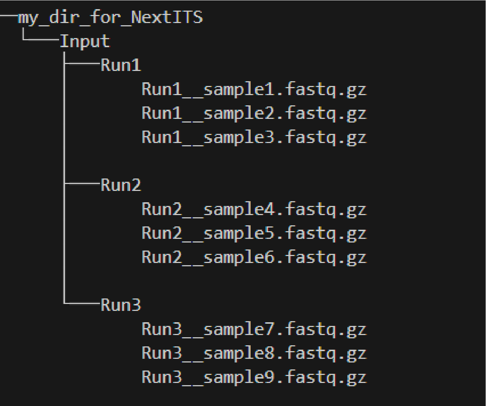

.. |PipeCraft2_logo| image:: _static/PipeCraft2_icon_v2.png
  :width: 100
  :alt: Alternative text
  

.. |NextITS_singledir_structure| image:: _static/NextITS_singledir_structure.png
  :width: 290
  :alt: Alternative text

.. |NextITS_seq_cluster| image:: _static/nextits_sequence_clustering.png
  :width: 600
  :height: 200
  :alt: Alternative text

.. |NextITS_extraction| image:: _static/nextits_extraction.png
  :width: 300
  :height: 200
  :alt: Alternative text

.. meta::
    :description lang=en:
        PipeCraft2 manual. User guide for PipeCraft2

|PipeCraft2_logo|
  `github <https://github.com/pipecraft2/pipecraft>`_

.. raw:: html

    

.. role:: red

=====================
Pre-defined pipelines
=====================

.. _predefinedpipelines: 

vsearch OTUs
============

.. _vsearchOTUs:

.. |otuoff| image:: _static/OTU_off.png
  :width: 50
  :alt: Alternative text

This automated workflow is mostly based on `vsearch <https://github.com/torognes/vsearch>`_ (`Rognes et. al 2016 <https://peerj.com/articles/2584/>`_) [`manual <_static/vsearch_manual_2.22.1.pdf>`_]

 
.. _vsearchOTUs_defaults:

| **Default options:**
| *click on analyses step for more info*

==================================================================== =========================
Analyses step                                                        Default setting
==================================================================== =========================
:ref:`DEMULTIPLEX <demux>` (optional)                                 --
:ref:`REORIENT <reorient>` (optional)                                 --
:ref:`REMOVE PRIMERS <remove_primers>` (optional)                     --
:ref:`MERGE READS <merge_vsearch>`                                   | ``read_R1`` = \\.R1
                                                                     | ``min_overlap`` = 12
                                                                     | ``min_length`` = 32
                                                                     | ``allow_merge_stagger`` = TRUE 
                                                                     | ``include only R1`` = FALSE 
                                                                     | ``max_diffs`` = 20
                                                                     | ``max_Ns`` = 0
                                                                     | ``max_len`` = 600
                                                                     | ``keep_disjoined`` = FALSE 
                                                                     | ``fastq_qmax`` = 41
:ref:`QUALITY FILTERING with vsearch <qfilt_vsearch>`                | ``maxEE`` = 1
                                                                     | ``maxN`` = 0
                                                                     | ``minLen`` = 32
                                                                     | ``max_length`` = undefined
                                                                     | ``qmax`` = 41
                                                                     | ``qmin`` = 0
                                                                     | ``maxee_rate`` = undefined
:ref:`CHIMERA FILTERING with uchime_denovo <chimFilt_vsearch>`       | ``pre_cluster`` = 0.98
                                                                     | ``min_unique_size`` = 1
                                                                     | ``denovo`` = TRUE 
                                                                     | ``reference_based`` = undefined
                                                                     | ``abundance_skew`` = 2
                                                                     | ``min_h`` = 0.28
:ref:`ITS Extractor <itsextractor>` (optional)                       | ``organisms`` = all 
                                                                     | ``regions`` = all
                                                                     | ``partial`` = 50
                                                                     | ``region_for_clustering`` = ITS2
                                                                     | ``cluster_full_and_partial`` = TRUE
                                                                     | ``e_value`` = 1e-2
                                                                     | ``scores`` = 0
                                                                     | ``domains`` = 2
                                                                     | ``complement`` = TRUE 
                                                                     | ``only_full`` = FALSE
                                                                     | ``truncate`` = TRUE 
:ref:`CLUSTERING with vsearch <clustering_vsearch>`                  | ``OTU_type`` = centroid
                                                                     | ``similarity_threshold`` = 0.97
                                                                     | ``strands`` = both
                                                                     | ``remove_singletons`` = false
                                                                     | ``similarity_type`` = 2
                                                                     | ``sequence_sorting`` = cluster_size
                                                                     | ``centroid_type`` = similarity
                                                                     | ``max_hits`` = 1
                                                                     | ``mask`` = dust
                                                                     | ``dbmask`` = dust
:ref:`ASSIGN TAXONOMY with BLAST <assign_taxonomy_blast>` (optional) | ``database_file`` = select a database
                                                                     | ``task`` = blastn
                                                                     | ``strands`` = both
==================================================================== =========================

DADA2 ASVs
=============

.. _asvpipe:

ASVs workflow panel (with `DADA2 <https://benjjneb.github.io/dada2/index.html>`_)
---------------------------------------------------------------------------------

.. note::
  Working directory must contain **at least 2 samples** for DADA2 pipeline.

This automated workflow is based on the `DADA2 tutorial <https://benjjneb.github.io/dada2/tutorial.html>`_ 
 | Note that ``demultiplexing``, ``reorienting``, and ``primer removal`` steps are optional and do not represent parts from the DADA2 tutorial. Nevertheless, it is advisable to :ref:`remove primers <remove_primers>` before proceeding with ASV generation with DADA2.

| The official DADA2 manual is available `here <https://www.bioconductor.org/packages/devel/bioc/manuals/dada2/man/dada2.pdf>`_
 
.. _dada2_defaults:

**Default options:**

=========================================================== =========================
Analyses step                                               Default setting
=========================================================== =========================
:ref:`DEMULTIPLEX <demux>` (optional)                       | --
:ref:`REORIENT <reorient>` (optional)                       | --
:ref:`REMOVE PRIMERS <remove_primers>` (optional)           | --
:ref:`QUALITY FILTERING <dada2_qual_filt>`                  | ``read_R1`` = \\.R1
                                                            | ``read_R2`` = \\.R2
                                                            | ``maxEE`` = 2
                                                            | ``maxN`` = 0
                                                            | ``minLen`` = 20
                                                            | ``truncQ`` = 2
                                                            | ``truncLen`` = 0
                                                            | ``maxLen`` = 9999
                                                            | ``minQ`` = 2
                                                            | ``matchIDs`` = TRUE
:ref:`DENOISE <dada2_denoise>`                              | ``pool`` = FALSE
                                                            | ``selfConsist`` = FASLE
                                                            | ``qualityType`` = Auto
:ref:`MERGE PAIRED-END READS <dada2_merge_pairs>`           | ``minOverlap`` = 12
                                                            | ``maxMismatch`` = 0
                                                            | ``trimOverhang`` = FALSE
                                                            | ``justConcatenate`` = FALSE
:ref:`CHIMERA FILTERING <dada2_chimeras>`                   | ``method`` = consensus
:ref:`Filter ASV table <dada2_table_filtering>` (optional)  | ``collapseNoMismatch`` = TRUE
                                                            | ``by_length`` = 250
                                                            | ``minOverlap`` = 20
                                                            | ``vec`` = TRUE
:ref:`ASSIGN TAXONOMY <dada2_taxonomy>` (optional)          | ``minBoot`` = 50
                                                            | ``tryRC`` = FALSE
                                                            | ``dada2 database`` = select a database
=========================================================== =========================

____________________________________________________

.. _dada2_qual_filt:

QUALITY FILTERING [ASVs workflow] 
~~~~~~~~~~~~~~~~~~~~~~~~~~~~~~~~~

DADA2 `filterAndTrim <https://www.bioconductor.org/packages/devel/bioc/manuals/dada2/man/dada2.pdf>`_ function performs quality filtering on input FASTQ files based on user-selected criteria. Outputs include filtered FASTQ files located in the ``qualFiltered_out`` directory.

Quality profiles may be examined using the :ref:`QualityCheck module <interface>`.

================================ =========================
Setting                          Tooltip
================================ =========================
``read_R1``                      | applies only for **paired-end** data. 
                                 | Identifyer string that is common for all R1 reads 
                                 | (e.g. when all R1 files have '.R1' string, then enter '\\.R1'. 
                                 | Note that backslash is only needed to escape dot regex; e.g. 
                                 | when all R1 files have '_R1' string, then enter '_R1'.). 
``read_R2``                      | applies only for **paired-end** data. 
                                 | Identifyer string that is common for all R2 reads 
                                 | (e.g. when all R2 files have '.R2' string, then enter '\\.R2'. 
                                 | Note that backslash is only needed to escape dot regex; e.g. 
                                 | when all R2 files have '_R1' string, then enter '_R2'.).
``maxEE``                        | discard sequences with more than the specified number of expected errors
``maxN``                         | discard sequences with more than the specified number of N’s (ambiguous bases)
``minLen``                       | remove reads with length less than minLen. minLen is enforced 
                                 | after all other trimming and truncation
``truncQ``                       | truncate reads at the first instance of a quality score less than or equal to truncQ
``truncLen``                     | truncate reads after truncLen bases 
                                 | (applies to **R1 reads** when working with **paired-end** data). 
                                 | Reads shorter than this are discarded. 
                                 | Explore quality profiles (with QualityCheck module) and 
                                 | see whether poor quality ends needs to be truncated
``truncLen_R2``                  | applies only for **paired-end** data. 
                                 | Truncate **R2 reads** after truncLen bases. 
                                 | Reads shorter than this are discarded. 
                                 | Explore quality profiles (with QualityCheck module) and 
                                 | see whether poor quality ends needs to truncated
``maxLen``                       | remove reads with length greater than maxLen. 
                                 | maxLen is enforced on the raw reads. 
                                 | In dada2, the default = Inf, but here set as 9999
``minQ``                         | after truncation, reads contain a quality score below minQ will be discarded
``matchIDs``                     | applies only for **paired-end** data. 
                                 | If TRUE, then double-checking (with seqkit pair) that only paired reads 
                                 | that share ids are outputted.
                                 | :red:`Note that 'seqkit' will be used for this process`, because when 
                                 | using e.g. SRA fastq files where original fastq headers have been 
                                 | replaced, dada2 does not recognize those fastq id strings
================================ =========================

see :ref:`default settings <dada2_defaults>`

____________________________________________________

.. _dada2_denoise:

DENOISING [ASVs workflow] 
~~~~~~~~~~~~~~~~~~~~~~~~~

DADA2 `dada <https://www.bioconductor.org/packages/devel/bioc/manuals/dada2/man/dada2.pdf>`_ function to remove sequencing errors.
Outputs filtered fasta files into ``denoised_assembled.dada2`` directory.

==================== ============
Setting              Tooltip
==================== ============
``pool``             | if TRUE, the algorithm will pool together all samples prior to sample inference. 
                     | Pooling improves the detection of rare variants, but is computationally more expensive. 
                     | If pool = 'pseudo', the algorithm will perform pseudo-pooling between individually 
                     | processed samples.
``selfConsist``      | if TRUE, the algorithm will alternate between sample inference and error rate estimation 
                     | until convergence
``qualityType``      | 'Auto' means to attempt to auto-detect the fastq quality encoding. 
                     | This may fail for PacBio files with uniformly high quality scores, 
                     | in which case use 'FastqQuality'
==================== ============

see :ref:`default settings <dada2_defaults>`

____________________________________________________

.. _dada2_merge_pairs:

MERGE PAIRS [ASVs workflow] 
~~~~~~~~~~~~~~~~~~~~~~~~~~~

DADA2 `mergePairs <https://www.bioconductor.org/packages/devel/bioc/manuals/dada2/man/dada2.pdf>`_ function to merge paired-end reads. 
Outputs merged fasta files into ``denoised_assembled.dada2`` directory.

==================== ============
Setting               Tooltip
==================== ============
``minOverlap``       | the minimum length of the overlap required for merging the forward and reverse reads
``maxMismatch``      | the maximum mismatches allowed in the overlap region
``trimOverhang``     | if TRUE, overhangs in the alignment between the forwards and reverse read are  
                     | trimmed off. Overhangs are when the reverse read extends past the start of 
                     | the forward read, and vice-versa, as can happen when reads are longer than the 
                     | amplicon and read into the other-direction primer region
``justConcatenate``  | if TRUE, the forward and reverse-complemented reverse read are concatenated  
                     | rather than merged, with a NNNNNNNNNN (10 Ns) spacer inserted between them
==================== ============

see :ref:`default settings <dada2_defaults>`

.. _dada2_chimeras:

____________________________________________________

CHIMERA FILTERING [ASVs workflow] 
~~~~~~~~~~~~~~~~~~~~~~~~~~~~~~~~~

DADA2 `removeBimeraDenovo <https://www.bioconductor.org/packages/devel/bioc/manuals/dada2/man/dada2.pdf>`_ function to remove chimeras. 
Outputs filtered fasta files into ``chimeraFiltered_out.dada2`` and final ASVs to ``ASVs_out.dada2`` directory.

==================== ============
Setting               Tooltip
==================== ============
``method``           | 'consensus' - the samples are independently checked for chimeras, and a consensus 
                     | decision on each sequence variant is made. 
                     | If 'pooled', the samples are all pooled together for chimera identification. 
                     | If 'per-sample', the samples are independently checked for chimeras
==================== ============

see :ref:`default settings <dada2_defaults>`

.. _dada2_table_filtering:

____________________________________________________

filter ASV table [ASVs workflow] 
~~~~~~~~~~~~~~~~~~~~~~~~~~~~~~~~~~

DADA2 `collapseNoMismatch <https://www.bioconductor.org/packages/devel/bioc/manuals/dada2/man/dada2.pdf>`_ function to collapse identical ASVs; 
and ASVs filtering based on minimum accepted sequence length (custom R functions). 
Outputs filtered ASV table and fasta files into ``ASVs_out.dada2/filtered`` directory.

========================== ============
Setting                    Tooltip
========================== ============
``collapseNoMismatch``     | collapses ASVs that are identical up to shifts or 
                           | length variation, i.e. that have no mismatches or internal indels
``by_length``              | discard ASVs from the ASV table that are shorter than specified 
                           | value (in base pairs). Value 0 means OFF, no filtering by length
``minOverlap``             | collapseNoMismatch setting. Default = 20. The minimum overlap of 
                           | base pairs between ASV sequences required to collapse them together
``vec``                    | collapseNoMismatch setting. Default = TRUE. Use the vectorized 
                           | aligner. Should be turned off if sequences exceed 2kb in length
========================== ============

see :ref:`default settings <dada2_defaults>`

____________________________________________________

.. _dada2_taxonomy:

ASSIGN TAXONOMY [ASVs workflow] 
~~~~~~~~~~~~~~~~~~~~~~~~~~~~~~~~~~

DADA2 `assignTaxonomy <https://www.bioconductor.org/packages/devel/bioc/manuals/dada2/man/dada2.pdf>`_ function to classify ASVs. 
Outputs classified fasta files into ``taxonomy_out.dada2`` directory.

==================== ============
Setting               Tooltip
==================== ============
``minBoot``          | the minimum bootstrap confidence for assigning a taxonomic level
``tryRC``            | the reverse-complement of each sequences will be used for classification 
                     | if it is a better match to the reference sequences than the forward sequence
``dada2 database``   | select a reference database fasta file for taxonomy annotation
                     | `Download DADA2-formatted reference databases here <https://benjjneb.github.io/dada2/training.html>`_
==================== ============

see :ref:`default settings <dada2_defaults>`

____________________________________________________

UNOISE ASVs
===========

UNOISE3 pipeline for making ASVs (zOTUs). 
Can optionally do automatic clustering of those ASVs (zOTUs) to OTUs by specifying the similarity threshold < 1.
Uses UNOISE3 and clustering algorithms in vsearch. 

.. _nextits_pipeline: 

NextITS
=======

`NextITS <https://next-its.github.io>`_ is an automated pipeline for analysing **full-length ITS** reads 
obtained via **PacBio** sequencing. 

| This pipeline implements:
| * primer trimming
| * quality filtering
| * full-length ITS region extraction
| * correction of homopolymer errors
| * chimera filtering (`get database for reference-based chimera filtering here <https://owncloud.ut.ee/owncloud/s/iaQ3i862pjwYgdy>`_)
| * recovery of sequences false-positively annotated as chimeric
| * detection of tag-switching artifacts per sequencing run
| * multiple options for sequence clustering
| * post-clustering with LULU

Please see other details here: https://next-its.github.io
**Please note that NextITS pipeline accepts only a single primer pair**, i.e., one forward and one reverse primer in STEP_1!

.. important:: 

  NextITS requires your data and folders to be structured in a specific way (see below)! 
  Directory ``my_dir_for_NextITS`` contains ``Input`` [hard-coded requirement here] and one or multiple sequencing runs.
  In the below example, the sequencing runs [``RunID``] are named as Run1, Run2 and Run3 (but naming can be different).
  
  In PipeCraft2, following the examples below, select ``my_dir_for_NextITS`` as a WORKDIR.

Single sequencing run
---------------------

| Select ``my_dir_for_NextITS`` as a WORKDIR in PipeCraft2.
| Directory structure for analysing a single sequencing run:

|NextITS_singledir_structure|

Input data for this pipeline **must be demultiplexed**, if your data is multiplexed use the demultiplexer 
from **QuickTools** before running the pipeline.

.. admonition:: Sample naming

  Please avoid non-ASCII symbols in ``SampleID``,
  and do not use the period symbol (.), as it represents the wildcard character in regular expressions.
  Also, it is preferable not to start the sample name with a number.

Multiple sequencing runs
------------------------

| Select ``my_dir_for_NextITS`` as a WORKDIR in PipeCraft2.
| Directory structure for analysing multiple sequencing runs:

|NextITS_multidir_structure|

Input data for this pipeline **must be demultiplexed**, if your data is multiplexed use the demultiplexer 
from **QuickTools** before running the pipeline.

.. admonition:: Sample naming

  Please avoid non-ASCII symbols in ``RunID`` and ``SampleID``,
  and do not use the period symbol (.), as it represents the wildcard character in regular expressions.
  Also, it is preferable not to start the sample name with a number.

NextITS uses the ``SequencingRunID__SampleID`` naming convention (please note the double underscore separating ``RunID`` and ``SampleID`` parts). 
This naming scheme allows to easily trace back sequences, especially if the same sample was sequenced several times and is present in multiple sequencing runs. 
In the later steps, extracting the SampleID part and summarizing read counts for such samples is easy.

**Default settings:**

+---------------------------------------------------------------------------------------------------------------+------------------------------------+
| Analyses step                                                                                                 | Default setting                    |
+===============================================================================================================+====================================+
|| STEP 1: `QUALITY CONTROL, ARTEFACT REMOVAL <https://next-its.github.io/assets/NextITS_Workflow_Step1.webp>`_ || ``primer_mismatch`` = 2           |
||                                                                                                              || ``its_region`` = full             |
||                                                                                                              || ``qc_maxhomopolymerlen`` = 25     |
||                                                                                                              || ``qc_maxn`` = 4                   |
||                                                                                                              || ``ITSx_evalue`` = 1e-2            |
||                                                                                                              || ``ITSx_partial`` = 0              |
||                                                                                                              || ``ITSx_tax`` = all                |
||                                                                                                              || ``chimera_rescue_occurrence`` = 2 |
||                                                                                                              || ``tj f`` = 0.01                   |
||                                                                                                              || ``tj p`` = 1                      |
||                                                                                                              || ``hp`` = TRUE                     |
+---------------------------------------------------------------------------------------------------------------+------------------------------------+
|| STEP 2: `DATA AGGREGATION, CLUSTERING <https://next-its.github.io/assets/NextITS_Workflow_Step2.webp>`_      || ``otu_id`` = 0.98                 |
||                                                                                                              || ``swarm_d`` = 1                   |
||                                                                                                              || ``lulu`` = TRUE                   |
||                                                                                                              || ``unoise`` = FALSE                |
||                                                                                                              || ``otu_id_def`` = 2                |
||                                                                                                              || ``otu_qmask`` = dust              |
||                                                                                                              || ``swarm_fastidious`` = TRUE       |
||                                                                                                              || ``unoise_alpha`` = 2              |
||                                                                                                              || ``unoise_minsize`` = 8            |
||                                                                                                              || ``max_MEEP`` = 0.5                |
||                                                                                                              || ``max_chimera_score`` = 0.5       |
||                                                                                                              || ``lulu_match`` = 95               |
||                                                                                                              || ``lulu_ratio`` = 1                |
||                                                                                                              || ``lulu_ratiotype`` = min          |
||                                                                                                              || ``lulu_relcooc`` = 0.95           |
||                                                                                                              || ``lulu_maxhits`` = 0              |
+---------------------------------------------------------------------------------------------------------------+------------------------------------+

Cut primers
-----------

**Please note that NextITS pipeline accepts only a single primer pair**, i.e., one forward and one reverse primer!

================================ =========================
Setting                          Tooltip
================================ =========================
``primer_forward``               | Specify forward primer, IUPAC codes allowed
``primer_reverse``               | Specify reverse primer, IUPAC codes allowed
``primer_mismatch``              | Specify allowed number of mismatches for primers
================================ =========================

Quality filtering
-----------------

Filter sequences based on expected errors per sequence and per base, compress and correct homopolymers.

================================ =========================
Setting                          Tooltip
================================ =========================
``qc_maxee``                     | Maximum number of expected errors
``qc_maxeerate``                 | Maximum number of expected error per base
``qc_maxn``                      | Discard sequences with more than the specified number of ambiguous nucleotides (N's)
``qc_maxhomopolymerlen``         | Threshold for a homopolymer region lenght in a sequence
``hp``                           | Enable or disable homopolymer correction
================================ =========================

ITS extraction
--------------

| When performing ITS metabarcoding, it may be beneficial to trim the flanking 18S and 28S rRNA genes; because:

 - these conserved regions don't offer species-level differentiation.
 - random errors in these areas can disrupt sequence clustering.
 - chimeric breakpoints, which are common in these regions, are hard to detect in short fragments ranging from 10 to 70 bases.

 | NextITS deploys the `ITSx software <https://microbiology.se/software/itsx/>`_ (`Bengtsson-Palme et al. 2013 <https://doi.org/10.1111/2041-210X.12073>`_) for extracting the ITS sequence. 

================================ =========================
Setting                          Tooltip
================================ =========================
``its_region``                   | ITS part selector (ITS1, ITS2 or full)
``ITSx_tax``                     | Taxonomy profile for ITSx can be used to restrict the search to only taxon(s) of interest.
``ITSx_evalue``                  | E-value cutoff threshold for ITSx
``ITSx_partial``                 | Keep partial ITS sequences (specify a minimum length cutoff)
================================ =========================

Chimera filtering
-----------------

| NextITS employs a two-pronged strategy to detect chimeras: de novo and reference-based chimera filtering.
| A **reference database** for chimera filtering from full-length ITS data is `accessible here <https://owncloud.ut.ee/owncloud/s/iaQ3i862pjwYgdy>`_. This database is based on `EUKARYOME database <https://eukaryome.org>`_

Additional step in NextITS is a **"rescue" of sequences** that were initially flagged as chimeric, but are occur at least in 2 samples (which represent independent PCR reactions); 
thus are likely false-positive chimeric sequences. The chimeric sequence occurrence frequency can be edited using the --chimera_rescue_occurrence parameter.

================================ =========================
Setting                          Tooltip
================================ =========================
``chimera_database`` (optional)  | Database for reference based chimera removal (UDB)
``chimera_rescue_occurence``     | A minimum occurence of initially flagged chimeric sequence required to rescue them
================================ =========================

Tag-jump correction
-------------------

 Tag-jumps, sometimes referred to as index-switches or index cross-talk, may represent a significant concern in high-throughput sequencing (HTS) data. 
 They can cause technical cross-contamination between samples, potentially distorting estimates of community composition. 
 Here, tag-jump events are evaluated the UNCROSS2 algorithm (`Edgar 2018 <https://www.biorxiv.org/content/10.1101/400762v1>`_ ) are removed.

================================ =========================
Setting                          Tooltip
================================ =========================
``tj_f``                         | `UNCROSS <https://www.drive5.com/usearch/manual/uncross_algo.html>`_ parameter f for tag-jump filtering
``tj_p``                         | `UNCROSS <https://www.drive5.com/usearch/manual/uncross_algo.html>`_ parameter p for tag-jump filtering
================================ =========================

UNOISE denoising
----------------

 | The UNOISE algorithm (`Edgar 2016 <https://www.biorxiv.org/content/10.1101/081257v1>`_ ) focuses on error-correction (or denoising) of amplicon reads. Essentially, UNOISE operates on the principle that if a sequence with low abundance closely resembles another sequence with high abundance, the former is probably an error. This helps differentiate between true biological variation and sequencing errors. It's important to note that UNOISE was initially designed and optimized for Illumina data. Because of indel errors stemming from inaccuracies in homopolymeric regions, UNOISE might not work well with data that hasn't undergone homopolymer correction.

================================ =========================
Setting                          Tooltip
================================ =========================
``unoise``                       | Enable or disable denoising with `UNOISE <https://www.drive5.com/usearch/manual/unoise_algo.html>`_ algorithm
``unoise_alpha``                 | Alpha parameter for `UNOISE <https://www.drive5.com/usearch/manual/unoise_algo.html>`_
``unoise_minsize``               | Minimum sequence abundance
================================ =========================

Clustering
----------

NextITS supports 3 different clustering methods:

  - vsearch:
    this employs greedy clustering using a fixed sequence similarity threshold with VSEARCH (`Rognes et al., 2016, <https://peerj.com/articles/2584/>`_ );

  - swarm:
    dynamic sequence similarity threshold for clustering with SWARM (`Mahé et al., 2021, <https://academic.oup.com/bioinformatics/article/38/1/267/6318385?login=false>`_ );

  - unoise:
    creates zero-radius OTUs (zOTUs) based on the UNOISE3 algorithm (`Edgar 2016 <https://www.biorxiv.org/content/10.1101/081257v1>`_ );

================================ =========================
Setting                          Tooltip
================================ =========================
``clustering_method``            | Sequence clustering method (choose from: vsearch, swarm, unoise)
``otu_id``                       | Sequence similarity threshold
``otu_iddef``                    | Sequence similarity definition (applied to UNOISE as well)
``otu_qmask``                    | Method to mask low-complexity sequences (applied to UNOISE as well)
``swarm_d``                      | `SWARM <https://github.com/torognes/swarm>`_ clustering resolution (d)
``swarm_fastidious``             | Link nearby low-abundance swarms (fastidious option)
================================ =========================

Post-clustering with LULU
-------------------------

The purpose of LULU is to reduce the number of erroneous OTUs in OTU tables to achieve more realistic biodiversity metrics. 
By evaluating the co-occurence patterns of OTUs among samples LULU identifies OTUs that 
consistently satisfy some user selected criteria for being errors of more abundant OTUs and merges these OTUs.

================================ =========================
Setting                          Tooltip
================================ =========================
``lulu``                         | Enable or disable post-clustering curation with `lulu <https://github.com/tobiasgf/lulu>`_
``lulu_match``                   | Minimum similarity threshold
``lulu_ratio``                   | Minimum abundance ratio
``lulu_ratiotype``               | Abundance ratio type - "min" or "avg
``lulu_relcooc``                 | Relative co-occurrence
``lulu_maxhits``                 | Maximum number of hits (0 = unlimited)
================================ =========================
