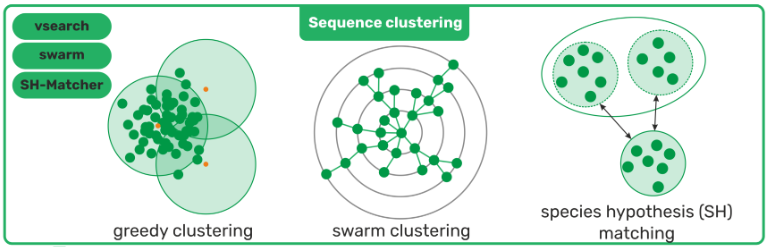
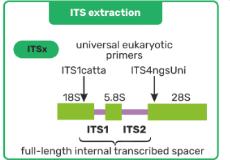

.. |PipeCraft2_logo| image:: _static/PipeCraft2_icon_v2.png
  :width: 50
  :target: https://github.com/pipecraft2/user_guide
  

  
.. meta::
    :description lang=en:
        PipeCraft2 manual. User guide for PipeCraft2

.. raw:: html

    

.. role:: red

.. _predefinedpipelines: 

=======================================
Pre-defined pipelines |PipeCraft2_logo|
=======================================

Pre-defined pipelines in PipeCraft2 provide automated workflows for processing amplicon sequencing data. 
These pipelines include options for generating ASVs with DADA2, ASVs with UNOISE3, OTUs with vsearch, and specialized pipelines like NextITS and OptimOTU. 
Each pipeline is carefully configured with sensible defaults while still allowing customization of key parameters to suit different experimental needs.

- **Use at least 2 samples per sequencing run** for the pre-defined pipelines.

.. admonition:: example data analyses
 
  See the example data analyses with the pre-compiled pipelines here: :doc:`example_analyses` 

.. _multi_run_dir:

___________________________________________________

|

Working with multiple sequencing runs
======================================

Applicable to: :ref:`DADA2 ASVs <asvpipe>`, :ref:`UNOISE ASVs <unoise_asvs>`,
:ref:`vsearch OTUs <vsearchOTUs>` pre-defined pipelines.

When working with multiple sequencing runs, then **pre-defined pipelines** can automatically process each sequencing run separately, and 
then **merge the results** into a single output OTU/ASV table. Processing each sequencing run separately is 
**necessary for appropriate handling of run-specifiec error profiles and tag-jumps filtering**.

Identical sequences from different runs will be recognized as the same ASV, and therefore merged into a single ASV. 

Directory structure
-------------------

.. important:: 

  When aiming to combine samples from multiple sequencing runs, then follow the below directory structure, 
  with :red:`**multiRunDir**` **being the mandatory directory name** (names of the nested sequencing run directories can be changed).
  
  When specifying a **working directory** in PipeCraft2 for processing multiple sequencing runs, 
  then select the **parent directory** of the **multiRunDir** (e.g. **my_sequencing_runs** in the example below).

.. code-block::
   :caption: Working with multiple sequencing runs

    my_sequencing_runs/             # SELECT THIS FOLDER AS WORKING DIRECTORY
    └── multiRunDir/                # name here MUST BE multiRunDir
        ├── Run1/                   # name here can be anything (without spaces)
        │   ├── sample1_R1.fastq
        │   ├── sample1_R2.fastq
        │   ├── sample2_R1.fastq
        │   ├── sample2_R2.fastq
        │   └── ...
        ├── Run2/                   # name here can be anything (without spaces)
        │   ├── sample10_R1.fastq
        │   ├── sample10_R2.fastq
        │   ├── sample11_R1.fastq
        │   ├── sample11_R2.fastq
        │   └── ...
        ├── skip_Run3/               # this dir will be skipped
        │   ├── sample20_R1.fastq
        │   ├── sample20_R2.fastq
        │   ├── sample21_R1.fastq
        │   ├── sample21_R2.fastq
        │   └── ...
        └── merged_runs/             # this is the dir where the merged ASV/OTU table will be saved
            ├── ASVs.fasta
            ├── ASV_table.txt
            └── ...

| Note that :red:`you can **skip** processing any sequencing run` by adding a **skip_** prefix to the directory name. In this example here, sequencing run ``skip_Run3`` will be skipped.
|
| ``merged_runs`` directory will contain the merged ASV/OTU table; :red:`avoid naming your sequencing run directories as **merged_runs**!`  
|
| Fastq files with the :red:`**same name**` will be considered as the same sample and will be merged in the final ASV/OTU table.

Merge sequencing runs
---------------------

When working with multiple sequencing runs, then you can merge the results into a single ASV/OTU table
by enabling the **MERGE SEQUENCING RUNS** option in the 
:ref:`DADA2 ASVs <asvpipe>`, :ref:`UNOISE ASVs <unoise_asvs>`,
:ref:`vsearch OTUs <vsearchOTUs>` pre-defined pipelines.

Note that NextITS and OptimOTU pipelines also support merging of sequencing runs, but require 
slightly different directory structure (see here for NextITS: :ref:`nextits_pipeline` and 
for OptimOTU: :ref:`optimotu_pipeline`).

___________________________________________________

|

.. _asvpipe:

DADA2 ASVs
=============

This pre-defined workflow is based on the `DADA2 tutorial <https://benjjneb.github.io/dada2/tutorial.html>`_ to form **ASVs and an ASV table**.
The input is the directory that contains per-sample fastq files (**demultiplexed data**).

| Note that ``CUT PRIMERS`` step do not represent parts from the DADA2 tutorial. Nevertheless, it is advisable to :ref:`remove primers <remove_primers>` before proceeding with ASV generation with DADA2.

.. _dada2_modes:

**Herein implemented DADA2 pipeline has three modes:**

+-------------------------+--------------------------------------------------------+
| DADA2 mode              | when do use                                            |
+=========================+========================================================+
|| ``PAIRED-END FORWARD`` || for paired-end Illumina data where amplicons          |
||                        || are expected to be in 5'-3' orientation. If           |
||                        || using DADA2 ``PAIRED-END FORWARD`` mode, but          |
||                        || you have sequences in mixed orientation, then         |
||                        || the reverse complement reads are not detected         |
||                        || and are discarded.                                    |
+-------------------------+--------------------------------------------------------+
|| ``PAIRED-END MIXED``   || for paired-end Illumina data where amplicons          |
||                        || are expected to be both, in 5'-3' (forward)           |
||                        || and 3'-5' (reverse) oriented. In that mode,           |
||                        || ``CUT PRIMERS`` is mandatory, and generates           |
||                        || separate directories for forward and reverse          |
||                        || oriented sequences, which will pass DADA2             |
||                        || pipeline individually. After merging the paired       |
||                        || ends, the reverse oriented sequences are              |
||                        || reverse complemented and aggregated with the          |
||                        || forward reads for chimera filtering and ASV           |
||                        || table generation. The output ASVs are all 5'-3'       |
||                        || oriented. If using DADA2 ``PAIRED-END MIXED``         |
||                        || mode, then be sure you have data in mixed             |
||                        || orientation (i.e. both 5'-3' and 3'-5' oriented       |
||                        || sequences in samples); if this is not the case        |
||                        || then ``PAIRED-END MIXED`` mode will report an         |
||                        || ERROR after quality filtering step (no output         |
||                        || files generated after quality filtering).             |
+-------------------------+--------------------------------------------------------+
|| ``SINGLE-END``         || for single-end PacBio data. ``CUT PRIMERS``           |
||                        || step for single-end data will reoriente all           |
||                        || reads to 5'-3' (forward) orientation. DADA2 denoising |
||                        || with PacBioErrfun (errorEstFun = PacBioErrfun).       |
+-------------------------+--------------------------------------------------------+

.. important::

  Working directory must contain **at least 2 samples** for DADA2 pipeline.

 
.. _dada2_defaults:

**Default options:**

+--------------------------------------------------------+--------------------------------------------+-------------------------------+
| Analyses step                                          | Default setting                            | output directory              |
+========================================================+============================================+===============================+
|| :ref:`CUT PRIMERS <remove_primers>`                   || Mandatory for ``paired-end mixed`` mode   || ``primersCut_out``           |
||                                                       || for getting the fwd and rev oriented      ||                              |
||                                                       || sequences                                 ||                              |
+--------------------------------------------------------+--------------------------------------------+-------------------------------+
|| QUALITY FILTERING                                     || ``maxEE`` = 2                             || ``qualFiltered_out``         |
||                                                       || ``maxN`` = 0                              ||                              |
||                                                       || ``minLen`` = 20                           ||                              |
||                                                       || ``truncQ`` = 2                            ||                              |
||                                                       || ``truncLen`` = 0                          ||                              |
||                                                       || ``truncLen_R2`` = 0 (for paired-end data) ||                              |
||                                                       || ``maxLen`` = 9999                         ||                              |
||                                                       || ``minQ`` = 2                              ||                              |
||                                                       || ``matchIDs`` = TRUE                       ||                              |
+--------------------------------------------------------+--------------------------------------------+-------------------------------+
|| DENOISE                                               || ``pool`` = FALSE                          || ``denoised_assembled.dada2`` |
||                                                       || ``selfConsist`` = FASLE                   ||                              |
||                                                       || ``qualityType`` = Auto                    ||                              |
+--------------------------------------------------------+--------------------------------------------+-------------------------------+
|| MERGE PAIRS                                           || ``minOverlap`` = 12 (for paired-end data) || ``denoised_assembled.dada2`` |
||                                                       || ``maxMismatch`` = 0                       ||                              |
||                                                       || ``trimOverhang`` = FALSE                  ||                              |
||                                                       || ``justConcatenate`` = FALSE               ||                              |
+--------------------------------------------------------+--------------------------------------------+-------------------------------+
|| CHIMERA FILTERING                                     || ``method`` = consensus                    || ``chimeraFiltered_out``      |
||                                                       ||                                           || ASVs in ``ASVs_out.dada2``   |
+--------------------------------------------------------+--------------------------------------------+-------------------------------+
|| :ref:`CURATE ASV TABLE <curate_asv_table>` (optional) || filter tag-jumps and ASVs that are        || ``ASVs_out.dada2/curated``   |
||                                                       || shorter/longer than expected length.      ||                              |
||                                                       || ``f_value`` = 0.01                        ||                              |
||                                                       || *[defines the expected tag-jumps rate]*   ||                              |
||                                                       || ``p_value`` = 1                           ||                              |
||                                                       || *[severity of tag-jump removal]*          ||                              |
||                                                       || ``min_length`` = 32                       ||                              |
||                                                       || *[minimum length of OTU sequence]*        ||                              |
||                                                       || ``max_length`` = 0                        ||                              |
||                                                       || *[max length of OTU sequence;*            ||                              |
||                                                       || *0 means no filtering]*                   ||                              |
+--------------------------------------------------------+--------------------------------------------+-------------------------------+

___________________________________________________

|

.. _unoise_asvs:

UNOISE ASVs
===========

UNOISE3 pipeline for making ASVs (zOTUs). Uses UNOISE3 algorithm in vsearch. 

This automated workflow is mostly based on `vsearch <https://github.com/torognes/vsearch>`_ (`Rognes et. al 2016 <https://peerj.com/articles/2584/>`_)
to form **zOTUs and an zOTU table** (herein also referred as ASVs). 

The input is the directory that contains per-sample fastq files (**demultiplexed data**).

+--------------------------------------------------------+------------------------------------------+-----------------------------+
| Analyses step                                          | Default setting                          | output directory            |
+========================================================+==========================================+=============================+
| :ref:`CUT PRIMERS <remove_primers>` (optional)         | --                                       | ``primersCut_out``          |
+--------------------------------------------------------+------------------------------------------+-----------------------------+
|| :ref:`MERGE READS <merge_vsearch>`                    || ``min_overlap`` = 12                    || ``assembled_out``          |
||                                                       || ``min_length`` = 32                     ||                            |
||                                                       || ``allow_merge_stagger`` = TRUE          ||                            |
||                                                       || ``include only R1`` = FALSE             ||                            |
||                                                       || ``max_diffs`` = 20                      ||                            |
||                                                       || ``max_Ns`` = 0                          ||                            |
||                                                       || ``max_len`` = 600                       ||                            |
||                                                       || ``keep_disjoined`` = FALSE              ||                            |
||                                                       || ``fastq_qmax`` = 41                     ||                            |
+--------------------------------------------------------+------------------------------------------+-----------------------------+
|| :ref:`QUALITY FILTERING with vsearch <qfilt_vsearch>` || ``maxEE`` = 1                           || ``qualFiltered_out``       |
||                                                       || ``maxN`` = 0                            ||                            |
||                                                       || ``minLen`` = 32                         ||                            |
||                                                       || ``max_length`` = undefined              ||                            |
||                                                       || ``qmax`` = 41                           ||                            |
||                                                       || ``qmin`` = 0                            ||                            |
||                                                       || ``maxee_rate`` = undefined              ||                            |
+--------------------------------------------------------+------------------------------------------+-----------------------------+
|| :ref:`ITS Extractor <itsextractor>` (optional)        || ``organisms`` = all                     || ``ITSx_out``               |
||                                                       || ``regions`` = all                       ||                            |
||                                                       || ``partial`` = 50                        ||                            |
||                                                       || ``region_for_clustering`` = ITS2        ||                            |
||                                                       || ``e_value`` = 1e-2                      ||                            |
||                                                       || ``scores`` = 0                          ||                            |
||                                                       || ``domains`` = 2                         ||                            |
||                                                       || ``complement`` = TRUE                   ||                            |
||                                                       || ``only_full`` = FALSE                   ||                            |
||                                                       || ``truncate`` = TRUE                     ||                            |
||                                                       ||                                         ||                            |
+--------------------------------------------------------+------------------------------------------+-----------------------------+
|| :ref:`CLUSTERING with UNOISE3 <clustering_unoise3>`   || ``strnads`` = both                      || ``clustering_out``         |
||                                                       || ``minsize`` = 8                         ||                            |
||                                                       || ``denoise_level`` = global              ||                            |
||                                                       || ``remove_chimeras`` = TRUE              ||                            |
||                                                       || ``unoise_alpha`` = 2                    ||                            |
||                                                       || ``similarity_type`` = 2                 ||                            |
||                                                       || ``maxaccepts`` = 1                      ||                            |
||                                                       || ``maxrejects`` = 32                     ||                            |
||                                                       || ``abskew`` = 16                         ||                            |
||                                                       || ``mask`` = dust                         ||                            |
+--------------------------------------------------------+------------------------------------------+-----------------------------+
|| :ref:`CURATE ASV TABLE <curate_asv_table>` (optional) || filter tag-jumps and ASVs that are      || ``clustering_out/curated`` |
||                                                       || shorter/longer than expected length.    ||                            |
||                                                       || ``f_value`` = 0.01                      ||                            |
||                                                       || *[defines the expected tag-jumps rate]* ||                            |
||                                                       || ``p_value`` = 1                         ||                            |
||                                                       || *[severity of tag-jump removal]*        ||                            |
||                                                       || ``min_length`` = 32                     ||                            |
||                                                       || *[minimum length of OTU sequence]*      ||                            |
||                                                       || ``max_length`` = 0                      ||                            |
||                                                       || *[max length of OTU sequence;*          ||                            |
||                                                       || *0 means no filtering]*                 ||                            |
+--------------------------------------------------------+------------------------------------------+-----------------------------+

___________________________________________________

|

.. _vsearchOTUs:

vsearch OTUs
============

This automated workflow is mostly based on `vsearch <https://github.com/torognes/vsearch>`_ (`Rognes et. al 2016 <https://peerj.com/articles/2584/>`_)
to form **OTUs and an OTU table**. 
The input is the directory that contains per-sample fastq files (**demultiplexed data**).

Pipeline final outputs are in the ``clustering_out`` directory; but per process a separate 
output directory is created (e.g. ``primersCut_out``, ``chimeraFiltered_out`` etc.).

.. _vsearchOTUs_defaults:

| **Default options:**
| *click on analyses step for more info*

+--------------------------------------------------------+------------------------------------------+-----------------------------+
| Analyses step                                          | Default setting                          | output directory            |
+========================================================+==========================================+=============================+
| :ref:`CUT PRIMERS <remove_primers>` (optional)         | --                                       | ``primersCut_out``          |
+--------------------------------------------------------+------------------------------------------+-----------------------------+
|| :ref:`MERGE READS <merge_vsearch>`                    || ``min_overlap`` = 12                    || ``assembled_out``          |
||                                                       || ``min_length`` = 32                     ||                            |
||                                                       || ``allow_merge_stagger`` = TRUE          ||                            |
||                                                       || ``include only R1`` = FALSE             ||                            |
||                                                       || ``max_diffs`` = 20                      ||                            |
||                                                       || ``max_Ns`` = 0                          ||                            |
||                                                       || ``max_len`` = 600                       ||                            |
||                                                       || ``keep_disjoined`` = FALSE              ||                            |
||                                                       || ``fastq_qmax`` = 41                     ||                            |
+--------------------------------------------------------+------------------------------------------+-----------------------------+
|| :ref:`QUALITY FILTERING <qfilt_vsearch>`              || ``maxEE`` = 1                           || ``qualFiltered_out``       |
|| with vsearch                                          || ``maxN`` = 0                            ||                            |
||                                                       || ``minLen`` = 32                         ||                            |
||                                                       || ``max_length`` = undefined              ||                            |
||                                                       || ``qmax`` = 41                           ||                            |
||                                                       || ``qmin`` = 0                            ||                            |
||                                                       || ``maxee_rate`` = undefined              ||                            |
+--------------------------------------------------------+------------------------------------------+-----------------------------+
|| :ref:`CHIMERA FILTERING <chimFilt_vsearch>`           || ``pre_cluster`` = 0.98                  || ``chimeraFiltered_out``    |
|| with uchime_denovo                                    || ``min_unique_size`` = 1                 ||                            |
||                                                       || ``denovo`` = TRUE                       ||                            |
||                                                       || ``reference_based`` = undefined         ||                            |
||                                                       || ``abundance_skew`` = 2                  ||                            |
||                                                       || ``min_h`` = 0.28                        ||                            |
+--------------------------------------------------------+------------------------------------------+-----------------------------+
|| :ref:`ITS Extractor <itsextractor>` (optional)        || ``organisms`` = all                     || ``ITSx_out``               |
||                                                       || ``regions`` = all                       ||                            |
||                                                       || ``partial`` = 50                        ||                            |
||                                                       || ``region_for_clustering`` = ITS2        ||                            |
||                                                       || ``cluster_full_and_partial`` = TRUE     ||                            |
||                                                       || ``e_value`` = 1e-2                      ||                            |
||                                                       || ``scores`` = 0                          ||                            |
||                                                       || ``domains`` = 2                         ||                            |
||                                                       || ``complement`` = TRUE                   ||                            |
||                                                       || ``only_full`` = FALSE                   ||                            |
||                                                       || ``truncate`` = TRUE                     ||                            |
+--------------------------------------------------------+------------------------------------------+-----------------------------+
|| :ref:`CLUSTERING <clustering_vsearch>`                || ``OTU_type`` = centroid                 || ``clustering_out``         |
||                                                       || ``similarity_threshold`` = 0.97         ||                            |
||                                                       || ``strands`` = both                      ||                            |
||                                                       || ``remove_singletons`` = false           ||                            |
||                                                       || ``similarity_type`` = 2                 ||                            |
||                                                       || ``sequence_sorting`` = cluster_size     ||                            |
||                                                       || ``centroid_type`` = similarity          ||                            |
||                                                       || ``max_hits`` = 1                        ||                            |
||                                                       || ``mask`` = dust                         ||                            |
||                                                       || ``dbmask`` = dust                       ||                            |
+--------------------------------------------------------+------------------------------------------+-----------------------------+
|| :ref:`CURATE ASV TABLE <curate_asv_table>` (optional) || filter tag-jumps and ASVs that are      || ``clustering_out/curated`` |
||                                                       || shorter/longer than expected length.    ||                            |
||                                                       || ``f_value`` = 0.01                      ||                            |
||                                                       || *[defines the expected tag-jumps rate]* ||                            |
||                                                       || ``p_value`` = 1                         ||                            |
||                                                       || *[severity of tag-jump removal]*        ||                            |
||                                                       || ``min_length`` = 32                     ||                            |
||                                                       || *[minimum length of OTU sequence]*      ||                            |
||                                                       || ``max_length`` = 0                      ||                            |
||                                                       || *[max length of OTU sequence;*          ||                            |
||                                                       || *0 means no filtering]*                 ||                            |
+--------------------------------------------------------+------------------------------------------+-----------------------------+

__________________________________________________

.. _nextits_pipeline: 

NextITS
=======

`NextITS <https://next-its.github.io>`_ is an automated pipeline for analysing **full-length ITS** reads 
obtained via **PacBio** sequencing. 

| This pipeline implements:
| * primer trimming
| * quality filtering
| * full-length ITS region extraction
| * correction of homopolymer errors
| * chimera filtering (`get database for reference-based chimera filtering here <https://owncloud.ut.ee/owncloud/s/iaQ3i862pjwYgdy>`_)
| * recovery of sequences false-positively annotated as chimeric
| * detection of tag-switching artifacts per sequencing run
| * multiple options for sequence clustering
| * post-clustering with LULU

.. note:: 

  Please see other details here: https://next-its.github.io
  **Please note that NextITS pipeline accepts only a single primer pair**, i.e., one forward and one reverse primer in STEP_1!

.. important:: 

  NextITS in pipecraft v1.0.0 requires that your PC has at least 8 cores (and Docker has access to those cores).
  
  NextITS requires your data and folders to be structured in a specific way (see below)! 
  Directory ``my_dir_for_NextITS`` contains ``Input`` [hard-coded requirement here] and one or multiple sequencing runs.
  In the below example, the sequencing runs [``RunID``] are named as Run1, Run2 and Run3 (but naming can be different).

  Although native NextITS requires multiplexed data as an input, the PipeCraft2's implementation **requires demultiplexed data**. So, if you have multiplexed data, then first use the DEMULTIPLEX QuickTool.
  
  In PipeCraft2, following the examples below, select ``my_dir_for_NextITS`` as a **WORKDIR**.
  

| `Download example data set here <https://zenodo.org/records/18770850/files/example_data_NextITS.zip?download=1>`_ 

Single sequencing run
---------------------

| Select ``my_dir_for_NextITS`` as a WORKDIR in PipeCraft2.
| Directory structure for analysing a single sequencing run:

.. code-block::
   :caption: Required directory structure for NextITS

    my_dir_for_NextITS/   # SELECT THIS FOLDER AS WORKING DIRECTORY
    └── Input/
        ├── Run1/      # name here can be anything (without spaces)
        │   ├── sample1.fastq.gz
        │   ├── sample2.fastq.gz 
        │   ├── sample3.fastq.gz
        │   └── sample4.fastq.gz

Input data for this pipeline **must be demultiplexed**, if your data is multiplexed use the demultiplexer 
from **QuickTools** before running the pipeline.

.. admonition:: Sample naming

  Please avoid non-ASCII symbols in ``SampleID``,
  and do not use the period symbol (.), as it represents the wildcard character in regular expressions.
  Also, it is preferable not to start the sample name with a number.

Multiple sequencing runs
------------------------

| Select ``my_dir_for_NextITS`` as a WORKDIR in PipeCraft2.
| Directory structure for analysing multiple sequencing runs:

.. code-block::
   :caption: Required directory structure for NextITS

    my_dir_for_NextITS/   # SELECT THIS FOLDER AS WORKING DIRECTORY
    └── Input/
        ├── Run1/      # name here can be anything (without spaces)
        │   ├── Run1__sample1.fastq.gz
        │   ├── Run1__sample2.fastq.gz 
        │   ├── Run1__sample3.fastq.gz
        │   └── Run1__sample4.fastq.gz
        ├── Run2/      # name here can be anything (without spaces)
        │   ├── Run2__sample5.fastq.gz
        │   ├── Run2__sample6.fastq.gz
        │   ├── Run2__sample7.fastq.gz
        │   └── Run2__sample8.fastq.gz
        └── Run3/      # name here can be anything (without spaces)
            ├── Run3__sample9.fastq.gz
            └── Run3__sample10.fastq.gz

Input data for this pipeline **must be demultiplexed**, if your data is multiplexed use the demultiplexer 
from **QuickTools** before running the pipeline.

.. admonition:: Sample naming

  Please avoid non-ASCII symbols in ``RunID`` and ``SampleID``,
  and do not use the period symbol (.), as it represents the wildcard character in regular expressions.
  Also, it is preferable not to start the sample name with a number.

NextITS uses the ``SequencingRunID__SampleID`` naming convention (please note the double underscore separating ``RunID`` and ``SampleID`` parts). 
This naming scheme allows to easily trace back sequences, especially if the same sample was sequenced several times and is present in multiple sequencing runs. 
In the later steps, extracting the SampleID part and summarizing read counts for such samples is easy.

**Default settings:**

+---------------------------------------------------------------------------------------------------------------+------------------------------------+
| Analyses step                                                                                                 | Default setting                    |
+===============================================================================================================+====================================+
|| STEP 1: `QUALITY CONTROL, ARTEFACT REMOVAL <https://next-its.github.io/assets/NextITS_Workflow_Step1.webp>`_ || ``primer_mismatch`` = 2           |
||                                                                                                              || ``its_region`` = full             |
||                                                                                                              || ``qc_maxhomopolymerlen`` = 25     |
||                                                                                                              || ``qc_maxn`` = 4                   |
||                                                                                                              || ``ITSx_evalue`` = 1e-2            |
||                                                                                                              || ``ITSx_partial`` = 0              |
||                                                                                                              || ``ITSx_tax`` = all                |
||                                                                                                              || ``chimera_rescue_occurrence`` = 2 |
||                                                                                                              || ``tj f`` = 0.01                   |
||                                                                                                              || ``tj p`` = 1                      |
||                                                                                                              || ``hp`` = TRUE                     |
+---------------------------------------------------------------------------------------------------------------+------------------------------------+
|| STEP 2: `DATA AGGREGATION, CLUSTERING <https://next-its.github.io/assets/NextITS_Workflow_Step2.webp>`_      || ``otu_id`` = 0.98                 |
||                                                                                                              || ``swarm_d`` = 1                   |
||                                                                                                              || ``lulu`` = TRUE                   |
||                                                                                                              || ``unoise`` = FALSE                |
||                                                                                                              || ``otu_id_def`` = 2                |
||                                                                                                              || ``otu_qmask`` = dust              |
||                                                                                                              || ``swarm_fastidious`` = TRUE       |
||                                                                                                              || ``unoise_alpha`` = 2              |
||                                                                                                              || ``unoise_minsize`` = 8            |
||                                                                                                              || ``max_MEEP`` = 0.5                |
||                                                                                                              || ``max_chimera_score`` = 0.5       |
||                                                                                                              || ``lulu_match`` = 95               |
||                                                                                                              || ``lulu_ratio`` = 1                |
||                                                                                                              || ``lulu_ratiotype`` = min          |
||                                                                                                              || ``lulu_relcooc`` = 0.95           |
||                                                                                                              || ``lulu_maxhits`` = 0              |
+---------------------------------------------------------------------------------------------------------------+------------------------------------+

Cut primers
-----------

**Please note that NextITS pipeline accepts only a single primer pair**, i.e., one forward and one reverse primer!

================================ =========================
Setting                          Tooltip
================================ =========================
``primer_forward``               | Specify forward primer, IUPAC codes allowed
``primer_reverse``               | Specify reverse primer, IUPAC codes allowed
``primer_mismatch``              | Specify allowed number of mismatches for primers
================================ =========================

Quality filtering
-----------------

Filter sequences based on expected errors per sequence and per base, compress and correct homopolymers.

================================ =========================
Setting                          Tooltip
================================ =========================
``qc_maxee``                     | Maximum number of expected errors
``qc_maxeerate``                 | Maximum number of expected error per base
``qc_maxn``                      | Discard sequences with more than the specified number of ambiguous nucleotides (N's)
``qc_maxhomopolymerlen``         | Threshold for a homopolymer region lenght in a sequence
``hp``                           | Enable or disable homopolymer correction
================================ =========================

ITS extraction
--------------

| When performing ITS metabarcoding, it may be beneficial to trim the flanking 18S and 28S rRNA genes; because:

 - these conserved regions don't offer species-level differentiation.
 - random errors in these areas can disrupt sequence clustering.
 - chimeric breakpoints, which are common in these regions, are hard to detect in short fragments ranging from 10 to 70 bases.

 | NextITS deploys the `ITSx software <https://microbiology.se/software/itsx/>`_ (`Bengtsson-Palme et al. 2013 <https://doi.org/10.1111/2041-210X.12073>`_) for extracting the ITS sequence. 

================================ =========================
Setting                          Tooltip
================================ =========================
``its_region``                   | ITS part selector (ITS1, ITS2 or full)
``ITSx_tax``                     | Taxonomy profile for ITSx can be used to restrict the search to only taxon(s) of interest.
``ITSx_evalue``                  | E-value cutoff threshold for ITSx
``ITSx_partial``                 | Keep partial ITS sequences (specify a minimum length cutoff)
================================ =========================

Chimera filtering
-----------------

| NextITS employs a two-pronged strategy to detect chimeras: de novo and reference-based chimera filtering.
| A **reference database** for chimera filtering from full-length ITS data is `accessible here <https://owncloud.ut.ee/owncloud/s/iaQ3i862pjwYgdy>`_. This database is based on `EUKARYOME database <https://eukaryome.org>`_

Additional step in NextITS is a **"rescue" of sequences** that were initially flagged as chimeric, but are occur at least in 2 samples (which represent independent PCR reactions); 
thus are likely false-positive chimeric sequences. The chimeric sequence occurrence frequency can be edited using the --chimera_rescue_occurrence parameter.

================================ =========================
Setting                          Tooltip
================================ =========================
``chimera_database`` (optional)  | Database for reference based chimera removal (UDB)
``chimera_rescue_occurence``     | A minimum occurence of initially flagged chimeric sequence required to rescue them
================================ =========================

Tag-jump correction
-------------------

 Tag-jumps, sometimes referred to as index-switches or index cross-talk, may represent a significant concern in high-throughput sequencing (HTS) data. 
 They can cause technical cross-contamination between samples, potentially distorting estimates of community composition. 
 Here, tag-jump events are evaluated the UNCROSS2 algorithm (`Edgar 2018 <https://www.biorxiv.org/content/10.1101/400762v1>`_ ) are removed.

================================ =========================
Setting                          Tooltip
================================ =========================
``tj_f``                         | `UNCROSS <https://www.drive5.com/usearch/manual/uncross_algo.html>`_ parameter f for tag-jump filtering
``tj_p``                         | `UNCROSS <https://www.drive5.com/usearch/manual/uncross_algo.html>`_ parameter p for tag-jump filtering
================================ =========================

UNOISE denoising
----------------

 | The UNOISE algorithm (`Edgar 2016 <https://www.biorxiv.org/content/10.1101/081257v1>`_ ) focuses on error-correction (or denoising) of amplicon reads. Essentially, UNOISE operates on the principle that if a sequence with low abundance closely resembles another sequence with high abundance, the former is probably an error. This helps differentiate between true biological variation and sequencing errors. It's important to note that UNOISE was initially designed and optimized for Illumina data. Because of indel errors stemming from inaccuracies in homopolymeric regions, UNOISE might not work well with data that hasn't undergone homopolymer correction.

================================ =========================
Setting                          Tooltip
================================ =========================
``unoise``                       | Enable or disable denoising with `UNOISE <https://www.drive5.com/usearch/manual/unoise_algo.html>`_ algorithm
``unoise_alpha``                 | Alpha parameter for `UNOISE <https://www.drive5.com/usearch/manual/unoise_algo.html>`_
``unoise_minsize``               | Minimum sequence abundance
================================ =========================

Clustering
----------

NextITS supports 3 different clustering methods:

  - vsearch:
    this employs greedy clustering using a fixed sequence similarity threshold with VSEARCH (`Rognes et al., 2016, <https://peerj.com/articles/2584/>`_ );

  - swarm:
    dynamic sequence similarity threshold for clustering with SWARM (`Mahé et al., 2021, <https://academic.oup.com/bioinformatics/article/38/1/267/6318385?login=false>`_ );

  - unoise:
    creates zero-radius OTUs (zOTUs) based on the UNOISE3 algorithm (`Edgar 2016 <https://www.biorxiv.org/content/10.1101/081257v1>`_ );

================================ =========================
Setting                          Tooltip
================================ =========================
``clustering_method``            | Sequence clustering method (choose from: vsearch, swarm, unoise)
``otu_id``                       | Sequence similarity threshold
``otu_iddef``                    | Sequence similarity definition (applied to UNOISE as well)
``otu_qmask``                    | Method to mask low-complexity sequences (applied to UNOISE as well)
``swarm_d``                      | `SWARM <https://github.com/torognes/swarm>`_ clustering resolution (d)
``swarm_fastidious``             | Link nearby low-abundance swarms (fastidious option)
================================ =========================

Post-clustering with LULU
-------------------------

The purpose of LULU is to reduce the number of erroneous OTUs in OTU tables to achieve more realistic biodiversity metrics. 
By evaluating the co-occurence patterns of OTUs among samples LULU identifies OTUs that 
consistently satisfy some user selected criteria for being errors of more abundant OTUs and merges these OTUs.

================================ =========================
Setting                          Tooltip
================================ =========================
``lulu``                         | Enable or disable post-clustering curation with `lulu <https://github.com/tobiasgf/lulu>`_
``lulu_match``                   | Minimum similarity threshold
``lulu_ratio``                   | Minimum abundance ratio
``lulu_ratiotype``               | Abundance ratio type - "min" or "avg
``lulu_relcooc``                 | Relative co-occurrence
``lulu_maxhits``                 | Maximum number of hits (0 = unlimited)
================================ =========================

__________________________________________________

.. _optimotu_pipeline:

OptimOTU
========

| OptimOTU is a full metabarcoding data analysis pipeline for **paired-end Illumina data** (`arXiv:2502.10350 <https://doi.org/10.48550/arXiv.2502.10350>`_).
| OptimOTU uses taxonomically identified reference sequences to 
| determine optimal genetic distance thresholds for clustering ancestor 
| taxa into groups that best match their descendant taxa (**taxonomically aware OTU clustering**).

.. note:: 

    Note that compared with other herein (in PipeCraft) pre-defined pipelines, OptimOTU requires a lot of resources (CPU, RAM), 
    so please allocate sufficient resources when running this pipeline. Due to many optimized steps in the pipeline, 
    the local run of OptimOTU takes comparably more time.

.. note:: 

    PipeCraft2's implementation in v 1.1.0 of OptimOTU is **currently restricted to Fungi (ITS3-ITS4 and g/fITS7-ITS4 amplicons)**; 
    the Metazoa COI amplicons mode is **beta version** and not available in MacOS version.

Docker env built based on optimotu_targets v5.1.0 (https://github.com/brendanf/optimotu_targets/releases/tag/v5.1.0) with optimotu=0.9.3 and optimotu.pipeline=0.5.2.

.. important::

  OptimOTU requires a specific directory structure for input data. See below.
  Note than if you are analysing a single sequencing run, you still need to follow the directory structure, but just 
  need to have a single directory in "01_raw" (e.g. "Run1", but you can name it as you want).

.. code-block::
   :caption: Required directory structure for OptimOTU

    my_dir/   
    └── sequences/         # SELECT THIS FOLDER AS WORKING DIRECTORY (name here can be anything)
        └── 01_raw/
            ├── Run1/      # name here can be anything (without spaces)
            │   ├── sample1_R1.fastq.gz
            │   ├── sample1_R2.fastq.gz
            │   ├── sample2_R1.fastq.gz
            │   └── sample2_R2.fastq.gz
            ├── Run2/      # name here can be anything (without spaces)
            │   ├── sample3_R1.fastq.gz
            │   ├── sample3_R2.fastq.gz
            │   ├── sample4_R1.fastq.gz
            │   └── sample4_R2.fastq.gz
            └── Run3/      # name here can be anything (without spaces)
                ├── sample5_R1.fastq.gz
                └── sample5_R2.fastq.gz

**When startin the OptimOTU pipeline in PipeCraft**, then the ``PROCESSING ...`` message will be displayed on the left upper corner of the screen
(on the place where ``SELECT WORKDIR`` was). The whole OptimOTU pipeline is executed in the background with a 
single R-command, there will not be any specific feedback on the GUI which excact process is running and which are completed. 

Output files will be saved in the ``my_dir_for_optimotu/output`` directory.
Intermediate files will be saved in the ``my_dir_for_optimotu/sequences/02_trim`` etc directories.

Target taxa and sequence orientation
------------------------------------

Specify if target taxa is fungi or metazoa, and if provided sequences are are expected to be forward, reverse or mixed orientation.

| "fwd" = all sequences are expected to be in 5'-3' orientation.
| "rev" = all sequences are expected to be in 3'-5' orientation.
| "mixed" = the orientation of seqs is expected to be mixed (5'-3' and 3'-5)
| "custom" = the orientation of different files is given in a custom sample table (see :ref:`custom_sample_table`)
| if seqs are "mixed", but using "fwd" setting, then some valid seqs (or samples) will be lost.
| **if seqs are "fwd", but using "mixed" setting, then ERROR.**

+----------------------+---------------------------------------------------+
| Setting              | Tooltip                                           |
+======================+===================================================+
| ``target taxa``      | specify if target taxa is fungi or metazoa        |
+----------------------+---------------------------------------------------+
|| ``seq orientation`` || specify if provided sequences are forward (fwd), |
||                     || reverse (rev) or mixed (mixed)                   |
+----------------------+---------------------------------------------------+

Control sequences
-----------------

Two types of control sequences are supported:

1) spike-in sequences: sequences that are added to the samples before PCR
   These sequences are expected to be present in every sample, even
   most types of negative control.
2) positive control sequences: sequences that are added to only a few specific
   positive control samples.  These sequences are expected to be present only
   in the positive control samples, and their presence in other samples is
   indicative of cross-contamination. (Either in the lab or "tag-switching").

In practice both types are treated the same by the pipeline, they are just
reported separately.

The sequences should be in a fasta file.
Specifying either or both type of control sequences is optional.

+----------------------+----------------------------------------------------------+
| Setting              | Tooltip                                                  |
+======================+==========================================================+
| ``spike in``         | (optional) specigy a file with spike-in sequences        |
+----------------------+----------------------------------------------------------+
| ``positive control`` | (optional) specify a file with positive control sequence |
+----------------------+----------------------------------------------------------+

Cut primers and trim reads
--------------------------

Cut primers and trim reads according to the specified parameters (using cutadapt).

+--------------------------+-----------------------------------------------------------------------+
| Setting                  | Tooltip                                                               |
+==========================+=======================================================================+
| ``forward primer``       | specify forward primer sequence (supports only single primer)         |
+--------------------------+-----------------------------------------------------------------------+
| ``reverse primer``       | specify reverse primer sequence (supports only single primer)         |
+--------------------------+-----------------------------------------------------------------------+
| ``max error rate``       | (maximum allowed error rate in the primer search)                     |
+--------------------------+-----------------------------------------------------------------------+
| ``truncQ_R1``            | truncate ends (3') of R1 at first base with quality score <= N        |
+--------------------------+-----------------------------------------------------------------------+
| ``truncQ_R2``            | truncate ends (3') of R2 at first base with quality score <= N        |
+--------------------------+-----------------------------------------------------------------------+
| ``min_length``           | minimum length of the trimmed sequence                                |
+--------------------------+-----------------------------------------------------------------------+
| ``cut_R1``               | remove N bases from start of R1                                       |
+--------------------------+-----------------------------------------------------------------------+
| ``cut_R2``               | remove N bases from start of R2                                       |
+--------------------------+-----------------------------------------------------------------------+
|| ``action``              || trim = trim the primers from the reads;                              |
||                         || retain = retain the primers after primer has been founds             |
+--------------------------+-----------------------------------------------------------------------+
|| ``custom_sample_table`` || custom primer trimming parameters per sample can be given as columns |
||                         || in the sample table. See example below.                              |
+--------------------------+-----------------------------------------------------------------------+

.. _custom_sample_table:

custom sample table
~~~~~~~~~~~~~~~~~~~

Example of custom primer trimming parameters per sample (**tab-delimited**): 

+--------+---------+------------------+------------------+--------+
| seqrun | samples | fastq_R1         | fastq_R2         | orient |
+--------+---------+------------------+------------------+--------+
| run1   | sample1 | sample1_R1.fq.gz | sample1_R2.fq.gz | fwd    |
+--------+---------+------------------+------------------+--------+
| run1   | sample2 | sample2_R1.fq.gz | sample2_R2.fq.gz | fwd    |
+--------+---------+------------------+------------------+--------+
| run2   | sample3 | sample3_R1.fq.gz | sample3_R2.fq.gz | rev    |
+--------+---------+------------------+------------------+--------+
| run2   | sample4 | sample4_R1.fq.gz | sample4_R2.fq.gz | rev    |
+--------+---------+------------------+------------------+--------+
| run3   | sample5 | sample5_R1.fq.gz | sample5_R2.fq.gz | mixed  |
+--------+---------+------------------+------------------+--------+

Quality filtering
-----------------

Quality filtering settings; performed using DADA2. Sequences with ambiguous nucleotides (N's) are discarded. 

+--------------+--------------------------------------------------------------------------------------+
| Setting      | Tooltip                                                                              |
+==============+======================================================================================+
| ``maxEE_R1`` | discard sequences with more than the specified number of expected errors in R1 reads |
+--------------+--------------------------------------------------------------------------------------+
| ``maxEE_R2`` | discard sequences with more than the specified number of expected errors in R2 reads |
+--------------+--------------------------------------------------------------------------------------+

Denoising and merging paired-end reads 
--------------------------------------

There are no adjustable setting for denoising. 
The denoising steps are performed using the DADA2 package (Callahan et al. 2016). 
Error profiles are then learned separately for each
sequencing run, read, and orientation using the learnErrors() function. Sequences with binned quality
scores, as produced by newer Illumina sequencers, are automatically detected, and the error model is adjusted
accordingly. Denoising is then performed using the dada() function, and read pairs are merged using the
mergePairs() function.

Chimera filtering
-----------------

Chimera filtering is performed using the consensus algorithm implemented in DADA2's isBimeraDenovoTable() function.
Additional database provided in the PROTAX CLASSIFICATION step (``with_outgroup`` file) is used for reference-based chimera filtering (vsearch --uchime_ref).

Filter tag-jumps
----------------

Filter potential cases of tag-switching with UNCROSS2 algorithm (Edgar 2018).

+--------------+----------------------------------------------------------------------------------------+
| Setting      | Tooltip                                                                                |
+==============+========================================================================================+
|| ``f value`` || f-parameter of UNCROSS2, which defines the expected tag-jumps rate. Default is 0.03   |
||             || (equivalent to 3%). A higher value enforces stricter filtering                        |
+--------------+----------------------------------------------------------------------------------------+
|| ``p value`` || p-parameter, which controls the severity of tag-jump removal. It adjusts the exponent |
||             || in the UNCROSS formula. Default is 1. Opt for 0.5 or 0.3 to steepen the curve         |
+--------------+----------------------------------------------------------------------------------------+

Amplicon model setting
----------------------

+----------------------+--------------------------------------------------------------------------------------------+
| Setting              | Tooltip                                                                                    |
+======================+============================================================================================+
|| ``model type``      || statistical sequence model type for aligning ASVs prior to use of protaxA                 |
||                     || and/or NuMt detection and for filtering ASVs to remove spurious sequences.                |
+----------------------+--------------------------------------------------------------------------------------------+
|| ``model file``      || inbuilt ITS3_ITS4.cm and gITS7_ITS4.cm files are optimized for ITS3-ITS4 and              |
||                     || gITS7-ITS4 amplicons for fungi. COI.hmm is HMM model for COI amplicons.                   |
||                     || A custom model may be supplied.                                                           |
+----------------------+--------------------------------------------------------------------------------------------+
| ``numt filter``      | filter out sequences that are likely to be NUMTs (mitochondrial coding amplicon genes)     |
+----------------------+--------------------------------------------------------------------------------------------+
|| ``max model start`` || maximum start position of the model                                                       |
||                     || (the match must start at this point in the model or earlier)                              |
+----------------------+--------------------------------------------------------------------------------------------+
| ``min model end``    | minimum end position of the model (the match must end at this point in the model or later) |
+----------------------+--------------------------------------------------------------------------------------------+
| ``min model score``  | minimum bit score threshold for model matches                                              |
+----------------------+--------------------------------------------------------------------------------------------+

ProTAX classification
---------------------

+----------------+--------------------------------------------------------------------------+
| Setting        | Tooltip                                                                  |
+================+==========================================================================+
|| ``location``  || directory where protax is located. For fungi, default is protaxFungi    |
||               || and for protaxAnimal for metazoa (included in the PipeCraft2 container) |
+----------------+--------------------------------------------------------------------------+
|| ``UNITE_SHs`` || additional database which contains also outgroup (non-target)           |
||               || sequences from the same locus. For fungi, default is UNITE_SHs,         |
||               || which is sh_matching_data_0_5_v9 sequences (included in the             |
||               || PipeCraft2 container)                                                   |
+----------------+--------------------------------------------------------------------------+

Clustering
----------

+-------------------------+----------------------------------------------------------------------------------+
| Setting                 | Tooltip                                                                          |
+=========================+==================================================================================+
|| ``cluster thresholds`` || select file with clustering thresholds. Default is pre-calculated               |
||                        || thresholds for Fungi from Global Spore Sampling Project (Ovaskainen et al 2024) |
+-------------------------+----------------------------------------------------------------------------------+

__________________________________________________

.. _funbaront_pipeline:

FunBarONT
=========

`FunBarONT <https://github.com/mdziurzynski/ont_fungal_barcoding_pipeline>`_ is an automated pipeline for processing 
**Oxford Nanopore Technologies (ONT) fungal barcoding data**, specifically targeting the **ITS rRNA gene region**.

This pipeline processes Oxford Nanopore sequencing data through quality filtering, clustering, consensus polishing, 
ITS extraction, and taxonomic assignment to generate high-confidence fungal identifications.

.. note::

  FunBarONT requires **single-end demultiplexed** Oxford Nanopore data as input.
  The pipeline automatically handles the higher error rates typical of ONT sequencing through 
  consensus polishing with racon and medaka.

Directory structure
-------------------

.. code-block::
   :caption: Required directory structure for FunBarONT

    my_fungal_barcoding/   # SELECT THIS FOLDER AS WORKING DIRECTORY
    └── sequences/
        ├── sample1.fastq
        ├── sample2.fastq
        ├── sample3.fastq.gz
        └── ...

Input data must be **demultiplexed** with one fastq file per sample.

**Default settings:**

+----------------------------------------+----------------------------------+---------------------------+
| Analyses step                          | Default setting                  | output directory          |
+========================================+==================================+===========================+
|| QUALITY CONTROL                       || generates quality reports       || ``01_quality_reports``   |
|| (NanoPlot)                            || per sample                      ||                          |
+----------------------------------------+----------------------------------+---------------------------+
|| QUALITY FILTERING                     || ``chopper quality`` = 10        || ``02_filtered_``         |
|| (chopper)                             || ``chopper min read length``     || ``sequences``            |
||                                       || = 150                           ||                          |
||                                       || ``chopper max read length``     ||                          |
||                                       || = 1000                          ||                          |
+----------------------------------------+----------------------------------+---------------------------+
|| CLUSTERING                            || ``vsearch cluster id`` = 0.95   || ``03_clusters``          |
|| (VSEARCH)                             || ``vsearch cluster strand``      ||                          |
||                                       || = both                          ||                          |
+----------------------------------------+----------------------------------+---------------------------+
|| READ MAPPING                          || maps reads to cluster           || *no separate output*     |
|| (minimap2)                            || centroids (intermediate step    || *(used for polishing)*   |
||                                       || for polishing)                  ||                          |
+----------------------------------------+----------------------------------+---------------------------+
|| SEQUENCE POLISHING                    || ``medaka model`` =              || ``04_polished_``         |
|| (racon + medaka)                      || r1041_e82_400bps_hac\_          || ``sequences``            |
||                                       || variant_v4.3.0                  ||                          |
||                                       || ``racon quality threshold``     ||                          |
||                                       || = 20                            ||                          |
||                                       || ``racon window length`` = 100   ||                          |
+----------------------------------------+----------------------------------+---------------------------+
|| ITS EXTRACTION                        || ``use itsx`` = TRUE             || ``05_its_extracted``     |
|| (ITSx)                                ||                                 ||                          |
+----------------------------------------+----------------------------------+---------------------------+
|| TAXONOMY ASSIGNMENT                   || ``strands`` = both              || ``06_blast_results``     |
|| (BLAST)                               || ``e value`` = 10                ||                          |
||                                       || ``word size`` = 11              ||                          |
+----------------------------------------+----------------------------------+---------------------------+
|| FINAL RESULTS                         || ``run id`` = funbaront_run      || ``07_json_results``      |
||                                       || ``rel abu threshold`` = 10      ||                          |
||                                       || ``output all polished seqs``    ||                          |
||                                       || = FALSE                         ||                          |
+----------------------------------------+----------------------------------+---------------------------+

Pipeline options
----------------

+------------------------------+--------------------------------------------------------------------------------------------+
| Setting                      | Tooltip                                                                                    |
+==============================+============================================================================================+
| ``use ITSx``                 | set to FALSE to skip ITS extraction (useful for non-ITS sequences)                         |
+------------------------------+--------------------------------------------------------------------------------------------+
| ``output all polished seqs`` | output all polished sequences even those without database hits                             |
+------------------------------+--------------------------------------------------------------------------------------------+
| ``rel abu threshold``        | output only clusters with relative abundance above this value (0-100%)                     |
+------------------------------+--------------------------------------------------------------------------------------------+
| ``cpu threads``              | number of CPU threads to use for processing                                                |
+------------------------------+--------------------------------------------------------------------------------------------+

Quality filtering (chopper)
---------------------------

+------------------------------+--------------------------------------------------------------------------------------------+
| Setting                      | Tooltip                                                                                    |
+==============================+============================================================================================+
| ``chopper quality``          | minimum read quality score (Phred). Reads below this threshold are discarded               |
+------------------------------+--------------------------------------------------------------------------------------------+
| ``chopper min read length``  | minimum read length in bp. Shorter reads are removed                                       |
+------------------------------+--------------------------------------------------------------------------------------------+
| ``chopper max read length``  | maximum read length in bp. Longer reads are removed                                        |
+------------------------------+--------------------------------------------------------------------------------------------+

Sequence polishing
------------------

+------------------------------+--------------------------------------------------------------------------------------------+
| Setting                      | Tooltip                                                                                    |
+==============================+============================================================================================+
|| ``medaka model``            || medaka inference model for consensus polishing. Select based on your flowcell,            |
||                             || kit, and basecaller model (e.g., r1041_e82_400bps_hac_variant_v4.3.0)                     |
+------------------------------+--------------------------------------------------------------------------------------------+
| ``racon quality threshold``  | minimum average base quality for windows used by racon (default: 20)                       |
+------------------------------+--------------------------------------------------------------------------------------------+
| ``racon window length``      | window length used by racon for polishing (default: 100)                                   |
+------------------------------+--------------------------------------------------------------------------------------------+

VSEARCH clustering
------------------

+------------------------------+--------------------------------------------------------------------------------------------+
| Setting                      | Tooltip                                                                                    |
+==============================+============================================================================================+
| ``similarity threshold``     | clustering identity threshold (0-1). Sequences above this similarity are clustered         |
+------------------------------+--------------------------------------------------------------------------------------------+
| ``strands``                  | check both strands or plus strand only during clustering                                   |
+------------------------------+--------------------------------------------------------------------------------------------+

Taxonomy assignment (BLAST)
---------------------------

+------------------------------+--------------------------------------------------------------------------------------------+
| Setting                      | Tooltip                                                                                    |
+==============================+============================================================================================+
|| ``database file``           || reference database file in FASTA format (e.g., UNITE database).                           |
||                             || Automatically converted to BLAST database format                                          |
+------------------------------+--------------------------------------------------------------------------------------------+
| ``run id``                   | unique identifier for this analysis run. Used for naming output files                      |
+------------------------------+--------------------------------------------------------------------------------------------+
| ``task``                     | BLAST search settings according to blastn or megablast                                     |
+------------------------------+--------------------------------------------------------------------------------------------+
| ``strands``                  | query strand to search against database. Both = search also reverse complement             |
+------------------------------+--------------------------------------------------------------------------------------------+
|| ``e value``                 || a parameter that describes the number of hits one can expect to see by chance when        |
||                             || searching a database of a particular size. The lower the e-value the more 'significant'   |
||                             || the match is                                                                              |
+------------------------------+--------------------------------------------------------------------------------------------+
|| ``word size``               || the size of the initial word that must be matched between the database and the query      |
||                             || sequence                                                                                  |
+------------------------------+--------------------------------------------------------------------------------------------+
| ``reward``                   | reward for a match                                                                         |
+------------------------------+--------------------------------------------------------------------------------------------+
| ``penalty``                  | penalty for a mismatch                                                                     |
+------------------------------+--------------------------------------------------------------------------------------------+
| ``gap open``                 | cost to open a gap                                                                         |
+------------------------------+--------------------------------------------------------------------------------------------+
| ``gap extend``               | cost to extend a gap                                                                       |
+------------------------------+--------------------------------------------------------------------------------------------+

Output files
------------

The pipeline produces the following output structure:

+-------------------------------+-----------------------------------------------------------+
| Output                        | Description                                               |
+===============================+===========================================================+
| ``<run_id>.results.xlsx``     | Excel spreadsheet with all results (taxonomy, quality)    |
+-------------------------------+-----------------------------------------------------------+
| ``README.txt``                | summary of the pipeline run with parameters and citations |
+-------------------------------+-----------------------------------------------------------+
| ``01_quality_reports/``       | NanoPlot quality reports per sample                       |
+-------------------------------+-----------------------------------------------------------+
| ``02_filtered_sequences/``    | chopper-filtered sequences (\*.chopper.fasta.gz)          |
+-------------------------------+-----------------------------------------------------------+
| ``03_clusters/``              | VSEARCH clustering centroids (\*.centroids.fasta.gz)      |
+-------------------------------+-----------------------------------------------------------+
| ``04_polished_sequences/``    | racon and medaka polished sequences                       |
+-------------------------------+-----------------------------------------------------------+
| ``05_its_extracted/``         | ITSx extracted ITS sequences (\*.its.fasta)               |
+-------------------------------+-----------------------------------------------------------+
| ``06_blast_results/``         | BLAST taxonomy results (\*.blast.tsv)                     |
+-------------------------------+-----------------------------------------------------------+
| ``07_json_results/``          | JSON formatted results per sample                         |
+-------------------------------+-----------------------------------------------------------+
