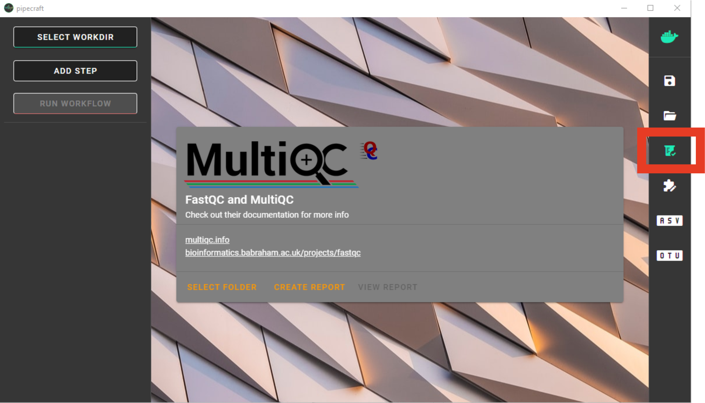
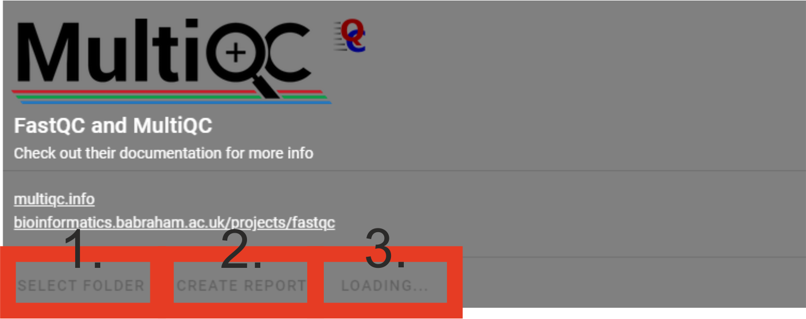

.. |PipeCraft2_logo| image:: _static/PipeCraft2_icon_v2.png
  :width: 100
  :alt: Alternative text

.. |main_interface| image:: _static/main_interface.png
  :width: 2000
  :alt: Alternative text

.. |select_pipeline_or_quicktools| image:: _static/select_pipeline_or_quicktools.png
  :width: 1000
  :alt: Alternative text

.. |select_wd| image:: _static/select_wd.png
  :width: 1000
  :alt: Alternative text

.. meta::
    :description lang=en:
        PipeCraft2 manual. User guide for PipeCraft2

|PipeCraft2_logo|
  `github <https://github.com/pipecraft2/pipecraft>`_

.. raw:: html

    

.. role:: red

.. _quickstart:

==========
QuickStart
==========

Required data formats
=====================

There are few specifc requirements for the input data for PipeCraft. 

- **Paired-end data** 
    * :red:`must contain **R1** and **R2** strings in the paired-end files`,
    * :red:`sample names maynot contain 'R1/R2' strings`
        + **OK file names**: ``my_sample_01_R1_L001.fastq`` and ``my_sample_01_R2_L001.fastq``
        + **NOT-OK** file names: ``my_R1sample_01_R1_L001.fastq`` and ``my_R1sample_01_R2_L001.fastq`` or  ``my_sample_01_1.fastq`` and ``my_sample_01_2.fastq``

- **index/barcodes file** for demultiplexing:
    * :ref:`see formatting requirements here <indexes>` 

- specific directory structure of NextITS pipeline 
    * :ref:`see NextITS page here <nextits_pipeline>` 

____________________________________________________

How to START
============

1. To ``START`` any analyses, you must specify the working directory (WORKDIR) by pressing the ``SELECT WORKDIR`` button. E.g., if working with **fastq** files,
then be sure that the working directory contains **only relevant fastq files** because the selected process will be 
applied to all fastq files in the working directory!

.. note::

 When using Windows OS, the selection window might not display the files while browsing through the directories. 

After selecting a working directory, PipeCraft needs you to specify if 

 * if the data is paired-end or single-end
 * and the extension of the data (fastq or fasta)

| ``paired-end data`` --> such as data from Illumina or MGI-Tech platforms (R1 and R2 files). :red:`Be sure to have **R1** and **R2** strings in the paired-end files (not simply _1 and _2; and sample names maynot contain R1/R2 strings)`
| ``single-end data`` --> such as data from PacBio, or assembled paired-end data (single file per library or per sample)

|select_wd|

2. ``SELECT PIPELINE`` or press ``Quick Tools`` button
to select relevant :ref:`step <quicktools>`; 
edit settings if needed and **start
running the analyses** by pressing the ``START`` button.

|select_pipeline_or_quicktools|

.. note::

 **When running 'step-by-step analyses with Quick Tools'**: when one workflow is finished, then press ``SELECT WORKDIR`` to specify inputs for the next process to ensure the correct workflow piping.  

.. warning::

 The **outputs will be overwritten** if running the same 
 analysis step **multiple times in the same working directory**.
 If needed, edit the default output directory name to prevent that.

Each process creates a separate output directory with the processed files. 
The **README** file in the output directory states some of the details about the finished process.

____________________________________________________

 :ref:`Ready-to-run pre-defined pipelines here <predefinedpipelines>`

 :ref:`QuickTools page here <quicktools>`

____________________________________________________

.. _qualitycheck:

Quality scores and basic statistics screening of the data
==========================================================

.. |multiQC_view_report| image:: _static/multiQC_view_report.png
  :width: 550
  :alt: Alternative text

Quality and basic statistics screening of the data can be done via ``QualityCheck`` panel. 
QualityCheck panel implements `FastQC <https://www.bioinformatics.babraham.ac.uk/projects/fastqc/>`_ and `MultiQC <https://multiqc.info/>`_ to screen the input **fastq** files. 

|multiQC_main|

| 

**To start:** 

 1. **Select folder** (a working directory) which contains only **fastq** (fastq/fq) files that you aim to inspect. 
 2. Press ``CREATE REPORT`` to start MultiQC 
 3. "LOADING ..." will be displayed while the report is being generated

|multiQC_1-3|

|multiQC_view_report|

 4. Click ``VIEW REPORT``. A html file (multiqc_report.html) will open in your default web browser.
    
    *If the summary does not open, check your working floder for the presence of* **multiqc_report.html** *and try to open with some other web browser.*
    *Something went wrong if the file multiqc_report.html* **does not exist** *(may fail when maximum number of fastq files in the folder is extremely large, >10 000).*

 5. Check out  `"using MultiQC reports" <https://multiqc.info/docs/#using-multiqc-reports>`_ in MultiQC web page.
   
.. note::

 Note that '_fastqc.zip' and '_fastqc.html' are generated for each fastq file in the **'quality_check'** directory. These are summarized in **multiqc_report.html**, 
 so you may delete all individual '_fastqc.zip' and '_fastqc.html' files if those are of no interest.
 