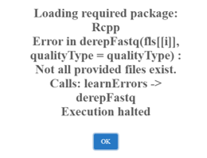
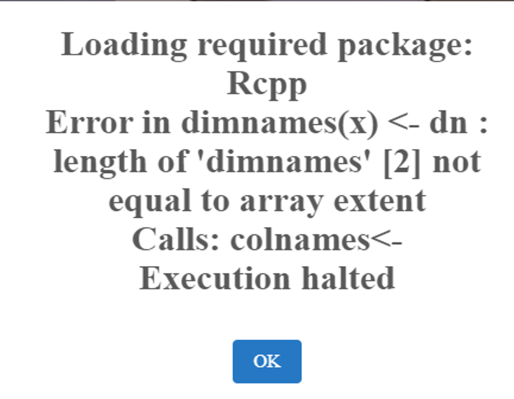
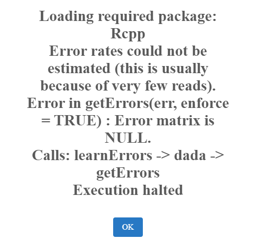
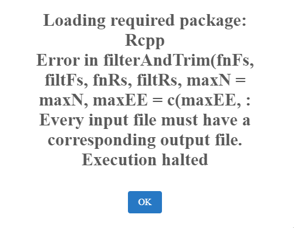

.. |PipeCraft2_logo| image:: _static/PipeCraft2_icon_v2.png
  :width: 50
  :target: https://github.com/pipecraft2/pipecraft

  

=================================
Troubleshooting |PipeCraft2_logo| 
=================================

This page is developing based on the user feedback.

____________________________________________________

Debugging mode
==============

Turn on '**debugging mode**' (bottom-right button) to keep temporary (log) files for identifying the cause of the error

|debug|

____________________________________________________

General errors
==============

.. admonition:: "rm: cannot remove ... File is not accessible"
  :class: error

  **Possible reason**: The file is being used by another process OR the container engine (Docker or Podman) does not have permissions to delete the file(s).

  **Fix**: Close all other applications that might be using the file / Delete the file manually when attempting to rerun the workflow.

____________________________________________________

.. admonition:: BBmap error in metaMATE (memory error)
  :class: error

  if a reference database (``reference seqs``) is very large, then the process may require a lot of RAM.
  If you receive an error message "*.ERROR: BBMap alignment produced no matches and a memory error was detected*", 
  then you may need to increase the :ref:`memory (RAM) allocated to the container engine <manage_resources>` and or close other applications that are using a lot of RAM.

__________________________________________________

.. admonition:: No files in the output folder, but PipeCraft said "Workflow finished"
  :class: error

  **Possible reason**: Computer's memory (RAM) is full, and process was killed. Cannot finish the analyses with those local resources. 

  **Possible fix**: In Windows, try to increase the RAM size accessible to Docker or Podman (see :ref:`here <increase_RAM>`).
  Check if there was a README.txt output and read that. Please :ref:`report <contact>` unexpexted errors. 

____________________________________________________

.. admonition:: No OTU_table.txt with version v0.1.4
  :class: error

  **Possible reason**: known bug.

  **Fix**: Fixed the bug. Reinstall PipeCraft v0.1.4 (or higher)

____________________________________________________

.. admonition:: "ERROR]: cannot find files with specified extension"
  :class: error
  
  **Possible reason**: wrongly specified working directory or extension; OR issues with external hard drives in Windows.

  **Fix**: Double-check the specified directory and extention; OR **restart the container engine** (Docker or Podman).

____________________________________________________

.. admonition:: Workflow stopped
  :class: error

  |workflow_stopped|

  **Possible reason**: Computer's memory (RAM) is full, and process was killed. Cannot finish the analyses with those local resources. 

  **Possible fix**: In Windows, try to increase the RAM size accessible to Docker or Podman (see :ref:`here <increase_RAM>`).

____________________________________________________

.. admonition:: Error in DADA2 quality filtering (filterAndTrim)
  :class: error

  |DADA2_read_identifiers|

  **Possible reason**: wrong read identifiers for ``read R1`` and ``read R2`` in QUALITY FILTERING panel. 

  **Fix**: Check the input fastq file names and edit the identifiers. 
  Specify identifyer string that is common for all R1 reads (e.g. when all R1 files have '.R1' string, then enter '\\.R1'. 
  Note that backslash is only needed to escape dot regex; e.g. when all R1 files have '_R1' string, then enter '_R1'.). 

____________________________________________________

.. admonition:: "Error rates could not be estimated (this is usually because of very few reads). Error in getErrors(err, enforce = TRUE) : Error matrix is null."
  :class: error
  
  |learnErrors_fewReads|

  **Possible reason**: Too small data set; samples contain too few reads for DADA2 denoising.

  **Fix**: use OTU workflow.

____________________________________________________

.. error::

 Conflict. The container name XXX is already in use by container "XXX".
 You have to remove (or rename) that container to be able to reuse that name.

**Reason**: Process stopped unexpectedly and the container was not closed.

**Fix**: Remove the container (not the image!) that is causing the conflict (``docker rm`` or ``podman rm``).

____________________________________________________

|

.. _troubleshoot_podman:

Container engine (Docker or Podman)
===================================

.. admonition:: "No container engine found" / START button disabled with "Failed to find Docker" (or "Failed to find Podman")
  :class: error

  **Possible reason**: Docker or Podman is not installed, or the selected engine is not running (the container engine icon in the top-right corner is not green).

  **Fix**: Install Docker or Podman (:ref:`see here <container_engine>`) and start it; then press ``CHECK AGAIN`` or restart PipeCraft2.
  If both engines are installed, check which one is selected in the :ref:`Resource Manager <manage_resources>`.

____________________________________________________

.. admonition:: "Could not start the Podman machine. Start Podman Desktop or run "podman machine start", then retry."
  :class: error

  **Possible reason** (Windows and MacOS): the Podman machine does not exist or could not be started.
  PipeCraft2 starts an existing Podman machine, but does not create one.

  **Fix**: Create the Podman machine (Podman Desktop, or ``podman machine init``), start it (``podman machine start``) and press ``RETRY``.

____________________________________________________

.. admonition:: Podman on Windows: the Podman machine is running, but PipeCraft2 cannot connect to it
  :class: error

  **Possible reason**: the WSL-based Podman machine is reported as running, but its API named pipe is missing.

  **Fix**: from v1.3.1, PipeCraft2 detects this and restarts the Podman machine automatically.
  If the problem persists, restart the machine manually (``podman machine stop`` and then ``podman machine start``).

____________________________________________________

.. admonition:: Rootless Podman on Linux: output files are locked (owned by another user ID)
  :class: error

  **Possible reason**: files written by rootless Podman containers may be owned by a subordinate user ID on the host
  (may happen with outputs created with PipeCraft2 v1.3.0).

  **Fix**: from v1.3.1, PipeCraft2 reclaims the ownership of the output files after the run.
  For older outputs, run ``podman unshare chown -R 0:0 PATH_TO_OUTPUT_DIR`` (inside ``podman unshare``, user ID 0 is your own user).

____________________________________________________

|

.. _bugs:

Known bugs
==========

**UNOISE**: chimeric sequences are removed from the zOTUs but not from the zOTUs table.
**Fixed in v1.1.0**

__________________________________________________

**QualityCheck** module: multiQC does not merge fastqc reports into a single multiqc_report.html file.
**Fixed in v1.1.0**

__________________________________________________

**Demultiplexing with dual indexes** in v1.1.0 only: samples names are eg indexF_1-indexR_1.fastq.gz.
**Fixed in v1.2.0**

__________________________________________________

**Icon are missing**, noted in v1.1.0. Try closing the GUI and opening it again to re-load the icons.
**Fixed in v1.2.0**

